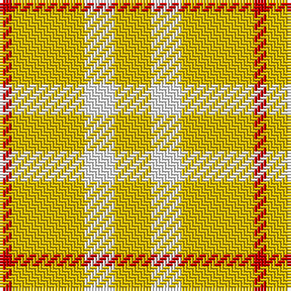

In pattern [RYWY](/patterns/rywy/).

This was sourced from tartans-authority.  It is a [4 stripes tartan](/stripes/stripes4/).

Original link http://www.tartansauthority.com/tartan-ferret/display/3912/

## Thread count
R/4 Y24 W10 Y/12

## Palette
Each colour and its ΔE from the base-6 reference it is a variant of.

| Colour | Shade | Base | ΔE (OKLab) |
|---|---|---|---|
| R | <code style="background-color:#C80000;">#C80000</code> `#C80000` | R <code style="background-color:#CC0000;">#CC0000</code> | 0.01 |
| W | <code style="background-color:#FCFCFC;">#FCFCFC</code> `#FCFCFC` | W <code style="background-color:#F7F7F7;">#F7F7F7</code> | 0.01 |
| Y | <code style="background-color:#E8C000;">#E8C000</code> `#E8C000` | Y <code style="background-color:#F2BF00;">#F2BF00</code> | 0.02 |

# Sample pattern

## Nearest tartans

The nearest existing variants by ΔTartan distance.

1. [One Account](/setts/s6/y12w5y6w5y12r2x2~rc80000-wfcfcfc-ye8c000/) — ΔT 0.97
1. [Virgin One (Corporate)](/setts/s4/y7w6y11r2x2~rc80000-we0e0e0-ybc8c00/) — ΔT 1.34
1. [Virgin One](/setts/s6/y11r2y11w6y7w6x2~rc80000-we0e0e0-ybc8c00/) — ΔT 1.65
1. [Glufree](/setts/s8/y8r2y8g1r6y3g4y2x4~g649848-re87878-yf8e38c/) — ΔT 2.12
1. [Burt's Highlanders (Fashion)](/setts/s5/y40g13y6b13y22x2~b2c2c80-g006818-yfcb464/) — ΔT 2.46
1. [Fallow Deer, The](/setts/s6/r3w17r11w2r11w2x4~r9c8000-wf8f4d0/) — ΔT 2.58
1. [O'Neill](/setts/s4/g9y20g40w5x2~g008000-we0e0e0-yd08010/) — ΔT 2.95
1. [Sands-Pingot Family, Alabama (Personal)](/setts/s5/y6r1y4r4b2x5~b0000cd-rff0000-yffe600/) — ΔT 3.01
1. [Sands-Pingot (Name?)](/setts/s5/y6r1y4r4b2x5~b2c2c80-rc80000-yfccc00/) — ΔT 3.01
1. [Hogan (2014)](/setts/s4/g10w7y41k7x2~g649848-k1c1714-wf8f8f8-yf8e38c/) — ΔT 3.02

## Neighbour map

Every grey dot is one of 15726 variants placed by the first two principal components of the ΔTartan feature space (44% of its variance). Red is this tartan; blue dots are its nearest — click one to open its page.

<svg viewBox="0 0 640 380" role="img" style="max-width:100%;height:auto;border:1px solid #e0e0e0;border-radius:4px;display:block" xmlns="http://www.w3.org/2000/svg"><image href="/nn/cloud.v1.png" width="640" height="380"/><a href="/setts/s6/y12w5y6w5y12r2x2~rc80000-wfcfcfc-ye8c000/"><circle cx="416.4" cy="278.7" r="4" fill="#3465a4"><title>One Account</title></circle></a><a href="/setts/s4/y7w6y11r2x2~rc80000-we0e0e0-ybc8c00/"><circle cx="401.9" cy="307.5" r="4" fill="#3465a4"><title>Virgin One (Corporate)</title></circle></a><a href="/setts/s6/y11r2y11w6y7w6x2~rc80000-we0e0e0-ybc8c00/"><circle cx="377.2" cy="296.7" r="4" fill="#3465a4"><title>Virgin One</title></circle></a><a href="/setts/s8/y8r2y8g1r6y3g4y2x4~g649848-re87878-yf8e38c/"><circle cx="348.6" cy="240.5" r="4" fill="#3465a4"><title>Glufree</title></circle></a><a href="/setts/s5/y40g13y6b13y22x2~b2c2c80-g006818-yfcb464/"><circle cx="374.7" cy="253.7" r="4" fill="#3465a4"><title>Burt's Highlanders (Fashion)</title></circle></a><a href="/setts/s6/r3w17r11w2r11w2x4~r9c8000-wf8f4d0/"><circle cx="343.6" cy="245.0" r="4" fill="#3465a4"><title>Fallow Deer, The</title></circle></a><a href="/setts/s4/g9y20g40w5x2~g008000-we0e0e0-yd08010/"><circle cx="404.5" cy="281.2" r="4" fill="#3465a4"><title>O'Neill</title></circle></a><a href="/setts/s5/y6r1y4r4b2x5~b0000cd-rff0000-yffe600/"><circle cx="257.5" cy="252.0" r="4" fill="#3465a4"><title>Sands-Pingot Family, Alabama (Personal)</title></circle></a><a href="/setts/s5/y6r1y4r4b2x5~b2c2c80-rc80000-yfccc00/"><circle cx="271.1" cy="257.8" r="4" fill="#3465a4"><title>Sands-Pingot (Name?)</title></circle></a><a href="/setts/s4/g10w7y41k7x2~g649848-k1c1714-wf8f8f8-yf8e38c/"><circle cx="291.9" cy="219.7" r="4" fill="#3465a4"><title>Hogan (2014)</title></circle></a><circle cx="419.9" cy="286.0" r="5" fill="#c00000"/></svg>

ID: /setts/s4/y6w5y12r2x2~rc80000-wfcfcfc-ye8c000/
