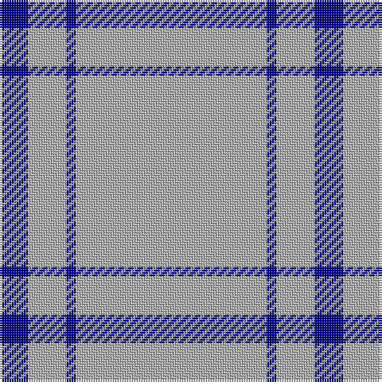

In pattern [BYBY](/patterns/byby/).

This was sourced from register-of-tartans.  It is a [4 stripes tartan](/stripes/stripes4/).

Original link https://www.tartanregister.gov.uk/tartanDetails.aspx?ref=4937

## Thread count
DB/12 N16 DB4 N/80

## Palette
Each colour and its ΔE from the base-6 reference it is a variant of.

| Colour | Shade | Base | ΔE (OKLab) |
|---|---|---|---|
| DB | <code style="background-color:#00008C;">#00008C</code> `#00008C` | B <code style="background-color:#2C4084;">#2C4084</code> | 0.13 |
| N | <code style="background-color:#B0B0B0;">#B0B0B0</code> `#B0B0B0` | Y <code style="background-color:#E8C000;">#E8C000</code> | 0.18 |

# Sample pattern

## Nearest tartans

The nearest existing variants by ΔTartan distance.

1. [Asahi (Estimated threadcount)](/setts/s5/w90b4w8b30w14-b1474b4-we0e0e0/) — ΔT 1.81
1. [The Poulain League](/setts/s5/y12b76k6b76y12-b8080d0-k000000-yf0c000/) — ΔT 1.82
1. [Poulain League (Corporate)](/setts/s3/y12b76k6-b2888c4-k101010-ye8c000/) — ΔT 2.16
1. [London Fog Safari (Fashion)](/setts/s6/y20k4w10k8y100b4-b1474b4-k101010-we0e0e0-yb8b8b8/) — ΔT 2.27
1. [Sephardim (Corporate)](/setts/s5/w100b14w14ba14w36-b2c2c80-ba2888c4-we0e0e0/) — ΔT 2.28
1. [Young in Australia](/setts/s4/w162g12y16g16-g23321b-we8ddcb-ye0a126/) — ΔT 2.38
1. [Covenanter](/setts/s4/w60k2w2k4-k101010-wf8f8f8/) — ΔT 2.50
1. [Brooks Brothers Tattersall Camel](/setts/s5/b4y36b8y36r4-b202060-r880000-ya08858/) — ΔT 2.76
1. [MacLaine of Lochbuie](/setts/s4/b64r6b8y6-b2c4084-rdc0000-ye8c000/) — ΔT 2.78
1. [MacLaine of Lochbuie](/setts/s4/b64r6b8y6-b304080-rc00000-yf0c000/) — ΔT 2.81

## Neighbour map

Every grey dot is one of 15726 variants placed by the first two principal components of the ΔTartan feature space (44% of its variance). Red is this tartan; blue dots are its nearest — click one to open its page.

<svg viewBox="0 0 640 380" role="img" style="max-width:100%;height:auto;border:1px solid #e0e0e0;border-radius:4px;display:block" xmlns="http://www.w3.org/2000/svg"><image href="/nn/cloud.v1.png" width="640" height="380"/><a href="/setts/s5/w90b4w8b30w14-b1474b4-we0e0e0/"><circle cx="535.9" cy="197.2" r="4" fill="#3465a4"><title>Asahi (Estimated threadcount)</title></circle></a><a href="/setts/s5/y12b76k6b76y12-b8080d0-k000000-yf0c000/"><circle cx="542.6" cy="226.1" r="4" fill="#3465a4"><title>The Poulain League</title></circle></a><a href="/setts/s3/y12b76k6-b2888c4-k101010-ye8c000/"><circle cx="530.3" cy="247.3" r="4" fill="#3465a4"><title>Poulain League (Corporate)</title></circle></a><a href="/setts/s6/y20k4w10k8y100b4-b1474b4-k101010-we0e0e0-yb8b8b8/"><circle cx="552.5" cy="139.6" r="4" fill="#3465a4"><title>London Fog Safari (Fashion)</title></circle></a><a href="/setts/s5/w100b14w14ba14w36-b2c2c80-ba2888c4-we0e0e0/"><circle cx="516.5" cy="230.8" r="4" fill="#3465a4"><title>Sephardim (Corporate)</title></circle></a><a href="/setts/s4/w162g12y16g16-g23321b-we8ddcb-ye0a126/"><circle cx="499.8" cy="187.4" r="4" fill="#3465a4"><title>Young in Australia</title></circle></a><a href="/setts/s4/w60k2w2k4-k101010-wf8f8f8/"><circle cx="626.0" cy="162.7" r="4" fill="#3465a4"><title>Covenanter</title></circle></a><a href="/setts/s5/b4y36b8y36r4-b202060-r880000-ya08858/"><circle cx="537.7" cy="248.8" r="4" fill="#3465a4"><title>Brooks Brothers Tattersall Camel</title></circle></a><a href="/setts/s4/b64r6b8y6-b2c4084-rdc0000-ye8c000/"><circle cx="591.5" cy="238.1" r="4" fill="#3465a4"><title>MacLaine of Lochbuie</title></circle></a><a href="/setts/s4/b64r6b8y6-b304080-rc00000-yf0c000/"><circle cx="596.8" cy="239.8" r="4" fill="#3465a4"><title>MacLaine of Lochbuie</title></circle></a><circle cx="603.3" cy="216.7" r="5" fill="#c00000"/></svg>

ID: /setts/s4/y80b4y16b12-b00008c-yb0b0b0/
