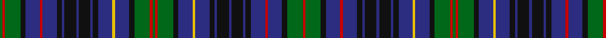

**Bands:** [GRGKBRBKBKBKBKBYBKGRGRGKBYBKBKBKBKBRBKGR](/stripes/grgkbrbkbkbkbkbybkgrgrgkbybkbkbkbkbrbkgr/) · **Stripes:** [G R G K DB R DB K DB K DB K DB K DB LY DB K G R G R G K DB LY DB K DB K DB K DB K DB R DB K G R](/stripes/stripes40/) G R G K DB R DB K DB K DB K DB K DB LY DB K G R G R G K DB LY DB K DB K DB K DB K DB R DB K G R

This was sourced from house-of-tartan.  It is a [40 band tartan](/bands/bands40/).

Original link http://www.house-of-tartan.scotland.net/house/TartanViewjs.asp?colr=Def&tnam=2482

## Thread count
G/4 R4 G24 K8 DB22 R4 DB22 K8 DB4 K18 DB4 K18 DB4 K8 DB22 Y4 DB22 K8 G24 R4 G4 R4 G24 K8 DB22 Y4 DB22 K8 DB4 K18 DB4 K18 DB4 K8 DB22 R4 DB22 K8 G24 R/4

## Palette
Each colour and its ΔE from the base-6 reference it is a variant of.

| Colour | Shade | Base | ΔE (OKLab) |
|---|---|---|---|
| DB | <code style="background-color:#2C2C80;">#2C2C80</code> `#2C2C80` | B <code style="background-color:#2A418A;">#2A418A</code> | 0.06 |
| G | <code style="background-color:#006818;">#006818</code> `#006818` | G <code style="background-color:#006100;">#006100</code> | 0.02 |
| K | <code style="background-color:#101010;">#101010</code> `#101010` | K <code style="background-color:#000000;">#000000</code> | 0.17 |
| R | <code style="background-color:#C80000;">#C80000</code> `#C80000` | R <code style="background-color:#CC0000;">#CC0000</code> | 0.01 |
| Y | <code style="background-color:#E8C000;">#E8C000</code> `#E8C000` | Y <code style="background-color:#F2BF00;">#F2BF00</code> | 0.02 |

## Nearest tartans

The nearest existing variants by ΔTartan distance.

1. [MacKenzie](/setts/s33/db14k3db3k3db3k14g14k3w3k3g14k14db14k3r3k14db14k3r3k3db14k14g14k3w3k3g14k14db3k3db3k3db7~x4/) — ΔT 0.68
1. [MacEwen (Clans Originaux)](/setts/s28/k1g6k6db1k1db1k1db7k1db1k1db1k6g6k1r1k1g6k6db6k1db1k1db6k6g6k1ly1~x4/) — ΔT 1.12
1. [Campbell](/setts/s29/db4k1db1k1db1k8g8k1ly2k1g8k8db8k1db1k1db8k8g8k1w2k1g8k8db1k1db1k1db4~x8/) — ΔT 1.28
1. [Campbell of Argyll Clan Tartan Tartan Number: 1961. Earliest known date: 1810-15 This sett appears in the Cockburn Collection, (1815). Logan (1831). Vestiarium Scoticum (1842). Smibert (1850). Smith (1850). Grant (1886). The Setts No: 19 (1950). W & A K Johnston (1906). Like many of the earliest clan setts, the Campbell of Argyll, owes its origin to the post rebellion output of Wilson's of Bannockburn, whose monopoly on military supply dictated design. See products available Copyright © Blair Urquhart, Comrie, 2015](/setts/s28/k8g8k1ly2k1g8k8db8k1db1k1db8k8g8k1w2k1g8k8db1k1db1k1db8k1db1k1db1~x2/) — ΔT 1.33
1. [Murray](/setts/s25/db2k1db6k6g6r2g6k6db1k1db1k1db6k1db1k1db1k6g6r2g6k6db6k1db1~x8/) — ΔT 1.46
1. [Allen (1998)](/setts/s21/g2r2g12k4n11ly2n11k4n2k9n2k9n2k4n11r2n11k4g12r2g2~x2/) — ΔT 1.50
1. [Lamont](/setts/s25/db9k3db3k3db3k12g12w3g12k12db12k3db3k3db12k12g12w3g12k12db3k3db3k3db5~x4/) — ΔT 1.58
1. [Stuart/Stewart Hunting #3](/setts/s26/db8dg2db8k2db2k2db2k4dg11r2dg11k4dg2k9dg2k9dg2k4dg11ly2dg11k4db2k2db2k4~x2/) — ΔT 1.60
1. [Lochinvar Marine Harvest (Corporate)](/setts/s24/g2k2g8k7db8dp2db8k7g2k2g2k2g10k2g2k2g2k7db8dp2db8k7g8k2~x2/) — ΔT 1.60
1. [Apache North Sea Commemorative Tartan Tartan Number: 6447. Earliest known date: 2004 50th Anniversary tartan of Apache North Sea Ltd, Aberdeen See products available Copyright © Blair Urquhart, Comrie, 2015](/setts/s24/dp4ly2dt7o3k10k13dt7o3k13o3dt7k15dt7o3k13o3dt7k13k10o3dt7ly2dp4ly2~x2/) — ΔT 1.64

## Neighbour map

Every grey dot is one of 14313 variants placed by the first two principal components of the ΔTartan feature space (44% of its variance). Red is this tartan; blue dots are its nearest — click one to open its page.

<svg viewBox="0 0 640 380" role="img" style="max-width:100%;height:auto;border:1px solid #e0e0e0;border-radius:4px;display:block" xmlns="http://www.w3.org/2000/svg"><image href="/nn/cloud.v1.png" width="640" height="380"/><a href="/setts/s33/db14k3db3k3db3k14g14k3w3k3g14k14db14k3r3k14db14k3r3k3db14k14g14k3w3k3g14k14db3k3db3k3db7~x4/"><circle cx="145.8" cy="179.3" r="4" fill="#3465a4"><title>MacKenzie</title></circle></a><a href="/setts/s28/k1g6k6db1k1db1k1db7k1db1k1db1k6g6k1r1k1g6k6db6k1db1k1db6k6g6k1ly1~x4/"><circle cx="182.7" cy="168.4" r="4" fill="#3465a4"><title>MacEwen (Clans Originaux)</title></circle></a><a href="/setts/s29/db4k1db1k1db1k8g8k1ly2k1g8k8db8k1db1k1db8k8g8k1w2k1g8k8db1k1db1k1db4~x8/"><circle cx="166.3" cy="150.2" r="4" fill="#3465a4"><title>Campbell</title></circle></a><a href="/setts/s28/k8g8k1ly2k1g8k8db8k1db1k1db8k8g8k1w2k1g8k8db1k1db1k1db8k1db1k1db1~x2/"><circle cx="167.8" cy="150.9" r="4" fill="#3465a4"><title>Campbell of Argyll Clan Tartan Tartan Number: 1961. Earliest known date: 1810-15 This sett appears in the Cockburn Collection, (1815). Logan (1831). Vestiarium Scoticum (1842). Smibert (1850). Smith (1850). Grant (1886). The Setts No: 19 (1950). W &amp; A K Johnston (1906). Like many of the earliest clan setts, the Campbell of Argyll, owes its origin to the post rebellion output of Wilson's of Bannockburn, whose monopoly on military supply dictated design. See products available Copyright © Blair Urquhart, Comrie, 2015</title></circle></a><a href="/setts/s25/db2k1db6k6g6r2g6k6db1k1db1k1db6k1db1k1db1k6g6r2g6k6db6k1db1~x8/"><circle cx="165.2" cy="201.0" r="4" fill="#3465a4"><title>Murray</title></circle></a><a href="/setts/s21/g2r2g12k4n11ly2n11k4n2k9n2k9n2k4n11r2n11k4g12r2g2~x2/"><circle cx="170.6" cy="193.4" r="4" fill="#3465a4"><title>Allen (1998)</title></circle></a><a href="/setts/s25/db9k3db3k3db3k12g12w3g12k12db12k3db3k3db12k12g12w3g12k12db3k3db3k3db5~x4/"><circle cx="135.1" cy="219.0" r="4" fill="#3465a4"><title>Lamont</title></circle></a><a href="/setts/s26/db8dg2db8k2db2k2db2k4dg11r2dg11k4dg2k9dg2k9dg2k4dg11ly2dg11k4db2k2db2k4~x2/"><circle cx="193.7" cy="200.1" r="4" fill="#3465a4"><title>Stuart/Stewart Hunting #3</title></circle></a><a href="/setts/s24/g2k2g8k7db8dp2db8k7g2k2g2k2g10k2g2k2g2k7db8dp2db8k7g8k2~x2/"><circle cx="154.2" cy="222.7" r="4" fill="#3465a4"><title>Lochinvar Marine Harvest (Corporate)</title></circle></a><a href="/setts/s24/dp4ly2dt7o3k10k13dt7o3k13o3dt7k15dt7o3k13o3dt7k13k10o3dt7ly2dp4ly2~x2/"><circle cx="221.2" cy="186.2" r="4" fill="#3465a4"><title>Apache North Sea Commemorative Tartan Tartan Number: 6447. Earliest known date: 2004 50th Anniversary tartan of Apache North Sea Ltd, Aberdeen See products available Copyright © Blair Urquhart, Comrie, 2015</title></circle></a><circle cx="153.3" cy="165.2" r="5" fill="#c00000"/></svg>

ID: /setts/s40/g2r2g12k4db11r2db11k4db2k9db2k9db2k4db11ly2db11k4g12r2g2r2g12k4db11ly2db11k4db2k9db2k9db2k4db11r2db11k4g12r2~x2/
