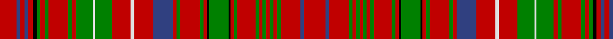

In pattern [RBRBRKGRGRGRGWGRWRBRGRGRKGKRGRGRGRGRGRBR](/patterns/rbrbrkgrgrgrgwgrwrbrgrgrkgkrgrgrgrgrgrbr/).

This was sourced from weddslist.  It is a [40 stripes tartan](/stripes/stripes40/).

Original link http://www.weddslist.com/cgi-bin/tartans/pg.pl?source=sts

## Thread count
R/19 B4 R5 B4 R5 K4 G4 R5 G4 R22 G4 R5 G19 LN2 G19 R21 LN4 R21 B22 R4 G4 R22 G4 R4 K2 G22 K2 R4 G4 R20 G4 R4 G4 R4 G4 R4 G4 R22 B4 R/24

## Palette
Each colour and its ΔE from the base-6 reference it is a variant of.

| Colour | Shade | Base | ΔE (OKLab) |
|---|---|---|---|
| B | <code style="background-color:#304080;">#304080</code> `#304080` | B <code style="background-color:#2C4084;">#2C4084</code> | 0.01 |
| G | <code style="background-color:#008000;">#008000</code> `#008000` | G <code style="background-color:#006400;">#006400</code> | 0.09 |
| K | <code style="background-color:#000000;">#000000</code> `#000000` | K <code style="background-color:#000000;">#000000</code> | 0.00 |
| LN | <code style="background-color:#E0E0E0;">#E0E0E0</code> `#E0E0E0` | W <code style="background-color:#F4F4F0;">#F4F4F0</code> | 0.06 |
| R | <code style="background-color:#C00000;">#C00000</code> `#C00000` | R <code style="background-color:#C80000;">#C80000</code> | 0.02 |

ID: /setts/s40/r24b4r22g4r4g4r4g4r4g4r20g4r4k2g22k2r4g4r22g4r4b22r21w4r21g19w2g19r5g4r22g4r5g4k4r5b4r5b4r19-b304080-g008000-k000000-rc00000-we0e0e0/
