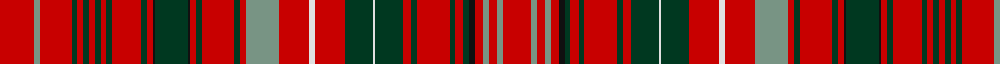

In pattern [RGRGRGRGRGRGRKGKRGRGRGRWRGWGRGRGRGKRGRGR](/patterns/rgrgrgrgrgrgrkgkrgrgrgrwrgwgrgrgrgkrgrgr/).

This was sourced from register-of-tartans.  It is a [40 stripes tartan](/stripes/stripes40/).

Original link https://www.tartanregister.gov.uk/tartanDetails.aspx?ref=949

## Thread count
R/60 LG10 R54 DG10 R10 DG10 R10 DG10 R10 DG10 R50 DG10 R10 K4 DG56 K4 R10 DG10 R56 DG10 R10 LG56 R52 LN10 R52 DG48 LN4 DG48 R14 DG10 R56 DG10 R14 DG10 K10 R14 LG10 R14 LG10 R/48

## Palette
Each colour and its ΔE from the base-6 reference it is a variant of.

| Colour | Shade | Base | ΔE (OKLab) |
|---|---|---|---|
| DG | <code style="background-color:#003820;">#003820</code> `#003820` | G <code style="background-color:#006100;">#006100</code> | 0.15 |
| K | <code style="background-color:#101010;">#101010</code> `#101010` | K <code style="background-color:#000000;">#000000</code> | 0.17 |
| LG | <code style="background-color:#789484;">#789484</code> `#789484` | G <code style="background-color:#006100;">#006100</code> | 0.24 |
| LN | <code style="background-color:#E0E0E0;">#E0E0E0</code> `#E0E0E0` | W <code style="background-color:#F7F7F7;">#F7F7F7</code> | 0.07 |
| R | <code style="background-color:#C80000;">#C80000</code> `#C80000` | R <code style="background-color:#CC0000;">#CC0000</code> | 0.01 |

## Nearest tartans

The nearest existing variants by ΔTartan distance.

1. [MacDonald of Staffa](/setts/s40/r24b4r22g4r4g4r4g4r4g4r20g4r4k2g22k2r4g4r22g4r4b22r21w4r21g19w2g19r5g4r22g4r5g4k4r5b4r5b4r19~b2c4084-g005020-k101010-rdc0000-we0e0e0/) — ΔT 0.40
1. [MacDonald of Staffa Clan Tartan Tartan Number: 1387. Earliest known date: 1819 Reduced by 60% for display. Until recently the various branches of the Clan Donald were regarded as independant clans in their own right. In 1947 the Mac Dhomnuill was re-instated by Lord Lyon. See products available Copyright © Blair Urquhart, Comrie, 2015](/setts/s40/r24b4r22g4r4g4r4g4r4g4r20g4r4k2g22k2r4g4r22g4r4b22r21w4r21g19w2g19r5g4r22g4r5g4k4r5b4r5b4r19~b2c2c80-g006818-k101010-rc80000-we0e0e0/) — ΔT 0.43
1. [MacDonald of Staffa 6](/setts/s40/r24b4r22g4r4g4r4g4r4g4r20g4r4k2g22k2r4g4r22g4r4b22r21w4r21g19w2g19r5g4r22g4r5g4k4r5b4r5b4r19~b304080-g008000-k000000-rc00000-we0e0e0/) — ΔT 0.63
1. [MacAlister (Gourlay Steele Collection)](/setts/s30/r12g3y1r2y1g3r3b3r6ba1r1g8r1ba1r12ba1r1g8r1ba1r6g2r1ba1r2ba1r1g3y1r4x4~b2c4084-ba3c82af-g005020-rdc0000-ye8c000/) — ΔT 0.91
1. [MacKintosh #6](/setts/s41/b48r40k4r4g48r54b46r54ga14r4k4r4k4r48k4r4k4r4ga14r52b46r54ga60r4ga4r48b4r12b4r4b4r48k4r4ga60r48b4r4b4r4k7~b2c4084-g005020-ga002814-k101010-rdc0000/) — ΔT 0.97
1. [MacKintosh 5](/setts/s42/b48r40k4r4g48r54b46r54ga14r4k4r4k4r48k4r4k4r4ga14r52b46r54ga60r4ga4r48b4r4r8b4r4b4r48k4r4ga60r48b4r4b4r4k7~b304080-g008000-ga003000-k000000-rc00000/) — ΔT 0.99
1. [MacDonald of Staffa Clan Tartan Tartan Number: 1529. Earliest known date: 1850 This plate is taken from the manuscript of William and Andrew Smith's 'Authenticated Tartans of the Clans and Families of Scotland'. The Smith's sources included the findings of George Hunter, an Army clothier, who toured the Highlands in search of old tartans prior to 1822. See products available Copyright © Blair Urquhart, Comrie, 2015](/setts/s31/r16g1r1g1r1g1r1g1r6g1b1g6k1r1g1r4g1r1b4r4w1r4g4w1g4r1g1r6g1r8w1x2~b2c2c80-g006818-k101010-rc80000-we0e0e0/) — ΔT 1.04
1. [MacDonald of Staffa (Smith's)](/setts/s31/r16g1r1g1r1g1r1g1r6g1b1g6k1r1g1r4g1r1b4r4w1r4g4w1g4r1g1r6g1r8w1x2~b2c2c80-g006818-k101010-rc80000-wfcfcfc/) — ΔT 1.05
1. [MacRae of Inverinate](/setts/s40/r23g2r3g2r3g2r5y5r5g2r3g2r3g2r23g23r5g15r5g23r23g2r3g2r3g2r5w5r5g2r3g2r3g2r23b15r5b15r5b15x2~b440044-g003820-rc80000-wfcfcfc-yd8b000/) — ΔT 1.08
1. [MacRae of Inverinate Clan Tartan Tartan Number: 2000. Earliest known date: pre 2003 Presented by Mrs Macrae of Inverinate 1977, and approved for the use of the MacRaes of the Inverinate branch of the Clan. See products available Copyright © Blair Urquhart, Comrie, 2015](/setts/s40/r23g2r3g2r3g2r5y5r5g2r3g2r3g2r23g23r5g15r5g23r23g2r3g2r3g2r5w5r5g2r3g2r3g2r23b15r5b15r5b15x2~b2c2c80-g006818-rc80000-we0e0e0-ye8c000/) — ΔT 1.10

## Neighbour map

Every grey dot is one of 15726 variants placed by the first two principal components of the ΔTartan feature space (44% of its variance). Red is this tartan; blue dots are its nearest — click one to open its page.

<svg viewBox="0 0 640 380" role="img" style="max-width:100%;height:auto;border:1px solid #e0e0e0;border-radius:4px;display:block" xmlns="http://www.w3.org/2000/svg"><image href="/nn/cloud.v1.png" width="640" height="380"/><a href="/setts/s40/r24b4r22g4r4g4r4g4r4g4r20g4r4k2g22k2r4g4r22g4r4b22r21w4r21g19w2g19r5g4r22g4r5g4k4r5b4r5b4r19~b2c4084-g005020-k101010-rdc0000-we0e0e0/"><circle cx="292.0" cy="96.2" r="4" fill="#3465a4"><title>MacDonald of Staffa</title></circle></a><a href="/setts/s40/r24b4r22g4r4g4r4g4r4g4r20g4r4k2g22k2r4g4r22g4r4b22r21w4r21g19w2g19r5g4r22g4r5g4k4r5b4r5b4r19~b2c2c80-g006818-k101010-rc80000-we0e0e0/"><circle cx="297.1" cy="100.6" r="4" fill="#3465a4"><title>MacDonald of Staffa Clan Tartan Tartan Number: 1387. Earliest known date: 1819 Reduced by 60% for display. Until recently the various branches of the Clan Donald were regarded as independant clans in their own right. In 1947 the Mac Dhomnuill was re-instated by Lord Lyon. See products available Copyright © Blair Urquhart, Comrie, 2015</title></circle></a><a href="/setts/s40/r24b4r22g4r4g4r4g4r4g4r20g4r4k2g22k2r4g4r22g4r4b22r21w4r21g19w2g19r5g4r22g4r5g4k4r5b4r5b4r19~b304080-g008000-k000000-rc00000-we0e0e0/"><circle cx="290.0" cy="98.9" r="4" fill="#3465a4"><title>MacDonald of Staffa 6</title></circle></a><a href="/setts/s30/r12g3y1r2y1g3r3b3r6ba1r1g8r1ba1r12ba1r1g8r1ba1r6g2r1ba1r2ba1r1g3y1r4x4~b2c4084-ba3c82af-g005020-rdc0000-ye8c000/"><circle cx="299.4" cy="97.5" r="4" fill="#3465a4"><title>MacAlister (Gourlay Steele Collection)</title></circle></a><a href="/setts/s41/b48r40k4r4g48r54b46r54ga14r4k4r4k4r48k4r4k4r4ga14r52b46r54ga60r4ga4r48b4r12b4r4b4r48k4r4ga60r48b4r4b4r4k7~b2c4084-g005020-ga002814-k101010-rdc0000/"><circle cx="273.6" cy="74.1" r="4" fill="#3465a4"><title>MacKintosh #6</title></circle></a><a href="/setts/s42/b48r40k4r4g48r54b46r54ga14r4k4r4k4r48k4r4k4r4ga14r52b46r54ga60r4ga4r48b4r4r8b4r4b4r48k4r4ga60r48b4r4b4r4k7~b304080-g008000-ga003000-k000000-rc00000/"><circle cx="280.1" cy="77.2" r="4" fill="#3465a4"><title>MacKintosh 5</title></circle></a><a href="/setts/s31/r16g1r1g1r1g1r1g1r6g1b1g6k1r1g1r4g1r1b4r4w1r4g4w1g4r1g1r6g1r8w1x2~b2c2c80-g006818-k101010-rc80000-we0e0e0/"><circle cx="355.4" cy="82.9" r="4" fill="#3465a4"><title>MacDonald of Staffa Clan Tartan Tartan Number: 1529. Earliest known date: 1850 This plate is taken from the manuscript of William and Andrew Smith's 'Authenticated Tartans of the Clans and Families of Scotland'. The Smith's sources included the findings of George Hunter, an Army clothier, who toured the Highlands in search of old tartans prior to 1822. See products available Copyright © Blair Urquhart, Comrie, 2015</title></circle></a><a href="/setts/s31/r16g1r1g1r1g1r1g1r6g1b1g6k1r1g1r4g1r1b4r4w1r4g4w1g4r1g1r6g1r8w1x2~b2c2c80-g006818-k101010-rc80000-wfcfcfc/"><circle cx="350.3" cy="80.9" r="4" fill="#3465a4"><title>MacDonald of Staffa (Smith's)</title></circle></a><a href="/setts/s40/r23g2r3g2r3g2r5y5r5g2r3g2r3g2r23g23r5g15r5g23r23g2r3g2r3g2r5w5r5g2r3g2r3g2r23b15r5b15r5b15x2~b440044-g003820-rc80000-wfcfcfc-yd8b000/"><circle cx="260.1" cy="87.7" r="4" fill="#3465a4"><title>MacRae of Inverinate</title></circle></a><a href="/setts/s40/r23g2r3g2r3g2r5y5r5g2r3g2r3g2r23g23r5g15r5g23r23g2r3g2r3g2r5w5r5g2r3g2r3g2r23b15r5b15r5b15x2~b2c2c80-g006818-rc80000-we0e0e0-ye8c000/"><circle cx="258.0" cy="88.7" r="4" fill="#3465a4"><title>MacRae of Inverinate Clan Tartan Tartan Number: 2000. Earliest known date: pre 2003 Presented by Mrs Macrae of Inverinate 1977, and approved for the use of the MacRaes of the Inverinate branch of the Clan. See products available Copyright © Blair Urquhart, Comrie, 2015</title></circle></a><circle cx="305.9" cy="91.5" r="5" fill="#c00000"/></svg>

ID: /setts/s40/r30g5r27ga5r5ga5r5ga5r5ga5r25ga5r5k2ga28k2r5ga5r28ga5r5g28r26w5r26ga24w2ga24r7ga5r28ga5r7ga5k5r7g5r7g5r24x2~g789484-ga003820-k101010-rc80000-we0e0e0/
