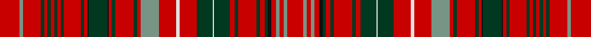

This page is one **sett** — a single exact thread-count. It belongs to the [tartan](/tartans/r30y5r27dg5r5dg5r5dg5r5dg5r25dg5r5k2dg28k2r5dg5r28dg5r5y28r26w5r26dg24w2dg24r7dg5r28dg5r7dg5k5r7y5r7y5r24/)
(the same proportion at any scale), whose colour order is pattern [RGRGRGRGRGRGRKGKRGRGRGRWRGWGRGRGRGKRGRGR](/stripes/rgrgrgrgrgrgrkgkrgrgrgrwrgwgrgrgrgkrgrgr/).

Sourced from register-of-tartans.  It is a [40 stripe tartan](/stripes/stripes40/).

Original link https://www.tartanregister.gov.uk/tartanDetails.aspx?ref=949

## Register references

External register numbers recorded for this tartan.

- Scottish Register of Tartans: [949](https://www.tartanregister.gov.uk/tartanDetails.aspx?ref=949)
- Scottish Tartans Authority (ITI): 4689

## Thread count
R/60 LG10 R54 DG10 R10 DG10 R10 DG10 R10 DG10 R50 DG10 R10 K4 DG56 K4 R10 DG10 R56 DG10 R10 LG56 R52 LN10 R52 DG48 LN4 DG48 R14 DG10 R56 DG10 R14 DG10 K10 R14 LG10 R14 LG10 R/48

## Palette

Palette: <strong>Tartan Register</strong>
<table><thead><tr><th>Colour</th><th>Threads</th><th>Shade</th><th>Base</th><th>OKLCh</th></tr></thead><tbody><tr><td>R/</td><td style="text-align:right;font-variant-numeric:tabular-nums">60</td><td><code style="background-color:#C80000;">#C80000</code> <small style="color:#888">#C80000</small></td><td>R <code style="background-color:#CC0000;">#CC0000</code></td><td><small style="color:#888">oklch(52.3% 0.215 29.2)</small></td></tr><tr><td>LG</td><td style="text-align:right;font-variant-numeric:tabular-nums">10</td><td><code style="background-color:#789484;">#789484</code> <small style="color:#888">#789484</small></td><td>G <code style="background-color:#006100;">#006100</code></td><td><small style="color:#888">oklch(64.0% 0.040 160.0)</small></td></tr><tr><td>R</td><td style="text-align:right;font-variant-numeric:tabular-nums">54</td><td><code style="background-color:#C80000;">#C80000</code> <small style="color:#888">#C80000</small></td><td>R <code style="background-color:#CC0000;">#CC0000</code></td><td><small style="color:#888">oklch(52.3% 0.215 29.2)</small></td></tr><tr><td>DG</td><td style="text-align:right;font-variant-numeric:tabular-nums">10</td><td><code style="background-color:#003820;">#003820</code> <small style="color:#888">#003820</small></td><td>G <code style="background-color:#006100;">#006100</code></td><td><small style="color:#888">oklch(30.0% 0.070 158.3)</small></td></tr><tr><td>R</td><td style="text-align:right;font-variant-numeric:tabular-nums">10</td><td><code style="background-color:#C80000;">#C80000</code> <small style="color:#888">#C80000</small></td><td>R <code style="background-color:#CC0000;">#CC0000</code></td><td><small style="color:#888">oklch(52.3% 0.215 29.2)</small></td></tr><tr><td>DG</td><td style="text-align:right;font-variant-numeric:tabular-nums">10</td><td><code style="background-color:#003820;">#003820</code> <small style="color:#888">#003820</small></td><td>G <code style="background-color:#006100;">#006100</code></td><td><small style="color:#888">oklch(30.0% 0.070 158.3)</small></td></tr><tr><td>R</td><td style="text-align:right;font-variant-numeric:tabular-nums">10</td><td><code style="background-color:#C80000;">#C80000</code> <small style="color:#888">#C80000</small></td><td>R <code style="background-color:#CC0000;">#CC0000</code></td><td><small style="color:#888">oklch(52.3% 0.215 29.2)</small></td></tr><tr><td>DG</td><td style="text-align:right;font-variant-numeric:tabular-nums">10</td><td><code style="background-color:#003820;">#003820</code> <small style="color:#888">#003820</small></td><td>G <code style="background-color:#006100;">#006100</code></td><td><small style="color:#888">oklch(30.0% 0.070 158.3)</small></td></tr><tr><td>R</td><td style="text-align:right;font-variant-numeric:tabular-nums">10</td><td><code style="background-color:#C80000;">#C80000</code> <small style="color:#888">#C80000</small></td><td>R <code style="background-color:#CC0000;">#CC0000</code></td><td><small style="color:#888">oklch(52.3% 0.215 29.2)</small></td></tr><tr><td>DG</td><td style="text-align:right;font-variant-numeric:tabular-nums">10</td><td><code style="background-color:#003820;">#003820</code> <small style="color:#888">#003820</small></td><td>G <code style="background-color:#006100;">#006100</code></td><td><small style="color:#888">oklch(30.0% 0.070 158.3)</small></td></tr><tr><td>R</td><td style="text-align:right;font-variant-numeric:tabular-nums">50</td><td><code style="background-color:#C80000;">#C80000</code> <small style="color:#888">#C80000</small></td><td>R <code style="background-color:#CC0000;">#CC0000</code></td><td><small style="color:#888">oklch(52.3% 0.215 29.2)</small></td></tr><tr><td>DG</td><td style="text-align:right;font-variant-numeric:tabular-nums">10</td><td><code style="background-color:#003820;">#003820</code> <small style="color:#888">#003820</small></td><td>G <code style="background-color:#006100;">#006100</code></td><td><small style="color:#888">oklch(30.0% 0.070 158.3)</small></td></tr><tr><td>R</td><td style="text-align:right;font-variant-numeric:tabular-nums">10</td><td><code style="background-color:#C80000;">#C80000</code> <small style="color:#888">#C80000</small></td><td>R <code style="background-color:#CC0000;">#CC0000</code></td><td><small style="color:#888">oklch(52.3% 0.215 29.2)</small></td></tr><tr><td>K</td><td style="text-align:right;font-variant-numeric:tabular-nums">4</td><td><code style="background-color:#101010;">#101010</code> <small style="color:#888">#101010</small></td><td>K <code style="background-color:#000000;">#000000</code></td><td><small style="color:#888">oklch(17.3% 0.000 89.9)</small></td></tr><tr><td>DG</td><td style="text-align:right;font-variant-numeric:tabular-nums">56</td><td><code style="background-color:#003820;">#003820</code> <small style="color:#888">#003820</small></td><td>G <code style="background-color:#006100;">#006100</code></td><td><small style="color:#888">oklch(30.0% 0.070 158.3)</small></td></tr><tr><td>K</td><td style="text-align:right;font-variant-numeric:tabular-nums">4</td><td><code style="background-color:#101010;">#101010</code> <small style="color:#888">#101010</small></td><td>K <code style="background-color:#000000;">#000000</code></td><td><small style="color:#888">oklch(17.3% 0.000 89.9)</small></td></tr><tr><td>R</td><td style="text-align:right;font-variant-numeric:tabular-nums">10</td><td><code style="background-color:#C80000;">#C80000</code> <small style="color:#888">#C80000</small></td><td>R <code style="background-color:#CC0000;">#CC0000</code></td><td><small style="color:#888">oklch(52.3% 0.215 29.2)</small></td></tr><tr><td>DG</td><td style="text-align:right;font-variant-numeric:tabular-nums">10</td><td><code style="background-color:#003820;">#003820</code> <small style="color:#888">#003820</small></td><td>G <code style="background-color:#006100;">#006100</code></td><td><small style="color:#888">oklch(30.0% 0.070 158.3)</small></td></tr><tr><td>R</td><td style="text-align:right;font-variant-numeric:tabular-nums">56</td><td><code style="background-color:#C80000;">#C80000</code> <small style="color:#888">#C80000</small></td><td>R <code style="background-color:#CC0000;">#CC0000</code></td><td><small style="color:#888">oklch(52.3% 0.215 29.2)</small></td></tr><tr><td>DG</td><td style="text-align:right;font-variant-numeric:tabular-nums">10</td><td><code style="background-color:#003820;">#003820</code> <small style="color:#888">#003820</small></td><td>G <code style="background-color:#006100;">#006100</code></td><td><small style="color:#888">oklch(30.0% 0.070 158.3)</small></td></tr><tr><td>R</td><td style="text-align:right;font-variant-numeric:tabular-nums">10</td><td><code style="background-color:#C80000;">#C80000</code> <small style="color:#888">#C80000</small></td><td>R <code style="background-color:#CC0000;">#CC0000</code></td><td><small style="color:#888">oklch(52.3% 0.215 29.2)</small></td></tr><tr><td>LG</td><td style="text-align:right;font-variant-numeric:tabular-nums">56</td><td><code style="background-color:#789484;">#789484</code> <small style="color:#888">#789484</small></td><td>G <code style="background-color:#006100;">#006100</code></td><td><small style="color:#888">oklch(64.0% 0.040 160.0)</small></td></tr><tr><td>R</td><td style="text-align:right;font-variant-numeric:tabular-nums">52</td><td><code style="background-color:#C80000;">#C80000</code> <small style="color:#888">#C80000</small></td><td>R <code style="background-color:#CC0000;">#CC0000</code></td><td><small style="color:#888">oklch(52.3% 0.215 29.2)</small></td></tr><tr><td>LN</td><td style="text-align:right;font-variant-numeric:tabular-nums">10</td><td><code style="background-color:#E0E0E0;">#E0E0E0</code> <small style="color:#888">#E0E0E0</small></td><td>W <code style="background-color:#F7F7F7;">#F7F7F7</code></td><td><small style="color:#888">oklch(90.7% 0.000 89.9)</small></td></tr><tr><td>R</td><td style="text-align:right;font-variant-numeric:tabular-nums">52</td><td><code style="background-color:#C80000;">#C80000</code> <small style="color:#888">#C80000</small></td><td>R <code style="background-color:#CC0000;">#CC0000</code></td><td><small style="color:#888">oklch(52.3% 0.215 29.2)</small></td></tr><tr><td>DG</td><td style="text-align:right;font-variant-numeric:tabular-nums">48</td><td><code style="background-color:#003820;">#003820</code> <small style="color:#888">#003820</small></td><td>G <code style="background-color:#006100;">#006100</code></td><td><small style="color:#888">oklch(30.0% 0.070 158.3)</small></td></tr><tr><td>LN</td><td style="text-align:right;font-variant-numeric:tabular-nums">4</td><td><code style="background-color:#E0E0E0;">#E0E0E0</code> <small style="color:#888">#E0E0E0</small></td><td>W <code style="background-color:#F7F7F7;">#F7F7F7</code></td><td><small style="color:#888">oklch(90.7% 0.000 89.9)</small></td></tr><tr><td>DG</td><td style="text-align:right;font-variant-numeric:tabular-nums">48</td><td><code style="background-color:#003820;">#003820</code> <small style="color:#888">#003820</small></td><td>G <code style="background-color:#006100;">#006100</code></td><td><small style="color:#888">oklch(30.0% 0.070 158.3)</small></td></tr><tr><td>R</td><td style="text-align:right;font-variant-numeric:tabular-nums">14</td><td><code style="background-color:#C80000;">#C80000</code> <small style="color:#888">#C80000</small></td><td>R <code style="background-color:#CC0000;">#CC0000</code></td><td><small style="color:#888">oklch(52.3% 0.215 29.2)</small></td></tr><tr><td>DG</td><td style="text-align:right;font-variant-numeric:tabular-nums">10</td><td><code style="background-color:#003820;">#003820</code> <small style="color:#888">#003820</small></td><td>G <code style="background-color:#006100;">#006100</code></td><td><small style="color:#888">oklch(30.0% 0.070 158.3)</small></td></tr><tr><td>R</td><td style="text-align:right;font-variant-numeric:tabular-nums">56</td><td><code style="background-color:#C80000;">#C80000</code> <small style="color:#888">#C80000</small></td><td>R <code style="background-color:#CC0000;">#CC0000</code></td><td><small style="color:#888">oklch(52.3% 0.215 29.2)</small></td></tr><tr><td>DG</td><td style="text-align:right;font-variant-numeric:tabular-nums">10</td><td><code style="background-color:#003820;">#003820</code> <small style="color:#888">#003820</small></td><td>G <code style="background-color:#006100;">#006100</code></td><td><small style="color:#888">oklch(30.0% 0.070 158.3)</small></td></tr><tr><td>R</td><td style="text-align:right;font-variant-numeric:tabular-nums">14</td><td><code style="background-color:#C80000;">#C80000</code> <small style="color:#888">#C80000</small></td><td>R <code style="background-color:#CC0000;">#CC0000</code></td><td><small style="color:#888">oklch(52.3% 0.215 29.2)</small></td></tr><tr><td>DG</td><td style="text-align:right;font-variant-numeric:tabular-nums">10</td><td><code style="background-color:#003820;">#003820</code> <small style="color:#888">#003820</small></td><td>G <code style="background-color:#006100;">#006100</code></td><td><small style="color:#888">oklch(30.0% 0.070 158.3)</small></td></tr><tr><td>K</td><td style="text-align:right;font-variant-numeric:tabular-nums">10</td><td><code style="background-color:#101010;">#101010</code> <small style="color:#888">#101010</small></td><td>K <code style="background-color:#000000;">#000000</code></td><td><small style="color:#888">oklch(17.3% 0.000 89.9)</small></td></tr><tr><td>R</td><td style="text-align:right;font-variant-numeric:tabular-nums">14</td><td><code style="background-color:#C80000;">#C80000</code> <small style="color:#888">#C80000</small></td><td>R <code style="background-color:#CC0000;">#CC0000</code></td><td><small style="color:#888">oklch(52.3% 0.215 29.2)</small></td></tr><tr><td>LG</td><td style="text-align:right;font-variant-numeric:tabular-nums">10</td><td><code style="background-color:#789484;">#789484</code> <small style="color:#888">#789484</small></td><td>G <code style="background-color:#006100;">#006100</code></td><td><small style="color:#888">oklch(64.0% 0.040 160.0)</small></td></tr><tr><td>R</td><td style="text-align:right;font-variant-numeric:tabular-nums">14</td><td><code style="background-color:#C80000;">#C80000</code> <small style="color:#888">#C80000</small></td><td>R <code style="background-color:#CC0000;">#CC0000</code></td><td><small style="color:#888">oklch(52.3% 0.215 29.2)</small></td></tr><tr><td>LG</td><td style="text-align:right;font-variant-numeric:tabular-nums">10</td><td><code style="background-color:#789484;">#789484</code> <small style="color:#888">#789484</small></td><td>G <code style="background-color:#006100;">#006100</code></td><td><small style="color:#888">oklch(64.0% 0.040 160.0)</small></td></tr><tr><td>R/</td><td style="text-align:right;font-variant-numeric:tabular-nums">48</td><td><code style="background-color:#C80000;">#C80000</code> <small style="color:#888">#C80000</small></td><td>R <code style="background-color:#CC0000;">#CC0000</code></td><td><small style="color:#888">oklch(52.3% 0.215 29.2)</small></td></tr></tbody></table>

## Nearest tartans

The nearest existing variants by ΔTartan distance, with this tartan at the top so the swatches line up against it.

ΔTartan

Tartan

Sett

—

<a href="/ttd/edit/#slug=r30y5r27dg5r5dg5r5dg5r5dg5r25dg5r5k2dg28k2r5dg5r28dg5r5y28r26w5r26dg24w2dg24r7dg5r28dg5r7dg5k5r7y5r7y5r24~x2">Donald of Staffa's Sett</a> <a class="nn-out" href="/setts/s40/r30y5r27dg5r5dg5r5dg5r5dg5r25dg5r5k2dg28k2r5dg5r28dg5r5y28r26w5r26dg24w2dg24r7dg5r28dg5r7dg5k5r7y5r7y5r24~x2/" title="open its dictionary page">↗</a>

0.40

<a href="/ttd/edit/#slug=r24db4r22dg4r4dg4r4dg4r4dg4r20dg4r4k2dg22k2r4dg4r22dg4r4db22r21w4r21dg19w2dg19r5dg4r22dg4r5dg4k4r5db4r5db4r19">MacDonald of Staffa</a> <a class="nn-out" href="/setts/s40/r24db4r22dg4r4dg4r4dg4r4dg4r20dg4r4k2dg22k2r4dg4r22dg4r4db22r21w4r21dg19w2dg19r5dg4r22dg4r5dg4k4r5db4r5db4r19/" title="open its dictionary page">↗</a>

0.63

<a href="/ttd/edit/#slug=r24db4r22g4r4g4r4g4r4g4r20g4r4k2g22k2r4g4r22g4r4db22r21w4r21g19w2g19r5g4r22g4r5g4k4r5db4r5db4r19">MacDonald of Staffa 6</a> <a class="nn-out" href="/setts/s40/r24db4r22g4r4g4r4g4r4g4r20g4r4k2g22k2r4g4r22g4r4db22r21w4r21g19w2g19r5g4r22g4r5g4k4r5db4r5db4r19/" title="open its dictionary page">↗</a>

0.91

<a href="/ttd/edit/#slug=r12dg3ly1r2ly1dg3r3db3r6t1r1dg8r1t1r12t1r1dg8r1t1r6dg2r1t1r2t1r1dg3ly1r4~x4">MacAlister (Gourlay Steele Collection)</a> <a class="nn-out" href="/setts/s30/r12dg3ly1r2ly1dg3r3db3r6t1r1dg8r1t1r12t1r1dg8r1t1r6dg2r1t1r2t1r1dg3ly1r4~x4/" title="open its dictionary page">↗</a>

0.97

<a href="/ttd/edit/#slug=db48r40k4r4dgi48r54db46r54dg14r4k4r4k4r48k4r4k4r4dg14r52db46r54dg60r4dg4r48db4r12db4r4db4r48k4r4dg60r48db4r4db4r4k7">MacKintosh #6</a> <a class="nn-out" href="/setts/s41/db48r40k4r4dgi48r54db46r54dg14r4k4r4k4r48k4r4k4r4dg14r52db46r54dg60r4dg4r48db4r12db4r4db4r48k4r4dg60r48db4r4db4r4k7/" title="open its dictionary page">↗</a>

0.99

<a href="/ttd/edit/#slug=db48r40k4r4g48r54db46r54dg14r4k4r4k4r48k4r4k4r4dg14r52db46r54dg60r4dg4r48db4r4r8db4r4db4r48k4r4dg60r48db4r4db4r4k7">MacKintosh 5</a> <a class="nn-out" href="/setts/s42/db48r40k4r4g48r54db46r54dg14r4k4r4k4r48k4r4k4r4dg14r52db46r54dg60r4dg4r48db4r4r8db4r4db4r48k4r4dg60r48db4r4db4r4k7/" title="open its dictionary page">↗</a>

1.05

<a href="/ttd/edit/#slug=r16g1r1g1r1g1r1g1r6g1db1g6k1r1g1r4g1r1db4r4w1r4g4w1g4r1g1r6g1r8w1~x2">MacDonald of Staffa (Smith's)</a> <a class="nn-out" href="/setts/s31/r16g1r1g1r1g1r1g1r6g1db1g6k1r1g1r4g1r1db4r4w1r4g4w1g4r1g1r6g1r8w1~x2/" title="open its dictionary page">↗</a>

1.08

<a href="/ttd/edit/#slug=r23dg2r3dg2r3dg2r5ly5r5dg2r3dg2r3dg2r23dg23r5dg15r5dg23r23dg2r3dg2r3dg2r5w5r5dg2r3dg2r3dg2r23dp15r5dp15r5dp15~x2">MacRae of Inverinate</a> <a class="nn-out" href="/setts/s40/r23dg2r3dg2r3dg2r5ly5r5dg2r3dg2r3dg2r23dg23r5dg15r5dg23r23dg2r3dg2r3dg2r5w5r5dg2r3dg2r3dg2r23dp15r5dp15r5dp15~x2/" title="open its dictionary page">↗</a>

1.11

<a href="/ttd/edit/#slug=dt6r3ly14r3ri15ly3ri15dt5ri3g1ri3g1ri3g1ri3g1ri3g1ri3g1ri3g1ri3g1ri3g1ri3dt5ri15ly3ri19r3ly14r3~x2">Confrerie de Vouvray Corporate Tartan Tartan Number: 5802. Earliest known date: 2003 The Confrerie de Vouvray tartan was created for the French Order of Wine Growers by the Chevaliers Ecossais de la Chantepleure de Vouvray. The red, yellow and maroon are the colours of the french order and the grid pattern of green lines depict the rows of vines of the Chenin Blanc grape. The tartan was presented as a gift to the Grand Council at the 2nd Scottish Confrerie, held in Dundee in May 2003. See products available Copyright © Blair Urquhart, Comrie, 2015</a> <a class="nn-out" href="/setts/s34/dt6r3ly14r3ri15ly3ri15dt5ri3g1ri3g1ri3g1ri3g1ri3g1ri3g1ri3g1ri3g1ri3g1ri3dt5ri15ly3ri19r3ly14r3~x2/" title="open its dictionary page">↗</a>

1.14

<a href="/ttd/edit/#slug=dg32r7dg32r33dg4r12dg4r33w3r12ly3dp33r7dp33ly3r12w3r33dp2r2dp5r2dp2r33dp2r2dp5r2dp2r33dg32r6dg23">Huntly (District)</a> <a class="nn-out" href="/setts/s33/dg32r7dg32r33dg4r12dg4r33w3r12ly3dp33r7dp33ly3r12w3r33dp2r2dp5r2dp2r33dp2r2dp5r2dp2r33dg32r6dg23/" title="open its dictionary page">↗</a>

1.20

<a href="/ttd/edit/#slug=g8r2g8r12g2r3g2r12w1r3ly1db12r3db12ly1r3w1r12db1r1db2r1db1r12db1r1db2r1db1r12g8r2g8~x2">Huntly</a> <a class="nn-out" href="/setts/s33/g8r2g8r12g2r3g2r12w1r3ly1db12r3db12ly1r3w1r12db1r1db2r1db1r12db1r1db2r1db1r12g8r2g8~x2/" title="open its dictionary page">↗</a>

## Neighbour map

Every grey dot is one of 14359 variants placed by the first two principal components of the ΔTartan feature space (44% of its variance). Red is this tartan; blue dots are its nearest — click one to open its page.

<svg viewBox="0 0 640 380" role="img" style="max-width:100%;height:auto;border:1px solid #e0e0e0;border-radius:4px;display:block" xmlns="http://www.w3.org/2000/svg"><image href="/nn/cloud.v1.png" width="640" height="380"/><a href="/setts/s40/r24db4r22dg4r4dg4r4dg4r4dg4r20dg4r4k2dg22k2r4dg4r22dg4r4db22r21w4r21dg19w2dg19r5dg4r22dg4r5dg4k4r5db4r5db4r19/"><circle cx="290.7" cy="95.7" r="4" fill="#3465a4"><title>MacDonald of Staffa</title></circle></a><a href="/setts/s40/r24db4r22g4r4g4r4g4r4g4r20g4r4k2g22k2r4g4r22g4r4db22r21w4r21g19w2g19r5g4r22g4r5g4k4r5db4r5db4r19/"><circle cx="289.0" cy="99.0" r="4" fill="#3465a4"><title>MacDonald of Staffa 6</title></circle></a><a href="/setts/s30/r12dg3ly1r2ly1dg3r3db3r6t1r1dg8r1t1r12t1r1dg8r1t1r6dg2r1t1r2t1r1dg3ly1r4~x4/"><circle cx="298.2" cy="97.0" r="4" fill="#3465a4"><title>MacAlister (Gourlay Steele Collection)</title></circle></a><a href="/setts/s41/db48r40k4r4dgi48r54db46r54dg14r4k4r4k4r48k4r4k4r4dg14r52db46r54dg60r4dg4r48db4r12db4r4db4r48k4r4dg60r48db4r4db4r4k7/"><circle cx="272.9" cy="74.1" r="4" fill="#3465a4"><title>MacKintosh #6</title></circle></a><a href="/setts/s42/db48r40k4r4g48r54db46r54dg14r4k4r4k4r48k4r4k4r4dg14r52db46r54dg60r4dg4r48db4r4r8db4r4db4r48k4r4dg60r48db4r4db4r4k7/"><circle cx="279.8" cy="78.5" r="4" fill="#3465a4"><title>MacKintosh 5</title></circle></a><a href="/setts/s31/r16g1r1g1r1g1r1g1r6g1db1g6k1r1g1r4g1r1db4r4w1r4g4w1g4r1g1r6g1r8w1~x2/"><circle cx="348.8" cy="79.4" r="4" fill="#3465a4"><title>MacDonald of Staffa (Smith's)</title></circle></a><a href="/setts/s40/r23dg2r3dg2r3dg2r5ly5r5dg2r3dg2r3dg2r23dg23r5dg15r5dg23r23dg2r3dg2r3dg2r5w5r5dg2r3dg2r3dg2r23dp15r5dp15r5dp15~x2/"><circle cx="259.6" cy="88.5" r="4" fill="#3465a4"><title>MacRae of Inverinate</title></circle></a><a href="/setts/s34/dt6r3ly14r3ri15ly3ri15dt5ri3g1ri3g1ri3g1ri3g1ri3g1ri3g1ri3g1ri3g1ri3g1ri3dt5ri15ly3ri19r3ly14r3~x2/"><circle cx="283.2" cy="67.7" r="4" fill="#3465a4"><title>Confrerie de Vouvray Corporate Tartan Tartan Number: 5802. Earliest known date: 2003 The Confrerie de Vouvray tartan was created for the French Order of Wine Growers by the Chevaliers Ecossais de la Chantepleure de Vouvray. The red, yellow and maroon are the colours of the french order and the grid pattern of green lines depict the rows of vines of the Chenin Blanc grape. The tartan was presented as a gift to the Grand Council at the 2nd Scottish Confrerie, held in Dundee in May 2003. See products available Copyright © Blair Urquhart, Comrie, 2015</title></circle></a><a href="/setts/s33/dg32r7dg32r33dg4r12dg4r33w3r12ly3dp33r7dp33ly3r12w3r33dp2r2dp5r2dp2r33dp2r2dp5r2dp2r33dg32r6dg23/"><circle cx="273.2" cy="91.6" r="4" fill="#3465a4"><title>Huntly (District)</title></circle></a><a href="/setts/s33/g8r2g8r12g2r3g2r12w1r3ly1db12r3db12ly1r3w1r12db1r1db2r1db1r12db1r1db2r1db1r12g8r2g8~x2/"><circle cx="259.4" cy="103.2" r="4" fill="#3465a4"><title>Huntly</title></circle></a><circle cx="304.6" cy="91.4" r="5" fill="#c00000"/></svg>

ID: /setts/s40/r30y5r27dg5r5dg5r5dg5r5dg5r25dg5r5k2dg28k2r5dg5r28dg5r5y28r26w5r26dg24w2dg24r7dg5r28dg5r7dg5k5r7y5r7y5r24~x2/
