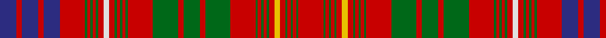

In pattern [BRBRBRGRGRGRWRGRGRGRGRGRGRGRGRGRYRGRGRGR](/patterns/brbrbrgrgrgrwrgrgrgrgrgrgrgrgrgryrgrgrgr/).

This was sourced from house-of-tartan.  It is a [40 stripes tartan](/stripes/stripes40/).

Original link http://www.house-of-tartan.scotland.net/house/TartanViewjs.asp?colr=Def&tnam=2000

## Thread count
DB/30 R10 DB30 R10 DB30 R46 G4 R6 G4 R6 G4 R10 LN10 R10 G4 R6 G4 R6 G4 R46 G46 R10 G30 R10 G46 R46 G4 R6 G4 R6 G4 R10 Y10 R10 G4 R6 G4 R6 G4 R/46

## Palette
Each colour and its ΔE from the base-6 reference it is a variant of.

| Colour | Shade | Base | ΔE (OKLab) |
|---|---|---|---|
| DB | <code style="background-color:#2C2C80;">#2C2C80</code> `#2C2C80` | B <code style="background-color:#2C4084;">#2C4084</code> | 0.05 |
| G | <code style="background-color:#006818;">#006818</code> `#006818` | G <code style="background-color:#006400;">#006400</code> | 0.02 |
| LN | <code style="background-color:#E0E0E0;">#E0E0E0</code> `#E0E0E0` | W <code style="background-color:#F4F4F0;">#F4F4F0</code> | 0.06 |
| R | <code style="background-color:#C80000;">#C80000</code> `#C80000` | R <code style="background-color:#C80000;">#C80000</code> | 0.00 |
| Y | <code style="background-color:#E8C000;">#E8C000</code> `#E8C000` | Y <code style="background-color:#E8C000;">#E8C000</code> | 0.00 |

## Nearest tartans

The nearest existing variants by ΔTartan distance.

1. [MacRae of Inverinate](/setts/s40/r46g4r6g4r6g4r10y10r10g4r6g4r6g4r46g46r10g30r10g46r46g4r6g4r6g4r10w10r10g4r6g4r6g4r46b30r10b30r10b30-b304080-g008000-rc00000-we0e0e0-yf0c000/) — ΔT 0.38
1. [Huntly](/setts/s33/g16r4g16r24g4r6g4r24w2r6y2b24r6b24y2r6w2r24b2r2b4r2b2r24b2r2b4r2b2r24g16r4g16-b304080-g008000-rc00000-we0e0e0-yf0c000/) — ΔT 0.48
1. [Huntly District Tartan Tartan Number: 853. Earliest known date: 1893 (1745) 'Old and Rare Scottish Tartans' was published in 1893 by D.W. Stewart. The book was illustrated by samples woven in silk. The Huntly district tartan is known to have been worn at the time of the '45 rebellion by Brodies, Forbes', Gordons, MacRaes, Munros and Rosses which gives a strong indication of the greater antiquity of the 'District' setts. See products available Copyright © Blair Urquhart, Comrie, 2015](/setts/s33/g16r4g16r24g4r6g4r24w2r6y2b24r6b24y2r6w2r24b2r2b4r2b2r24b2r2b4r2b2r24g16r4g16-b2c2c80-g006818-rc80000-we0e0e0-ye8c000/) — ΔT 0.54
1. [MacKintosh 5](/setts/s42/b48r40k4r4g48r54b46r54ga14r4k4r4k4r48k4r4k4r4ga14r52b46r54ga60r4ga4r48b4r4r8b4r4b4r48k4r4ga60r48b4r4b4r4k7-b304080-g008000-ga003000-k000000-rc00000/) — ΔT 0.78
1. [MacRae of Inverinate](/setts/s40/r46g4r6g4r6g4r10y10r10g4r6g4r6g4r46g46r10g30r10g46r46g4r6g4r6g4r10w10r10g4r6g4r6g4r46b30r10b30r10b30-b440044-g003820-rc80000-wfcfcfc-yd8b000/) — ΔT 0.78
1. [Lumsden (Waistcoat)](/setts/s39/g21w2g20r8g6y3g6r8g10r9g11r22g3r9g3r21w2r10b26r6b26r10w2r19g2r2g3r2g2r20g2r2g3r2g2r19g20r6g20-b2c2c80-g006818-rc80000-we0e0e0-ye8c000/) — ΔT 0.83
1. [MacDonald of Staffa Clan Tartan Tartan Number: 1387. Earliest known date: 1819 Reduced by 60% for display. Until recently the various branches of the Clan Donald were regarded as independant clans in their own right. In 1947 the Mac Dhomnuill was re-instated by Lord Lyon. See products available Copyright © Blair Urquhart, Comrie, 2015](/setts/s40/r24b4r22g4r4g4r4g4r4g4r20g4r4k2g22k2r4g4r22g4r4b22r21w4r21g19w2g19r5g4r22g4r5g4k4r5b4r5b4r19-b2c2c80-g006818-k101010-rc80000-we0e0e0/) — ΔT 0.92
1. [MacDonald of Staffa 6](/setts/s40/r24b4r22g4r4g4r4g4r4g4r20g4r4k2g22k2r4g4r22g4r4b22r21w4r21g19w2g19r5g4r22g4r5g4k4r5b4r5b4r19-b304080-g008000-k000000-rc00000-we0e0e0/) — ΔT 0.92
1. [MacKintosh #6](/setts/s41/b48r40k4r4g48r54b46r54ba14r4k4r4k4r48k4r4k4r4ba14r52b46r54ba60r4ba4r48b4r12b4r4b4r48k4r4ba60r48b4r4b4r4k7-b2c4084-ba002814-g005020-k101010-rdc0000/) — ΔT 0.93
1. [Marchioness of Huntly's](/setts/s33/g64r14g64r66g8r24g8r66w6r24y6b66r14b66y6r24w6r66b4r4b10r4b4r66b4r4b10r4b4r66g64r14g64-b780078-g006818-rc80000-wc0c0c0-yd8b000/) — ΔT 0.95

## Neighbour map

Every grey dot is one of 15726 variants placed by the first two principal components of the ΔTartan feature space (44% of its variance). Red is this tartan; blue dots are its nearest — click one to open its page.

<svg viewBox="0 0 640 380" role="img" style="max-width:100%;height:auto;border:1px solid #e0e0e0;border-radius:4px;display:block" xmlns="http://www.w3.org/2000/svg"><image href="/nn/cloud.v1.png" width="640" height="380"/><a href="/setts/s40/r46g4r6g4r6g4r10y10r10g4r6g4r6g4r46g46r10g30r10g46r46g4r6g4r6g4r10w10r10g4r6g4r6g4r46b30r10b30r10b30-b304080-g008000-rc00000-we0e0e0-yf0c000/"><circle cx="256.4" cy="89.9" r="4" fill="#3465a4"><title>MacRae of Inverinate</title></circle></a><a href="/setts/s33/g16r4g16r24g4r6g4r24w2r6y2b24r6b24y2r6w2r24b2r2b4r2b2r24b2r2b4r2b2r24g16r4g16-b304080-g008000-rc00000-we0e0e0-yf0c000/"><circle cx="257.6" cy="101.4" r="4" fill="#3465a4"><title>Huntly</title></circle></a><a href="/setts/s33/g16r4g16r24g4r6g4r24w2r6y2b24r6b24y2r6w2r24b2r2b4r2b2r24b2r2b4r2b2r24g16r4g16-b2c2c80-g006818-rc80000-we0e0e0-ye8c000/"><circle cx="255.2" cy="99.5" r="4" fill="#3465a4"><title>Huntly District Tartan Tartan Number: 853. Earliest known date: 1893 (1745) 'Old and Rare Scottish Tartans' was published in 1893 by D.W. Stewart. The book was illustrated by samples woven in silk. The Huntly district tartan is known to have been worn at the time of the '45 rebellion by Brodies, Forbes', Gordons, MacRaes, Munros and Rosses which gives a strong indication of the greater antiquity of the 'District' setts. See products available Copyright © Blair Urquhart, Comrie, 2015</title></circle></a><a href="/setts/s42/b48r40k4r4g48r54b46r54ga14r4k4r4k4r48k4r4k4r4ga14r52b46r54ga60r4ga4r48b4r4r8b4r4b4r48k4r4ga60r48b4r4b4r4k7-b304080-g008000-ga003000-k000000-rc00000/"><circle cx="277.6" cy="76.9" r="4" fill="#3465a4"><title>MacKintosh 5</title></circle></a><a href="/setts/s40/r46g4r6g4r6g4r10y10r10g4r6g4r6g4r46g46r10g30r10g46r46g4r6g4r6g4r10w10r10g4r6g4r6g4r46b30r10b30r10b30-b440044-g003820-rc80000-wfcfcfc-yd8b000/"><circle cx="257.9" cy="87.4" r="4" fill="#3465a4"><title>MacRae of Inverinate</title></circle></a><a href="/setts/s39/g21w2g20r8g6y3g6r8g10r9g11r22g3r9g3r21w2r10b26r6b26r10w2r19g2r2g3r2g2r20g2r2g3r2g2r19g20r6g20-b2c2c80-g006818-rc80000-we0e0e0-ye8c000/"><circle cx="226.2" cy="101.6" r="4" fill="#3465a4"><title>Lumsden (Waistcoat)</title></circle></a><a href="/setts/s40/r24b4r22g4r4g4r4g4r4g4r20g4r4k2g22k2r4g4r22g4r4b22r21w4r21g19w2g19r5g4r22g4r5g4k4r5b4r5b4r19-b2c2c80-g006818-k101010-rc80000-we0e0e0/"><circle cx="295.4" cy="100.1" r="4" fill="#3465a4"><title>MacDonald of Staffa Clan Tartan Tartan Number: 1387. Earliest known date: 1819 Reduced by 60% for display. Until recently the various branches of the Clan Donald were regarded as independant clans in their own right. In 1947 the Mac Dhomnuill was re-instated by Lord Lyon. See products available Copyright © Blair Urquhart, Comrie, 2015</title></circle></a><a href="/setts/s40/r24b4r22g4r4g4r4g4r4g4r20g4r4k2g22k2r4g4r22g4r4b22r21w4r21g19w2g19r5g4r22g4r5g4k4r5b4r5b4r19-b304080-g008000-k000000-rc00000-we0e0e0/"><circle cx="288.4" cy="98.3" r="4" fill="#3465a4"><title>MacDonald of Staffa 6</title></circle></a><a href="/setts/s41/b48r40k4r4g48r54b46r54ba14r4k4r4k4r48k4r4k4r4ba14r52b46r54ba60r4ba4r48b4r12b4r4b4r48k4r4ba60r48b4r4b4r4k7-b2c4084-ba002814-g005020-k101010-rdc0000/"><circle cx="271.3" cy="73.5" r="4" fill="#3465a4"><title>MacKintosh #6</title></circle></a><a href="/setts/s33/g64r14g64r66g8r24g8r66w6r24y6b66r14b66y6r24w6r66b4r4b10r4b4r66b4r4b10r4b4r66g64r14g64-b780078-g006818-rc80000-wc0c0c0-yd8b000/"><circle cx="268.7" cy="90.5" r="4" fill="#3465a4"><title>Marchioness of Huntly's</title></circle></a><circle cx="255.8" cy="88.7" r="5" fill="#c00000"/></svg>

ID: /setts/s40/r46g4r6g4r6g4r10y10r10g4r6g4r6g4r46g46r10g30r10g46r46g4r6g4r6g4r10w10r10g4r6g4r6g4r46b30r10b30r10b30-b2c2c80-g006818-rc80000-we0e0e0-ye8c000/
