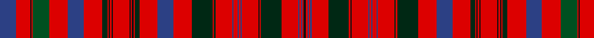

In pattern [BRKRGRBRBRKRKRKRKRBRBRBRBRBRBRBRKRBRBRBRK](/patterns/brkrgrbrbrkrkrkrkrbrbrbrbrbrbrbrkrbrbrbrk/).

This was sourced from register-of-tartans.  It is a [41 stripes tartan](/stripes/stripes41/).

Original link https://www.tartanregister.gov.uk/tartanDetails.aspx?ref=2564

## Thread count
B/48 R40 K4 R4 G48 R54 B46 R54 DG14 R4 K4 R4 K4 R48 K4 R4 K4 R4 DG14 R52 B46 R54 DG60 R4 DG4 R48 B4 R12 B4 R4 B4 R48 K4 R4 DG60 R48 B4 R4 B4 R4 K/7

## Palette
Each colour and its ΔE from the base-6 reference it is a variant of.

| Colour | Shade | Base | ΔE (OKLab) |
|---|---|---|---|
| B | <code style="background-color:#2C4084;">#2C4084</code> `#2C4084` | B <code style="background-color:#2C4084;">#2C4084</code> | 0.00 |
| DG | <code style="background-color:#002814;">#002814</code> `#002814` | B <code style="background-color:#2C4084;">#2C4084</code> | 0.21 |
| G | <code style="background-color:#005020;">#005020</code> `#005020` | G <code style="background-color:#006400;">#006400</code> | 0.08 |
| K | <code style="background-color:#101010;">#101010</code> `#101010` | K <code style="background-color:#000000;">#000000</code> | 0.17 |
| R | <code style="background-color:#DC0000;">#DC0000</code> `#DC0000` | R <code style="background-color:#C80000;">#C80000</code> | 0.04 |

## Nearest tartans

The nearest existing variants by ΔTartan distance.

1. [MacKintosh 5](/setts/s42/b48r40k4r4g48r54b46r54ga14r4k4r4k4r48k4r4k4r4ga14r52b46r54ga60r4ga4r48b4r4r8b4r4b4r48k4r4ga60r48b4r4b4r4k7-b304080-g008000-ga003000-k000000-rc00000/) — ΔT 0.48
1. [MacRae of Inverinate](/setts/s40/r46g4r6g4r6g4r10y10r10g4r6g4r6g4r46g46r10g30r10g46r46g4r6g4r6g4r10w10r10g4r6g4r6g4r46b30r10b30r10b30-b440044-g003820-rc80000-wfcfcfc-yd8b000/) — ΔT 0.55
1. [Huntly District Tartan Tartan Number: 853. Earliest known date: 1893 (1745) 'Old and Rare Scottish Tartans' was published in 1893 by D.W. Stewart. The book was illustrated by samples woven in silk. The Huntly district tartan is known to have been worn at the time of the '45 rebellion by Brodies, Forbes', Gordons, MacRaes, Munros and Rosses which gives a strong indication of the greater antiquity of the 'District' setts. See products available Copyright © Blair Urquhart, Comrie, 2015](/setts/s33/g16r4g16r24g4r6g4r24w2r6y2b24r6b24y2r6w2r24b2r2b4r2b2r24b2r2b4r2b2r24g16r4g16-b2c2c80-g006818-rc80000-we0e0e0-ye8c000/) — ΔT 0.89
1. [MacRae of Inverinate Clan Tartan Tartan Number: 2000. Earliest known date: pre 2003 Presented by Mrs Macrae of Inverinate 1977, and approved for the use of the MacRaes of the Inverinate branch of the Clan. See products available Copyright © Blair Urquhart, Comrie, 2015](/setts/s40/r46g4r6g4r6g4r10y10r10g4r6g4r6g4r46g46r10g30r10g46r46g4r6g4r6g4r10w10r10g4r6g4r6g4r46b30r10b30r10b30-b2c2c80-g006818-rc80000-we0e0e0-ye8c000/) — ΔT 0.93
1. [Huntly (District)](/setts/s33/g32r7g32r33g4r12g4r33w3r12y3b33r7b33y3r12w3r33b2r2b5r2b2r33b2r2b5r2b2r33g32r6g23-b580058-g285800-rc80000-wfcfcfc-yd8b000/) — ΔT 0.94
1. [Donald of Staffa's Sett](/setts/s40/r60g10r54ga10r10ga10r10ga10r10ga10r50ga10r10k4ga56k4r10ga10r56ga10r10g56r52w10r52ga48w4ga48r14ga10r56ga10r14ga10k10r14g10r14g10r48-g789484-ga003820-k101010-rc80000-we0e0e0/) — ΔT 0.97
1. [MacDonald of Staffa](/setts/s40/r24b4r22g4r4g4r4g4r4g4r20g4r4k2g22k2r4g4r22g4r4b22r21w4r21g19w2g19r5g4r22g4r5g4k4r5b4r5b4r19-b2c4084-g005020-k101010-rdc0000-we0e0e0/) — ΔT 1.00
1. [Marchioness of Huntly's](/setts/s33/g64r14g64r66g8r24g8r66w6r24y6b66r14b66y6r24w6r66b4r4b10r4b4r66b4r4b10r4b4r66g64r14g64-b780078-g006818-rc80000-wc0c0c0-yd8b000/) — ΔT 1.07
1. [Confrerie de Vouvray Corporate Tartan Tartan Number: 5802. Earliest known date: 2003 The Confrerie de Vouvray tartan was created for the French Order of Wine Growers by the Chevaliers Ecossais de la Chantepleure de Vouvray. The red, yellow and maroon are the colours of the french order and the grid pattern of green lines depict the rows of vines of the Chenin Blanc grape. The tartan was presented as a gift to the Grand Council at the 2nd Scottish Confrerie, held in Dundee in May 2003. See products available Copyright © Blair Urquhart, Comrie, 2015](/setts/s34/b12r6y28r6ra30y6ra30b10ra6g2ra6g2ra6g2ra6g2ra6g2ra6g2ra6g2ra6g2ra6g2ra6b10ra30y6ra38r6y28r6-b003c64-g289c18-rc80000-ra880000-ye8c000/) — ΔT 1.08
1. [Huntly](/setts/s64/g16r4g16r24g4r6g4r24w2r6y2b24r6b24y2r6w2r24b2r2b4r2b2r24b2r2b4r2b2r24g16r4g16r4g16r24b2r2b4r2b2r24b2r2b4r2b2r24w2r6y2b24r6b24y2r6w2r24g4r6g4r24g16r4-b440044-g003820-rc80000-wfcfcfc-yd8b000/) — ΔT 1.10

## Neighbour map

Every grey dot is one of 15726 variants placed by the first two principal components of the ΔTartan feature space (44% of its variance). Red is this tartan; blue dots are its nearest — click one to open its page.

<svg viewBox="0 0 640 380" role="img" style="max-width:100%;height:auto;border:1px solid #e0e0e0;border-radius:4px;display:block" xmlns="http://www.w3.org/2000/svg"><image href="/nn/cloud.v1.png" width="640" height="380"/><a href="/setts/s42/b48r40k4r4g48r54b46r54ga14r4k4r4k4r48k4r4k4r4ga14r52b46r54ga60r4ga4r48b4r4r8b4r4b4r48k4r4ga60r48b4r4b4r4k7-b304080-g008000-ga003000-k000000-rc00000/"><circle cx="277.6" cy="76.9" r="4" fill="#3465a4"><title>MacKintosh 5</title></circle></a><a href="/setts/s40/r46g4r6g4r6g4r10y10r10g4r6g4r6g4r46g46r10g30r10g46r46g4r6g4r6g4r10w10r10g4r6g4r6g4r46b30r10b30r10b30-b440044-g003820-rc80000-wfcfcfc-yd8b000/"><circle cx="257.9" cy="87.4" r="4" fill="#3465a4"><title>MacRae of Inverinate</title></circle></a><a href="/setts/s33/g16r4g16r24g4r6g4r24w2r6y2b24r6b24y2r6w2r24b2r2b4r2b2r24b2r2b4r2b2r24g16r4g16-b2c2c80-g006818-rc80000-we0e0e0-ye8c000/"><circle cx="255.2" cy="99.5" r="4" fill="#3465a4"><title>Huntly District Tartan Tartan Number: 853. Earliest known date: 1893 (1745) 'Old and Rare Scottish Tartans' was published in 1893 by D.W. Stewart. The book was illustrated by samples woven in silk. The Huntly district tartan is known to have been worn at the time of the '45 rebellion by Brodies, Forbes', Gordons, MacRaes, Munros and Rosses which gives a strong indication of the greater antiquity of the 'District' setts. See products available Copyright © Blair Urquhart, Comrie, 2015</title></circle></a><a href="/setts/s40/r46g4r6g4r6g4r10y10r10g4r6g4r6g4r46g46r10g30r10g46r46g4r6g4r6g4r10w10r10g4r6g4r6g4r46b30r10b30r10b30-b2c2c80-g006818-rc80000-we0e0e0-ye8c000/"><circle cx="255.8" cy="88.7" r="4" fill="#3465a4"><title>MacRae of Inverinate Clan Tartan Tartan Number: 2000. Earliest known date: pre 2003 Presented by Mrs Macrae of Inverinate 1977, and approved for the use of the MacRaes of the Inverinate branch of the Clan. See products available Copyright © Blair Urquhart, Comrie, 2015</title></circle></a><a href="/setts/s33/g32r7g32r33g4r12g4r33w3r12y3b33r7b33y3r12w3r33b2r2b5r2b2r33b2r2b5r2b2r33g32r6g23-b580058-g285800-rc80000-wfcfcfc-yd8b000/"><circle cx="271.6" cy="89.8" r="4" fill="#3465a4"><title>Huntly (District)</title></circle></a><a href="/setts/s40/r60g10r54ga10r10ga10r10ga10r10ga10r50ga10r10k4ga56k4r10ga10r56ga10r10g56r52w10r52ga48w4ga48r14ga10r56ga10r14ga10k10r14g10r14g10r48-g789484-ga003820-k101010-rc80000-we0e0e0/"><circle cx="304.1" cy="90.7" r="4" fill="#3465a4"><title>Donald of Staffa's Sett</title></circle></a><a href="/setts/s40/r24b4r22g4r4g4r4g4r4g4r20g4r4k2g22k2r4g4r22g4r4b22r21w4r21g19w2g19r5g4r22g4r5g4k4r5b4r5b4r19-b2c4084-g005020-k101010-rdc0000-we0e0e0/"><circle cx="290.4" cy="95.4" r="4" fill="#3465a4"><title>MacDonald of Staffa</title></circle></a><a href="/setts/s33/g64r14g64r66g8r24g8r66w6r24y6b66r14b66y6r24w6r66b4r4b10r4b4r66b4r4b10r4b4r66g64r14g64-b780078-g006818-rc80000-wc0c0c0-yd8b000/"><circle cx="268.7" cy="90.5" r="4" fill="#3465a4"><title>Marchioness of Huntly's</title></circle></a><a href="/setts/s34/b12r6y28r6ra30y6ra30b10ra6g2ra6g2ra6g2ra6g2ra6g2ra6g2ra6g2ra6g2ra6g2ra6b10ra30y6ra38r6y28r6-b003c64-g289c18-rc80000-ra880000-ye8c000/"><circle cx="282.1" cy="67.9" r="4" fill="#3465a4"><title>Confrerie de Vouvray Corporate Tartan Tartan Number: 5802. Earliest known date: 2003 The Confrerie de Vouvray tartan was created for the French Order of Wine Growers by the Chevaliers Ecossais de la Chantepleure de Vouvray. The red, yellow and maroon are the colours of the french order and the grid pattern of green lines depict the rows of vines of the Chenin Blanc grape. The tartan was presented as a gift to the Grand Council at the 2nd Scottish Confrerie, held in Dundee in May 2003. See products available Copyright © Blair Urquhart, Comrie, 2015</title></circle></a><a href="/setts/s64/g16r4g16r24g4r6g4r24w2r6y2b24r6b24y2r6w2r24b2r2b4r2b2r24b2r2b4r2b2r24g16r4g16r4g16r24b2r2b4r2b2r24b2r2b4r2b2r24w2r6y2b24r6b24y2r6w2r24g4r6g4r24g16r4-b440044-g003820-rc80000-wfcfcfc-yd8b000/"><circle cx="267.8" cy="68.7" r="4" fill="#3465a4"><title>Huntly</title></circle></a><circle cx="271.3" cy="73.5" r="5" fill="#c00000"/></svg>

ID: /setts/s41/b48r40k4r4g48r54b46r54ba14r4k4r4k4r48k4r4k4r4ba14r52b46r54ba60r4ba4r48b4r12b4r4b4r48k4r4ba60r48b4r4b4r4k7-b2c4084-ba002814-g005020-k101010-rdc0000/
