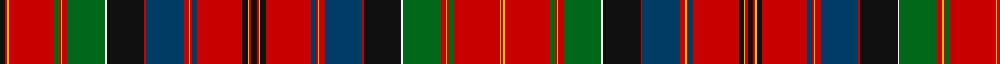

In pattern [KRYRGRYRGWKRBRYRBRKYRKRYKRBRYRBRKWGRYRGRYR](/patterns/kryrgryrgwkrbryrbrkyrkrykrbryrbrkwgryrgryr/).

This was sourced from register-of-tartans.  It is a [42 stripes tartan](/stripes/stripes42/).

Original link https://www.tartanregister.gov.uk/tartanDetails.aspx?ref=1632

## Register references

External register numbers recorded for this tartan.

- Scottish Register of Tartans: [1632](https://www.tartanregister.gov.uk/tartanDetails.aspx?ref=1632)
- Scottish Tartans Authority (ITI): 1215
- Scottish Tartans World Register: 1215

## Thread count
K/7 R3 Y2 R60 G7 R2 Y2 R7 G50 W2 K50 R2 DBa50 R7 Y2 R2 DBa7 R60 K7 Y2 R3 K7 R3 Y2 K7 R60 DBa7 R2 Y2 R7 DBa50 R2 K50 W2 G50 R7 Y2 R2 G7 R60 Y2 R/3

## Palette
Each colour and its ΔE from the base-6 reference it is a variant of.

| Colour | Shade | Base | ΔE (OKLab) |
|---|---|---|---|
| DB | <code style="background-color:#2C2C80;">#2C2C80</code> `#2C2C80` | B <code style="background-color:#2A418A;">#2A418A</code> | 0.06 |
| DBa | <code style="background-color:#003C64;">#003C64</code> `#003C64` | B <code style="background-color:#2A418A;">#2A418A</code> | 0.08 |
| G | <code style="background-color:#006818;">#006818</code> `#006818` | G <code style="background-color:#006100;">#006100</code> | 0.02 |
| K | <code style="background-color:#101010;">#101010</code> `#101010` | K <code style="background-color:#000000;">#000000</code> | 0.17 |
| P | <code style="background-color:#780078;">#780078</code> `#780078` | B <code style="background-color:#2A418A;">#2A418A</code> | 0.17 |
| R | <code style="background-color:#C80000;">#C80000</code> `#C80000` | R <code style="background-color:#CC0000;">#CC0000</code> | 0.01 |
| W | <code style="background-color:#FCFCFC;">#FCFCFC</code> `#FCFCFC` | W <code style="background-color:#F7F7F7;">#F7F7F7</code> | 0.01 |
| Y | <code style="background-color:#E8C000;">#E8C000</code> `#E8C000` | Y <code style="background-color:#F2BF00;">#F2BF00</code> | 0.02 |

## Nearest tartans

The nearest existing variants by ΔTartan distance.

1. [Leith (Hay)](/setts/s44/k14r4y4k8r70b8r3y3r8b64r3k63w3g64r8y3r3g8r70k8y4r4k14r4y4k8r70g8r3y3r8g64w3k63r3b64r8y3r3b8r70k8y4r4~b440044-g006818-k101010-rc80000-we0e0e0-ye8c000/) — ΔT 0.66
1. [MacAlister](/setts/s41/r32g2ga12r4b4r4w2r4b4r4ga12r2w2r24b2r2ga44r2b2r64b2r2ga44r2b2r22w2r2ba16r2w2r10ga12g2r8g2ga12r3w2r2ba10~b5480b0-ba304080-g30a010-ga003000-rc00000-we0e0e0~x2/) — ΔT 1.09
1. [Stuart/Stewart of Ardshiel](/setts/s34/b4k2r2ra12g66ra4k2b2ra6k34ra6b2k2ra65k3r2ra6g14ra6r2k3ra65k2b2ra6k34ra6b2k2ra4g66ra12r2k2~b5c8ca8-g285800-k00002c-re87878-rac80000/) — ΔT 1.14
1. [Whitworth](/setts/s38/r5y1r8w1b20w1ba20w1g20y1r5y1r5y1g20y2r52w1y5w1y5w1r52y2g20y1r5y1r5y1g20w1ba20w1b20w1r8y1~b202060-ba2888c4-g006818-rc80000-wfcfcfc-ye8c000~x2/) — ΔT 1.16
1. [Unnamed C18th - Hynde Cotton Plaid](/setts/s45/w2b1r3ra7g7r2b1r2g7r41b40w2r4ra4r1ra1r1ra4r4g15r4ra4r1ra1r1ra4r4w2k40r3g36r5ra5r1ra5r5b38r40g16w2r8ra8r3ra2r1~b202060-g285800-k101010-rc80000-raa00048-wfcfcfc~x2/) — ΔT 1.19
1. [MacAlister (Logan 1831)](/setts/s41/r32g2ga12r4b4r4w2r4b4r4ga12r2w2r24b2r2ga44r2b2r64b2r2ga44r2b2r22w2r2ba16r2w2r10ga12g2r8g2ga12r3w2r2ba10~b3c82af-ba2c4084-g309c18-ga002814-rdc0000-we0e0e0~x2/) — ΔT 1.22
1. [New Brunswick (Lyon Court Books)](/setts/s44/b1y1b1g1ga2g2ga2g2ga2g1b1y1b1y1b1g28r24y1ra2y3b4r10rb16r4y2r15rb5r9g28b1y1b1y1b1g1ga2g2ga2g2ga2g1b1y1b1~b5c8ca8-g003820-ga289c18-rc80000-ra888888-rb6c0800-ye8c000~x2/) — ΔT 1.32
1. [Hay & Leith - 1800 (Clan)](/setts/s23/k10r3y3k6r48g6r2y2r6g40w2k38r2b40r6y2r2b6r48k6y2r3k10~b280034-g285800-k101010-rc80000-wfcfcfc-ye8c000/) — ΔT 1.41
1. [MacDougall of MacDougall](/setts/s24/b2ba10r3ra4g72ra7g4ra10bb24ba6r5ra4r5ba7g24ra24g24ra3bb3ra74ba7r5ra6b2~b3c82af-ba5a008c-bb2c4084-g005020-rc82828-radc0000~x2/) — ΔT 1.42
1. [Unidentified (Paisley)](/setts/s66/b4k1b2k1b1k2b1k6g1k2g2k2g2k1g3k1g28r2g6r6w2r33k1r3k1r2k2r2k2r1k6g8k1y2k1g8k6r1k2r2k2r2k1r3k1r33w2r6g6r2g28k1g3k1g2k2g2k2g1k6b1k2b1k1b2k1~b2c2c80-g006818-k101010-rc80000-wfcfcfc-ye8c000~x2/) — ΔT 1.44

## Neighbour map

Every grey dot is one of 15726 variants placed by the first two principal components of the ΔTartan feature space (44% of its variance). Red is this tartan; blue dots are its nearest — click one to open its page.

<svg viewBox="0 0 640 380" role="img" style="max-width:100%;height:auto;border:1px solid #e0e0e0;border-radius:4px;display:block" xmlns="http://www.w3.org/2000/svg"><image href="/nn/cloud.v1.png" width="640" height="380"/><a href="/setts/s44/k14r4y4k8r70b8r3y3r8b64r3k63w3g64r8y3r3g8r70k8y4r4k14r4y4k8r70g8r3y3r8g64w3k63r3b64r8y3r3b8r70k8y4r4~b440044-g006818-k101010-rc80000-we0e0e0-ye8c000/"><circle cx="189.7" cy="18.9" r="4" fill="#3465a4"><title>Leith (Hay)</title></circle></a><a href="/setts/s41/r32g2ga12r4b4r4w2r4b4r4ga12r2w2r24b2r2ga44r2b2r64b2r2ga44r2b2r22w2r2ba16r2w2r10ga12g2r8g2ga12r3w2r2ba10~b5480b0-ba304080-g30a010-ga003000-rc00000-we0e0e0~x2/"><circle cx="286.8" cy="14.0" r="4" fill="#3465a4"><title>MacAlister</title></circle></a><a href="/setts/s34/b4k2r2ra12g66ra4k2b2ra6k34ra6b2k2ra65k3r2ra6g14ra6r2k3ra65k2b2ra6k34ra6b2k2ra4g66ra12r2k2~b5c8ca8-g285800-k00002c-re87878-rac80000/"><circle cx="269.1" cy="26.9" r="4" fill="#3465a4"><title>Stuart/Stewart of Ardshiel</title></circle></a><a href="/setts/s38/r5y1r8w1b20w1ba20w1g20y1r5y1r5y1g20y2r52w1y5w1y5w1r52y2g20y1r5y1r5y1g20w1ba20w1b20w1r8y1~b202060-ba2888c4-g006818-rc80000-wfcfcfc-ye8c000~x2/"><circle cx="227.8" cy="14.0" r="4" fill="#3465a4"><title>Whitworth</title></circle></a><a href="/setts/s45/w2b1r3ra7g7r2b1r2g7r41b40w2r4ra4r1ra1r1ra4r4g15r4ra4r1ra1r1ra4r4w2k40r3g36r5ra5r1ra5r5b38r40g16w2r8ra8r3ra2r1~b202060-g285800-k101010-rc80000-raa00048-wfcfcfc~x2/"><circle cx="190.8" cy="14.0" r="4" fill="#3465a4"><title>Unnamed C18th - Hynde Cotton Plaid</title></circle></a><a href="/setts/s41/r32g2ga12r4b4r4w2r4b4r4ga12r2w2r24b2r2ga44r2b2r64b2r2ga44r2b2r22w2r2ba16r2w2r10ga12g2r8g2ga12r3w2r2ba10~b3c82af-ba2c4084-g309c18-ga002814-rdc0000-we0e0e0~x2/"><circle cx="274.9" cy="14.0" r="4" fill="#3465a4"><title>MacAlister (Logan 1831)</title></circle></a><a href="/setts/s44/b1y1b1g1ga2g2ga2g2ga2g1b1y1b1y1b1g28r24y1ra2y3b4r10rb16r4y2r15rb5r9g28b1y1b1y1b1g1ga2g2ga2g2ga2g1b1y1b1~b5c8ca8-g003820-ga289c18-rc80000-ra888888-rb6c0800-ye8c000~x2/"><circle cx="171.8" cy="14.0" r="4" fill="#3465a4"><title>New Brunswick (Lyon Court Books)</title></circle></a><a href="/setts/s23/k10r3y3k6r48g6r2y2r6g40w2k38r2b40r6y2r2b6r48k6y2r3k10~b280034-g285800-k101010-rc80000-wfcfcfc-ye8c000/"><circle cx="203.9" cy="49.3" r="4" fill="#3465a4"><title>Hay &amp; Leith - 1800 (Clan)</title></circle></a><a href="/setts/s24/b2ba10r3ra4g72ra7g4ra10bb24ba6r5ra4r5ba7g24ra24g24ra3bb3ra74ba7r5ra6b2~b3c82af-ba5a008c-bb2c4084-g005020-rc82828-radc0000~x2/"><circle cx="248.6" cy="32.8" r="4" fill="#3465a4"><title>MacDougall of MacDougall</title></circle></a><a href="/setts/s66/b4k1b2k1b1k2b1k6g1k2g2k2g2k1g3k1g28r2g6r6w2r33k1r3k1r2k2r2k2r1k6g8k1y2k1g8k6r1k2r2k2r2k1r3k1r33w2r6g6r2g28k1g3k1g2k2g2k2g1k6b1k2b1k1b2k1~b2c2c80-g006818-k101010-rc80000-wfcfcfc-ye8c000~x2/"><circle cx="206.1" cy="14.0" r="4" fill="#3465a4"><title>Unidentified (Paisley)</title></circle></a><circle cx="217.8" cy="14.0" r="5" fill="#c00000"/></svg>

ID: /setts/s42/k7r3y2r60g7r2y2r7g50w2k50r2b50r7y2r2b7r60k7y2r3k7r3y2k7r60b7r2y2r7b50r2k50w2g50r7y2r2g7r60y2r3~b003c64-g006818-k101010-rc80000-wfcfcfc-ye8c000/
