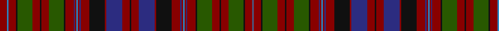

In pattern [BRKGRKRGKRBRBRBRKRBRKRBRKRBRBRBRKGRKRGKRBR](/stripes/brkgrkrgkrbrbrbrkrbrkrbrkrbrbrbrkgrkrgkrbr/).

This was sourced from register-of-tartans.  It is a [42 stripe tartan](/stripes/stripes42/).

Original link https://www.tartanregister.gov.uk/tartanDetails.aspx?ref=4284

## Register references

External register numbers recorded for this tartan.

- Scottish Register of Tartans: [4284](https://www.tartanregister.gov.uk/tartanDetails.aspx?ref=4284)
- Scottish Tartans Authority (ITI): 5861

## Thread count
DR/16 B3 DR16 K3 G32 DR16 K3 DR16 G32 K3 DR18 DB3 DR3 B3 DR3 DB3 DR18 K34 DR3 DB34 DR16 K3 DR16 DB34 DR3 K34 DR18 DB3 DR3 B3 DR3 DB3 DR18 K3 G32 DR16 K3 DR16 G32 K3 DR16 B/3

## Palette
Each colour and its ΔE from the base-6 reference it is a variant of.

| Colour | Shade | Base | ΔE (OKLab) |
|---|---|---|---|
| B | <code style="background-color:#2888C4;">#2888C4</code> `#2888C4` | B <code style="background-color:#2A418A;">#2A418A</code> | 0.21 |
| DB | <code style="background-color:#2C2C80;">#2C2C80</code> `#2C2C80` | B <code style="background-color:#2A418A;">#2A418A</code> | 0.06 |
| DR | <code style="background-color:#880000;">#880000</code> `#880000` | R <code style="background-color:#CC0000;">#CC0000</code> | 0.15 |
| G | <code style="background-color:#285800;">#285800</code> `#285800` | G <code style="background-color:#006100;">#006100</code> | 0.03 |
| K | <code style="background-color:#101010;">#101010</code> `#101010` | K <code style="background-color:#000000;">#000000</code> | 0.17 |

## Nearest tartans

The nearest existing variants by ΔTartan distance.

1. [Austrian Bowhunters Hunting Corporate Tartan Tartan Number: 6460. Earliest known date: October 2004 Designed online by Andrea Egelkraut for the Austrian Bowhunters. See products available Copyright © Blair Urquhart, Comrie, 2015](/setts/s39/k3dg3k2r3k2dg3k3r5ly1r5k3r3k3r3k3dg3k2r3k2dg20dg20k2r3k2dg3k3r3k3r3k3r5ly1r5k3dg3k2r3k2dg3~x2/) — ΔT 1.23
1. [MacMaster (Name 2001)](/setts/s28/r12dg12lb2dg12r12dg2r2dg2r2dg6lo2r1lo2dg6r2dg2r2dg2r12db8dg8k2r4k2r4k2dg8db8~x2/) — ΔT 1.53
1. [Cairns of Finavon](/setts/s28/db16g3db3g3db3g16db3g3db3g3db16m15db1ly3db1m15db16g15db3g3db3g15db16m15b1m3b1m15~x2/) — ΔT 1.61
1. [Cairns of Finavon (Name)](/setts/s28/g16db3g3db3g3db16m15db1ly3db1m15db16g15db3g3db3g15db16m15b1m3b1m15db16g3db3g3db3~x2/) — ΔT 1.61
1. [Unidentified #38](/setts/s37/dg12k1r6db1r1t1r1db1r6k12r1db12r6k1r6db12r1k12r6t1dg12r6k1r6dg12r6db1r1t1r1db1r6k12r1db12r6k1~x2/) — ΔT 1.65
1. [Unidentified Cant #07](/setts/s38/g24r24db3k21db3r6g4r6db10r6g4r6k3db11r42db10k6g16r3k21/) — ΔT 1.82
1. [Dryer](/setts/s29/db15k1db1k1db1k7r8k1ly3k1r8k7db8k1k3k1db8k7r8k1ly3k1r8k7db1k1db1k1db9~x4/) — ΔT 1.83
1. [Lumsden (Waistcoat)](/setts/s39/g21w2g20r8g6ly3g6r8g10r9g11r22g3r9g3r21w2r10db26r6db26r10w2r19g2r2g3r2g2r20g2r2g3r2g2r19g20r6g20/) — ΔT 1.88
1. [Gordon #4](/setts/s32/db15k3db3k3db3k15dg15r1dg1r4dg1r1dg15k15db15k3db4k3db15k15dg15ly1dg1ly4dg1ly1dg15k15db3k3db3k3~x2/) — ΔT 1.90
1. [Johnnie Walker (2003)](/setts/s22/r8db10r30k8lo5k5lo5k36r11db4k6db4r11k36lo5k5lo5k8r30db10r8db4/) — ΔT 1.92

## Neighbour map

Every grey dot is one of 14299 variants placed by the first two principal components of the ΔTartan feature space (44% of its variance). Red is this tartan; blue dots are its nearest — click one to open its page.

<svg viewBox="0 0 640 380" role="img" style="max-width:100%;height:auto;border:1px solid #e0e0e0;border-radius:4px;display:block" xmlns="http://www.w3.org/2000/svg"><image href="/nn/cloud.v1.png" width="640" height="380"/><a href="/setts/s39/k3dg3k2r3k2dg3k3r5ly1r5k3r3k3r3k3dg3k2r3k2dg20dg20k2r3k2dg3k3r3k3r3k3r5ly1r5k3dg3k2r3k2dg3~x2/"><circle cx="238.0" cy="104.5" r="4" fill="#3465a4"><title>Austrian Bowhunters Hunting Corporate Tartan Tartan Number: 6460. Earliest known date: October 2004 Designed online by Andrea Egelkraut for the Austrian Bowhunters. See products available Copyright © Blair Urquhart, Comrie, 2015</title></circle></a><a href="/setts/s28/r12dg12lb2dg12r12dg2r2dg2r2dg6lo2r1lo2dg6r2dg2r2dg2r12db8dg8k2r4k2r4k2dg8db8~x2/"><circle cx="201.3" cy="129.7" r="4" fill="#3465a4"><title>MacMaster (Name 2001)</title></circle></a><a href="/setts/s28/db16g3db3g3db3g16db3g3db3g3db16m15db1ly3db1m15db16g15db3g3db3g15db16m15b1m3b1m15~x2/"><circle cx="212.1" cy="127.9" r="4" fill="#3465a4"><title>Cairns of Finavon</title></circle></a><a href="/setts/s28/g16db3g3db3g3db16m15db1ly3db1m15db16g15db3g3db3g15db16m15b1m3b1m15db16g3db3g3db3~x2/"><circle cx="212.1" cy="127.9" r="4" fill="#3465a4"><title>Cairns of Finavon (Name)</title></circle></a><a href="/setts/s37/dg12k1r6db1r1t1r1db1r6k12r1db12r6k1r6db12r1k12r6t1dg12r6k1r6dg12r6db1r1t1r1db1r6k12r1db12r6k1~x2/"><circle cx="143.8" cy="100.5" r="4" fill="#3465a4"><title>Unidentified #38</title></circle></a><a href="/setts/s38/g24r24db3k21db3r6g4r6db10r6g4r6k3db11r42db10k6g16r3k21/"><circle cx="216.8" cy="107.1" r="4" fill="#3465a4"><title>Unidentified Cant #07</title></circle></a><a href="/setts/s29/db15k1db1k1db1k7r8k1ly3k1r8k7db8k1k3k1db8k7r8k1ly3k1r8k7db1k1db1k1db9~x4/"><circle cx="180.6" cy="119.5" r="4" fill="#3465a4"><title>Dryer</title></circle></a><a href="/setts/s39/g21w2g20r8g6ly3g6r8g10r9g11r22g3r9g3r21w2r10db26r6db26r10w2r19g2r2g3r2g2r20g2r2g3r2g2r19g20r6g20/"><circle cx="229.3" cy="103.1" r="4" fill="#3465a4"><title>Lumsden (Waistcoat)</title></circle></a><a href="/setts/s32/db15k3db3k3db3k15dg15r1dg1r4dg1r1dg15k15db15k3db4k3db15k15dg15ly1dg1ly4dg1ly1dg15k15db3k3db3k3~x2/"><circle cx="194.7" cy="131.1" r="4" fill="#3465a4"><title>Gordon #4</title></circle></a><a href="/setts/s22/r8db10r30k8lo5k5lo5k36r11db4k6db4r11k36lo5k5lo5k8r30db10r8db4/"><circle cx="230.3" cy="163.8" r="4" fill="#3465a4"><title>Johnnie Walker (2003)</title></circle></a><circle cx="213.5" cy="124.2" r="5" fill="#c00000"/></svg>

ID: /setts/s42/r16t3r16k3dg32r16k3r16dg32k3r18db3r3t3r3db3r18k34r3db34r16k3/
