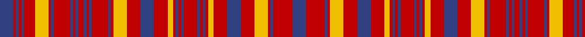

In pattern [BRBRBRYRBRBRBRBRBRBRYRBRYRBRBRBRBRYRBRYRBRB](/patterns/brbrbryrbrbrbrbrbrbryrbryrbrbrbrbryrbryrbrb/).

This was sourced from weddslist.  It is a [43 stripes tartan](/stripes/stripes43/).

Original link http://www.weddslist.com/cgi-bin/tartans/pg.pl?source=sts

## Thread count
B/10 R2 B2 R2 B2 R8 Y10 R2 B2 R12 B2 R2 B2 R4 B2 R2 B2 R12 B2 R2 Y10 R10 B10 R10 Y4 R2 B2 R2 B2 R10 B2 R2 B2 R2 Y4 R10 B10 R10 Y10 R2 B2 R14 B/10

## Palette
Each colour and its ΔE from the base-6 reference it is a variant of.

| Colour | Shade | Base | ΔE (OKLab) |
|---|---|---|---|
| B | <code style="background-color:#304080;">#304080</code> `#304080` | B <code style="background-color:#2C4084;">#2C4084</code> | 0.01 |
| R | <code style="background-color:#C00000;">#C00000</code> `#C00000` | R <code style="background-color:#C80000;">#C80000</code> | 0.02 |
| Y | <code style="background-color:#F0C000;">#F0C000</code> `#F0C000` | Y <code style="background-color:#E8C000;">#E8C000</code> | 0.01 |

## Nearest tartans

The nearest existing variants by ΔTartan distance.

1. [Culloden Unidentified Plaid](/setts/s43/b10r14b2r2y10r10b10r10y4r2b2r2b2r10b2r2b2r2y4r10b10r10y10r2b2r12b2r2b2r4b2r2b2r12b2r2y10r8b2r2b2r2b10-b2c4084-rdc0000-ye8c000/) — ΔT 0.33
1. [Na Fir Dileas (Corporate)](/setts/s32/r17g12r6b33r4g4r33g4r4g4r33g4r4b33r39g15r7b39r4g4r39g4r4g4r39g4r4b39r7g15r39b14-b2c2c80-g006818-rc80000/) — ΔT 1.29
1. [Ross 1](/setts/s36/r32b3r3b8r3b3r23g20r6g20r6g20r22g5r10g5r22b24r5b24r23b3r3b8r3b3r32b3r3b8r3b3r23g20r6g20-b304080-g008000-rc00000/) — ΔT 1.35
1. [Staffa (Silk)](/setts/s25/r34g28r8g8r34g8r8b24r26w10r26g28w6g28r8g8r34g8r8g16r8b8r8b8r28-b2c2c80-g003820-rc80000-we0e0e0/) — ΔT 1.70
1. [Ross #8](/setts/s25/r28b2r2b4r2b2r20g20r4g20r4g20r20g4r12g4r20b20r4b20r4b20r20g4r12-b2c4084-g005020-rdc0000/) — ΔT 1.70
1. [MacDonald of Staffa #2](/setts/s29/r37g6r11g32w4g18r27w3r27k16g21r5g5r27g5r5k3g25k3g4r27g5r5g5r5g5r5g5r8-g005020-k101010-rdc0000-we0e0e0/) — ΔT 1.77
1. [Lumsden, of Clova](/setts/s31/b18r4b18r18g2r2g4r2g2r18g2r2g4r2g2r18w2r8b22r4b22r8w2r18g4r8g4r18g18r4g18-b304080-g008000-rc00000-we0e0e0/) — ΔT 1.81
1. [Ross #3](/setts/s31/g46r12g46r52g8r18g8r52w6r16b62r12b62r16w6r52b4r4b8r4b4r52b4r4b8r4b4r52g46r12g46-b5a008c-g005020-rdc0000-we0e0e0/) — ΔT 1.82
1. [MacRae (Red)](/setts/s31/g16r4g16r16b4r4b4r4b4r16b4r4b4r4b4r16w4r4b16r4b16r4w4r16g4r4g4r16g16r4g16-b2c2c80-g006818-rc80000-wfcfcfc/) — ΔT 1.86
1. [Robertson #4](/setts/s29/r56g4r10g4r56b6r6b48r6g48r6b6r56g4r10g4r56b6r6b48r6g48r6b6r56g4r10g4r56-b2c4084-g005020-rdc0000/) — ΔT 1.87

## Neighbour map

Every grey dot is one of 15726 variants placed by the first two principal components of the ΔTartan feature space (44% of its variance). Red is this tartan; blue dots are its nearest — click one to open its page.

<svg viewBox="0 0 640 380" role="img" style="max-width:100%;height:auto;border:1px solid #e0e0e0;border-radius:4px;display:block" xmlns="http://www.w3.org/2000/svg"><image href="/nn/cloud.v1.png" width="640" height="380"/><a href="/setts/s43/b10r14b2r2y10r10b10r10y4r2b2r2b2r10b2r2b2r2y4r10b10r10y10r2b2r12b2r2b2r4b2r2b2r12b2r2y10r8b2r2b2r2b10-b2c4084-rdc0000-ye8c000/"><circle cx="253.7" cy="140.1" r="4" fill="#3465a4"><title>Culloden Unidentified Plaid</title></circle></a><a href="/setts/s32/r17g12r6b33r4g4r33g4r4g4r33g4r4b33r39g15r7b39r4g4r39g4r4g4r39g4r4b39r7g15r39b14-b2c2c80-g006818-rc80000/"><circle cx="309.1" cy="146.8" r="4" fill="#3465a4"><title>Na Fir Dileas (Corporate)</title></circle></a><a href="/setts/s36/r32b3r3b8r3b3r23g20r6g20r6g20r22g5r10g5r22b24r5b24r23b3r3b8r3b3r32b3r3b8r3b3r23g20r6g20-b304080-g008000-rc00000/"><circle cx="289.1" cy="149.0" r="4" fill="#3465a4"><title>Ross 1</title></circle></a><a href="/setts/s25/r34g28r8g8r34g8r8b24r26w10r26g28w6g28r8g8r34g8r8g16r8b8r8b8r28-b2c2c80-g003820-rc80000-we0e0e0/"><circle cx="240.7" cy="181.5" r="4" fill="#3465a4"><title>Staffa (Silk)</title></circle></a><a href="/setts/s25/r28b2r2b4r2b2r20g20r4g20r4g20r20g4r12g4r20b20r4b20r4b20r20g4r12-b2c4084-g005020-rdc0000/"><circle cx="288.8" cy="156.4" r="4" fill="#3465a4"><title>Ross #8</title></circle></a><a href="/setts/s29/r37g6r11g32w4g18r27w3r27k16g21r5g5r27g5r5k3g25k3g4r27g5r5g5r5g5r5g5r8-g005020-k101010-rdc0000-we0e0e0/"><circle cx="288.2" cy="125.1" r="4" fill="#3465a4"><title>MacDonald of Staffa #2</title></circle></a><a href="/setts/s31/b18r4b18r18g2r2g4r2g2r18g2r2g4r2g2r18w2r8b22r4b22r8w2r18g4r8g4r18g18r4g18-b304080-g008000-rc00000-we0e0e0/"><circle cx="244.0" cy="133.5" r="4" fill="#3465a4"><title>Lumsden, of Clova</title></circle></a><a href="/setts/s31/g46r12g46r52g8r18g8r52w6r16b62r12b62r16w6r52b4r4b8r4b4r52b4r4b8r4b4r52g46r12g46-b5a008c-g005020-rdc0000-we0e0e0/"><circle cx="263.5" cy="106.5" r="4" fill="#3465a4"><title>Ross #3</title></circle></a><a href="/setts/s31/g16r4g16r16b4r4b4r4b4r16b4r4b4r4b4r16w4r4b16r4b16r4w4r16g4r4g4r16g16r4g16-b2c2c80-g006818-rc80000-wfcfcfc/"><circle cx="173.3" cy="175.8" r="4" fill="#3465a4"><title>MacRae (Red)</title></circle></a><a href="/setts/s29/r56g4r10g4r56b6r6b48r6g48r6b6r56g4r10g4r56b6r6b48r6g48r6b6r56g4r10g4r56-b2c4084-g005020-rdc0000/"><circle cx="378.0" cy="126.8" r="4" fill="#3465a4"><title>Robertson #4</title></circle></a><circle cx="257.2" cy="144.3" r="5" fill="#c00000"/></svg>

ID: /setts/s43/b10r14b2r2y10r10b10r10y4r2b2r2b2r10b2r2b2r2y4r10b10r10y10r2b2r12b2r2b2r4b2r2b2r12b2r2y10r8b2r2b2r2b10-b304080-rc00000-yf0c000/
