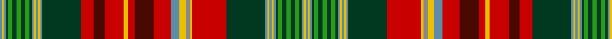

In pattern [BYBGGGGGGGBYBYBGRBRYRBRBYRYRGBYBYBGGGGGGGBYB](/patterns/bybgggggggbybybgrbryrbrbyryrgbybybgggggggbyb/).

This was sourced from house-of-tartan.  It is a [44 stripes tartan](/stripes/stripes44/).

Original link http://www.house-of-tartan.scotland.net/house/TartanViewjs.asp?colr=Def&tnam=663

## Thread count
B/2 Y2 B2 DG2 G4 DG4 G4 DG4 G4 DG2 B2 Y2 B2 Y2 B2 DG36 R12 DR10 R18 Y4 R6 DR18 R16 B8 Y6 N4 Y2 R32 DG36 B2 Y2 B2 Y2 B2 DG2 G4 DG4 G4 DG4 G4 DG2 B2 Y2 B/2

## Palette
Each colour and its ΔE from the base-6 reference it is a variant of.

| Colour | Shade | Base | ΔE (OKLab) |
|---|---|---|---|
| B | <code style="background-color:#5C8CA8;">#5C8CA8</code> `#5C8CA8` | B <code style="background-color:#2A418A;">#2A418A</code> | 0.23 |
| DG | <code style="background-color:#003820;">#003820</code> `#003820` | G <code style="background-color:#006100;">#006100</code> | 0.15 |
| DR | <code style="background-color:#480800;">#480800</code> `#480800` | B <code style="background-color:#2A418A;">#2A418A</code> | 0.24 |
| G | <code style="background-color:#289C18;">#289C18</code> `#289C18` | G <code style="background-color:#006100;">#006100</code> | 0.19 |
| N | <code style="background-color:#888888;">#888888</code> `#888888` | R <code style="background-color:#CC0000;">#CC0000</code> | 0.24 |
| R | <code style="background-color:#C80000;">#C80000</code> `#C80000` | R <code style="background-color:#CC0000;">#CC0000</code> | 0.01 |
| Y | <code style="background-color:#E8C000;">#E8C000</code> `#E8C000` | Y <code style="background-color:#F2BF00;">#F2BF00</code> | 0.02 |

## Nearest tartans

The nearest existing variants by ΔTartan distance.

1. [New Brunswick, or Beaverbrook](/setts/s44/b2y2b2g2ga4g4ga4g4ga4g2b2y2b2y2b2g36r32y2gb4y6b8r16ra18r6y4r18ra10r12g36b2y2b2y2b2g2ga4g4ga4g4ga4g2b2y2b2-b5480b0-g003000-ga30a010-gb808080-rc00000-ra703000-yf0c000/) — ΔT 0.21
1. [New Brunswick (Lyon Court Books)](/setts/s44/b2y2b2g2ga4g4ga4g4ga4g2b2y2b2y2b2g56r48y2ra4y6b8r20rb32r8y4r30rb10r18g56b2y2b2y2b2g2ga4g4ga4g4ga4g2b2y2b2-b5c8ca8-g003820-ga289c18-rc80000-ra888888-rb6c0800-ye8c000/) — ΔT 0.98
1. [Hunter (Wilsons1819)](/setts/s34/w2r8w2k15w2wa5w2g20ga2g4ga2g20ga3y3r2w2r2y3ga3g20w2r32w2g20w2wa5w2ga4k15w2wa5w2r8w2-g285800-ga606000-k101010-rc8002c-wf8f8f8-wa98c8e8-ye8c000/) — ΔT 1.08
1. [Beaverbrook (District)](/setts/s81/g4ga4g4ga2b2y2b2y2b2ga36r12ra10r18y4r6ra18r16b8y6rb4y2r32ga36b2y2b2y2b2ga2g4ga4g4ga4g4ga2b2y2b2y2b2ga2g4ga4g4ga4g4ga2b2y2b2y2b2ga36r32y2rb4y6b8r16ra18r6y4r18ra10r12ga36b2y2b2y2b2ga2g4ga4g4ga4g4ga2b2y2-hf2dce04e714fbb39/) — ΔT 1.26
1. [Hunter](/setts/s66/r8w2k15w2b5w2g20ga2g4ga2g20ga3y3r2w2r2y3ga3g20w2r32w2g20w2b5w2ga4k15w2b20w2r8w2r8w2b20w2k15ga4w2b5w2g20w2r32w2g20ga3y3r2w2r2y3ga3g20ga2g4ga2g20w2b5w2k15w2r8w2-b5c8ca8-g006818-ga5c6428-k101010-rc80000--h89e7de297b18f22e/) — ΔT 1.27
1. [Hunter (Wilsons)](/setts/s30/w4r16w4k30g8w4b10w4ga40w4r64w4ga40g6y6r4w4r4y6g6ga40g4ga40w4b10w4k30w4r16w4-b5c8ca8-g289c18-ga006818-k101010-rc8002c-we0e0e0-ye8c000/) — ΔT 1.28
1. [Duchess of Edinburgh Tartan Tartan Number: 358. Earliest known date: pre 2003 MacKinlay Strip See products available Copyright © Blair Urquhart, Comrie, 2015](/setts/s35/b24k8r8k8y4k10ba8k16ba20k8g64r8g64b16k16y4k4w4k4g24r16k4r10w4r10k4r16g24k4w4k4y4k16b16r24-b5c8ca8-ba2c2c80-g006818-k101010-rc80000-we0e0e0-ye8c000/) — ΔT 1.29
1. [Duchess of Edinburgh](/setts/s35/b24k8r8k8y4k10ba8k16ba20k8g64r8g64b16k16y4k4w4k4g24r16k4r10w4r10k4r16g24k4w4k4y4k16b16r24-b3c82af-ba2c4084-g005020-k101010-rdc0000-we0e0e0-ye8c000/) — ΔT 1.34
1. [Lawson, Robin (Personal)](/setts/s52/b2g20b8w2b8g20r2b8ba6y2b2y2b2y2b2y2b2y2b2y2b2y2b2y2b10r40w4g6y6g6w4g40b8ba8w4ba8b8g20r6g6y4g6r6g20b2ba2b2ba14r4ba14b2ba2-b1c1c1c-ba5f749c-g005020-rc80000-wf8f4d0-yc88c00/) — ΔT 1.40
1. [New Brunswick variation Canadian Tartan Tartan Number: 1880. Earliest known date: pre 2003 Sent in by Tweedmill for information. See products available Copyright © Blair Urquhart, Comrie, 2015](/setts/s38/y4b4g2ga4g4ga4g4ga4g4b4y4b4g56r48y2ra4y6b8r20gb32r8y4r28gb10r20g56b4y4b4g2ga4g4ga4g4ga4g2b4y4-b5c8ca8-g006818-ga289c18-gb604000-rc80000-ra888888-ye8c000/) — ΔT 1.41

## Neighbour map

Every grey dot is one of 15726 variants placed by the first two principal components of the ΔTartan feature space (44% of its variance). Red is this tartan; blue dots are its nearest — click one to open its page.

<svg viewBox="0 0 640 380" role="img" style="max-width:100%;height:auto;border:1px solid #e0e0e0;border-radius:4px;display:block" xmlns="http://www.w3.org/2000/svg"><image href="/nn/cloud.v1.png" width="640" height="380"/><a href="/setts/s44/b2y2b2g2ga4g4ga4g4ga4g2b2y2b2y2b2g36r32y2gb4y6b8r16ra18r6y4r18ra10r12g36b2y2b2y2b2g2ga4g4ga4g4ga4g2b2y2b2-b5480b0-g003000-ga30a010-gb808080-rc00000-ra703000-yf0c000/"><circle cx="111.6" cy="14.2" r="4" fill="#3465a4"><title>New Brunswick, or Beaverbrook</title></circle></a><a href="/setts/s44/b2y2b2g2ga4g4ga4g4ga4g2b2y2b2y2b2g56r48y2ra4y6b8r20rb32r8y4r30rb10r18g56b2y2b2y2b2g2ga4g4ga4g4ga4g2b2y2b2-b5c8ca8-g003820-ga289c18-rc80000-ra888888-rb6c0800-ye8c000/"><circle cx="166.4" cy="14.0" r="4" fill="#3465a4"><title>New Brunswick (Lyon Court Books)</title></circle></a><a href="/setts/s34/w2r8w2k15w2wa5w2g20ga2g4ga2g20ga3y3r2w2r2y3ga3g20w2r32w2g20w2wa5w2ga4k15w2wa5w2r8w2-g285800-ga606000-k101010-rc8002c-wf8f8f8-wa98c8e8-ye8c000/"><circle cx="94.9" cy="31.5" r="4" fill="#3465a4"><title>Hunter (Wilsons1819)</title></circle></a><a href="/setts/s81/g4ga4g4ga2b2y2b2y2b2ga36r12ra10r18y4r6ra18r16b8y6rb4y2r32ga36b2y2b2y2b2ga2g4ga4g4ga4g4ga2b2y2b2y2b2ga2g4ga4g4ga4g4ga2b2y2b2y2b2ga36r32y2rb4y6b8r16ra18r6y4r18ra10r12ga36b2y2b2y2b2ga2g4ga4g4ga4g4ga2b2y2-hf2dce04e714fbb39/"><circle cx="102.1" cy="14.0" r="4" fill="#3465a4"><title>Beaverbrook (District)</title></circle></a><a href="/setts/s66/r8w2k15w2b5w2g20ga2g4ga2g20ga3y3r2w2r2y3ga3g20w2r32w2g20w2b5w2ga4k15w2b20w2r8w2r8w2b20w2k15ga4w2b5w2g20w2r32w2g20ga3y3r2w2r2y3ga3g20ga2g4ga2g20w2b5w2k15w2r8w2-b5c8ca8-g006818-ga5c6428-k101010-rc80000--h89e7de297b18f22e/"><circle cx="85.2" cy="17.0" r="4" fill="#3465a4"><title>Hunter</title></circle></a><a href="/setts/s30/w4r16w4k30g8w4b10w4ga40w4r64w4ga40g6y6r4w4r4y6g6ga40g4ga40w4b10w4k30w4r16w4-b5c8ca8-g289c18-ga006818-k101010-rc8002c-we0e0e0-ye8c000/"><circle cx="105.6" cy="42.8" r="4" fill="#3465a4"><title>Hunter (Wilsons)</title></circle></a><a href="/setts/s35/b24k8r8k8y4k10ba8k16ba20k8g64r8g64b16k16y4k4w4k4g24r16k4r10w4r10k4r16g24k4w4k4y4k16b16r24-b5c8ca8-ba2c2c80-g006818-k101010-rc80000-we0e0e0-ye8c000/"><circle cx="101.4" cy="51.1" r="4" fill="#3465a4"><title>Duchess of Edinburgh Tartan Tartan Number: 358. Earliest known date: pre 2003 MacKinlay Strip See products available Copyright © Blair Urquhart, Comrie, 2015</title></circle></a><a href="/setts/s35/b24k8r8k8y4k10ba8k16ba20k8g64r8g64b16k16y4k4w4k4g24r16k4r10w4r10k4r16g24k4w4k4y4k16b16r24-b3c82af-ba2c4084-g005020-k101010-rdc0000-we0e0e0-ye8c000/"><circle cx="103.9" cy="52.0" r="4" fill="#3465a4"><title>Duchess of Edinburgh</title></circle></a><a href="/setts/s52/b2g20b8w2b8g20r2b8ba6y2b2y2b2y2b2y2b2y2b2y2b2y2b2y2b10r40w4g6y6g6w4g40b8ba8w4ba8b8g20r6g6y4g6r6g20b2ba2b2ba14r4ba14b2ba2-b1c1c1c-ba5f749c-g005020-rc80000-wf8f4d0-yc88c00/"><circle cx="149.9" cy="36.4" r="4" fill="#3465a4"><title>Lawson, Robin (Personal)</title></circle></a><a href="/setts/s38/y4b4g2ga4g4ga4g4ga4g4b4y4b4g56r48y2ra4y6b8r20gb32r8y4r28gb10r20g56b4y4b4g2ga4g4ga4g4ga4g2b4y4-b5c8ca8-g006818-ga289c18-gb604000-rc80000-ra888888-ye8c000/"><circle cx="170.4" cy="14.0" r="4" fill="#3465a4"><title>New Brunswick variation Canadian Tartan Tartan Number: 1880. Earliest known date: pre 2003 Sent in by Tweedmill for information. See products available Copyright © Blair Urquhart, Comrie, 2015</title></circle></a><circle cx="111.0" cy="14.0" r="5" fill="#c00000"/></svg>

ID: /setts/s44/b2y2b2g2ga4g4ga4g4ga4g2b2y2b2y2b2g36r32y2ra4y6b8r16ba18r6y4r18ba10r12g36b2y2b2y2b2g2ga4g4ga4g4ga4g2b2y2b2-b5c8ca8-ba480800-g003820-ga289c18-rc80000-ra888888-ye8c000/
