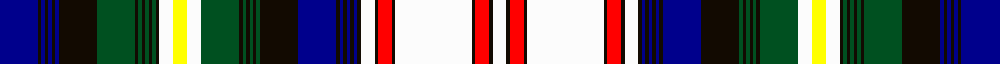

This page is one **sett** — a single exact thread-count. It belongs to the [tartan](/tartans/db11k1db1k1db1k1db1k11dg11k1dg1k1dg1k1dg1k1w4ly4w4dg11k1dg1k1dg1k1dg1k11db11k1db1k1db1k1db1k1w4k1r4k1w22k1r4k1w4/)
(the same proportion at any scale), whose colour order is pattern [BKBKBKBKGKGKGKGKWYWGKGKGKGKBKBKBKBKWKRKWKRKW](/stripes/bkbkbkbkgkgkgkgkwywgkgkgkgkbkbkbkbkwkrkwkrkw/).

Sourced from register-of-tartans.  It is a [44 stripe tartan](/stripes/stripes44/).

Original link https://www.tartanregister.gov.uk/tartanDetails.aspx?ref=11436

## Register references

External register numbers recorded for this tartan.

- Scottish Register of Tartans: [11436](https://www.tartanregister.gov.uk/tartanDetails.aspx?ref=11436)

## Thread count
DB/22 K2 DB2 K2 DB2 K2 DB2 K22 G22 K2 G2 K2 G2 K2 G2 K2 W8 Y8 W8 G22 K2 G2 K2 G2 K2 G2 K22 DB22 K2 DB2 K2 DB2 K2 DB2 K2 W8 K2 R8 K2 W44 K2 R8 K2 W/8

## Palette

Palette: <strong>Tartan Register</strong> <small style="color:#888">(5 of 6 colours)</small>
<table><thead><tr><th>Colour</th><th>Threads</th><th>Shade</th><th>Base</th><th>OKLCh</th></tr></thead><tbody><tr><td>DB/</td><td style="text-align:right;font-variant-numeric:tabular-nums">22</td><td><code style="background-color:#00008C;">#00008C</code> <small style="color:#888">#00008C</small></td><td>B <code style="background-color:#2A418A;">#2A418A</code></td><td><small style="color:#888">oklch(28.9% 0.200 264.1)</small></td></tr><tr><td>K</td><td style="text-align:right;font-variant-numeric:tabular-nums">2</td><td><code style="background-color:#120A01;">#120A01</code> <small style="color:#888">#120A01</small></td><td>K <code style="background-color:#000000;">#000000</code></td><td><small style="color:#888">oklch(15.2% 0.028 78.6)</small></td></tr><tr><td>DB</td><td style="text-align:right;font-variant-numeric:tabular-nums">2</td><td><code style="background-color:#00008C;">#00008C</code> <small style="color:#888">#00008C</small></td><td>B <code style="background-color:#2A418A;">#2A418A</code></td><td><small style="color:#888">oklch(28.9% 0.200 264.1)</small></td></tr><tr><td>K</td><td style="text-align:right;font-variant-numeric:tabular-nums">2</td><td><code style="background-color:#120A01;">#120A01</code> <small style="color:#888">#120A01</small></td><td>K <code style="background-color:#000000;">#000000</code></td><td><small style="color:#888">oklch(15.2% 0.028 78.6)</small></td></tr><tr><td>DB</td><td style="text-align:right;font-variant-numeric:tabular-nums">2</td><td><code style="background-color:#00008C;">#00008C</code> <small style="color:#888">#00008C</small></td><td>B <code style="background-color:#2A418A;">#2A418A</code></td><td><small style="color:#888">oklch(28.9% 0.200 264.1)</small></td></tr><tr><td>K</td><td style="text-align:right;font-variant-numeric:tabular-nums">2</td><td><code style="background-color:#120A01;">#120A01</code> <small style="color:#888">#120A01</small></td><td>K <code style="background-color:#000000;">#000000</code></td><td><small style="color:#888">oklch(15.2% 0.028 78.6)</small></td></tr><tr><td>DB</td><td style="text-align:right;font-variant-numeric:tabular-nums">2</td><td><code style="background-color:#00008C;">#00008C</code> <small style="color:#888">#00008C</small></td><td>B <code style="background-color:#2A418A;">#2A418A</code></td><td><small style="color:#888">oklch(28.9% 0.200 264.1)</small></td></tr><tr><td>K</td><td style="text-align:right;font-variant-numeric:tabular-nums">22</td><td><code style="background-color:#120A01;">#120A01</code> <small style="color:#888">#120A01</small></td><td>K <code style="background-color:#000000;">#000000</code></td><td><small style="color:#888">oklch(15.2% 0.028 78.6)</small></td></tr><tr><td>G</td><td style="text-align:right;font-variant-numeric:tabular-nums">22</td><td><code style="background-color:#005020;">#005020</code> <small style="color:#888">#005020</small></td><td>G <code style="background-color:#006100;">#006100</code></td><td><small style="color:#888">oklch(37.7% 0.105 149.6)</small></td></tr><tr><td>K</td><td style="text-align:right;font-variant-numeric:tabular-nums">2</td><td><code style="background-color:#120A01;">#120A01</code> <small style="color:#888">#120A01</small></td><td>K <code style="background-color:#000000;">#000000</code></td><td><small style="color:#888">oklch(15.2% 0.028 78.6)</small></td></tr><tr><td>G</td><td style="text-align:right;font-variant-numeric:tabular-nums">2</td><td><code style="background-color:#005020;">#005020</code> <small style="color:#888">#005020</small></td><td>G <code style="background-color:#006100;">#006100</code></td><td><small style="color:#888">oklch(37.7% 0.105 149.6)</small></td></tr><tr><td>K</td><td style="text-align:right;font-variant-numeric:tabular-nums">2</td><td><code style="background-color:#120A01;">#120A01</code> <small style="color:#888">#120A01</small></td><td>K <code style="background-color:#000000;">#000000</code></td><td><small style="color:#888">oklch(15.2% 0.028 78.6)</small></td></tr><tr><td>G</td><td style="text-align:right;font-variant-numeric:tabular-nums">2</td><td><code style="background-color:#005020;">#005020</code> <small style="color:#888">#005020</small></td><td>G <code style="background-color:#006100;">#006100</code></td><td><small style="color:#888">oklch(37.7% 0.105 149.6)</small></td></tr><tr><td>K</td><td style="text-align:right;font-variant-numeric:tabular-nums">2</td><td><code style="background-color:#120A01;">#120A01</code> <small style="color:#888">#120A01</small></td><td>K <code style="background-color:#000000;">#000000</code></td><td><small style="color:#888">oklch(15.2% 0.028 78.6)</small></td></tr><tr><td>G</td><td style="text-align:right;font-variant-numeric:tabular-nums">2</td><td><code style="background-color:#005020;">#005020</code> <small style="color:#888">#005020</small></td><td>G <code style="background-color:#006100;">#006100</code></td><td><small style="color:#888">oklch(37.7% 0.105 149.6)</small></td></tr><tr><td>K</td><td style="text-align:right;font-variant-numeric:tabular-nums">2</td><td><code style="background-color:#120A01;">#120A01</code> <small style="color:#888">#120A01</small></td><td>K <code style="background-color:#000000;">#000000</code></td><td><small style="color:#888">oklch(15.2% 0.028 78.6)</small></td></tr><tr><td>W</td><td style="text-align:right;font-variant-numeric:tabular-nums">8</td><td><code style="background-color:#FCFCFC;">#FCFCFC</code> <small style="color:#888">#FCFCFC</small></td><td>W <code style="background-color:#F7F7F7;">#F7F7F7</code></td><td><small style="color:#888">oklch(99.1% 0.000 89.9)</small></td></tr><tr><td>Y</td><td style="text-align:right;font-variant-numeric:tabular-nums">8</td><td><code style="background-color:#FFFF00;">#FFFF00</code> <small style="color:#888">#FFFF00</small></td><td>Y <code style="background-color:#F2BF00;">#F2BF00</code></td><td><small style="color:#888">oklch(96.8% 0.211 109.8)</small></td></tr><tr><td>W</td><td style="text-align:right;font-variant-numeric:tabular-nums">8</td><td><code style="background-color:#FCFCFC;">#FCFCFC</code> <small style="color:#888">#FCFCFC</small></td><td>W <code style="background-color:#F7F7F7;">#F7F7F7</code></td><td><small style="color:#888">oklch(99.1% 0.000 89.9)</small></td></tr><tr><td>G</td><td style="text-align:right;font-variant-numeric:tabular-nums">22</td><td><code style="background-color:#005020;">#005020</code> <small style="color:#888">#005020</small></td><td>G <code style="background-color:#006100;">#006100</code></td><td><small style="color:#888">oklch(37.7% 0.105 149.6)</small></td></tr><tr><td>K</td><td style="text-align:right;font-variant-numeric:tabular-nums">2</td><td><code style="background-color:#120A01;">#120A01</code> <small style="color:#888">#120A01</small></td><td>K <code style="background-color:#000000;">#000000</code></td><td><small style="color:#888">oklch(15.2% 0.028 78.6)</small></td></tr><tr><td>G</td><td style="text-align:right;font-variant-numeric:tabular-nums">2</td><td><code style="background-color:#005020;">#005020</code> <small style="color:#888">#005020</small></td><td>G <code style="background-color:#006100;">#006100</code></td><td><small style="color:#888">oklch(37.7% 0.105 149.6)</small></td></tr><tr><td>K</td><td style="text-align:right;font-variant-numeric:tabular-nums">2</td><td><code style="background-color:#120A01;">#120A01</code> <small style="color:#888">#120A01</small></td><td>K <code style="background-color:#000000;">#000000</code></td><td><small style="color:#888">oklch(15.2% 0.028 78.6)</small></td></tr><tr><td>G</td><td style="text-align:right;font-variant-numeric:tabular-nums">2</td><td><code style="background-color:#005020;">#005020</code> <small style="color:#888">#005020</small></td><td>G <code style="background-color:#006100;">#006100</code></td><td><small style="color:#888">oklch(37.7% 0.105 149.6)</small></td></tr><tr><td>K</td><td style="text-align:right;font-variant-numeric:tabular-nums">2</td><td><code style="background-color:#120A01;">#120A01</code> <small style="color:#888">#120A01</small></td><td>K <code style="background-color:#000000;">#000000</code></td><td><small style="color:#888">oklch(15.2% 0.028 78.6)</small></td></tr><tr><td>G</td><td style="text-align:right;font-variant-numeric:tabular-nums">2</td><td><code style="background-color:#005020;">#005020</code> <small style="color:#888">#005020</small></td><td>G <code style="background-color:#006100;">#006100</code></td><td><small style="color:#888">oklch(37.7% 0.105 149.6)</small></td></tr><tr><td>K</td><td style="text-align:right;font-variant-numeric:tabular-nums">22</td><td><code style="background-color:#120A01;">#120A01</code> <small style="color:#888">#120A01</small></td><td>K <code style="background-color:#000000;">#000000</code></td><td><small style="color:#888">oklch(15.2% 0.028 78.6)</small></td></tr><tr><td>DB</td><td style="text-align:right;font-variant-numeric:tabular-nums">22</td><td><code style="background-color:#00008C;">#00008C</code> <small style="color:#888">#00008C</small></td><td>B <code style="background-color:#2A418A;">#2A418A</code></td><td><small style="color:#888">oklch(28.9% 0.200 264.1)</small></td></tr><tr><td>K</td><td style="text-align:right;font-variant-numeric:tabular-nums">2</td><td><code style="background-color:#120A01;">#120A01</code> <small style="color:#888">#120A01</small></td><td>K <code style="background-color:#000000;">#000000</code></td><td><small style="color:#888">oklch(15.2% 0.028 78.6)</small></td></tr><tr><td>DB</td><td style="text-align:right;font-variant-numeric:tabular-nums">2</td><td><code style="background-color:#00008C;">#00008C</code> <small style="color:#888">#00008C</small></td><td>B <code style="background-color:#2A418A;">#2A418A</code></td><td><small style="color:#888">oklch(28.9% 0.200 264.1)</small></td></tr><tr><td>K</td><td style="text-align:right;font-variant-numeric:tabular-nums">2</td><td><code style="background-color:#120A01;">#120A01</code> <small style="color:#888">#120A01</small></td><td>K <code style="background-color:#000000;">#000000</code></td><td><small style="color:#888">oklch(15.2% 0.028 78.6)</small></td></tr><tr><td>DB</td><td style="text-align:right;font-variant-numeric:tabular-nums">2</td><td><code style="background-color:#00008C;">#00008C</code> <small style="color:#888">#00008C</small></td><td>B <code style="background-color:#2A418A;">#2A418A</code></td><td><small style="color:#888">oklch(28.9% 0.200 264.1)</small></td></tr><tr><td>K</td><td style="text-align:right;font-variant-numeric:tabular-nums">2</td><td><code style="background-color:#120A01;">#120A01</code> <small style="color:#888">#120A01</small></td><td>K <code style="background-color:#000000;">#000000</code></td><td><small style="color:#888">oklch(15.2% 0.028 78.6)</small></td></tr><tr><td>DB</td><td style="text-align:right;font-variant-numeric:tabular-nums">2</td><td><code style="background-color:#00008C;">#00008C</code> <small style="color:#888">#00008C</small></td><td>B <code style="background-color:#2A418A;">#2A418A</code></td><td><small style="color:#888">oklch(28.9% 0.200 264.1)</small></td></tr><tr><td>K</td><td style="text-align:right;font-variant-numeric:tabular-nums">2</td><td><code style="background-color:#120A01;">#120A01</code> <small style="color:#888">#120A01</small></td><td>K <code style="background-color:#000000;">#000000</code></td><td><small style="color:#888">oklch(15.2% 0.028 78.6)</small></td></tr><tr><td>W</td><td style="text-align:right;font-variant-numeric:tabular-nums">8</td><td><code style="background-color:#FCFCFC;">#FCFCFC</code> <small style="color:#888">#FCFCFC</small></td><td>W <code style="background-color:#F7F7F7;">#F7F7F7</code></td><td><small style="color:#888">oklch(99.1% 0.000 89.9)</small></td></tr><tr><td>K</td><td style="text-align:right;font-variant-numeric:tabular-nums">2</td><td><code style="background-color:#120A01;">#120A01</code> <small style="color:#888">#120A01</small></td><td>K <code style="background-color:#000000;">#000000</code></td><td><small style="color:#888">oklch(15.2% 0.028 78.6)</small></td></tr><tr><td>R</td><td style="text-align:right;font-variant-numeric:tabular-nums">8</td><td><code style="background-color:#FF0000;">#FF0000</code> <small style="color:#888">#FF0000</small></td><td>R <code style="background-color:#CC0000;">#CC0000</code></td><td><small style="color:#888">oklch(62.8% 0.258 29.2)</small></td></tr><tr><td>K</td><td style="text-align:right;font-variant-numeric:tabular-nums">2</td><td><code style="background-color:#120A01;">#120A01</code> <small style="color:#888">#120A01</small></td><td>K <code style="background-color:#000000;">#000000</code></td><td><small style="color:#888">oklch(15.2% 0.028 78.6)</small></td></tr><tr><td>W</td><td style="text-align:right;font-variant-numeric:tabular-nums">44</td><td><code style="background-color:#FCFCFC;">#FCFCFC</code> <small style="color:#888">#FCFCFC</small></td><td>W <code style="background-color:#F7F7F7;">#F7F7F7</code></td><td><small style="color:#888">oklch(99.1% 0.000 89.9)</small></td></tr><tr><td>K</td><td style="text-align:right;font-variant-numeric:tabular-nums">2</td><td><code style="background-color:#120A01;">#120A01</code> <small style="color:#888">#120A01</small></td><td>K <code style="background-color:#000000;">#000000</code></td><td><small style="color:#888">oklch(15.2% 0.028 78.6)</small></td></tr><tr><td>R</td><td style="text-align:right;font-variant-numeric:tabular-nums">8</td><td><code style="background-color:#FF0000;">#FF0000</code> <small style="color:#888">#FF0000</small></td><td>R <code style="background-color:#CC0000;">#CC0000</code></td><td><small style="color:#888">oklch(62.8% 0.258 29.2)</small></td></tr><tr><td>K</td><td style="text-align:right;font-variant-numeric:tabular-nums">2</td><td><code style="background-color:#120A01;">#120A01</code> <small style="color:#888">#120A01</small></td><td>K <code style="background-color:#000000;">#000000</code></td><td><small style="color:#888">oklch(15.2% 0.028 78.6)</small></td></tr><tr><td>W/</td><td style="text-align:right;font-variant-numeric:tabular-nums">8</td><td><code style="background-color:#FCFCFC;">#FCFCFC</code> <small style="color:#888">#FCFCFC</small></td><td>W <code style="background-color:#F7F7F7;">#F7F7F7</code></td><td><small style="color:#888">oklch(99.1% 0.000 89.9)</small></td></tr></tbody></table>

## Nearest tartans

The nearest existing variants by ΔTartan distance, with this tartan at the top so the swatches line up against it.

ΔTartan

Tartan

Sett

—

<a href="/ttd/edit/#slug=db11k1db1k1db1k1db1k11dg11k1dg1k1dg1k1dg1k1w4ly4w4dg11k1dg1k1dg1k1dg1k11db11k1db1k1db1k1db1k1w4k1r4k1w22k1r4k1w4~x2">Coutts 80th (James Robert)</a> <a class="nn-out" href="/setts/s44/db11k1db1k1db1k1db1k11dg11k1dg1k1dg1k1dg1k1w4ly4w4dg11k1dg1k1dg1k1dg1k11db11k1db1k1db1k1db1k1w4k1r4k1w22k1r4k1w4~x2/" title="open its dictionary page">↗</a>

1.42

<a href="/ttd/edit/#slug=ly8k2w3k4y3k2lb6k2y3k4lb3t44k4y4k4dy5y5dy5y6dy5y5dy5k4dy5ly5dy5ly6dy5ly5dy5k4w6">Whiskey &amp; Bourbon</a> <a class="nn-out" href="/setts/s32/ly8k2w3k4y3k2lb6k2y3k4lb3t44k4y4k4dy5y5dy5y6dy5y5dy5k4dy5ly5dy5ly6dy5ly5dy5k4w6/" title="open its dictionary page">↗</a>

1.43

<a href="/ttd/edit/#slug=db18r7db2r2db7r2db2r7db18r2k18w8db7w40db2r8db2w40db7w8r2k18g18r7g2r2g6r2g2r7g18k18r2~x2">MacDonald, dress</a> <a class="nn-out" href="/setts/s33/db18r7db2r2db7r2db2r7db18r2k18w8db7w40db2r8db2w40db7w8r2k18g18r7g2r2g6r2g2r7g18k18r2~x2/" title="open its dictionary page">↗</a>

1.50

<a href="/ttd/edit/#slug=k12g1k1g1k1g1k1g12lg4ly4lg4k1g1k1g1k1g1k1g12k12b1k1b1k1b1k1b12lg4k1r4k1lg4k1b1k1b1k1b1k1b12~x2">Coutts 75th (James Robert )</a> <a class="nn-out" href="/setts/s40/k12g1k1g1k1g1k1g12lg4ly4lg4k1g1k1g1k1g1k1g12k12b1k1b1k1b1k1b12lg4k1r4k1lg4k1b1k1b1k1b1k1b12~x2/" title="open its dictionary page">↗</a>

1.52

<a href="/ttd/edit/#slug=ly8k2w3k4lo3k2t6k2lo3k4t3db44k4lo4k4dy5lo5dy5lo6dy5lo5dy5k4dy5ly5dy5ly6dy5ly5dy5k4w6">Whiskey &amp; Bourbon (Corporate)</a> <a class="nn-out" href="/setts/s32/ly8k2w3k4lo3k2t6k2lo3k4t3db44k4lo4k4dy5lo5dy5lo6dy5lo5dy5k4dy5ly5dy5ly6dy5ly5dy5k4w6/" title="open its dictionary page">↗</a>

1.53

<a href="/ttd/edit/#slug=w70dy7db7w7db7dy7w7db5dy9ly4dy3w4dy3dg13dy70dg30dy4r10dy4dg30dy15db4dy4db4dy4db27dg6db27~x2">Unidentified Plaid #9</a> <a class="nn-out" href="/setts/s28/w70dy7db7w7db7dy7w7db5dy9ly4dy3w4dy3dg13dy70dg30dy4r10dy4dg30dy15db4dy4db4dy4db27dg6db27~x2/" title="open its dictionary page">↗</a>

1.54

<a href="/ttd/edit/#slug=db18r7db2r2db7r2db2r7db18r2k18w8db7w40db2r8db2w40db7w8r2k18dg18r7dg2r2dg6r2dg2r7dg18k18r2~x2">MacDonald Dress #2</a> <a class="nn-out" href="/setts/s33/db18r7db2r2db7r2db2r7db18r2k18w8db7w40db2r8db2w40db7w8r2k18dg18r7dg2r2dg6r2dg2r7dg18k18r2~x2/" title="open its dictionary page">↗</a>

1.54

<a href="/ttd/edit/#slug=db10k10g10k1db2k1g10k10w2db2w24db2w2db2w24db2w2k10g10k1db2k1g10k10db10k2r3k2db10k10w2db2w24db2w2db2~x2">Campbell of Cawdor Dress</a> <a class="nn-out" href="/setts/s36/db10k10g10k1db2k1g10k10w2db2w24db2w2db2w24db2w2k10g10k1db2k1g10k10db10k2r3k2db10k10w2db2w24db2w2db2~x2/" title="open its dictionary page">↗</a>

1.58

<a href="/ttd/edit/#slug=k12g1k1g1k1g1k1g12lb4ly4lb4k1g1k1g1k1g1db1g12k12db1k1db1k1db1k1db12lb4k1r4k1lb4k1db1k1db1k1db1k1db12~x2">Coutts 75th (Name)</a> <a class="nn-out" href="/setts/s40/k12g1k1g1k1g1k1g12lb4ly4lb4k1g1k1g1k1g1db1g12k12db1k1db1k1db1k1db12lb4k1r4k1lb4k1db1k1db1k1db1k1db12~x2/" title="open its dictionary page">↗</a>

1.63

<a href="/ttd/edit/#slug=k2lo2k3w2k2g16r2w24r2g16k2w2k3lo2k4db4k4lo2k3w2k2db12w12w12r2g12k2w2k3lo2k4db2~x2">Hawick Dress</a> <a class="nn-out" href="/setts/s32/k2lo2k3w2k2g16r2w24r2g16k2w2k3lo2k4db4k4lo2k3w2k2db12w12w12r2g12k2w2k3lo2k4db2~x2/" title="open its dictionary page">↗</a>

1.73

<a href="/ttd/edit/#slug=db12r3db2r1db8r1db2r3db12r1k12g12r3g2r1g8r1g2r3g12k12w2k4w16k1r4k1w16k4w2k12r1~x2">MacDonald, dress</a> <a class="nn-out" href="/setts/s32/db12r3db2r1db8r1db2r3db12r1k12g12r3g2r1g8r1g2r3g12k12w2k4w16k1r4k1w16k4w2k12r1~x2/" title="open its dictionary page">↗</a>

## Neighbour map

Every grey dot is one of 14359 variants placed by the first two principal components of the ΔTartan feature space (44% of its variance). Red is this tartan; blue dots are its nearest — click one to open its page.

<svg viewBox="0 0 640 380" role="img" style="max-width:100%;height:auto;border:1px solid #e0e0e0;border-radius:4px;display:block" xmlns="http://www.w3.org/2000/svg"><image href="/nn/cloud.v1.png" width="640" height="380"/><a href="/setts/s32/ly8k2w3k4y3k2lb6k2y3k4lb3t44k4y4k4dy5y5dy5y6dy5y5dy5k4dy5ly5dy5ly6dy5ly5dy5k4w6/"><circle cx="49.4" cy="17.1" r="4" fill="#3465a4"><title>Whiskey &amp; Bourbon</title></circle></a><a href="/setts/s33/db18r7db2r2db7r2db2r7db18r2k18w8db7w40db2r8db2w40db7w8r2k18g18r7g2r2g6r2g2r7g18k18r2~x2/"><circle cx="91.6" cy="54.2" r="4" fill="#3465a4"><title>MacDonald, dress</title></circle></a><a href="/setts/s40/k12g1k1g1k1g1k1g12lg4ly4lg4k1g1k1g1k1g1k1g12k12b1k1b1k1b1k1b12lg4k1r4k1lg4k1b1k1b1k1b1k1b12~x2/"><circle cx="90.3" cy="53.7" r="4" fill="#3465a4"><title>Coutts 75th (James Robert )</title></circle></a><a href="/setts/s32/ly8k2w3k4lo3k2t6k2lo3k4t3db44k4lo4k4dy5lo5dy5lo6dy5lo5dy5k4dy5ly5dy5ly6dy5ly5dy5k4w6/"><circle cx="57.9" cy="21.1" r="4" fill="#3465a4"><title>Whiskey &amp; Bourbon (Corporate)</title></circle></a><a href="/setts/s28/w70dy7db7w7db7dy7w7db5dy9ly4dy3w4dy3dg13dy70dg30dy4r10dy4dg30dy15db4dy4db4dy4db27dg6db27~x2/"><circle cx="138.5" cy="44.9" r="4" fill="#3465a4"><title>Unidentified Plaid #9</title></circle></a><a href="/setts/s33/db18r7db2r2db7r2db2r7db18r2k18w8db7w40db2r8db2w40db7w8r2k18dg18r7dg2r2dg6r2dg2r7dg18k18r2~x2/"><circle cx="99.0" cy="55.7" r="4" fill="#3465a4"><title>MacDonald Dress #2</title></circle></a><a href="/setts/s36/db10k10g10k1db2k1g10k10w2db2w24db2w2db2w24db2w2k10g10k1db2k1g10k10db10k2r3k2db10k10w2db2w24db2w2db2~x2/"><circle cx="119.5" cy="48.0" r="4" fill="#3465a4"><title>Campbell of Cawdor Dress</title></circle></a><a href="/setts/s40/k12g1k1g1k1g1k1g12lb4ly4lb4k1g1k1g1k1g1db1g12k12db1k1db1k1db1k1db12lb4k1r4k1lb4k1db1k1db1k1db1k1db12~x2/"><circle cx="100.3" cy="60.6" r="4" fill="#3465a4"><title>Coutts 75th (Name)</title></circle></a><a href="/setts/s32/k2lo2k3w2k2g16r2w24r2g16k2w2k3lo2k4db4k4lo2k3w2k2db12w12w12r2g12k2w2k3lo2k4db2~x2/"><circle cx="69.9" cy="58.0" r="4" fill="#3465a4"><title>Hawick Dress</title></circle></a><a href="/setts/s32/db12r3db2r1db8r1db2r3db12r1k12g12r3g2r1g8r1g2r3g12k12w2k4w16k1r4k1w16k4w2k12r1~x2/"><circle cx="58.8" cy="79.8" r="4" fill="#3465a4"><title>MacDonald, dress</title></circle></a><circle cx="75.5" cy="14.0" r="5" fill="#c00000"/></svg>

ID: /setts/s44/db11k1db1k1db1k1db1k11dg11k1dg1k1dg1k1dg1k1w4ly4w4dg11k1dg1k1dg1k1dg1k11db11k1db1k1db1k1db1k1w4k1r4k1w22k1r4k1w4~x2/
