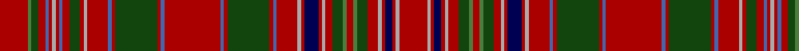

**Bands:** [RGGRBRYRBRGRYRBRGRBRBRGRBRYRBRYRGGRGGRYRBRYR](/stripes/rggrbryrbrgryrbrgrbrbrgrbryrbryrggrggryrbryr/) · **Stripes:** [R G DG R B R LR R B R DG R LR R B R DG R B R B R DG R B R LR R DB R LR R DG G R G DG R LR R DB R LR R](/stripes/stripes44/) R G DG R B R LR R B R DG R LR R B R DG R B R B R DG R B R LR R DB R LR R DG G R G DG R LR R DB R LR R

This was sourced from weddslist.  It is a [44 band tartan](/bands/bands44/).

Original link http://www.weddslist.com/cgi-bin/tartans/pg.pl?source=x

## Register references

External register numbers recorded for this tartan.

- Scottish Register of Tartans: [2540](https://www.tartanregister.gov.uk/tartanDetails.aspx?ref=2540)
- Scottish Register of Tartans: [2625](https://www.tartanregister.gov.uk/tartanDetails.aspx?ref=2625)
- Scottish Register of Tartans: [3555](https://www.tartanregister.gov.uk/tartanDetails.aspx?ref=3555)
- Scottish Tartans Authority (ITI): 1429
- Scottish Tartans Authority (ITI): 218
- Scottish Tartans World Register: 1429
- Scottish Tartans World Register: 218
- Scottish Tartans World Register: 864

## Variants

Other setts woven to the same stripe pattern.

- [MacAlister](/setts/s44/r8g1dg2r2b1r1lr1r1b1r2dg3r1lr1r6b1r1dg12r1b1r16b1r1dg12r1b1r6lr1r1db4r1lr1r2dg3g1r2g1dg3r3lr1r1db2r1lr1r8~x2/)

## Thread count
DR/8 G1 DG2 DR2 B1 DR1 N1 DR1 B1 DR2 DG3 DR1 N1 DR6 B1 DR1 DG12 DR1 B1 DR16 B1 DR1 DG12 DR1 B1 DR6 N1 DR1 DB4 DR1 N1 DR2 DG3 G1 DR2 G1 DG3 DR3 N1 DR1 DB2 DR1 N1 DR/8

## Palette
Each colour and its ΔE from the base-6 reference it is a variant of.

| Colour | Shade | Base | ΔE (OKLab) |
|---|---|---|---|
| B | <code style="background-color:#4367AE;">#4367AE</code> `#4367AE` | B <code style="background-color:#2A418A;">#2A418A</code> | 0.12 |
| DB | <code style="background-color:#000052;">#000052</code> `#000052` | B <code style="background-color:#2A418A;">#2A418A</code> | 0.20 |
| DG | <code style="background-color:#11450D;">#11450D</code> `#11450D` | G <code style="background-color:#006100;">#006100</code> | 0.09 |
| DR | <code style="background-color:#AA0000;">#AA0000</code> `#AA0000` | R <code style="background-color:#CC0000;">#CC0000</code> | 0.07 |
| G | <code style="background-color:#4C7D3C;">#4C7D3C</code> `#4C7D3C` | G <code style="background-color:#006100;">#006100</code> | 0.12 |
| N | <code style="background-color:#AAAAAA;">#AAAAAA</code> `#AAAAAA` | Y <code style="background-color:#F2BF00;">#F2BF00</code> | 0.19 |

## Nearest tartans

The nearest existing variants by ΔTartan distance.

1. [MacAlister](/setts/s44/r8g1dg2r2b1r1lr1r1b1r2dg3r1lr1r6b1r1dg12r1b1r16b1r1dg12r1b1r6lr1r1db4r1lr1r2dg3g1r2g1dg3r3lr1r1db2r1lr1r8~x2/) — ΔT 0.00
1. [MacAlister (Clan)](/setts/s44/r8g1g2r2t1r1w1r1t1r2g3r1w1r6t1r1g12r1t1r16t1r1g12r1t1r6w1r1db4r1w1r2g3g1r2g1g3r3w1r1db2r1w1r8~x2/) — ΔT 0.93
1. [MacAlister Clan Tartan Tartan Number: 1465. Earliest known date: 1850 This plate is taken from the manuscript of William and Andrew Smith's 'Authenticated Tartans of the Clans and Families of Scotland'. The Smith's sources included the findings of George Hunter, an Army clothier, who toured the Highlands in search of old tartans prior to 1822. MacAlisters are descendants of Donald of Islay, Lord of the Isles. Contemporary accounts of Flora MacDonald (1746) suggest that MacAlisters wore the MacDonald tartan at that time. The MacAlister tartan certified by the chief in 1816 shows the MacDonald connection in its design. The present day Chief MacAlister of Loup was granted by Lord Lyon in 1991. See products available Copyright © Blair Urquhart, Comrie, 2015](/setts/s44/r8g1dg2r2t1r1w1r1t1r2dg3r1w1r6t1r1dg12r1t1r16t1r1dg12r1t1r6w1r1db4r1w1r2dg3g1r2g1dg3r3w1r1db2r1w1r8~x2/) — ΔT 0.97
1. [MacRae The Princes Own Clan Tartan Tartan Number: 982. Earliest known date: c.1815 Two MacRae setts, of which this is one, are contained in the Highland Society collection and presumably sealed by the Chief around 1815. Unless he recognised both, perhaps one is the clan and the other the Chief's own See products available Copyright © Blair Urquhart, Comrie, 2015](/setts/s38/g29r5g28r22k2r2k4r2k2r22k2r2k4r2k2r20w2r9db26r5db28r9w2r22g3r8g3r22g8r6g8r6g5ly3g5r7g12w2~x2/) — ΔT 1.16
1. [MacKintosh 5](/setts/s42/db48r40k4r4g48r54db46r54dg14r4k4r4k4r48k4r4k4r4dg14r52db46r54dg60r4dg4r48db4r4r8db4r4db4r48k4r4dg60r48db4r4db4r4k7/) — ΔT 1.20
1. [MacRae The Princes Own](/setts/s38/dg29r5dg28r22k2r2k4r2k2r22k2r2k4r2k2r20w2r9db26r5db28r9w2r22dg3r8dg3r22dg8r6dg8r6dg5ly3dg5r7dg12w2~x2/) — ΔT 1.25
1. [Kinnoull (MacRae) Family Tartan Tartan Number: 983. Earliest known date: 1819 Check thread count against Sindex. See products available Copyright © Blair Urquhart, Comrie, 2015](/setts/s39/g24r7r26k2r2k5r2k2r26k2r2k5r2k2r26w3r12db33r7db33r12w3r26g4r12g4r26g12r8g12r12g8g7g8r12g9w3g16w2~x2/) — ΔT 1.28
1. [Kinnoull (MacRae) - Error?](/setts/s38/g24r7g24r26k2r2k5r2k2r24k2r2k5r2k2r26w3r12db33r12w3r26g4r12g4r26g12r8g12r12g8y7g8r12g9w3g16w2/) — ΔT 1.37
1. [MacRae of Inverinate](/setts/s40/r23g2r3g2r3g2r5ly5r5g2r3g2r3g2r23g23r5g15r5g23r23g2r3g2r3g2r5w5r5g2r3g2r3g2r23db15r5db15r5db15~x2/) — ΔT 1.39
1. [Kinnoull (MacRae)](/setts/s40/dg24r7dg24r26k2r2k5r2k2r26k2r2k5r2k2r26w3r12db33r7db33r12w3r26dg4r12dg4r26dg12r8dg12r12dg8g7dg8r12dg9w3dg16w2~x2/) — ΔT 1.44

## Neighbour map

Every grey dot is one of 14313 variants placed by the first two principal components of the ΔTartan feature space (44% of its variance). Red is this tartan; blue dots are its nearest — click one to open its page.

<svg viewBox="0 0 640 380" role="img" style="max-width:100%;height:auto;border:1px solid #e0e0e0;border-radius:4px;display:block" xmlns="http://www.w3.org/2000/svg"><image href="/nn/cloud.v1.png" width="640" height="380"/><a href="/setts/s44/r8g1dg2r2b1r1lr1r1b1r2dg3r1lr1r6b1r1dg12r1b1r16b1r1dg12r1b1r6lr1r1db4r1lr1r2dg3g1r2g1dg3r3lr1r1db2r1lr1r8~x2/"><circle cx="284.8" cy="57.1" r="4" fill="#3465a4"><title>MacAlister</title></circle></a><a href="/setts/s44/r8g1g2r2t1r1w1r1t1r2g3r1w1r6t1r1g12r1t1r16t1r1g12r1t1r6w1r1db4r1w1r2g3g1r2g1g3r3w1r1db2r1w1r8~x2/"><circle cx="267.7" cy="43.8" r="4" fill="#3465a4"><title>MacAlister (Clan)</title></circle></a><a href="/setts/s44/r8g1dg2r2t1r1w1r1t1r2dg3r1w1r6t1r1dg12r1t1r16t1r1dg12r1t1r6w1r1db4r1w1r2dg3g1r2g1dg3r3w1r1db2r1w1r8~x2/"><circle cx="260.7" cy="40.1" r="4" fill="#3465a4"><title>MacAlister Clan Tartan Tartan Number: 1465. Earliest known date: 1850 This plate is taken from the manuscript of William and Andrew Smith's 'Authenticated Tartans of the Clans and Families of Scotland'. The Smith's sources included the findings of George Hunter, an Army clothier, who toured the Highlands in search of old tartans prior to 1822. MacAlisters are descendants of Donald of Islay, Lord of the Isles. Contemporary accounts of Flora MacDonald (1746) suggest that MacAlisters wore the MacDonald tartan at that time. The MacAlister tartan certified by the chief in 1816 shows the MacDonald connection in its design. The present day Chief MacAlister of Loup was granted by Lord Lyon in 1991. See products available Copyright © Blair Urquhart, Comrie, 2015</title></circle></a><a href="/setts/s38/g29r5g28r22k2r2k4r2k2r22k2r2k4r2k2r20w2r9db26r5db28r9w2r22g3r8g3r22g8r6g8r6g5ly3g5r7g12w2~x2/"><circle cx="216.7" cy="71.4" r="4" fill="#3465a4"><title>MacRae The Princes Own Clan Tartan Tartan Number: 982. Earliest known date: c.1815 Two MacRae setts, of which this is one, are contained in the Highland Society collection and presumably sealed by the Chief around 1815. Unless he recognised both, perhaps one is the clan and the other the Chief's own See products available Copyright © Blair Urquhart, Comrie, 2015</title></circle></a><a href="/setts/s42/db48r40k4r4g48r54db46r54dg14r4k4r4k4r48k4r4k4r4dg14r52db46r54dg60r4dg4r48db4r4r8db4r4db4r48k4r4dg60r48db4r4db4r4k7/"><circle cx="281.1" cy="78.1" r="4" fill="#3465a4"><title>MacKintosh 5</title></circle></a><a href="/setts/s38/dg29r5dg28r22k2r2k4r2k2r22k2r2k4r2k2r20w2r9db26r5db28r9w2r22dg3r8dg3r22dg8r6dg8r6dg5ly3dg5r7dg12w2~x2/"><circle cx="214.4" cy="68.0" r="4" fill="#3465a4"><title>MacRae The Princes Own</title></circle></a><a href="/setts/s39/g24r7r26k2r2k5r2k2r26k2r2k5r2k2r26w3r12db33r7db33r12w3r26g4r12g4r26g12r8g12r12g8g7g8r12g9w3g16w2~x2/"><circle cx="230.7" cy="70.3" r="4" fill="#3465a4"><title>Kinnoull (MacRae) Family Tartan Tartan Number: 983. Earliest known date: 1819 Check thread count against Sindex. See products available Copyright © Blair Urquhart, Comrie, 2015</title></circle></a><a href="/setts/s38/g24r7g24r26k2r2k5r2k2r24k2r2k5r2k2r26w3r12db33r12w3r26g4r12g4r26g12r8g12r12g8y7g8r12g9w3g16w2/"><circle cx="236.1" cy="73.9" r="4" fill="#3465a4"><title>Kinnoull (MacRae) - Error?</title></circle></a><a href="/setts/s40/r23g2r3g2r3g2r5ly5r5g2r3g2r3g2r23g23r5g15r5g23r23g2r3g2r3g2r5w5r5g2r3g2r3g2r23db15r5db15r5db15~x2/"><circle cx="259.6" cy="91.1" r="4" fill="#3465a4"><title>MacRae of Inverinate</title></circle></a><a href="/setts/s40/dg24r7dg24r26k2r2k5r2k2r26k2r2k5r2k2r26w3r12db33r7db33r12w3r26dg4r12dg4r26dg12r8dg12r12dg8g7dg8r12dg9w3dg16w2~x2/"><circle cx="212.5" cy="68.2" r="4" fill="#3465a4"><title>Kinnoull (MacRae)</title></circle></a><circle cx="284.8" cy="57.1" r="5" fill="#c00000"/></svg>

ID: /setts/s44/r8g1dg2r2b1r1lr1r1b1r2dg3r1lr1r6b1r1dg12r1b1r16b1r1dg12r1b1r6lr1r1db4r1lr1r2dg3g1r2g1dg3r3lr1r1db2r1lr1r8/
