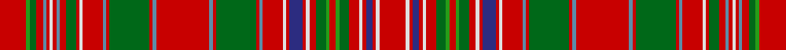

In pattern [RGGRBRWRBRGRWRBRGRBRBRGRBRWRBRWRGGRGGRWRBRWR](/stripes/rggrbrwrbrgrwrbrgrbrbrgrbrwrbrwrggrggrwrbrwr/).

This was sourced from tartans-authority.  It is a [44 stripe tartan](/stripes/stripes44/).

Original link http://www.tartansauthority.com/tartan-ferret/display/1465/

## Attestations

This cloth appears in 3 source records; the oldest owns this page.

- pre 1845 — MacAlister (Clan) (tartans-authority, [record](http://www.tartansauthority.com/tartan-ferret/display/1465/))
- 01/01/1850 — MacAlister (Smith 1850) (register-of-tartans, [record](https://www.tartanregister.gov.uk/tartanDetails.aspx?ref=2265))
- undated — MacAlister (weddslist, [record](http://www.weddslist.com/cgi-bin/tartans/pg.pl?source=sts))

## Register references

External register numbers recorded for this tartan.

- Scottish Register of Tartans: [2265](https://www.tartanregister.gov.uk/tartanDetails.aspx?ref=2265)
- Scottish Tartans Authority (ITI): 1465
- Scottish Tartans World Register: 1465

## Thread count
R/16 G2 Ga4 R4 B2 R2 LN2 R2 B2 R4 Ga6 R2 LN2 R12 B2 R2 Ga24 R2 B2 R32 B2 R2 Ga24 R2 B2 R12 LN2 R2 DB8 R2 LN2 R4 Ga6 G2 R4 G2 Ga6 R6 LN2 R2 DB4 R2 LN2 R/16

## Palette
Each colour and the base-6 reference it is a variant of.

| Colour | Shade | Base |
|---|---|---|
| B | <code style="background-color:#5C8CA8;">#5C8CA8</code> `oklch(61.7% 0.067 235.0)` <small>#5C8CA8</small> | B <code style="background-color:#2A418A;">#2A418A</code> |
| DB | <code style="background-color:#2C2C80;">#2C2C80</code> `oklch(35.0% 0.138 276.6)` <small>#2C2C80</small> | B <code style="background-color:#2A418A;">#2A418A</code> |
| G | <code style="background-color:#289C18;">#289C18</code> `oklch(60.6% 0.191 141.6)` <small>#289C18</small> | G <code style="background-color:#006100;">#006100</code> |
| Ga | <code style="background-color:#006818;">#006818</code> `oklch(45.0% 0.142 145.0)` <small>#006818</small> | G <code style="background-color:#006100;">#006100</code> |
| LN | <code style="background-color:#E0E0E0;">#E0E0E0</code> `oklch(90.7% 0.000 89.9)` <small>#E0E0E0</small> | W <code style="background-color:#F7F7F7;">#F7F7F7</code> |
| R | <code style="background-color:#C80000;">#C80000</code> `oklch(52.3% 0.215 29.2)` <small>#C80000</small> | R <code style="background-color:#CC0000;">#CC0000</code> |

## Nearest tartans

The nearest existing variants by ΔTartan distance.

1. [MacAlister Clan Tartan Tartan Number: 1465. Earliest known date: 1850 This plate is taken from the manuscript of William and Andrew Smith's 'Authenticated Tartans of the Clans and Families of Scotland'. The Smith's sources included the findings of George Hunter, an Army clothier, who toured the Highlands in search of old tartans prior to 1822. MacAlisters are descendants of Donald of Islay, Lord of the Isles. Contemporary accounts of Flora MacDonald (1746) suggest that MacAlisters wore the MacDonald tartan at that time. The MacAlister tartan certified by the chief in 1816 shows the MacDonald connection in its design. The present day Chief MacAlister of Loup was granted by Lord Lyon in 1991. See products available Copyright © Blair Urquhart, Comrie, 2015](/setts/s44/r8g1dg2r2t1r1w1r1t1r2dg3r1w1r6t1r1dg12r1t1r16t1r1dg12r1t1r6w1r1db4r1w1r2dg3g1r2g1dg3r3w1r1db2r1w1r8~x2/) — ΔT 0.64
1. [MacAlister](/setts/s44/r8g1dg2r2b1r1lr1r1b1r2dg3r1lr1r6b1r1dg12r1b1r16b1r1dg12r1b1r6lr1r1db4r1lr1r2dg3g1r2g1dg3r3lr1r1db2r1lr1r8~x2/) — ΔT 0.93
1. [MacRae The Princes Own Clan Tartan Tartan Number: 982. Earliest known date: c.1815 Two MacRae setts, of which this is one, are contained in the Highland Society collection and presumably sealed by the Chief around 1815. Unless he recognised both, perhaps one is the clan and the other the Chief's own See products available Copyright © Blair Urquhart, Comrie, 2015](/setts/s38/g29r5g28r22k2r2k4r2k2r22k2r2k4r2k2r20w2r9db26r5db28r9w2r22g3r8g3r22g8r6g8r6g5ly3g5r7g12w2~x2/) — ΔT 1.11
1. [MacRae The Princes Own](/setts/s38/dg29r5dg28r22k2r2k4r2k2r22k2r2k4r2k2r20w2r9db26r5db28r9w2r22dg3r8dg3r22dg8r6dg8r6dg5ly3dg5r7dg12w2~x2/) — ΔT 1.14
1. [Kinnoull (MacRae) - Error?](/setts/s38/g24r7g24r26k2r2k5r2k2r24k2r2k5r2k2r26w3r12db33r12w3r26g4r12g4r26g12r8g12r12g8y7g8r12g9w3g16w2/) — ΔT 1.16
1. [MacRae of Inverinate](/setts/s40/r23g2r3g2r3g2r5ly5r5g2r3g2r3g2r23g23r5g15r5g23r23g2r3g2r3g2r5w5r5g2r3g2r3g2r23db15r5db15r5db15~x2/) — ΔT 1.16
1. [Kinnoull (MacRae) Family Tartan Tartan Number: 983. Earliest known date: 1819 Check thread count against Sindex. See products available Copyright © Blair Urquhart, Comrie, 2015](/setts/s39/g24r7r26k2r2k5r2k2r26k2r2k5r2k2r26w3r12db33r7db33r12w3r26g4r12g4r26g12r8g12r12g8g7g8r12g9w3g16w2~x2/) — ΔT 1.18
1. [Kinnoull (MacRae)](/setts/s40/dg24r7dg24r26k2r2k5r2k2r26k2r2k5r2k2r26w3r12db33r7db33r12w3r26dg4r12dg4r26dg12r8dg12r12dg8g7dg8r12dg9w3dg16w2~x2/) — ΔT 1.29
1. [Confrerie de Vouvray Corporate Tartan Tartan Number: 5802. Earliest known date: 2003 The Confrerie de Vouvray tartan was created for the French Order of Wine Growers by the Chevaliers Ecossais de la Chantepleure de Vouvray. The red, yellow and maroon are the colours of the french order and the grid pattern of green lines depict the rows of vines of the Chenin Blanc grape. The tartan was presented as a gift to the Grand Council at the 2nd Scottish Confrerie, held in Dundee in May 2003. See products available Copyright © Blair Urquhart, Comrie, 2015](/setts/s34/dt6r3ly14r3r15ly3r15dt5r3g1r3g1r3g1r3g1r3g1r3g1r3g1r3g1r3g1r3dt5r15ly3r19r3ly14r3~x2/) — ΔT 1.33
1. [Kinnoull (Clan)](/setts/s40/dg23r6dg23r25k2r2k5r2k2r26k2r2k5r2k2r26w3r12lb33r7lb33r12w3r26dg8r12dg4r26dg12r8dg12r12dg8y7dg8r12dg9w3dg16w2/) — ΔT 1.34

## Neighbour map

Every grey dot is one of 14299 variants placed by the first two principal components of the ΔTartan feature space (44% of its variance). Red is this tartan; blue dots are its nearest — click one to open its page.

<svg viewBox="0 0 640 380" role="img" style="max-width:100%;height:auto;border:1px solid #e0e0e0;border-radius:4px;display:block" xmlns="http://www.w3.org/2000/svg"><image href="/nn/cloud.v1.png" width="640" height="380"/><a href="/setts/s44/r8g1dg2r2t1r1w1r1t1r2dg3r1w1r6t1r1dg12r1t1r16t1r1dg12r1t1r6w1r1db4r1w1r2dg3g1r2g1dg3r3w1r1db2r1w1r8~x2/"><circle cx="260.3" cy="40.2" r="4" fill="#3465a4"><title>MacAlister Clan Tartan Tartan Number: 1465. Earliest known date: 1850 This plate is taken from the manuscript of William and Andrew Smith's 'Authenticated Tartans of the Clans and Families of Scotland'. The Smith's sources included the findings of George Hunter, an Army clothier, who toured the Highlands in search of old tartans prior to 1822. MacAlisters are descendants of Donald of Islay, Lord of the Isles. Contemporary accounts of Flora MacDonald (1746) suggest that MacAlisters wore the MacDonald tartan at that time. The MacAlister tartan certified by the chief in 1816 shows the MacDonald connection in its design. The present day Chief MacAlister of Loup was granted by Lord Lyon in 1991. See products available Copyright © Blair Urquhart, Comrie, 2015</title></circle></a><a href="/setts/s44/r8g1dg2r2b1r1lr1r1b1r2dg3r1lr1r6b1r1dg12r1b1r16b1r1dg12r1b1r6lr1r1db4r1lr1r2dg3g1r2g1dg3r3lr1r1db2r1lr1r8~x2/"><circle cx="284.4" cy="57.3" r="4" fill="#3465a4"><title>MacAlister</title></circle></a><a href="/setts/s38/g29r5g28r22k2r2k4r2k2r22k2r2k4r2k2r20w2r9db26r5db28r9w2r22g3r8g3r22g8r6g8r6g5ly3g5r7g12w2~x2/"><circle cx="216.3" cy="71.5" r="4" fill="#3465a4"><title>MacRae The Princes Own Clan Tartan Tartan Number: 982. Earliest known date: c.1815 Two MacRae setts, of which this is one, are contained in the Highland Society collection and presumably sealed by the Chief around 1815. Unless he recognised both, perhaps one is the clan and the other the Chief's own See products available Copyright © Blair Urquhart, Comrie, 2015</title></circle></a><a href="/setts/s38/dg29r5dg28r22k2r2k4r2k2r22k2r2k4r2k2r20w2r9db26r5db28r9w2r22dg3r8dg3r22dg8r6dg8r6dg5ly3dg5r7dg12w2~x2/"><circle cx="214.0" cy="68.1" r="4" fill="#3465a4"><title>MacRae The Princes Own</title></circle></a><a href="/setts/s38/g24r7g24r26k2r2k5r2k2r24k2r2k5r2k2r26w3r12db33r12w3r26g4r12g4r26g12r8g12r12g8y7g8r12g9w3g16w2/"><circle cx="235.7" cy="74.0" r="4" fill="#3465a4"><title>Kinnoull (MacRae) - Error?</title></circle></a><a href="/setts/s40/r23g2r3g2r3g2r5ly5r5g2r3g2r3g2r23g23r5g15r5g23r23g2r3g2r3g2r5w5r5g2r3g2r3g2r23db15r5db15r5db15~x2/"><circle cx="259.2" cy="91.1" r="4" fill="#3465a4"><title>MacRae of Inverinate</title></circle></a><a href="/setts/s39/g24r7r26k2r2k5r2k2r26k2r2k5r2k2r26w3r12db33r7db33r12w3r26g4r12g4r26g12r8g12r12g8g7g8r12g9w3g16w2~x2/"><circle cx="230.4" cy="70.4" r="4" fill="#3465a4"><title>Kinnoull (MacRae) Family Tartan Tartan Number: 983. Earliest known date: 1819 Check thread count against Sindex. See products available Copyright © Blair Urquhart, Comrie, 2015</title></circle></a><a href="/setts/s40/dg24r7dg24r26k2r2k5r2k2r26k2r2k5r2k2r26w3r12db33r7db33r12w3r26dg4r12dg4r26dg12r8dg12r12dg8g7dg8r12dg9w3dg16w2~x2/"><circle cx="212.1" cy="68.3" r="4" fill="#3465a4"><title>Kinnoull (MacRae)</title></circle></a><a href="/setts/s34/dt6r3ly14r3r15ly3r15dt5r3g1r3g1r3g1r3g1r3g1r3g1r3g1r3g1r3g1r3dt5r15ly3r19r3ly14r3~x2/"><circle cx="284.3" cy="67.5" r="4" fill="#3465a4"><title>Confrerie de Vouvray Corporate Tartan Tartan Number: 5802. Earliest known date: 2003 The Confrerie de Vouvray tartan was created for the French Order of Wine Growers by the Chevaliers Ecossais de la Chantepleure de Vouvray. The red, yellow and maroon are the colours of the french order and the grid pattern of green lines depict the rows of vines of the Chenin Blanc grape. The tartan was presented as a gift to the Grand Council at the 2nd Scottish Confrerie, held in Dundee in May 2003. See products available Copyright © Blair Urquhart, Comrie, 2015</title></circle></a><a href="/setts/s40/dg23r6dg23r25k2r2k5r2k2r26k2r2k5r2k2r26w3r12lb33r7lb33r12w3r26dg8r12dg4r26dg12r8dg12r12dg8y7dg8r12dg9w3dg16w2/"><circle cx="197.0" cy="61.0" r="4" fill="#3465a4"><title>Kinnoull (Clan)</title></circle></a><circle cx="267.2" cy="43.9" r="5" fill="#c00000"/></svg>

ID: /setts/s44/r8g1g2r2t1r1w1r1t1r2g3r1w1r6t1r1g12r1t1r16t1r1g12r1t1r6w1r1db4r1w1r2g3g1r2g1g3r3w1r1db2r1w1r8~x2/
