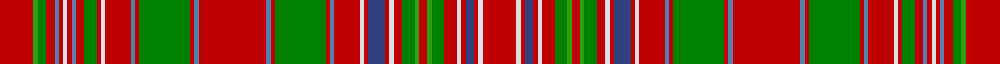

This page is one **sett** — a single exact thread-count. It belongs to the [tartan](/tartans/r8gi1g2r2t1r1w1r1t1r2g3r1w1r6t1r1g12r1t1r16t1r1g12r1t1r6w1r1db4r1w1r2g3gi1r2gi1g3r3w1r1db2r1w1r8/)
(the same proportion at any scale), whose colour order is pattern [RGGRBRWRBRGRWRBRGRBRBRGRBRWRBRWRGGRGGRWRBRWR](/stripes/rggrbrwrbrgrwrbrgrbrbrgrbrwrbrwrggrggrwrbrwr/).

Sourced from weddslist.  It is a [44 stripe tartan](/stripes/stripes44/).

Original link http://www.weddslist.com/cgi-bin/tartans/pg.pl?source=sts

## Thread count
R/16 G2 Ga4 R4 Ba2 R2 LN2 R2 Ba2 R4 Ga6 R2 LN2 R12 Ba2 R2 Ga24 R2 Ba2 R32 Ba2 R2 Ga24 R2 Ba2 R12 LN2 R2 B8 R2 LN2 R4 Ga6 G2 R4 G2 Ga6 R6 LN2 R2 B4 R2 LN2 R/16

## Palette

Palette: <strong>Tartan Dictionary</strong> <small style="color:#888">(1 of 6 colours)</small>
<table><thead><tr><th>Colour</th><th>Threads</th><th>Shade</th><th>Base</th><th>OKLCh</th></tr></thead><tbody><tr><td>R/</td><td style="text-align:right;font-variant-numeric:tabular-nums">16</td><td><code style="background-color:#C00000;">#C00000</code> <small style="color:#888">#C00000</small></td><td>R <code style="background-color:#CC0000;">#CC0000</code></td><td><small style="color:#888">oklch(50.7% 0.208 29.2)</small></td></tr><tr><td>G</td><td style="text-align:right;font-variant-numeric:tabular-nums">2</td><td><code style="background-color:#30A010;">#30A010</code> <small style="color:#888">#30A010</small></td><td>G <code style="background-color:#006100;">#006100</code></td><td><small style="color:#888">oklch(61.9% 0.195 140.5)</small></td></tr><tr><td>Ga</td><td style="text-align:right;font-variant-numeric:tabular-nums">4</td><td><code style="background-color:#008000;">#008000</code> <small style="color:#888">#008000</small></td><td>G <code style="background-color:#006100;">#006100</code></td><td><small style="color:#888">oklch(52.0% 0.177 142.5)</small></td></tr><tr><td>R</td><td style="text-align:right;font-variant-numeric:tabular-nums">4</td><td><code style="background-color:#C00000;">#C00000</code> <small style="color:#888">#C00000</small></td><td>R <code style="background-color:#CC0000;">#CC0000</code></td><td><small style="color:#888">oklch(50.7% 0.208 29.2)</small></td></tr><tr><td>Ba</td><td style="text-align:right;font-variant-numeric:tabular-nums">2</td><td><code style="background-color:#5480B0;">#5480B0</code> <small style="color:#888">#5480B0</small></td><td>B <code style="background-color:#2A418A;">#2A418A</code></td><td><small style="color:#888">oklch(58.8% 0.089 251.5)</small></td></tr><tr><td>R</td><td style="text-align:right;font-variant-numeric:tabular-nums">2</td><td><code style="background-color:#C00000;">#C00000</code> <small style="color:#888">#C00000</small></td><td>R <code style="background-color:#CC0000;">#CC0000</code></td><td><small style="color:#888">oklch(50.7% 0.208 29.2)</small></td></tr><tr><td>LN</td><td style="text-align:right;font-variant-numeric:tabular-nums">2</td><td><code style="background-color:#E0E0E0;">#E0E0E0</code> <small style="color:#888">#E0E0E0</small></td><td>W <code style="background-color:#F7F7F7;">#F7F7F7</code></td><td><small style="color:#888">oklch(90.7% 0.000 89.9)</small></td></tr><tr><td>R</td><td style="text-align:right;font-variant-numeric:tabular-nums">2</td><td><code style="background-color:#C00000;">#C00000</code> <small style="color:#888">#C00000</small></td><td>R <code style="background-color:#CC0000;">#CC0000</code></td><td><small style="color:#888">oklch(50.7% 0.208 29.2)</small></td></tr><tr><td>Ba</td><td style="text-align:right;font-variant-numeric:tabular-nums">2</td><td><code style="background-color:#5480B0;">#5480B0</code> <small style="color:#888">#5480B0</small></td><td>B <code style="background-color:#2A418A;">#2A418A</code></td><td><small style="color:#888">oklch(58.8% 0.089 251.5)</small></td></tr><tr><td>R</td><td style="text-align:right;font-variant-numeric:tabular-nums">4</td><td><code style="background-color:#C00000;">#C00000</code> <small style="color:#888">#C00000</small></td><td>R <code style="background-color:#CC0000;">#CC0000</code></td><td><small style="color:#888">oklch(50.7% 0.208 29.2)</small></td></tr><tr><td>Ga</td><td style="text-align:right;font-variant-numeric:tabular-nums">6</td><td><code style="background-color:#008000;">#008000</code> <small style="color:#888">#008000</small></td><td>G <code style="background-color:#006100;">#006100</code></td><td><small style="color:#888">oklch(52.0% 0.177 142.5)</small></td></tr><tr><td>R</td><td style="text-align:right;font-variant-numeric:tabular-nums">2</td><td><code style="background-color:#C00000;">#C00000</code> <small style="color:#888">#C00000</small></td><td>R <code style="background-color:#CC0000;">#CC0000</code></td><td><small style="color:#888">oklch(50.7% 0.208 29.2)</small></td></tr><tr><td>LN</td><td style="text-align:right;font-variant-numeric:tabular-nums">2</td><td><code style="background-color:#E0E0E0;">#E0E0E0</code> <small style="color:#888">#E0E0E0</small></td><td>W <code style="background-color:#F7F7F7;">#F7F7F7</code></td><td><small style="color:#888">oklch(90.7% 0.000 89.9)</small></td></tr><tr><td>R</td><td style="text-align:right;font-variant-numeric:tabular-nums">12</td><td><code style="background-color:#C00000;">#C00000</code> <small style="color:#888">#C00000</small></td><td>R <code style="background-color:#CC0000;">#CC0000</code></td><td><small style="color:#888">oklch(50.7% 0.208 29.2)</small></td></tr><tr><td>Ba</td><td style="text-align:right;font-variant-numeric:tabular-nums">2</td><td><code style="background-color:#5480B0;">#5480B0</code> <small style="color:#888">#5480B0</small></td><td>B <code style="background-color:#2A418A;">#2A418A</code></td><td><small style="color:#888">oklch(58.8% 0.089 251.5)</small></td></tr><tr><td>R</td><td style="text-align:right;font-variant-numeric:tabular-nums">2</td><td><code style="background-color:#C00000;">#C00000</code> <small style="color:#888">#C00000</small></td><td>R <code style="background-color:#CC0000;">#CC0000</code></td><td><small style="color:#888">oklch(50.7% 0.208 29.2)</small></td></tr><tr><td>Ga</td><td style="text-align:right;font-variant-numeric:tabular-nums">24</td><td><code style="background-color:#008000;">#008000</code> <small style="color:#888">#008000</small></td><td>G <code style="background-color:#006100;">#006100</code></td><td><small style="color:#888">oklch(52.0% 0.177 142.5)</small></td></tr><tr><td>R</td><td style="text-align:right;font-variant-numeric:tabular-nums">2</td><td><code style="background-color:#C00000;">#C00000</code> <small style="color:#888">#C00000</small></td><td>R <code style="background-color:#CC0000;">#CC0000</code></td><td><small style="color:#888">oklch(50.7% 0.208 29.2)</small></td></tr><tr><td>Ba</td><td style="text-align:right;font-variant-numeric:tabular-nums">2</td><td><code style="background-color:#5480B0;">#5480B0</code> <small style="color:#888">#5480B0</small></td><td>B <code style="background-color:#2A418A;">#2A418A</code></td><td><small style="color:#888">oklch(58.8% 0.089 251.5)</small></td></tr><tr><td>R</td><td style="text-align:right;font-variant-numeric:tabular-nums">32</td><td><code style="background-color:#C00000;">#C00000</code> <small style="color:#888">#C00000</small></td><td>R <code style="background-color:#CC0000;">#CC0000</code></td><td><small style="color:#888">oklch(50.7% 0.208 29.2)</small></td></tr><tr><td>Ba</td><td style="text-align:right;font-variant-numeric:tabular-nums">2</td><td><code style="background-color:#5480B0;">#5480B0</code> <small style="color:#888">#5480B0</small></td><td>B <code style="background-color:#2A418A;">#2A418A</code></td><td><small style="color:#888">oklch(58.8% 0.089 251.5)</small></td></tr><tr><td>R</td><td style="text-align:right;font-variant-numeric:tabular-nums">2</td><td><code style="background-color:#C00000;">#C00000</code> <small style="color:#888">#C00000</small></td><td>R <code style="background-color:#CC0000;">#CC0000</code></td><td><small style="color:#888">oklch(50.7% 0.208 29.2)</small></td></tr><tr><td>Ga</td><td style="text-align:right;font-variant-numeric:tabular-nums">24</td><td><code style="background-color:#008000;">#008000</code> <small style="color:#888">#008000</small></td><td>G <code style="background-color:#006100;">#006100</code></td><td><small style="color:#888">oklch(52.0% 0.177 142.5)</small></td></tr><tr><td>R</td><td style="text-align:right;font-variant-numeric:tabular-nums">2</td><td><code style="background-color:#C00000;">#C00000</code> <small style="color:#888">#C00000</small></td><td>R <code style="background-color:#CC0000;">#CC0000</code></td><td><small style="color:#888">oklch(50.7% 0.208 29.2)</small></td></tr><tr><td>Ba</td><td style="text-align:right;font-variant-numeric:tabular-nums">2</td><td><code style="background-color:#5480B0;">#5480B0</code> <small style="color:#888">#5480B0</small></td><td>B <code style="background-color:#2A418A;">#2A418A</code></td><td><small style="color:#888">oklch(58.8% 0.089 251.5)</small></td></tr><tr><td>R</td><td style="text-align:right;font-variant-numeric:tabular-nums">12</td><td><code style="background-color:#C00000;">#C00000</code> <small style="color:#888">#C00000</small></td><td>R <code style="background-color:#CC0000;">#CC0000</code></td><td><small style="color:#888">oklch(50.7% 0.208 29.2)</small></td></tr><tr><td>LN</td><td style="text-align:right;font-variant-numeric:tabular-nums">2</td><td><code style="background-color:#E0E0E0;">#E0E0E0</code> <small style="color:#888">#E0E0E0</small></td><td>W <code style="background-color:#F7F7F7;">#F7F7F7</code></td><td><small style="color:#888">oklch(90.7% 0.000 89.9)</small></td></tr><tr><td>R</td><td style="text-align:right;font-variant-numeric:tabular-nums">2</td><td><code style="background-color:#C00000;">#C00000</code> <small style="color:#888">#C00000</small></td><td>R <code style="background-color:#CC0000;">#CC0000</code></td><td><small style="color:#888">oklch(50.7% 0.208 29.2)</small></td></tr><tr><td>B</td><td style="text-align:right;font-variant-numeric:tabular-nums">8</td><td><code style="background-color:#304080;">#304080</code> <small style="color:#888">#304080</small></td><td>B <code style="background-color:#2A418A;">#2A418A</code></td><td><small style="color:#888">oklch(39.4% 0.109 270.2)</small></td></tr><tr><td>R</td><td style="text-align:right;font-variant-numeric:tabular-nums">2</td><td><code style="background-color:#C00000;">#C00000</code> <small style="color:#888">#C00000</small></td><td>R <code style="background-color:#CC0000;">#CC0000</code></td><td><small style="color:#888">oklch(50.7% 0.208 29.2)</small></td></tr><tr><td>LN</td><td style="text-align:right;font-variant-numeric:tabular-nums">2</td><td><code style="background-color:#E0E0E0;">#E0E0E0</code> <small style="color:#888">#E0E0E0</small></td><td>W <code style="background-color:#F7F7F7;">#F7F7F7</code></td><td><small style="color:#888">oklch(90.7% 0.000 89.9)</small></td></tr><tr><td>R</td><td style="text-align:right;font-variant-numeric:tabular-nums">4</td><td><code style="background-color:#C00000;">#C00000</code> <small style="color:#888">#C00000</small></td><td>R <code style="background-color:#CC0000;">#CC0000</code></td><td><small style="color:#888">oklch(50.7% 0.208 29.2)</small></td></tr><tr><td>Ga</td><td style="text-align:right;font-variant-numeric:tabular-nums">6</td><td><code style="background-color:#008000;">#008000</code> <small style="color:#888">#008000</small></td><td>G <code style="background-color:#006100;">#006100</code></td><td><small style="color:#888">oklch(52.0% 0.177 142.5)</small></td></tr><tr><td>G</td><td style="text-align:right;font-variant-numeric:tabular-nums">2</td><td><code style="background-color:#30A010;">#30A010</code> <small style="color:#888">#30A010</small></td><td>G <code style="background-color:#006100;">#006100</code></td><td><small style="color:#888">oklch(61.9% 0.195 140.5)</small></td></tr><tr><td>R</td><td style="text-align:right;font-variant-numeric:tabular-nums">4</td><td><code style="background-color:#C00000;">#C00000</code> <small style="color:#888">#C00000</small></td><td>R <code style="background-color:#CC0000;">#CC0000</code></td><td><small style="color:#888">oklch(50.7% 0.208 29.2)</small></td></tr><tr><td>G</td><td style="text-align:right;font-variant-numeric:tabular-nums">2</td><td><code style="background-color:#30A010;">#30A010</code> <small style="color:#888">#30A010</small></td><td>G <code style="background-color:#006100;">#006100</code></td><td><small style="color:#888">oklch(61.9% 0.195 140.5)</small></td></tr><tr><td>Ga</td><td style="text-align:right;font-variant-numeric:tabular-nums">6</td><td><code style="background-color:#008000;">#008000</code> <small style="color:#888">#008000</small></td><td>G <code style="background-color:#006100;">#006100</code></td><td><small style="color:#888">oklch(52.0% 0.177 142.5)</small></td></tr><tr><td>R</td><td style="text-align:right;font-variant-numeric:tabular-nums">6</td><td><code style="background-color:#C00000;">#C00000</code> <small style="color:#888">#C00000</small></td><td>R <code style="background-color:#CC0000;">#CC0000</code></td><td><small style="color:#888">oklch(50.7% 0.208 29.2)</small></td></tr><tr><td>LN</td><td style="text-align:right;font-variant-numeric:tabular-nums">2</td><td><code style="background-color:#E0E0E0;">#E0E0E0</code> <small style="color:#888">#E0E0E0</small></td><td>W <code style="background-color:#F7F7F7;">#F7F7F7</code></td><td><small style="color:#888">oklch(90.7% 0.000 89.9)</small></td></tr><tr><td>R</td><td style="text-align:right;font-variant-numeric:tabular-nums">2</td><td><code style="background-color:#C00000;">#C00000</code> <small style="color:#888">#C00000</small></td><td>R <code style="background-color:#CC0000;">#CC0000</code></td><td><small style="color:#888">oklch(50.7% 0.208 29.2)</small></td></tr><tr><td>B</td><td style="text-align:right;font-variant-numeric:tabular-nums">4</td><td><code style="background-color:#304080;">#304080</code> <small style="color:#888">#304080</small></td><td>B <code style="background-color:#2A418A;">#2A418A</code></td><td><small style="color:#888">oklch(39.4% 0.109 270.2)</small></td></tr><tr><td>R</td><td style="text-align:right;font-variant-numeric:tabular-nums">2</td><td><code style="background-color:#C00000;">#C00000</code> <small style="color:#888">#C00000</small></td><td>R <code style="background-color:#CC0000;">#CC0000</code></td><td><small style="color:#888">oklch(50.7% 0.208 29.2)</small></td></tr><tr><td>LN</td><td style="text-align:right;font-variant-numeric:tabular-nums">2</td><td><code style="background-color:#E0E0E0;">#E0E0E0</code> <small style="color:#888">#E0E0E0</small></td><td>W <code style="background-color:#F7F7F7;">#F7F7F7</code></td><td><small style="color:#888">oklch(90.7% 0.000 89.9)</small></td></tr><tr><td>R/</td><td style="text-align:right;font-variant-numeric:tabular-nums">16</td><td><code style="background-color:#C00000;">#C00000</code> <small style="color:#888">#C00000</small></td><td>R <code style="background-color:#CC0000;">#CC0000</code></td><td><small style="color:#888">oklch(50.7% 0.208 29.2)</small></td></tr></tbody></table>

## Nearest tartans

The nearest existing variants by ΔTartan distance, with this tartan at the top so the swatches line up against it.

ΔTartan

Tartan

Sett

—

<a href="/ttd/edit/#slug=r8gi1g2r2t1r1w1r1t1r2g3r1w1r6t1r1g12r1t1r16t1r1g12r1t1r6w1r1db4r1w1r2g3gi1r2gi1g3r3w1r1db2r1w1r8~x2">MacAlister</a> <a class="nn-out" href="/setts/s44/r8gi1g2r2t1r1w1r1t1r2g3r1w1r6t1r1g12r1t1r16t1r1g12r1t1r6w1r1db4r1w1r2g3gi1r2gi1g3r3w1r1db2r1w1r8~x2/" title="open its dictionary page">↗</a>

0.28

<a href="/ttd/edit/#slug=r8g1gi2r2t1r1w1r1t1r2gi3r1w1r6t1r1gi12r1t1r16t1r1gi12r1t1r6w1r1db4r1w1r2gi3g1r2g1gi3r3w1r1db2r1w1r8~x2">MacAlister (Clan)</a> <a class="nn-out" href="/setts/s44/r8g1gi2r2t1r1w1r1t1r2gi3r1w1r6t1r1gi12r1t1r16t1r1gi12r1t1r6w1r1db4r1w1r2gi3g1r2g1gi3r3w1r1db2r1w1r8~x2/" title="open its dictionary page">↗</a>

0.88

<a href="/ttd/edit/#slug=r8g1dg2r2t1r1w1r1t1r2dg3r1w1r6t1r1dg12r1t1r16t1r1dg12r1t1r6w1r1db4r1w1r2dg3g1r2g1dg3r3w1r1db2r1w1r8~x2">MacAlister Clan Tartan Tartan Number: 1465. Earliest known date: 1850 This plate is taken from the manuscript of William and Andrew Smith's 'Authenticated Tartans of the Clans and Families of Scotland'. The Smith's sources included the findings of George Hunter, an Army clothier, who toured the Highlands in search of old tartans prior to 1822. MacAlisters are descendants of Donald of Islay, Lord of the Isles. Contemporary accounts of Flora MacDonald (1746) suggest that MacAlisters wore the MacDonald tartan at that time. The MacAlister tartan certified by the chief in 1816 shows the MacDonald connection in its design. The present day Chief MacAlister of Loup was granted by Lord Lyon in 1991. See products available Copyright © Blair Urquhart, Comrie, 2015</a> <a class="nn-out" href="/setts/s44/r8g1dg2r2t1r1w1r1t1r2dg3r1w1r6t1r1dg12r1t1r16t1r1dg12r1t1r6w1r1db4r1w1r2dg3g1r2g1dg3r3w1r1db2r1w1r8~x2/" title="open its dictionary page">↗</a>

1.07

<a href="/ttd/edit/#slug=r8g1dg2r2b1r1lr1r1b1r2dg3r1lr1r6b1r1dg12r1b1r16b1r1dg12r1b1r6lr1r1db4r1lr1r2dg3g1r2g1dg3r3lr1r1db2r1lr1r8~x2">MacAlister</a> <a class="nn-out" href="/setts/s44/r8g1dg2r2b1r1lr1r1b1r2dg3r1lr1r6b1r1dg12r1b1r16b1r1dg12r1b1r6lr1r1db4r1lr1r2dg3g1r2g1dg3r3lr1r1db2r1lr1r8~x2/" title="open its dictionary page">↗</a>

1.18

<a href="/ttd/edit/#slug=r23g2r3g2r3g2r5ly5r5g2r3g2r3g2r23g23r5g15r5g23r23g2r3g2r3g2r5w5r5g2r3g2r3g2r23db15r5db15r5db15~x2">MacRae of Inverinate</a> <a class="nn-out" href="/setts/s40/r23g2r3g2r3g2r5ly5r5g2r3g2r3g2r23g23r5g15r5g23r23g2r3g2r3g2r5w5r5g2r3g2r3g2r23db15r5db15r5db15~x2/" title="open its dictionary page">↗</a>

1.21

<a href="/ttd/edit/#slug=g29r5g28r22k2r2k4r2k2r22k2r2k4r2k2r20w2r9db26r5db28r9w2r22g3r8g3r22g8r6g8r6g5ly3g5r7g12w2~x2">MacRae The Princes Own Clan Tartan Tartan Number: 982. Earliest known date: c.1815 Two MacRae setts, of which this is one, are contained in the Highland Society collection and presumably sealed by the Chief around 1815. Unless he recognised both, perhaps one is the clan and the other the Chief's own See products available Copyright © Blair Urquhart, Comrie, 2015</a> <a class="nn-out" href="/setts/s38/g29r5g28r22k2r2k4r2k2r22k2r2k4r2k2r20w2r9db26r5db28r9w2r22g3r8g3r22g8r6g8r6g5ly3g5r7g12w2~x2/" title="open its dictionary page">↗</a>

1.23

<a href="/ttd/edit/#slug=g24r7g24r26k2r2k5r2k2r24k2r2k5r2k2r26w3r12db33r12w3r26g4r12g4r26g12r8g12r12g8y7g8r12g9w3g16w2">Kinnoull (MacRae) - Error?</a> <a class="nn-out" href="/setts/s38/g24r7g24r26k2r2k5r2k2r24k2r2k5r2k2r26w3r12db33r12w3r26g4r12g4r26g12r8g12r12g8y7g8r12g9w3g16w2/" title="open its dictionary page">↗</a>

1.28

<a href="/ttd/edit/#slug=dg29r5dg28r22k2r2k4r2k2r22k2r2k4r2k2r20w2r9db26r5db28r9w2r22dg3r8dg3r22dg8r6dg8r6dg5ly3dg5r7dg12w2~x2">MacRae The Princes Own</a> <a class="nn-out" href="/setts/s38/dg29r5dg28r22k2r2k4r2k2r22k2r2k4r2k2r20w2r9db26r5db28r9w2r22dg3r8dg3r22dg8r6dg8r6dg5ly3dg5r7dg12w2~x2/" title="open its dictionary page">↗</a>

1.32

<a href="/ttd/edit/#slug=gi24r7r26k2r2k5r2k2r26k2r2k5r2k2r26w3r12db33r7db33r12w3r26gi4r12gi4r26gi12r8gi12r12gi8g7gi8r12gi9w3gi16w2~x2">Kinnoull (MacRae) Family Tartan Tartan Number: 983. Earliest known date: 1819 Check thread count against Sindex. See products available Copyright © Blair Urquhart, Comrie, 2015</a> <a class="nn-out" href="/setts/s39/gi24r7r26k2r2k5r2k2r26k2r2k5r2k2r26w3r12db33r7db33r12w3r26gi4r12gi4r26gi12r8gi12r12gi8g7gi8r12gi9w3gi16w2~x2/" title="open its dictionary page">↗</a>

1.38

<a href="/ttd/edit/#slug=dg23r6dg23r25k2r2k5r2k2r26k2r2k5r2k2r26w3r12lb33r7lb33r12w3r26dg8r12dg4r26dg12r8dg12r12dg8y7dg8r12dg9w3dg16w2">Kinnoull (Clan)</a> <a class="nn-out" href="/setts/s40/dg23r6dg23r25k2r2k5r2k2r26k2r2k5r2k2r26w3r12lb33r7lb33r12w3r26dg8r12dg4r26dg12r8dg12r12dg8y7dg8r12dg9w3dg16w2/" title="open its dictionary page">↗</a>

1.41

<a href="/ttd/edit/#slug=dt6r3ly14r3ri15ly3ri15dt5ri3g1ri3g1ri3g1ri3g1ri3g1ri3g1ri3g1ri3g1ri3g1ri3dt5ri15ly3ri19r3ly14r3~x2">Confrerie de Vouvray Corporate Tartan Tartan Number: 5802. Earliest known date: 2003 The Confrerie de Vouvray tartan was created for the French Order of Wine Growers by the Chevaliers Ecossais de la Chantepleure de Vouvray. The red, yellow and maroon are the colours of the french order and the grid pattern of green lines depict the rows of vines of the Chenin Blanc grape. The tartan was presented as a gift to the Grand Council at the 2nd Scottish Confrerie, held in Dundee in May 2003. See products available Copyright © Blair Urquhart, Comrie, 2015</a> <a class="nn-out" href="/setts/s34/dt6r3ly14r3ri15ly3ri15dt5ri3g1ri3g1ri3g1ri3g1ri3g1ri3g1ri3g1ri3g1ri3g1ri3dt5ri15ly3ri19r3ly14r3~x2/" title="open its dictionary page">↗</a>

## Neighbour map

Every grey dot is one of 14359 variants placed by the first two principal components of the ΔTartan feature space (44% of its variance). Red is this tartan; blue dots are its nearest — click one to open its page.

<svg viewBox="0 0 640 380" role="img" style="max-width:100%;height:auto;border:1px solid #e0e0e0;border-radius:4px;display:block" xmlns="http://www.w3.org/2000/svg"><image href="/nn/cloud.v1.png" width="640" height="380"/><a href="/setts/s44/r8g1gi2r2t1r1w1r1t1r2gi3r1w1r6t1r1gi12r1t1r16t1r1gi12r1t1r6w1r1db4r1w1r2gi3g1r2g1gi3r3w1r1db2r1w1r8~x2/"><circle cx="266.2" cy="43.9" r="4" fill="#3465a4"><title>MacAlister (Clan)</title></circle></a><a href="/setts/s44/r8g1dg2r2t1r1w1r1t1r2dg3r1w1r6t1r1dg12r1t1r16t1r1dg12r1t1r6w1r1db4r1w1r2dg3g1r2g1dg3r3w1r1db2r1w1r8~x2/"><circle cx="259.2" cy="40.3" r="4" fill="#3465a4"><title>MacAlister Clan Tartan Tartan Number: 1465. Earliest known date: 1850 This plate is taken from the manuscript of William and Andrew Smith's 'Authenticated Tartans of the Clans and Families of Scotland'. The Smith's sources included the findings of George Hunter, an Army clothier, who toured the Highlands in search of old tartans prior to 1822. MacAlisters are descendants of Donald of Islay, Lord of the Isles. Contemporary accounts of Flora MacDonald (1746) suggest that MacAlisters wore the MacDonald tartan at that time. The MacAlister tartan certified by the chief in 1816 shows the MacDonald connection in its design. The present day Chief MacAlister of Loup was granted by Lord Lyon in 1991. See products available Copyright © Blair Urquhart, Comrie, 2015</title></circle></a><a href="/setts/s44/r8g1dg2r2b1r1lr1r1b1r2dg3r1lr1r6b1r1dg12r1b1r16b1r1dg12r1b1r6lr1r1db4r1lr1r2dg3g1r2g1dg3r3lr1r1db2r1lr1r8~x2/"><circle cx="283.6" cy="57.3" r="4" fill="#3465a4"><title>MacAlister</title></circle></a><a href="/setts/s40/r23g2r3g2r3g2r5ly5r5g2r3g2r3g2r23g23r5g15r5g23r23g2r3g2r3g2r5w5r5g2r3g2r3g2r23db15r5db15r5db15~x2/"><circle cx="258.3" cy="91.4" r="4" fill="#3465a4"><title>MacRae of Inverinate</title></circle></a><a href="/setts/s38/g29r5g28r22k2r2k4r2k2r22k2r2k4r2k2r20w2r9db26r5db28r9w2r22g3r8g3r22g8r6g8r6g5ly3g5r7g12w2~x2/"><circle cx="215.5" cy="71.8" r="4" fill="#3465a4"><title>MacRae The Princes Own Clan Tartan Tartan Number: 982. Earliest known date: c.1815 Two MacRae setts, of which this is one, are contained in the Highland Society collection and presumably sealed by the Chief around 1815. Unless he recognised both, perhaps one is the clan and the other the Chief's own See products available Copyright © Blair Urquhart, Comrie, 2015</title></circle></a><a href="/setts/s38/g24r7g24r26k2r2k5r2k2r24k2r2k5r2k2r26w3r12db33r12w3r26g4r12g4r26g12r8g12r12g8y7g8r12g9w3g16w2/"><circle cx="234.8" cy="74.3" r="4" fill="#3465a4"><title>Kinnoull (MacRae) - Error?</title></circle></a><a href="/setts/s38/dg29r5dg28r22k2r2k4r2k2r22k2r2k4r2k2r20w2r9db26r5db28r9w2r22dg3r8dg3r22dg8r6dg8r6dg5ly3dg5r7dg12w2~x2/"><circle cx="213.2" cy="68.4" r="4" fill="#3465a4"><title>MacRae The Princes Own</title></circle></a><a href="/setts/s39/gi24r7r26k2r2k5r2k2r26k2r2k5r2k2r26w3r12db33r7db33r12w3r26gi4r12gi4r26gi12r8gi12r12gi8g7gi8r12gi9w3gi16w2~x2/"><circle cx="229.4" cy="70.7" r="4" fill="#3465a4"><title>Kinnoull (MacRae) Family Tartan Tartan Number: 983. Earliest known date: 1819 Check thread count against Sindex. See products available Copyright © Blair Urquhart, Comrie, 2015</title></circle></a><a href="/setts/s40/dg23r6dg23r25k2r2k5r2k2r26k2r2k5r2k2r26w3r12lb33r7lb33r12w3r26dg8r12dg4r26dg12r8dg12r12dg8y7dg8r12dg9w3dg16w2/"><circle cx="196.0" cy="61.3" r="4" fill="#3465a4"><title>Kinnoull (Clan)</title></circle></a><a href="/setts/s34/dt6r3ly14r3ri15ly3ri15dt5ri3g1ri3g1ri3g1ri3g1ri3g1ri3g1ri3g1ri3g1ri3g1ri3dt5ri15ly3ri19r3ly14r3~x2/"><circle cx="283.2" cy="67.7" r="4" fill="#3465a4"><title>Confrerie de Vouvray Corporate Tartan Tartan Number: 5802. Earliest known date: 2003 The Confrerie de Vouvray tartan was created for the French Order of Wine Growers by the Chevaliers Ecossais de la Chantepleure de Vouvray. The red, yellow and maroon are the colours of the french order and the grid pattern of green lines depict the rows of vines of the Chenin Blanc grape. The tartan was presented as a gift to the Grand Council at the 2nd Scottish Confrerie, held in Dundee in May 2003. See products available Copyright © Blair Urquhart, Comrie, 2015</title></circle></a><circle cx="265.1" cy="44.5" r="5" fill="#c00000"/></svg>

ID: /setts/s44/r8gi1g2r2t1r1w1r1t1r2g3r1w1r6t1r1g12r1t1r16t1r1g12r1t1r6w1r1db4r1w1r2g3gi1r2gi1g3r3w1r1db2r1w1r8~x2/
