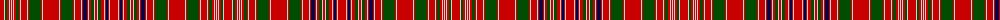

In pattern [RWGRWRWRWRGRWRWRGRWRWRGRWRWRBRWRGWRWGRWRBRWR](/patterns/rwgrwrwrwrgrwrwrgrwrwrgrwrwrbrwrgwrwgrwrbrwr/).

This was sourced from weddslist.  It is a [44 stripes tartan](/stripes/stripes44/).

Original link http://www.weddslist.com/cgi-bin/tartans/pg.pl?source=rb

## Thread count
R/8 N1 G2 R2 N1 R1 N1 R1 N1 R2 G3 R1 N1 R6 N1 R1 G12 R1 N1 R16 N1 R1 G12 R1 N1 R6 N1 R1 DB4 R1 N1 R2 G3 N1 R2 N1 G3 R3 N1 R1 DB2 R1 N1 R/8

## Palette
Each colour and its ΔE from the base-6 reference it is a variant of.

| Colour | Shade | Base | ΔE (OKLab) |
|---|---|---|---|
| DB | <code style="background-color:#00004C;">#00004C</code> `#00004C` | B <code style="background-color:#2A418A;">#2A418A</code> | 0.21 |
| G | <code style="background-color:#004C00;">#004C00</code> `#004C00` | G <code style="background-color:#006100;">#006100</code> | 0.07 |
| N | <code style="background-color:#D0D0D0;">#D0D0D0</code> `#D0D0D0` | W <code style="background-color:#F7F7F7;">#F7F7F7</code> | 0.12 |
| R | <code style="background-color:#C80000;">#C80000</code> `#C80000` | R <code style="background-color:#CC0000;">#CC0000</code> | 0.01 |

## Nearest tartans

The nearest existing variants by ΔTartan distance.

1. [Confrerie de Vouvray Corporate Tartan Tartan Number: 5802. Earliest known date: 2003 The Confrerie de Vouvray tartan was created for the French Order of Wine Growers by the Chevaliers Ecossais de la Chantepleure de Vouvray. The red, yellow and maroon are the colours of the french order and the grid pattern of green lines depict the rows of vines of the Chenin Blanc grape. The tartan was presented as a gift to the Grand Council at the 2nd Scottish Confrerie, held in Dundee in May 2003. See products available Copyright © Blair Urquhart, Comrie, 2015](/setts/s34/b12r6y28r6ra30y6ra30b10ra6g2ra6g2ra6g2ra6g2ra6g2ra6g2ra6g2ra6g2ra6g2ra6b10ra30y6ra38r6y28r6-b003c64-g289c18-rc80000-ra880000-ye8c000/) — ΔT 1.21
1. [MacRae of Inverinate Clan Tartan Tartan Number: 2000. Earliest known date: pre 2003 Presented by Mrs Macrae of Inverinate 1977, and approved for the use of the MacRaes of the Inverinate branch of the Clan. See products available Copyright © Blair Urquhart, Comrie, 2015](/setts/s40/r46g4r6g4r6g4r10y10r10g4r6g4r6g4r46g46r10g30r10g46r46g4r6g4r6g4r10w10r10g4r6g4r6g4r46b30r10b30r10b30-b2c2c80-g006818-rc80000-we0e0e0-ye8c000/) — ΔT 1.32
1. [King George IV](/setts/s32/g12y12g12r96b4w4r12b24r12w4b4r12g96r12b4w4r96w4b4r12g96r12b4w4r12b24r12w4b4r96g12y12-b280034-g285800-rc80000-wf8f8f8-yfca098/) — ΔT 1.35
1. [MacKintosh #6](/setts/s41/b48r40k4r4g48r54b46r54ga14r4k4r4k4r48k4r4k4r4ga14r52b46r54ga60r4ga4r48b4r12b4r4b4r48k4r4ga60r48b4r4b4r4k7-b2c4084-g005020-ga002814-k101010-rdc0000/) — ΔT 1.36
1. [MacKintosh 5](/setts/s42/b48r40k4r4g48r54b46r54ga14r4k4r4k4r48k4r4k4r4ga14r52b46r54ga60r4ga4r48b4r4r8b4r4b4r48k4r4ga60r48b4r4b4r4k7-b304080-g008000-ga003000-k000000-rc00000/) — ΔT 1.36
1. [MacRae of Inverinate](/setts/s40/r46g4r6g4r6g4r10y10r10g4r6g4r6g4r46g46r10g30r10g46r46g4r6g4r6g4r10w10r10g4r6g4r6g4r46b30r10b30r10b30-b304080-g008000-rc00000-we0e0e0-yf0c000/) — ΔT 1.39
1. [Hebrides North Uist](/setts/s46/b10r6w4b2w4r6g18y4w2y4g18r2g2r54b2r2b2r54b2r2b18w2b2w8b2w2b18r2b2r54b2r2b2r54g2r2g18y4w2y4g18r6w4b2w4r6-b202060-g006818-rc80000-we0e0e0-ye8c000/) — ΔT 1.39
1. [Unidentified Scarlett #3](/setts/s34/r6k36r4g6r4k4r40g4y2g4r4k36r4k4r40g6w2r6k36r4g6r4k4r40g4y2g4r4k36r4g4r40g6w2-g408060-k101010-rc80000-wfcfcfc-ye8c000/) — ΔT 1.45
1. [MacRae of Inverinate](/setts/s40/r46g4r6g4r6g4r10y10r10g4r6g4r6g4r46g46r10g30r10g46r46g4r6g4r6g4r10w10r10g4r6g4r6g4r46b30r10b30r10b30-b440044-g003820-rc80000-wfcfcfc-yd8b000/) — ΔT 1.49
1. [MacDonald of Staffa #2](/setts/s29/r37g6r11g32w4g18r27w3r27k16g21r5g5r27g5r5k3g25k3g4r27g5r5g5r5g5r5g5r8-g005020-k101010-rdc0000-we0e0e0/) — ΔT 1.50

## Neighbour map

Every grey dot is one of 15726 variants placed by the first two principal components of the ΔTartan feature space (44% of its variance). Red is this tartan; blue dots are its nearest — click one to open its page.

<svg viewBox="0 0 640 380" role="img" style="max-width:100%;height:auto;border:1px solid #e0e0e0;border-radius:4px;display:block" xmlns="http://www.w3.org/2000/svg"><image href="/nn/cloud.v1.png" width="640" height="380"/><a href="/setts/s34/b12r6y28r6ra30y6ra30b10ra6g2ra6g2ra6g2ra6g2ra6g2ra6g2ra6g2ra6g2ra6g2ra6b10ra30y6ra38r6y28r6-b003c64-g289c18-rc80000-ra880000-ye8c000/"><circle cx="282.1" cy="67.9" r="4" fill="#3465a4"><title>Confrerie de Vouvray Corporate Tartan Tartan Number: 5802. Earliest known date: 2003 The Confrerie de Vouvray tartan was created for the French Order of Wine Growers by the Chevaliers Ecossais de la Chantepleure de Vouvray. The red, yellow and maroon are the colours of the french order and the grid pattern of green lines depict the rows of vines of the Chenin Blanc grape. The tartan was presented as a gift to the Grand Council at the 2nd Scottish Confrerie, held in Dundee in May 2003. See products available Copyright © Blair Urquhart, Comrie, 2015</title></circle></a><a href="/setts/s40/r46g4r6g4r6g4r10y10r10g4r6g4r6g4r46g46r10g30r10g46r46g4r6g4r6g4r10w10r10g4r6g4r6g4r46b30r10b30r10b30-b2c2c80-g006818-rc80000-we0e0e0-ye8c000/"><circle cx="255.8" cy="88.7" r="4" fill="#3465a4"><title>MacRae of Inverinate Clan Tartan Tartan Number: 2000. Earliest known date: pre 2003 Presented by Mrs Macrae of Inverinate 1977, and approved for the use of the MacRaes of the Inverinate branch of the Clan. See products available Copyright © Blair Urquhart, Comrie, 2015</title></circle></a><a href="/setts/s32/g12y12g12r96b4w4r12b24r12w4b4r12g96r12b4w4r96w4b4r12g96r12b4w4r12b24r12w4b4r96g12y12-b280034-g285800-rc80000-wf8f8f8-yfca098/"><circle cx="302.4" cy="44.9" r="4" fill="#3465a4"><title>King George IV</title></circle></a><a href="/setts/s41/b48r40k4r4g48r54b46r54ga14r4k4r4k4r48k4r4k4r4ga14r52b46r54ga60r4ga4r48b4r12b4r4b4r48k4r4ga60r48b4r4b4r4k7-b2c4084-g005020-ga002814-k101010-rdc0000/"><circle cx="271.3" cy="73.5" r="4" fill="#3465a4"><title>MacKintosh #6</title></circle></a><a href="/setts/s42/b48r40k4r4g48r54b46r54ga14r4k4r4k4r48k4r4k4r4ga14r52b46r54ga60r4ga4r48b4r4r8b4r4b4r48k4r4ga60r48b4r4b4r4k7-b304080-g008000-ga003000-k000000-rc00000/"><circle cx="277.6" cy="76.9" r="4" fill="#3465a4"><title>MacKintosh 5</title></circle></a><a href="/setts/s40/r46g4r6g4r6g4r10y10r10g4r6g4r6g4r46g46r10g30r10g46r46g4r6g4r6g4r10w10r10g4r6g4r6g4r46b30r10b30r10b30-b304080-g008000-rc00000-we0e0e0-yf0c000/"><circle cx="256.4" cy="89.9" r="4" fill="#3465a4"><title>MacRae of Inverinate</title></circle></a><a href="/setts/s46/b10r6w4b2w4r6g18y4w2y4g18r2g2r54b2r2b2r54b2r2b18w2b2w8b2w2b18r2b2r54b2r2b2r54g2r2g18y4w2y4g18r6w4b2w4r6-b202060-g006818-rc80000-we0e0e0-ye8c000/"><circle cx="311.7" cy="14.0" r="4" fill="#3465a4"><title>Hebrides North Uist</title></circle></a><a href="/setts/s34/r6k36r4g6r4k4r40g4y2g4r4k36r4k4r40g6w2r6k36r4g6r4k4r40g4y2g4r4k36r4g4r40g6w2-g408060-k101010-rc80000-wfcfcfc-ye8c000/"><circle cx="271.7" cy="60.0" r="4" fill="#3465a4"><title>Unidentified Scarlett #3</title></circle></a><a href="/setts/s40/r46g4r6g4r6g4r10y10r10g4r6g4r6g4r46g46r10g30r10g46r46g4r6g4r6g4r10w10r10g4r6g4r6g4r46b30r10b30r10b30-b440044-g003820-rc80000-wfcfcfc-yd8b000/"><circle cx="257.9" cy="87.4" r="4" fill="#3465a4"><title>MacRae of Inverinate</title></circle></a><a href="/setts/s29/r37g6r11g32w4g18r27w3r27k16g21r5g5r27g5r5k3g25k3g4r27g5r5g5r5g5r5g5r8-g005020-k101010-rdc0000-we0e0e0/"><circle cx="288.2" cy="125.1" r="4" fill="#3465a4"><title>MacDonald of Staffa #2</title></circle></a><circle cx="286.3" cy="66.0" r="5" fill="#c00000"/></svg>

ID: /setts/s44/r8w1g2r2w1r1w1r1w1r2g3r1w1r6w1r1g12r1w1r16w1r1g12r1w1r6w1r1b4r1w1r2g3w1r2w1g3r3w1r1b2r1w1r8-b00004c-g004c00-rc80000-wd0d0d0/
