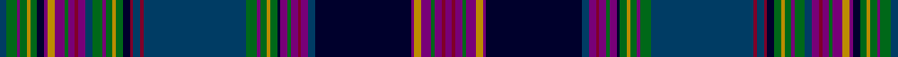

In pattern [BGBGYGKBYBGBRBBGBGYGKRBRBGBGYGKBGBRBBKBYBGBRB](/stripes/bgbgygkbybgbrbbgbgygkrbrbgbgygkbgbrbbkbybgbrb/).

This was sourced from house-of-tartan.  It is a [45 stripe tartan](/stripes/stripes45/).

Original link http://www.house-of-tartan.scotland.net/house/TartanViewjs.asp?colr=Def&tnam=4585

## Thread count
DB/4 G6 P2 G4 DY2 G4 DBa4 P2 DY4 P6 G2 P4 DR2 P4 DB4 G6 P2 G4 DY2 G4 DBa4 DR2 DB4 DR2 DB60 G6 P2 G4 DY2 G4 DBa2 P4 G2 P4 DR2 P4 DB4 DBa56 P2 DY4 P6 G2 P4 DR2 P/4

## Palette
Each colour and the base-6 reference it is a variant of.

| Colour | Shade | Base |
|---|---|---|
| DB | <code style="background-color:#003C64;">#003C64</code> `oklch(34.5% 0.089 246.0)` <small>#003C64</small> | B <code style="background-color:#2A418A;">#2A418A</code> |
| DBa | <code style="background-color:#00002C;">#00002C</code> `oklch(13.2% 0.092 264.1)` <small>#00002C</small> | K <code style="background-color:#000000;">#000000</code> |
| DR | <code style="background-color:#800028;">#800028</code> `oklch(38.2% 0.152 14.5)` <small>#800028</small> | R <code style="background-color:#CC0000;">#CC0000</code> |
| DY | <code style="background-color:#BC8C00;">#BC8C00</code> `oklch(66.8% 0.137 84.1)` <small>#BC8C00</small> | Y <code style="background-color:#F2BF00;">#F2BF00</code> |
| G | <code style="background-color:#006818;">#006818</code> `oklch(45.0% 0.142 145.0)` <small>#006818</small> | G <code style="background-color:#006100;">#006100</code> |
| K | <code style="background-color:#1C1C1C;">#1C1C1C</code> `oklch(22.6% 0.000 89.9)` <small>#1C1C1C</small> | B <code style="background-color:#2A418A;">#2A418A</code> |
| P | <code style="background-color:#780078;">#780078</code> `oklch(40.2% 0.185 328.4)` <small>#780078</small> | B <code style="background-color:#2A418A;">#2A418A</code> |

## Nearest tartans

The nearest existing variants by ΔTartan distance, with this tartan at the top so the swatches line up against it.

ΔTartan

Tartan

Sett

—

<a href="/ttd/edit/#slug=dt2g3dp1g2lo1g2k2dp1lo2dp3g1dp2r1dp2dt2g3dp1g2lo1g2k2r1dt2r1dt30g3dp1g2lo1g2k1dp2g1dp2r1dp2dt2k28dp1lo2dp3g1dp2r1dp2~x2">Highland Mist Corporate Tartan Tartan Number: 4585. Earliest known date: 2002 Designed by Claire Donaldson of House of Edgar for Harrisons of Hamilton for their sole use in their retail outlet and kilt hire operation. Very difficult to match colours. The black shown here should be a very dark blue verging on black. See products available Copyright © Blair Urquhart, Comrie, 2015</a> <a class="nn-out" href="/setts/s45/dt2g3dp1g2lo1g2k2dp1lo2dp3g1dp2r1dp2dt2g3dp1g2lo1g2k2r1dt2r1dt30g3dp1g2lo1g2k1dp2g1dp2r1dp2dt2k28dp1lo2dp3g1dp2r1dp2~x2/" title="open its dictionary page">↗</a>

1.01

<a href="/ttd/edit/#slug=dt2g3dp1g2lo1g2dt2dp1lo2dp3g1dp2r1dp2dt2g3dp1g2lo1g2dt2r1dt2r1dt30g3dp1g2lo1g2dt1dp2g1dp2r1dp2dt2dt28dp1lo2dp3g1dp2r1dp2~x2">Highland Mist</a> <a class="nn-out" href="/setts/s45/dt2g3dp1g2lo1g2dt2dp1lo2dp3g1dp2r1dp2dt2g3dp1g2lo1g2dt2r1dt2r1dt30g3dp1g2lo1g2dt1dp2g1dp2r1dp2dt2dt28dp1lo2dp3g1dp2r1dp2~x2/" title="open its dictionary page">↗</a>

1.72

<a href="/ttd/edit/#slug=k7r1k2r2k2r2k1r3w2r3k1r2k2r2k2r1k7n10k2n4k2n10k7r1k2r2k2r2k1r3w2r3k1r2k2r2k2r1k7dp2g2dp2g2dp40g2dp2g2dp2~x2">Arran, Isle of (Lochcarron)</a> <a class="nn-out" href="/setts/s48/k7r1k2r2k2r2k1r3w2r3k1r2k2r2k2r1k7n10k2n4k2n10k7r1k2r2k2r2k1r3w2r3k1r2k2r2k2r1k7dp2g2dp2g2dp40g2dp2g2dp2~x2/" title="open its dictionary page">↗</a>

1.79

<a href="/ttd/edit/#slug=dp32m16g8g1g1g1g1g1g1g1g1g16b1g1b1g1b1g1b1g1b1g1b1g1b1g1b1g1b16lb32b16g1b1g1b1g1b1g1b1g1b1g1b1g1b1g1">Virginia (Fashion)</a> <a class="nn-out" href="/setts/s46/dp32m16g8g1g1g1g1g1g1g1g1g16b1g1b1g1b1g1b1g1b1g1b1g1b1g1b1g1b16lb32b16g1b1g1b1g1b1g1b1g1b1g1b1g1b1g1/" title="open its dictionary page">↗</a>

1.82

<a href="/ttd/edit/#slug=r8k4g34k1g5k2g4k3g3k4g2k5g1k36db1k5db2k4db3k3db4k2db5k1db34w2r8">St. Andrews Soc. of New York (Corp)</a> <a class="nn-out" href="/setts/s27/r8k4g34k1g5k2g4k3g3k4g2k5g1k36db1k5db2k4db3k3db4k2db5k1db34w2r8/" title="open its dictionary page">↗</a>

2.08

<a href="/setts/s26/db7k1r3k1db24k1w3k3y3k3y3g19k2w4~x2/">Strathclyde, University of</a>

2.17

<a href="/ttd/edit/#slug=dp96dg10dp8dg8dp10dy34r1dy6r4dy4r6dy2r7w3r7dy2r6dy4r4dy6r1dy34t36dy6t18~x2">Unidentified #5</a> <a class="nn-out" href="/setts/s25/dp96dg10dp8dg8dp10dy34r1dy6r4dy4r6dy2r7w3r7dy2r6dy4r4dy6r1dy34t36dy6t18~x2/" title="open its dictionary page">↗</a>

2.17

<a href="/setts/s24/g4r1r1dg2r1r1r1r1k12g18db23w2k3~x2/">St. Andrews Grand</a>

2.18

<a href="/ttd/edit/#slug=r24w4r24k4g6db26g1db1g1db1g1db1g1db1g1db1g1db1g8k24r12k4db20k1db1k1db1k1db1k1db1k1db1k1db1k8r8db16~x2">Canadian Confederation (Commemorat)</a> <a class="nn-out" href="/setts/s38/r24w4r24k4g6db26g1db1g1db1g1db1g1db1g1db1g1db1g8k24r12k4db20k1db1k1db1k1db1k1db1k1db1k1db1k8r8db16~x2/" title="open its dictionary page">↗</a>

2.19

<a href="/ttd/edit/#slug=dp4m4dp3g20dp5k4dp3k7dp3k3db35w2db35k3dp3k7dp3k4dp5g20dp3m4dp4k2~x2">Spirit of Bannockburn</a> <a class="nn-out" href="/setts/s24/dp4m4dp3g20dp5k4dp3k7dp3k3db35w2db35k3dp3k7dp3k4dp5g20dp3m4dp4k2~x2/" title="open its dictionary page">↗</a>

2.22

<a href="/ttd/edit/#slug=db24ly1r2y2r2ly1k24y24w2db2w2y24k24ly1r2y2r2ly1db24y2~x2">Smithsonian</a> <a class="nn-out" href="/setts/s20/db24ly1r2y2r2ly1k24y24w2db2w2y24k24ly1r2y2r2ly1db24y2~x2/" title="open its dictionary page">↗</a>

## Neighbour map

Every grey dot is one of 14299 variants placed by the first two principal components of the ΔTartan feature space (44% of its variance). Red is this tartan; blue dots are its nearest — click one to open its page.

<svg viewBox="0 0 640 380" role="img" style="max-width:100%;height:auto;border:1px solid #e0e0e0;border-radius:4px;display:block" xmlns="http://www.w3.org/2000/svg"><image href="/nn/cloud.v1.png" width="640" height="380"/><a href="/setts/s45/dt2g3dp1g2lo1g2dt2dp1lo2dp3g1dp2r1dp2dt2g3dp1g2lo1g2dt2r1dt2r1dt30g3dp1g2lo1g2dt1dp2g1dp2r1dp2dt2dt28dp1lo2dp3g1dp2r1dp2~x2/"><circle cx="203.1" cy="22.7" r="4" fill="#3465a4"><title>Highland Mist</title></circle></a><a href="/setts/s48/k7r1k2r2k2r2k1r3w2r3k1r2k2r2k2r1k7n10k2n4k2n10k7r1k2r2k2r2k1r3w2r3k1r2k2r2k2r1k7dp2g2dp2g2dp40g2dp2g2dp2~x2/"><circle cx="192.7" cy="14.0" r="4" fill="#3465a4"><title>Arran, Isle of (Lochcarron)</title></circle></a><a href="/setts/s46/dp32m16g8g1g1g1g1g1g1g1g1g16b1g1b1g1b1g1b1g1b1g1b1g1b1g1b1g1b16lb32b16g1b1g1b1g1b1g1b1g1b1g1b1g1b1g1/"><circle cx="159.9" cy="14.0" r="4" fill="#3465a4"><title>Virginia (Fashion)</title></circle></a><a href="/setts/s27/r8k4g34k1g5k2g4k3g3k4g2k5g1k36db1k5db2k4db3k3db4k2db5k1db34w2r8/"><circle cx="220.8" cy="43.8" r="4" fill="#3465a4"><title>St. Andrews Soc. of New York (Corp)</title></circle></a><a href="/setts/s26/db7k1r3k1db24k1w3k3y3k3y3g19k2w4~x2/"><circle cx="179.7" cy="61.7" r="4" fill="#3465a4"><title>Strathclyde, University of</title></circle></a><a href="/setts/s25/dp96dg10dp8dg8dp10dy34r1dy6r4dy4r6dy2r7w3r7dy2r6dy4r4dy6r1dy34t36dy6t18~x2/"><circle cx="244.6" cy="28.9" r="4" fill="#3465a4"><title>Unidentified #5</title></circle></a><a href="/setts/s24/g4r1r1dg2r1r1r1r1k12g18db23w2k3~x2/"><circle cx="156.5" cy="49.4" r="4" fill="#3465a4"><title>St. Andrews Grand</title></circle></a><a href="/setts/s38/r24w4r24k4g6db26g1db1g1db1g1db1g1db1g1db1g1db1g8k24r12k4db20k1db1k1db1k1db1k1db1k1db1k1db1k8r8db16~x2/"><circle cx="198.8" cy="40.5" r="4" fill="#3465a4"><title>Canadian Confederation (Commemorat)</title></circle></a><a href="/setts/s24/dp4m4dp3g20dp5k4dp3k7dp3k3db35w2db35k3dp3k7dp3k4dp5g20dp3m4dp4k2~x2/"><circle cx="191.5" cy="90.4" r="4" fill="#3465a4"><title>Spirit of Bannockburn</title></circle></a><a href="/setts/s20/db24ly1r2y2r2ly1k24y24w2db2w2y24k24ly1r2y2r2ly1db24y2~x2/"><circle cx="189.9" cy="86.2" r="4" fill="#3465a4"><title>Smithsonian</title></circle></a><circle cx="179.6" cy="14.0" r="5" fill="#c00000"/></svg>

ID: /setts/s45/dt2g3dp1g2lo1g2k2dp1lo2dp3g1dp2r1dp2dt2g3dp1g2lo1g2k2r1dt2r1dt30g3dp1g2lo1g2k1dp2g1dp2r1dp2dt2k28dp1lo2dp3g1dp2r1dp2~x2/
