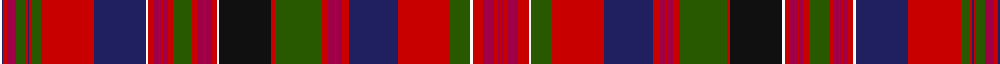

In pattern [RRRRRWGRBRRRRRGRKWRRRRRRRGRRRRRRRWBRGRBRGRRBW](/stripes/rrrrrwgrbrrrrrgrkwrrrrrrrgrrrrrrrwbrgrbrgrrbw/).

This was sourced from tartans-authority.  It is a [45 stripe tartan](/stripes/stripes45/).

Original link http://www.tartansauthority.com/tartan-ferret/display/8419/

## Thread count
W/2 DB1 R3 Ra7 G7 R2 DB1 R2 G7 R41 DB40 W2 R4 Ra4 R1 Ra1 R1 Ra4 R4 G15 R4 Ra4 R1 Ra1 R1 Ra4 R4 W2 K40 R3 G36 R5 Ra5 R1 Ra5 R5 DB38 R40 G16 W2 R8 Ra8 R3 Ra2 R/1

## Palette
Each colour and its ΔE from the base-6 reference it is a variant of.

| Colour | Shade | Base | ΔE (OKLab) |
|---|---|---|---|
| DB | <code style="background-color:#202060;">#202060</code> `#202060` | B <code style="background-color:#2A418A;">#2A418A</code> | 0.11 |
| G | <code style="background-color:#285800;">#285800</code> `#285800` | G <code style="background-color:#006100;">#006100</code> | 0.03 |
| K | <code style="background-color:#101010;">#101010</code> `#101010` | K <code style="background-color:#000000;">#000000</code> | 0.17 |
| R | <code style="background-color:#C80000;">#C80000</code> `#C80000` | R <code style="background-color:#CC0000;">#CC0000</code> | 0.01 |
| Ra | <code style="background-color:#A00048;">#A00048</code> `#A00048` | R <code style="background-color:#CC0000;">#CC0000</code> | 0.12 |
| W | <code style="background-color:#FCFCFC;">#FCFCFC</code> `#FCFCFC` | W <code style="background-color:#F7F7F7;">#F7F7F7</code> | 0.01 |

## Nearest tartans

The nearest existing variants by ΔTartan distance.

1. [Arran, Isle of (Lochcarron)](/setts/s48/k7r1k2r2k2r2k1r3w2r3k1r2k2r2k2r1k7n10k2n4k2n10k7r1k2r2k2r2k1r3w2r3k1r2k2r2k2r1k7dp2g2dp2g2dp40g2dp2g2dp2~x2/) — ΔT 1.05
1. [Hay & Leith #2](/setts/s42/k7r3ly2r60g7r2ly2r7g50w2k50r2dt50r7ly2r2dt7r60k7ly2r3k7/) — ΔT 1.19
1. [Leith (Hay)](/setts/s44/k14r4ly4k8r70dp8r3ly3r8dp64r3k63w3g64r8ly3r3g8r70k8ly4r4k14/) — ΔT 1.21
1. [Unidentified Cant #13](/setts/s34/r44m4db16r4m6db8m6r6db2r4db2r4db2r6w1g24t6w1/) — ΔT 1.23
1. [Whitworth](/setts/s38/r5ly1r8w1db20w1t20w1g20ly1r5ly1r5ly1g20ly2r52w1ly5w1~x2/) — ΔT 1.47
1. [New Brunswick (Lyon Court Books)](/setts/s44/t1ly1t1dg1g2dg2g2dg2g2dg1t1ly1t1ly1t1dg28r24ly1o2ly3t4r10o16r4ly2r15o5r9dg28t1ly1t1ly1t1dg1g2dg2g2dg2g2dg1t1ly1t1~x2/) — ΔT 1.51
1. [Hay](/setts/s23/k12r4ly4k8r66g8r1ly1r8g60w3k60r3dp60r8ly3r3dp8r66k8ly4r4k6~x2/) — ΔT 1.60
1. [MacDougall of MacDougall](/setts/s24/t2dp10r3r4dg72r7dg4r10db24dp6r5r4r5dp7dg24r24dg24r3db3r74dp7r5r6t2~x2/) — ΔT 1.63
1. [Unidentified Cant #11](/setts/s48/m99g6m8g4m10dy34r2dy6r4dy4r6dy2r7w3r7dy2r6dy4r4dy6r2dy34t36dy6t18/) — ΔT 1.68
1. [Unidentified (Paisley)](/setts/s66/db4k1db2k1db1k2db1k6g1k2g2k2g2k1g3k1g28r2g6r6w2r33k1r3k1r2k2r2k2r1k6g8k1ly2~x2/) — ΔT 1.72

## Neighbour map

Every grey dot is one of 14299 variants placed by the first two principal components of the ΔTartan feature space (44% of its variance). Red is this tartan; blue dots are its nearest — click one to open its page.

<svg viewBox="0 0 640 380" role="img" style="max-width:100%;height:auto;border:1px solid #e0e0e0;border-radius:4px;display:block" xmlns="http://www.w3.org/2000/svg"><image href="/nn/cloud.v1.png" width="640" height="380"/><a href="/setts/s48/k7r1k2r2k2r2k1r3w2r3k1r2k2r2k2r1k7n10k2n4k2n10k7r1k2r2k2r2k1r3w2r3k1r2k2r2k2r1k7dp2g2dp2g2dp40g2dp2g2dp2~x2/"><circle cx="192.7" cy="14.0" r="4" fill="#3465a4"><title>Arran, Isle of (Lochcarron)</title></circle></a><a href="/setts/s42/k7r3ly2r60g7r2ly2r7g50w2k50r2dt50r7ly2r2dt7r60k7ly2r3k7/"><circle cx="219.3" cy="16.0" r="4" fill="#3465a4"><title>Hay &amp; Leith #2</title></circle></a><a href="/setts/s44/k14r4ly4k8r70dp8r3ly3r8dp64r3k63w3g64r8ly3r3g8r70k8ly4r4k14/"><circle cx="191.2" cy="21.7" r="4" fill="#3465a4"><title>Leith (Hay)</title></circle></a><a href="/setts/s34/r44m4db16r4m6db8m6r6db2r4db2r4db2r6w1g24t6w1/"><circle cx="207.6" cy="26.1" r="4" fill="#3465a4"><title>Unidentified Cant #13</title></circle></a><a href="/setts/s38/r5ly1r8w1db20w1t20w1g20ly1r5ly1r5ly1g20ly2r52w1ly5w1~x2/"><circle cx="229.3" cy="14.0" r="4" fill="#3465a4"><title>Whitworth</title></circle></a><a href="/setts/s44/t1ly1t1dg1g2dg2g2dg2g2dg1t1ly1t1ly1t1dg28r24ly1o2ly3t4r10o16r4ly2r15o5r9dg28t1ly1t1ly1t1dg1g2dg2g2dg2g2dg1t1ly1t1~x2/"><circle cx="173.7" cy="14.0" r="4" fill="#3465a4"><title>New Brunswick (Lyon Court Books)</title></circle></a><a href="/setts/s23/k12r4ly4k8r66g8r1ly1r8g60w3k60r3dp60r8ly3r3dp8r66k8ly4r4k6~x2/"><circle cx="232.7" cy="19.7" r="4" fill="#3465a4"><title>Hay</title></circle></a><a href="/setts/s24/t2dp10r3r4dg72r7dg4r10db24dp6r5r4r5dp7dg24r24dg24r3db3r74dp7r5r6t2~x2/"><circle cx="249.8" cy="36.5" r="4" fill="#3465a4"><title>MacDougall of MacDougall</title></circle></a><a href="/setts/s48/m99g6m8g4m10dy34r2dy6r4dy4r6dy2r7w3r7dy2r6dy4r4dy6r2dy34t36dy6t18/"><circle cx="245.3" cy="14.0" r="4" fill="#3465a4"><title>Unidentified Cant #11</title></circle></a><a href="/setts/s66/db4k1db2k1db1k2db1k6g1k2g2k2g2k1g3k1g28r2g6r6w2r33k1r3k1r2k2r2k2r1k6g8k1ly2~x2/"><circle cx="208.4" cy="14.0" r="4" fill="#3465a4"><title>Unidentified (Paisley)</title></circle></a><circle cx="192.5" cy="14.0" r="5" fill="#c00000"/></svg>

ID: /setts/s45/w2db1r3m7dg7r2db1r2dg7r41db40w2r4m4r1m1r1m4r4dg15r4m4r1m1r1m4r4w2k40r3dg36r5m5r1m5r5db38r40dg16w2r8m8r3m2r1/
