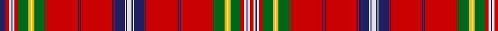

**Bands:** [BRWBWRGYWYGRGRBRBRBRBWBWBWBRBRBRBRGRGYWYGRWBWR](/stripes/brwbwrgywygrgrbrbrbrbwbwbwbrbrbrbrgrgywygrwbwr/) · **Stripes:** [DB R W DB W R G LY W LY G R G R DB R DB R DB R DB W DB W DB W DB R DB R DB R DB R G R G LY W LY G R W DB W R](/stripes/stripes46/) DB R W DB W R G LY W LY G R G R DB R DB R DB R DB W DB W DB W DB R DB R DB R DB R G R G LY W LY G R W DB W R

This was sourced from register-of-tartans.  It is a [46 band tartan](/bands/bands46/).

Original link https://www.tartanregister.gov.uk/tartanDetails.aspx?ref=1668

## Register references

External register numbers recorded for this tartan.

- Scottish Register of Tartans: [1668](https://www.tartanregister.gov.uk/tartanDetails.aspx?ref=1668)
- Scottish Tartans Authority (ITI): 583
- Scottish Tartans World Register: 583

## Thread count
DB/10 R6 LN4 DB2 LN4 R6 G18 Y4 LN2 Y4 G18 R2 G2 R54 DB2 R2 DB2 R54 DB2 R2 DB18 LN2 DB2 LN8 DB2 LN2 DB18 R2 DB2 R54 DB2 R2 DB2 R54 G2 R2 G18 Y4 LN2 Y4 G18 R6 LN4 DB2 LN4 R/6

## Palette
Each colour and its ΔE from the base-6 reference it is a variant of.

| Colour | Shade | Base | ΔE (OKLab) |
|---|---|---|---|
| DB | <code style="background-color:#202060;">#202060</code> `#202060` | B <code style="background-color:#2A418A;">#2A418A</code> | 0.11 |
| G | <code style="background-color:#006818;">#006818</code> `#006818` | G <code style="background-color:#006100;">#006100</code> | 0.02 |
| LN | <code style="background-color:#E0E0E0;">#E0E0E0</code> `#E0E0E0` | W <code style="background-color:#F7F7F7;">#F7F7F7</code> | 0.07 |
| R | <code style="background-color:#C80000;">#C80000</code> `#C80000` | R <code style="background-color:#CC0000;">#CC0000</code> | 0.01 |
| Y | <code style="background-color:#E8C000;">#E8C000</code> `#E8C000` | Y <code style="background-color:#F2BF00;">#F2BF00</code> | 0.02 |

## Nearest tartans

The nearest existing variants by ΔTartan distance.

1. [King George IV](/setts/s32/dg3lr3dg3r24dp1w1r3dp6r3w1dp1r3dg24r3dp1w1r24w1dp1r3dg24r3dp1w1r3dp6r3w1dp1r24dg3lr3~x4/) — ΔT 0.99
1. [MacAlister (Logan 1831)](/setts/s41/r32g2dg12r4t4r4w2r4t4r4dg12r2w2r24t2r2dg44r2t2r64t2r2dg44r2t2r22w2r2db16r2w2r10dg12g2r8g2dg12r3w2r2db10~x2/) — ΔT 1.25
1. [MacAlister](/setts/s44/r8lb1dg2r2lb1r1lb1r1lb1r2dg3r1lb1r6lb1r1dg12r1lb1r16lb1r1dg12r1lb1r6lb1r1db4r1lb1r2dg3lb1r2lb1dg3r3lb1r1db2r1lb1r8/) — ΔT 1.39
1. [MacAlister Clan Tartan Tartan Number: 1465. Earliest known date: 1850 This plate is taken from the manuscript of William and Andrew Smith's 'Authenticated Tartans of the Clans and Families of Scotland'. The Smith's sources included the findings of George Hunter, an Army clothier, who toured the Highlands in search of old tartans prior to 1822. MacAlisters are descendants of Donald of Islay, Lord of the Isles. Contemporary accounts of Flora MacDonald (1746) suggest that MacAlisters wore the MacDonald tartan at that time. The MacAlister tartan certified by the chief in 1816 shows the MacDonald connection in its design. The present day Chief MacAlister of Loup was granted by Lord Lyon in 1991. See products available Copyright © Blair Urquhart, Comrie, 2015](/setts/s44/r8g1dg2r2t1r1w1r1t1r2dg3r1w1r6t1r1dg12r1t1r16t1r1dg12r1t1r6w1r1db4r1w1r2dg3g1r2g1dg3r3w1r1db2r1w1r8~x2/) — ΔT 1.40
1. [Confrerie de Vouvray Corporate Tartan Tartan Number: 5802. Earliest known date: 2003 The Confrerie de Vouvray tartan was created for the French Order of Wine Growers by the Chevaliers Ecossais de la Chantepleure de Vouvray. The red, yellow and maroon are the colours of the french order and the grid pattern of green lines depict the rows of vines of the Chenin Blanc grape. The tartan was presented as a gift to the Grand Council at the 2nd Scottish Confrerie, held in Dundee in May 2003. See products available Copyright © Blair Urquhart, Comrie, 2015](/setts/s34/dt6r3ly14r3r15ly3r15dt5r3g1r3g1r3g1r3g1r3g1r3g1r3g1r3g1r3g1r3dt5r15ly3r19r3ly14r3~x2/) — ΔT 1.45
1. [Hebridean, North Uist](/setts/s24/db5r3w2db1w2r3g9ly2w1ly2g9r1g1r27db1r1db1r27db1r1db9w1db1w4~x2/) — ΔT 1.47
1. [MacAlister (Clan)](/setts/s44/r8g1g2r2t1r1w1r1t1r2g3r1w1r6t1r1g12r1t1r16t1r1g12r1t1r6w1r1db4r1w1r2g3g1r2g1g3r3w1r1db2r1w1r8~x2/) — ΔT 1.54
1. [Unidentified Scarlett #3](/setts/s34/r3k18r2g3r2k2r20g2ly1g2r2k18r2k2r20g3w1r3k18r2g3r2k2r20g2ly1g2r2k18r2g2r20g3w1~x2/) — ΔT 1.55
1. [Hebrides, Inner #02](/setts/s46/r47db3r1db3r11dg4g4r5db2r1g4r1db2r5g4r4db8r1k2db4r1db4k2r23k2db4r1db4k2r1db8r4g4r5db2r1g4r1db2r5g4dg4r11db3r1db3~x2/) — ΔT 1.58
1. [MacFarlane](/setts/s27/r42k1g12w2r3k1r3w2g2dp12k4r3w4g3w4r3k4dp12g2w2r3k1r3w2g12k1r21~x4/) — ΔT 1.58

## Neighbour map

Every grey dot is one of 14313 variants placed by the first two principal components of the ΔTartan feature space (44% of its variance). Red is this tartan; blue dots are its nearest — click one to open its page.

<svg viewBox="0 0 640 380" role="img" style="max-width:100%;height:auto;border:1px solid #e0e0e0;border-radius:4px;display:block" xmlns="http://www.w3.org/2000/svg"><image href="/nn/cloud.v1.png" width="640" height="380"/><a href="/setts/s32/dg3lr3dg3r24dp1w1r3dp6r3w1dp1r3dg24r3dp1w1r24w1dp1r3dg24r3dp1w1r3dp6r3w1dp1r24dg3lr3~x4/"><circle cx="306.2" cy="45.3" r="4" fill="#3465a4"><title>King George IV</title></circle></a><a href="/setts/s41/r32g2dg12r4t4r4w2r4t4r4dg12r2w2r24t2r2dg44r2t2r64t2r2dg44r2t2r22w2r2db16r2w2r10dg12g2r8g2dg12r3w2r2db10~x2/"><circle cx="276.3" cy="14.0" r="4" fill="#3465a4"><title>MacAlister (Logan 1831)</title></circle></a><a href="/setts/s44/r8lb1dg2r2lb1r1lb1r1lb1r2dg3r1lb1r6lb1r1dg12r1lb1r16lb1r1dg12r1lb1r6lb1r1db4r1lb1r2dg3lb1r2lb1dg3r3lb1r1db2r1lb1r8/"><circle cx="289.4" cy="65.5" r="4" fill="#3465a4"><title>MacAlister</title></circle></a><a href="/setts/s44/r8g1dg2r2t1r1w1r1t1r2dg3r1w1r6t1r1dg12r1t1r16t1r1dg12r1t1r6w1r1db4r1w1r2dg3g1r2g1dg3r3w1r1db2r1w1r8~x2/"><circle cx="260.7" cy="40.1" r="4" fill="#3465a4"><title>MacAlister Clan Tartan Tartan Number: 1465. Earliest known date: 1850 This plate is taken from the manuscript of William and Andrew Smith's 'Authenticated Tartans of the Clans and Families of Scotland'. The Smith's sources included the findings of George Hunter, an Army clothier, who toured the Highlands in search of old tartans prior to 1822. MacAlisters are descendants of Donald of Islay, Lord of the Isles. Contemporary accounts of Flora MacDonald (1746) suggest that MacAlisters wore the MacDonald tartan at that time. The MacAlister tartan certified by the chief in 1816 shows the MacDonald connection in its design. The present day Chief MacAlister of Loup was granted by Lord Lyon in 1991. See products available Copyright © Blair Urquhart, Comrie, 2015</title></circle></a><a href="/setts/s34/dt6r3ly14r3r15ly3r15dt5r3g1r3g1r3g1r3g1r3g1r3g1r3g1r3g1r3g1r3dt5r15ly3r19r3ly14r3~x2/"><circle cx="284.8" cy="67.5" r="4" fill="#3465a4"><title>Confrerie de Vouvray Corporate Tartan Tartan Number: 5802. Earliest known date: 2003 The Confrerie de Vouvray tartan was created for the French Order of Wine Growers by the Chevaliers Ecossais de la Chantepleure de Vouvray. The red, yellow and maroon are the colours of the french order and the grid pattern of green lines depict the rows of vines of the Chenin Blanc grape. The tartan was presented as a gift to the Grand Council at the 2nd Scottish Confrerie, held in Dundee in May 2003. See products available Copyright © Blair Urquhart, Comrie, 2015</title></circle></a><a href="/setts/s24/db5r3w2db1w2r3g9ly2w1ly2g9r1g1r27db1r1db1r27db1r1db9w1db1w4~x2/"><circle cx="297.8" cy="37.4" r="4" fill="#3465a4"><title>Hebridean, North Uist</title></circle></a><a href="/setts/s44/r8g1g2r2t1r1w1r1t1r2g3r1w1r6t1r1g12r1t1r16t1r1g12r1t1r6w1r1db4r1w1r2g3g1r2g1g3r3w1r1db2r1w1r8~x2/"><circle cx="267.7" cy="43.8" r="4" fill="#3465a4"><title>MacAlister (Clan)</title></circle></a><a href="/setts/s34/r3k18r2g3r2k2r20g2ly1g2r2k18r2k2r20g3w1r3k18r2g3r2k2r20g2ly1g2r2k18r2g2r20g3w1~x2/"><circle cx="275.5" cy="60.0" r="4" fill="#3465a4"><title>Unidentified Scarlett #3</title></circle></a><a href="/setts/s46/r47db3r1db3r11dg4g4r5db2r1g4r1db2r5g4r4db8r1k2db4r1db4k2r23k2db4r1db4k2r1db8r4g4r5db2r1g4r1db2r5g4dg4r11db3r1db3~x2/"><circle cx="331.9" cy="14.0" r="4" fill="#3465a4"><title>Hebrides, Inner #02</title></circle></a><a href="/setts/s27/r42k1g12w2r3k1r3w2g2dp12k4r3w4g3w4r3k4dp12g2w2r3k1r3w2g12k1r21~x4/"><circle cx="286.8" cy="24.4" r="4" fill="#3465a4"><title>MacFarlane</title></circle></a><circle cx="316.0" cy="14.0" r="5" fill="#c00000"/></svg>

ID: /setts/s46/db5r3w2db1w2r3g9ly2w1ly2g9r1g1r27db1r1db1r27db1r1db9w1db1w4db1w1db9r1db1r27db1r1db1r27g1r1g9ly2w1ly2g9r3w2db1w2r3~x2/
