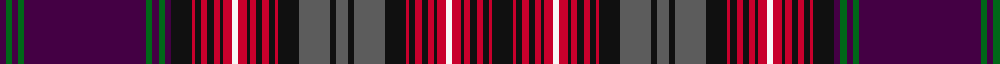

In pattern [BGBGBGBGBKRKRKRKRWRKRKRKRKBKBKBKRKRKRKRWRKRKRKRK](/patterns/bgbgbgbgbkrkrkrkrwrkrkrkrkbkbkbkrkrkrkrwrkrkrkrk/).

This was sourced from register-of-tartans.  It is a [48 stripes tartan](/stripes/stripes48/).

Original link https://www.tartanregister.gov.uk/tartanDetails.aspx?ref=1865

## Register references

External register numbers recorded for this tartan.

- Scottish Register of Tartans: [1865](https://www.tartanregister.gov.uk/tartanDetails.aspx?ref=1865)
- Scottish Tartans Authority (ITI): 4088

## Thread count
DP/4 G4 DP4 G4 DP80 G4 DP4 G4 DP4 K14 R2 K4 R4 K4 R4 K2 R6 W4 R6 K2 R4 K4 R4 K4 R2 K14 N20 K4 N8 K4 N20 K14 R2 K4 R4 K4 R4 K2 R6 W4 R6 K2 R4 K4 R4 K4 R2 K/14

## Palette
Each colour and its ΔE from the base-6 reference it is a variant of.

| Colour | Shade | Base | ΔE (OKLab) |
|---|---|---|---|
| DP | <code style="background-color:#440044;">#440044</code> `#440044` | B <code style="background-color:#2A418A;">#2A418A</code> | 0.18 |
| G | <code style="background-color:#006818;">#006818</code> `#006818` | G <code style="background-color:#006100;">#006100</code> | 0.02 |
| K | <code style="background-color:#101010;">#101010</code> `#101010` | K <code style="background-color:#000000;">#000000</code> | 0.17 |
| LN | <code style="background-color:#E0E0E0;">#E0E0E0</code> `#E0E0E0` | W <code style="background-color:#F7F7F7;">#F7F7F7</code> | 0.07 |
| N | <code style="background-color:#5C5C5C;">#5C5C5C</code> `#5C5C5C` | B <code style="background-color:#2A418A;">#2A418A</code> | 0.15 |
| R | <code style="background-color:#C8002C;">#C8002C</code> `#C8002C` | R <code style="background-color:#CC0000;">#CC0000</code> | 0.03 |
| W | <code style="background-color:#F8F8F8;">#F8F8F8</code> `#F8F8F8` | W <code style="background-color:#F7F7F7;">#F7F7F7</code> | 0.00 |

## Nearest tartans

The nearest existing variants by ΔTartan distance.

1. [Unnamed C18th - Hynde Cotton Plaid](/setts/s45/w2b1r3ra7g7r2b1r2g7r41b40w2r4ra4r1ra1r1ra4r4g15r4ra4r1ra1r1ra4r4w2k40r3g36r5ra5r1ra5r5b38r40g16w2r8ra8r3ra2r1~b202060-g285800-k101010-rc80000-raa00048-wfcfcfc~x2/) — ΔT 1.05
1. [Canadian Confederation (Commemorat)](/setts/s38/r24w4r24k4g6b26g1b1g1b1g1b1g1b1g1b1g1b1g8k24r12k4b20k1b1k1b1k1b1k1b1k1b1k1b1k8r8b16~b1c0070-g006818-k101010-rc80000-wfcfcfc/) — ΔT 1.54
1. [Unidentified #52](/setts/s48/b18k6b36k34r1k6r4k4r6k2r7w3r7k2r6k4r4k6r1k34ba10g8ba8g10ba96g10ba8g8ba10k34r1k6r4k4r6k2r7w3r7k2r6k4r4k6r1k34b36k6~b788ccc-ba8c008c-g48783c-k000000-rc80000-wfcfcfc~x2/) — ΔT 1.67
1. [Highland Mist Corporate Tartan Tartan Number: 4585. Earliest known date: 2002 Designed by Claire Donaldson of House of Edgar for Harrisons of Hamilton for their sole use in their retail outlet and kilt hire operation. Very difficult to match colours. The black shown here should be a very dark blue verging on black. See products available Copyright © Blair Urquhart, Comrie, 2015](/setts/s45/b2g3ba1g2y1g2k2ba1y2ba3g1ba2r1ba2b2g3ba1g2y1g2k2r1b2r1b30g3ba1g2y1g2k1ba2g1ba2r1ba2b2k28ba1y2ba3g1ba2r1ba2~b003c64-ba780078-g006818-k00002c-r800028-ybc8c00~x2/) — ΔT 1.71
1. [Unidentified Cant #13](/setts/s34/r44ra4b16r4ra6b8ra6r6b2r4b2r4b2r6w1g24ba6w1ba6g24w1r6b2r4b2r4b2r6ra6b8ra6r4b16ra4~b2c2c80-ba2888c4-g006818-rc80000-ra9c68a4-we0e0e0~x2/) — ΔT 1.78
1. [Canadian Confederation Canadian Tartan Tartan Number: 1964. Earliest known date: pre 2003 Re-do this sett to make 12 single thread strips where 8 exist here. See products available Copyright © Blair Urquhart, Comrie, 2015](/setts/s30/k8r8b16r24w4r24k4g6b26g1b1g1b1g1b1g1b1g8k24r12k4b20k1b1k1b1k1b1k1b1~b2c2c80-g006818-k101010-rc80000-we0e0e0/) — ΔT 1.80
1. [Leith (Hay)](/setts/s44/k14r4y4k8r70b8r3y3r8b64r3k63w3g64r8y3r3g8r70k8y4r4k14r4y4k8r70g8r3y3r8g64w3k63r3b64r8y3r3b8r70k8y4r4~b440044-g006818-k101010-rc80000-we0e0e0-ye8c000/) — ΔT 1.83
1. [Hay & Leith #2](/setts/s42/k7r3y2r60g7r2y2r7g50w2k50r2b50r7y2r2b7r60k7y2r3k7r3y2k7r60b7r2y2r7b50r2k50w2g50r7y2r2g7r60y2r3~b003c64-g006818-k101010-rc80000-wfcfcfc-ye8c000/) — ΔT 1.86
1. [Highland Mist](/setts/s45/b2g3ba1g2y1g2bb2ba1y2ba3g1ba2r1ba2b2g3ba1g2y1g2bb2r1b2r1b30g3ba1g2y1g2bb1ba2g1ba2r1ba2b2bb28ba1y2ba3g1ba2r1ba2~b003c64-ba780078-bb1c1c1c-g006818-r800028-ybc8c00~x2/) — ΔT 1.88
1. [Isle of Arran (Lochcarron) (Fashion)](/setts/s25/b40g2b2g2b2k7r1k2r2k2r2k1r3k2r3k1r2k2r2k2r1k7r10k2r4~b440044-g006818-k101010-rc8002c~x2/) — ΔT 1.89

## Neighbour map

Every grey dot is one of 15726 variants placed by the first two principal components of the ΔTartan feature space (44% of its variance). Red is this tartan; blue dots are its nearest — click one to open its page.

<svg viewBox="0 0 640 380" role="img" style="max-width:100%;height:auto;border:1px solid #e0e0e0;border-radius:4px;display:block" xmlns="http://www.w3.org/2000/svg"><image href="/nn/cloud.v1.png" width="640" height="380"/><a href="/setts/s45/w2b1r3ra7g7r2b1r2g7r41b40w2r4ra4r1ra1r1ra4r4g15r4ra4r1ra1r1ra4r4w2k40r3g36r5ra5r1ra5r5b38r40g16w2r8ra8r3ra2r1~b202060-g285800-k101010-rc80000-raa00048-wfcfcfc~x2/"><circle cx="190.8" cy="14.0" r="4" fill="#3465a4"><title>Unnamed C18th - Hynde Cotton Plaid</title></circle></a><a href="/setts/s38/r24w4r24k4g6b26g1b1g1b1g1b1g1b1g1b1g1b1g8k24r12k4b20k1b1k1b1k1b1k1b1k1b1k1b1k8r8b16~b1c0070-g006818-k101010-rc80000-wfcfcfc/"><circle cx="196.1" cy="37.5" r="4" fill="#3465a4"><title>Canadian Confederation (Commemorat)</title></circle></a><a href="/setts/s48/b18k6b36k34r1k6r4k4r6k2r7w3r7k2r6k4r4k6r1k34ba10g8ba8g10ba96g10ba8g8ba10k34r1k6r4k4r6k2r7w3r7k2r6k4r4k6r1k34b36k6~b788ccc-ba8c008c-g48783c-k000000-rc80000-wfcfcfc~x2/"><circle cx="172.4" cy="14.0" r="4" fill="#3465a4"><title>Unidentified #52</title></circle></a><a href="/setts/s45/b2g3ba1g2y1g2k2ba1y2ba3g1ba2r1ba2b2g3ba1g2y1g2k2r1b2r1b30g3ba1g2y1g2k1ba2g1ba2r1ba2b2k28ba1y2ba3g1ba2r1ba2~b003c64-ba780078-g006818-k00002c-r800028-ybc8c00~x2/"><circle cx="175.7" cy="14.0" r="4" fill="#3465a4"><title>Highland Mist Corporate Tartan Tartan Number: 4585. Earliest known date: 2002 Designed by Claire Donaldson of House of Edgar for Harrisons of Hamilton for their sole use in their retail outlet and kilt hire operation. Very difficult to match colours. The black shown here should be a very dark blue verging on black. See products available Copyright © Blair Urquhart, Comrie, 2015</title></circle></a><a href="/setts/s34/r44ra4b16r4ra6b8ra6r6b2r4b2r4b2r6w1g24ba6w1ba6g24w1r6b2r4b2r4b2r6ra6b8ra6r4b16ra4~b2c2c80-ba2888c4-g006818-rc80000-ra9c68a4-we0e0e0~x2/"><circle cx="205.9" cy="20.7" r="4" fill="#3465a4"><title>Unidentified Cant #13</title></circle></a><a href="/setts/s30/k8r8b16r24w4r24k4g6b26g1b1g1b1g1b1g1b1g8k24r12k4b20k1b1k1b1k1b1k1b1~b2c2c80-g006818-k101010-rc80000-we0e0e0/"><circle cx="199.5" cy="57.8" r="4" fill="#3465a4"><title>Canadian Confederation Canadian Tartan Tartan Number: 1964. Earliest known date: pre 2003 Re-do this sett to make 12 single thread strips where 8 exist here. See products available Copyright © Blair Urquhart, Comrie, 2015</title></circle></a><a href="/setts/s44/k14r4y4k8r70b8r3y3r8b64r3k63w3g64r8y3r3g8r70k8y4r4k14r4y4k8r70g8r3y3r8g64w3k63r3b64r8y3r3b8r70k8y4r4~b440044-g006818-k101010-rc80000-we0e0e0-ye8c000/"><circle cx="189.7" cy="18.9" r="4" fill="#3465a4"><title>Leith (Hay)</title></circle></a><a href="/setts/s42/k7r3y2r60g7r2y2r7g50w2k50r2b50r7y2r2b7r60k7y2r3k7r3y2k7r60b7r2y2r7b50r2k50w2g50r7y2r2g7r60y2r3~b003c64-g006818-k101010-rc80000-wfcfcfc-ye8c000/"><circle cx="217.8" cy="14.0" r="4" fill="#3465a4"><title>Hay &amp; Leith #2</title></circle></a><a href="/setts/s45/b2g3ba1g2y1g2bb2ba1y2ba3g1ba2r1ba2b2g3ba1g2y1g2bb2r1b2r1b30g3ba1g2y1g2bb1ba2g1ba2r1ba2b2bb28ba1y2ba3g1ba2r1ba2~b003c64-ba780078-bb1c1c1c-g006818-r800028-ybc8c00~x2/"><circle cx="199.8" cy="14.0" r="4" fill="#3465a4"><title>Highland Mist</title></circle></a><a href="/setts/s25/b40g2b2g2b2k7r1k2r2k2r2k1r3k2r3k1r2k2r2k2r1k7r10k2r4~b440044-g006818-k101010-rc8002c~x2/"><circle cx="281.3" cy="20.8" r="4" fill="#3465a4"><title>Isle of Arran (Lochcarron) (Fashion)</title></circle></a><circle cx="190.2" cy="14.0" r="5" fill="#c00000"/></svg>

ID: /setts/s48/k7r1k2r2k2r2k1r3w2r3k1r2k2r2k2r1k7b10k2b4k2b10k7r1k2r2k2r2k1r3w2r3k1r2k2r2k2r1k7ba2g2ba2g2ba40g2ba2g2ba2~b5c5c5c-ba440044-g006818-k101010-rc8002c-wf8f8f8~x2/
