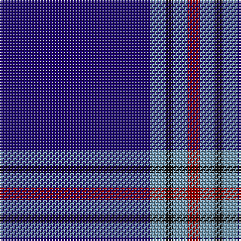

In pattern [BBKBR](/patterns/bbkbr/).

This was sourced from tartans-authority.  It is a [5 stripes tartan](/stripes/stripes5/).

Original link http://www.tartansauthority.com/tartan-ferret/display/10028/

## Thread count
DB/100 B10 K5 B10 DR/8

## Palette
Each colour and its ΔE from the base-6 reference it is a variant of.

| Colour | Shade | Base | ΔE (OKLab) |
|---|---|---|---|
| B | <code style="background-color:#7098B0;">#7098B0</code> `#7098B0` | B <code style="background-color:#2A418A;">#2A418A</code> | 0.27 |
| DB | <code style="background-color:#1C0070;">#1C0070</code> `#1C0070` | B <code style="background-color:#2A418A;">#2A418A</code> | 0.14 |
| DR | <code style="background-color:#980000;">#980000</code> `#980000` | R <code style="background-color:#CC0000;">#CC0000</code> | 0.11 |
| K | <code style="background-color:#101010;">#101010</code> `#101010` | K <code style="background-color:#000000;">#000000</code> | 0.17 |

# Sample pattern

## Nearest tartans

The nearest existing variants by ΔTartan distance.

1. [Waugh](/setts/s5/b100g10k5g10r8~b000080-g65909a-k000000-rb22222/) — ΔT 0.78
1. [McCallie](/setts/s4/r2k6b33w2~b2c2c80-k101010-rc80000-wfcfcfc~x4/) — ΔT 0.91
1. [French Freemasons' Pride (Fashion)](/setts/s6/b128r8ba41bb4ba4bb4~b1c0070-ba2888c4-bb5c5c5c-r901c38/) — ΔT 1.33
1. [Lochcarron (1985)](/setts/s5/b12w1k2b1r1~b000064-k000000-rc80000-wc8c8c8~x8/) — ΔT 1.37
1. [Steffen, Morris (Personal)](/setts/s6/b35w4b10r3ra3r3~b2c2c80-r901c38-rac80000-we0e0e0~x4/) — ΔT 1.38
1. [Laidlaw's Highland Drovers (Corp)](/setts/s7/b35k10b4w2b3r2y2~b2c2c80-k101010-rc80000-we0e0e0-ye8c000~x2/) — ΔT 1.42
1. [Inverness Htg (Royal)](/setts/s8/b61r6w2r8y2b3y2b15~b1c0070-r880000-wfcfcfc-yd09800~x2/) — ΔT 1.47
1. [Duke of York (Royal)](/setts/s8/b61r6w2r8y2b3y2b15~b00008c-r8c0000-wfcfcfc-yc88c00~x2/) — ΔT 1.52
1. [JetBlue (Corporate)](/setts/s7/b4w3ba6b40ba8b12g3~b2c2c80-ba1474b4-g289c18-wfcfcfc~x2/) — ΔT 1.52
1. [Marist School, The](/setts/s8/b29ba2b1ba1b1ba1bb8y1~b1c0070-ba2c2c80-bb5c8ca8-yd09800~x4/) — ΔT 1.52

## Neighbour map

Every grey dot is one of 15726 variants placed by the first two principal components of the ΔTartan feature space (44% of its variance). Red is this tartan; blue dots are its nearest — click one to open its page.

<svg viewBox="0 0 640 380" role="img" style="max-width:100%;height:auto;border:1px solid #e0e0e0;border-radius:4px;display:block" xmlns="http://www.w3.org/2000/svg"><image href="/nn/cloud.v1.png" width="640" height="380"/><a href="/setts/s5/b100g10k5g10r8~b000080-g65909a-k000000-rb22222/"><circle cx="498.1" cy="185.9" r="4" fill="#3465a4"><title>Waugh</title></circle></a><a href="/setts/s4/r2k6b33w2~b2c2c80-k101010-rc80000-wfcfcfc~x4/"><circle cx="505.6" cy="207.6" r="4" fill="#3465a4"><title>McCallie</title></circle></a><a href="/setts/s6/b128r8ba41bb4ba4bb4~b1c0070-ba2888c4-bb5c5c5c-r901c38/"><circle cx="478.1" cy="157.6" r="4" fill="#3465a4"><title>French Freemasons' Pride (Fashion)</title></circle></a><a href="/setts/s5/b12w1k2b1r1~b000064-k000000-rc80000-wc8c8c8~x8/"><circle cx="472.5" cy="207.4" r="4" fill="#3465a4"><title>Lochcarron (1985)</title></circle></a><a href="/setts/s6/b35w4b10r3ra3r3~b2c2c80-r901c38-rac80000-we0e0e0~x4/"><circle cx="493.1" cy="199.4" r="4" fill="#3465a4"><title>Steffen, Morris (Personal)</title></circle></a><a href="/setts/s7/b35k10b4w2b3r2y2~b2c2c80-k101010-rc80000-we0e0e0-ye8c000~x2/"><circle cx="450.6" cy="154.3" r="4" fill="#3465a4"><title>Laidlaw's Highland Drovers (Corp)</title></circle></a><a href="/setts/s8/b61r6w2r8y2b3y2b15~b1c0070-r880000-wfcfcfc-yd09800~x2/"><circle cx="559.1" cy="142.9" r="4" fill="#3465a4"><title>Inverness Htg (Royal)</title></circle></a><a href="/setts/s8/b61r6w2r8y2b3y2b15~b00008c-r8c0000-wfcfcfc-yc88c00~x2/"><circle cx="548.3" cy="144.0" r="4" fill="#3465a4"><title>Duke of York (Royal)</title></circle></a><a href="/setts/s7/b4w3ba6b40ba8b12g3~b2c2c80-ba1474b4-g289c18-wfcfcfc~x2/"><circle cx="469.0" cy="200.0" r="4" fill="#3465a4"><title>JetBlue (Corporate)</title></circle></a><a href="/setts/s8/b29ba2b1ba1b1ba1bb8y1~b1c0070-ba2c2c80-bb5c8ca8-yd09800~x4/"><circle cx="499.7" cy="142.2" r="4" fill="#3465a4"><title>Marist School, The</title></circle></a><circle cx="509.9" cy="185.0" r="5" fill="#c00000"/></svg>

ID: /setts/s5/b100ba10k5ba10r8~b1c0070-ba7098b0-k101010-r980000/
