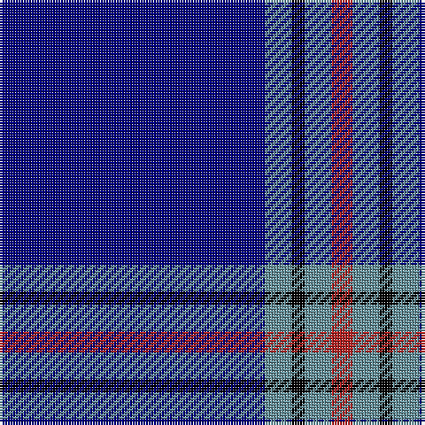

In pattern [BGKGR](/patterns/bgkgr/).

This was sourced from register-of-tartans.  It is a [5 stripes tartan](/stripes/stripes5/).

Original link https://www.tartanregister.gov.uk/tartanDetails.aspx?ref=10028

## Thread count
DB/100 B10 K5 B10 R/8

## Palette
Each colour and its ΔE from the base-6 reference it is a variant of.

| Colour | Shade | Base | ΔE (OKLab) |
|---|---|---|---|
| B | <code style="background-color:#65909A;">#65909A</code> `#65909A` | G <code style="background-color:#006100;">#006100</code> | 0.24 |
| DB | <code style="background-color:#000080;">#000080</code> `#000080` | B <code style="background-color:#2A418A;">#2A418A</code> | 0.14 |
| K | <code style="background-color:#000000;">#000000</code> `#000000` | K <code style="background-color:#000000;">#000000</code> | 0.00 |
| R | <code style="background-color:#B22222;">#B22222</code> `#B22222` | R <code style="background-color:#CC0000;">#CC0000</code> | 0.05 |

# Sample pattern

## Nearest tartans

The nearest existing variants by ΔTartan distance.

1. [Waugh (Name)](/setts/s5/b100ba10k5ba10r8~b1c0070-ba7098b0-k101010-r980000/) — ΔT 0.78
1. [Lochcarron (1985)](/setts/s5/b12w1k2b1r1~b000064-k000000-rc80000-wc8c8c8~x8/) — ΔT 1.29
1. [McCallie](/setts/s4/r2k6b33w2~b2c2c80-k101010-rc80000-wfcfcfc~x4/) — ΔT 1.32
1. [French Freemasons' Pride](/setts/s6/b128r8g41ba4g4ba4~b000080-ba2f4f4f-g5f9ea0-r8b0000/) — ΔT 1.35
1. [French Freemasons' Pride (Fashion)](/setts/s6/b128r8ba41bb4ba4bb4~b1c0070-ba2888c4-bb5c5c5c-r901c38/) — ΔT 1.41
1. [Duke of York (Royal)](/setts/s8/b61r6w2r8y2b3y2b15~b00008c-r8c0000-wfcfcfc-yc88c00~x2/) — ΔT 1.43
1. [Steffen, Markus (Personal)](/setts/s6/b35w4b10r3ra3r3~b00009c-r8b1c62-rab0171f-wffffff~x4/) — ΔT 1.47
1. [Auchairne](/setts/s6/b10ba6b3ba62w4ba5~b8080d0-ba000050-we0e0e0~x2/) — ΔT 1.53
1. [JetBlue (Corporate)](/setts/s7/b4w3ba6b40ba8b12g3~b2c2c80-ba1474b4-g289c18-wfcfcfc~x2/) — ΔT 1.59
1. [RAAF](/setts/s9/b66w2b10w2b10w2b12r3ba24~b1c0070-ba5c8ca8-rc80000-we0e0e0~x2/) — ΔT 1.61

## Neighbour map

Every grey dot is one of 15726 variants placed by the first two principal components of the ΔTartan feature space (44% of its variance). Red is this tartan; blue dots are its nearest — click one to open its page.

<svg viewBox="0 0 640 380" role="img" style="max-width:100%;height:auto;border:1px solid #e0e0e0;border-radius:4px;display:block" xmlns="http://www.w3.org/2000/svg"><image href="/nn/cloud.v1.png" width="640" height="380"/><a href="/setts/s5/b100ba10k5ba10r8~b1c0070-ba7098b0-k101010-r980000/"><circle cx="509.9" cy="185.0" r="4" fill="#3465a4"><title>Waugh (Name)</title></circle></a><a href="/setts/s5/b12w1k2b1r1~b000064-k000000-rc80000-wc8c8c8~x8/"><circle cx="472.5" cy="207.4" r="4" fill="#3465a4"><title>Lochcarron (1985)</title></circle></a><a href="/setts/s4/r2k6b33w2~b2c2c80-k101010-rc80000-wfcfcfc~x4/"><circle cx="505.6" cy="207.6" r="4" fill="#3465a4"><title>McCallie</title></circle></a><a href="/setts/s6/b128r8g41ba4g4ba4~b000080-ba2f4f4f-g5f9ea0-r8b0000/"><circle cx="452.2" cy="151.2" r="4" fill="#3465a4"><title>French Freemasons' Pride</title></circle></a><a href="/setts/s6/b128r8ba41bb4ba4bb4~b1c0070-ba2888c4-bb5c5c5c-r901c38/"><circle cx="478.1" cy="157.6" r="4" fill="#3465a4"><title>French Freemasons' Pride (Fashion)</title></circle></a><a href="/setts/s8/b61r6w2r8y2b3y2b15~b00008c-r8c0000-wfcfcfc-yc88c00~x2/"><circle cx="548.3" cy="144.0" r="4" fill="#3465a4"><title>Duke of York (Royal)</title></circle></a><a href="/setts/s6/b35w4b10r3ra3r3~b00009c-r8b1c62-rab0171f-wffffff~x4/"><circle cx="463.6" cy="196.7" r="4" fill="#3465a4"><title>Steffen, Markus (Personal)</title></circle></a><a href="/setts/s6/b10ba6b3ba62w4ba5~b8080d0-ba000050-we0e0e0~x2/"><circle cx="550.0" cy="190.2" r="4" fill="#3465a4"><title>Auchairne</title></circle></a><a href="/setts/s7/b4w3ba6b40ba8b12g3~b2c2c80-ba1474b4-g289c18-wfcfcfc~x2/"><circle cx="469.0" cy="200.0" r="4" fill="#3465a4"><title>JetBlue (Corporate)</title></circle></a><a href="/setts/s9/b66w2b10w2b10w2b12r3ba24~b1c0070-ba5c8ca8-rc80000-we0e0e0~x2/"><circle cx="492.1" cy="136.3" r="4" fill="#3465a4"><title>RAAF</title></circle></a><circle cx="498.1" cy="185.9" r="5" fill="#c00000"/></svg>

ID: /setts/s5/b100g10k5g10r8~b000080-g65909a-k000000-rb22222/
