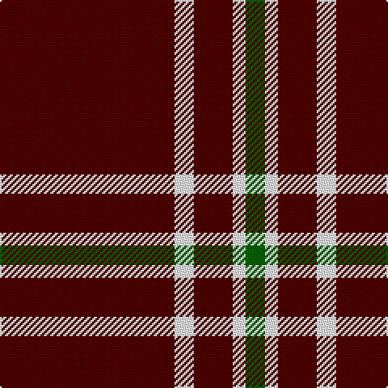

In pattern [BWBWG](/patterns/bwbwg/).

This was sourced from register-of-tartans.  It is a [5 stripes tartan](/stripes/stripes5/).

Original link https://www.tartanregister.gov.uk/tartanDetails.aspx?ref=10481

## Thread count
DR/108 W12 DR24 W8 G/12

## Palette
Each colour and its ΔE from the base-6 reference it is a variant of.

| Colour | Shade | Base | ΔE (OKLab) |
|---|---|---|---|
| DR | <code style="background-color:#500000;">#500000</code> `#500000` | B <code style="background-color:#2C4084;">#2C4084</code> | 0.23 |
| G | <code style="background-color:#006400;">#006400</code> `#006400` | G <code style="background-color:#006400;">#006400</code> | 0.00 |
| W | <code style="background-color:#FFFFFF;">#FFFFFF</code> `#FFFFFF` | W <code style="background-color:#F4F4F0;">#F4F4F0</code> | 0.03 |

# Sample pattern

ID: /setts/s5/b108w12b24w8g12-b500000-g006400-wffffff/
