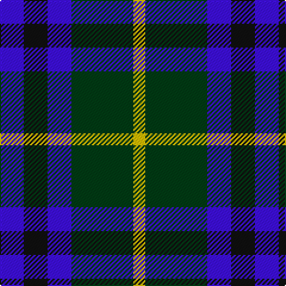

**Bands:** [YGBKB](/stripes/ygbkb/) · **Stripes:** [LY DG B K B](/stripes/stripes5/) LY DG B K B

This was sourced from register-of-tartans.  It is a [5 band tartan](/bands/bands5/).

Original link https://www.tartanregister.gov.uk/tartanDetails.aspx?ref=2840

## Register references

External register numbers recorded for this tartan.

- Scottish Register of Tartans: [2840](https://www.tartanregister.gov.uk/tartanDetails.aspx?ref=2840)
- Scottish Tartans World Register: 2976

## Thread count
B/20 K20 B20 DG52 Y/10

## Palette
Each colour and its ΔE from the base-6 reference it is a variant of.

| Colour | Shade | Base | ΔE (OKLab) |
|---|---|---|---|
| B | <code style="background-color:#3F0FFE;">#3F0FFE</code> `#3F0FFE` | B <code style="background-color:#2A418A;">#2A418A</code> | 0.19 |
| DG | <code style="background-color:#003C14;">#003C14</code> `#003C14` | G <code style="background-color:#006100;">#006100</code> | 0.13 |
| K | <code style="background-color:#101010;">#101010</code> `#101010` | K <code style="background-color:#000000;">#000000</code> | 0.17 |
| Y | <code style="background-color:#E8C000;">#E8C000</code> `#E8C000` | Y <code style="background-color:#F2BF00;">#F2BF00</code> | 0.02 |

# Sample pattern

## Nearest tartans

The nearest existing variants by ΔTartan distance.

1. [Tilburg (District)](/setts/s5/db9ly9db9t23r3~x2/) — ΔT 1.18
1. [Frobo Nairn](/setts/s5/r2db9k5g6db1~x4/) — ΔT 1.19
1. [Herd/Hurd](/setts/s6/db3g12k13w2db13w3~x2/) — ΔT 1.22
1. [Douglas](/setts/s5/k2lb2dg8db8lb1/) — ΔT 1.29
1. [Raven (Fashion)](/setts/s4/k19db18w9r3~x4/) — ΔT 1.31
1. [Hawick Rugby Club (Corporate)](/setts/s6/db2ly1db7w1k7w2~x6/) — ΔT 1.34
1. [Falconer](/setts/s5/b3k4b4g9k2~x4/) — ΔT 1.35
1. [St. Johnstone F.C. (Sports)](/setts/s7/k6lb3k8db7lo2db7lb1~x4/) — ΔT 1.36
1. [Douglas Green](/setts/s5/k4lb2dg8db8lb1/) — ΔT 1.39
1. [Black Watch (Pendleton)](/setts/s6/b3k2b8db8g8db2~x2/) — ΔT 1.40

## Neighbour map

Every grey dot is one of 14299 variants placed by the first two principal components of the ΔTartan feature space (44% of its variance). Red is this tartan; blue dots are its nearest — click one to open its page.

<svg viewBox="0 0 640 380" role="img" style="max-width:100%;height:auto;border:1px solid #e0e0e0;border-radius:4px;display:block" xmlns="http://www.w3.org/2000/svg"><image href="/nn/cloud.v1.png" width="640" height="380"/><a href="/setts/s5/db9ly9db9t23r3~x2/"><circle cx="194.6" cy="245.3" r="4" fill="#3465a4"><title>Tilburg (District)</title></circle></a><a href="/setts/s5/r2db9k5g6db1~x4/"><circle cx="186.4" cy="247.5" r="4" fill="#3465a4"><title>Frobo Nairn</title></circle></a><a href="/setts/s6/db3g12k13w2db13w3~x2/"><circle cx="126.3" cy="236.3" r="4" fill="#3465a4"><title>Herd/Hurd</title></circle></a><a href="/setts/s5/k2lb2dg8db8lb1/"><circle cx="168.2" cy="233.3" r="4" fill="#3465a4"><title>Douglas</title></circle></a><a href="/setts/s4/k19db18w9r3~x4/"><circle cx="146.2" cy="260.9" r="4" fill="#3465a4"><title>Raven (Fashion)</title></circle></a><a href="/setts/s6/db2ly1db7w1k7w2~x6/"><circle cx="197.2" cy="217.3" r="4" fill="#3465a4"><title>Hawick Rugby Club (Corporate)</title></circle></a><a href="/setts/s5/b3k4b4g9k2~x4/"><circle cx="180.6" cy="295.5" r="4" fill="#3465a4"><title>Falconer</title></circle></a><a href="/setts/s7/k6lb3k8db7lo2db7lb1~x4/"><circle cx="180.7" cy="242.7" r="4" fill="#3465a4"><title>St. Johnstone F.C. (Sports)</title></circle></a><a href="/setts/s5/k4lb2dg8db8lb1/"><circle cx="135.9" cy="243.1" r="4" fill="#3465a4"><title>Douglas Green</title></circle></a><a href="/setts/s6/b3k2b8db8g8db2~x2/"><circle cx="129.8" cy="281.3" r="4" fill="#3465a4"><title>Black Watch (Pendleton)</title></circle></a><circle cx="157.7" cy="263.9" r="5" fill="#c00000"/></svg>

ID: /setts/s5/b10k10b10dg26ly5~x2/
