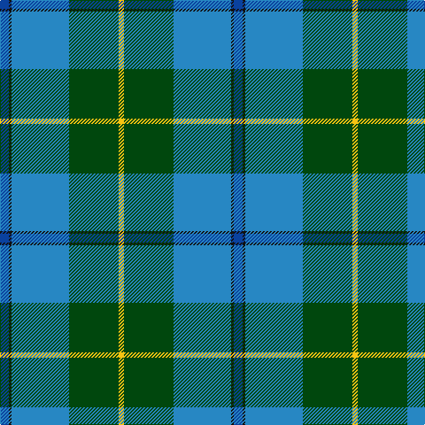

In pattern [BKBGY](/patterns/bkbgy/).

This was sourced from register-of-tartans.  It is a [5 stripes tartan](/stripes/stripes5/).

Original link https://www.tartanregister.gov.uk/tartanDetails.aspx?ref=10334

## Thread count
Ba/10 K3 B65 DG56 Y/6

## Palette
Each colour and its ΔE from the base-6 reference it is a variant of.

| Colour | Shade | Base | ΔE (OKLab) |
|---|---|---|---|
| B | <code style="background-color:#2787C3;">#2787C3</code> `#2787C3` | B <code style="background-color:#2C4084;">#2C4084</code> | 0.21 |
| Ba | <code style="background-color:#0A419E;">#0A419E</code> `#0A419E` | B <code style="background-color:#2C4084;">#2C4084</code> | 0.05 |
| DG | <code style="background-color:#00470D;">#00470D</code> `#00470D` | G <code style="background-color:#006400;">#006400</code> | 0.10 |
| K | <code style="background-color:#101010;">#101010</code> `#101010` | K <code style="background-color:#000000;">#000000</code> | 0.17 |
| Y | <code style="background-color:#F7C413;">#F7C413</code> `#F7C413` | Y <code style="background-color:#E8C000;">#E8C000</code> | 0.03 |

# Sample pattern

ID: /setts/s5/b10k3ba65g56y6-b0a419e-ba2787c3-g00470d-k101010-yf7c413/
