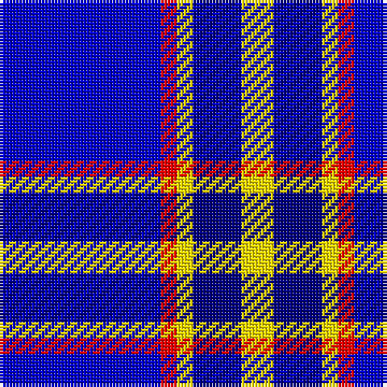

In pattern [BRYBY](/patterns/bryby/).

This was sourced from register-of-tartans.  It is a [5 stripes tartan](/stripes/stripes5/).

Original link https://www.tartanregister.gov.uk/tartanDetails.aspx?ref=10477

## Thread count
B/50 R5 Y5 DB15 Y/10

## Palette
Each colour and its ΔE from the base-6 reference it is a variant of.

| Colour | Shade | Base | ΔE (OKLab) |
|---|---|---|---|
| B | <code style="background-color:#0000CD;">#0000CD</code> `#0000CD` | B <code style="background-color:#2A418A;">#2A418A</code> | 0.14 |
| DB | <code style="background-color:#000080;">#000080</code> `#000080` | B <code style="background-color:#2A418A;">#2A418A</code> | 0.14 |
| R | <code style="background-color:#FF0000;">#FF0000</code> `#FF0000` | R <code style="background-color:#CC0000;">#CC0000</code> | 0.11 |
| Y | <code style="background-color:#FFE600;">#FFE600</code> `#FFE600` | Y <code style="background-color:#F2BF00;">#F2BF00</code> | 0.10 |

# Sample pattern

## Nearest tartans

The nearest existing variants by ΔTartan distance.

1. [Hannah (Personal)](/setts/s6/w2b35k9w3k9y2~b003df5-k101010-wffffff-yffe600~x2/) — ΔT 1.08
1. [Kinding](/setts/s7/k10b30g3b3g3b3r6~b0000cd-g00af33-k101010-rc82536~x2/) — ΔT 1.28
1. [Douglas Variation](/setts/s6/w4b25ba25b2ba5w2~b080848-ba0596fa-we0e0e0~x2/) — ΔT 1.45
1. [Brazell (Personal)](/setts/s5/b7y1b7ba11r2~b000064-ba0596fa-rdc0000-ye8c000~x6/) — ΔT 1.50
1. [International Police Association (IPA 2010)](/setts/s7/b14r6b52w4b4w51y8~b0000cd-rcd0000-w00b2ee-yffe600/) — ΔT 1.55
1. [Douglas, Variation](/setts/s6/w4b25ba25b2ba5w2~b000050-ba8080d0-we0e0e0~x2/) — ΔT 1.58
1. [Doten (2013)](/setts/s5/r14w6b38k3g2~b0000cd-g006400-k101010-rff0000-wffffff~x2/) — ΔT 1.65
1. [Auto Docs](/setts/s8/b30ba2k9w3b6w4k3ba6~b000080-ba2c4084-k101010-wffffff~x2/) — ΔT 1.73
1. [Instakilt, Blue (Fashion)](/setts/s7/b8w4b50k12b4k15r5~b6840fc-k101010-re40018-wf8f8f8~x2/) — ΔT 1.77
1. [Immanuel Presbyterian Church (Milwaukee)](/setts/s8/k3r2k14w2b6w2b16w3~b0000cd-k101010-rff0000-w82cffd~x2/) — ΔT 1.79

## Neighbour map

Every grey dot is one of 15726 variants placed by the first two principal components of the ΔTartan feature space (44% of its variance). Red is this tartan; blue dots are its nearest — click one to open its page.

<svg viewBox="0 0 640 380" role="img" style="max-width:100%;height:auto;border:1px solid #e0e0e0;border-radius:4px;display:block" xmlns="http://www.w3.org/2000/svg"><image href="/nn/cloud.v1.png" width="640" height="380"/><a href="/setts/s6/w2b35k9w3k9y2~b003df5-k101010-wffffff-yffe600~x2/"><circle cx="317.2" cy="165.6" r="4" fill="#3465a4"><title>Hannah (Personal)</title></circle></a><a href="/setts/s7/k10b30g3b3g3b3r6~b0000cd-g00af33-k101010-rc82536~x2/"><circle cx="323.0" cy="191.5" r="4" fill="#3465a4"><title>Kinding</title></circle></a><a href="/setts/s6/w4b25ba25b2ba5w2~b080848-ba0596fa-we0e0e0~x2/"><circle cx="270.4" cy="203.2" r="4" fill="#3465a4"><title>Douglas Variation</title></circle></a><a href="/setts/s5/b7y1b7ba11r2~b000064-ba0596fa-rdc0000-ye8c000~x6/"><circle cx="238.0" cy="231.1" r="4" fill="#3465a4"><title>Brazell (Personal)</title></circle></a><a href="/setts/s7/b14r6b52w4b4w51y8~b0000cd-rcd0000-w00b2ee-yffe600/"><circle cx="267.5" cy="179.4" r="4" fill="#3465a4"><title>International Police Association (IPA 2010)</title></circle></a><a href="/setts/s6/w4b25ba25b2ba5w2~b000050-ba8080d0-we0e0e0~x2/"><circle cx="279.5" cy="201.0" r="4" fill="#3465a4"><title>Douglas, Variation</title></circle></a><a href="/setts/s5/r14w6b38k3g2~b0000cd-g006400-k101010-rff0000-wffffff~x2/"><circle cx="307.4" cy="151.9" r="4" fill="#3465a4"><title>Doten (2013)</title></circle></a><a href="/setts/s8/b30ba2k9w3b6w4k3ba6~b000080-ba2c4084-k101010-wffffff~x2/"><circle cx="297.3" cy="169.6" r="4" fill="#3465a4"><title>Auto Docs</title></circle></a><a href="/setts/s7/b8w4b50k12b4k15r5~b6840fc-k101010-re40018-wf8f8f8~x2/"><circle cx="348.9" cy="173.9" r="4" fill="#3465a4"><title>Instakilt, Blue (Fashion)</title></circle></a><a href="/setts/s8/k3r2k14w2b6w2b16w3~b0000cd-k101010-rff0000-w82cffd~x2/"><circle cx="205.1" cy="199.5" r="4" fill="#3465a4"><title>Immanuel Presbyterian Church (Milwaukee)</title></circle></a><circle cx="279.7" cy="200.1" r="5" fill="#c00000"/></svg>

ID: /setts/s5/b10r1y1ba3y2~b0000cd-ba000080-rff0000-yffe600~x5/
