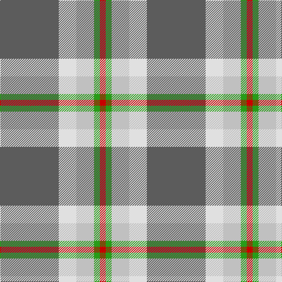

In pattern [BWWGR](/patterns/bwwgr/).

This was sourced from tartans-authority.  It is a [5 stripes tartan](/stripes/stripes5/).

Original link http://www.tartansauthority.com/tartan-ferret/display/10773/

## Thread count
N/100 LN30 Na30 G10 R/10

## Palette
Each colour and its ΔE from the base-6 reference it is a variant of.

| Colour | Shade | Base | ΔE (OKLab) |
|---|---|---|---|
| G | <code style="background-color:#289C18;">#289C18</code> `#289C18` | G <code style="background-color:#006100;">#006100</code> | 0.19 |
| LN | <code style="background-color:#E0E0E0;">#E0E0E0</code> `#E0E0E0` | W <code style="background-color:#F7F7F7;">#F7F7F7</code> | 0.07 |
| N | <code style="background-color:#5C5C5C;">#5C5C5C</code> `#5C5C5C` | B <code style="background-color:#2A418A;">#2A418A</code> | 0.15 |
| Na | <code style="background-color:#C0C0C0;">#C0C0C0</code> `#C0C0C0` | W <code style="background-color:#F7F7F7;">#F7F7F7</code> | 0.17 |
| R | <code style="background-color:#C80000;">#C80000</code> `#C80000` | R <code style="background-color:#CC0000;">#CC0000</code> | 0.01 |

# Sample pattern

## Nearest tartans

The nearest existing variants by ΔTartan distance.

1. [Bagpipe Shop (Switzerland)](/setts/s5/b10w3y3g1r1x10~b646464-g4ca412-rff0000-wf8f4d0-ya4a8a8/) — ΔT 0.28
1. [Celtic Norse Heritage Society](/setts/s5/r10k1b3g3y1x6~b2c2c80-g006818-k101010-r888888-yfccc00/) — ΔT 0.81
1. [S.I.D.E. (Corporate)](/setts/s5/y15r9b30w3ba4x2~b5c8ca8-ba2c2c80-rc80000-we0e0e0-ye8c000/) — ΔT 0.82
1. [Celtic Norse Heritage Society](/setts/s5/r10k1b3g3y1x6~b00008c-g289c18-k101010-r888888-yffe600/) — ΔT 0.98
1. [Roseberry (Name)](/setts/s6/w8b30g5w3ba8r5~b5c8ca8-ba2c2c80-g289c18-rc80000-we0e0e0/) — ΔT 1.13
1. [Manx Laxey](/setts/s6/b4g16y2ba7b28w4x2~b8080d0-ba800080-g008000-we0e0e0-yf0c000/) — ΔT 1.28
1. [Manx Laxey (Blue)](/setts/s6/b4g16y2ba7b28w4x2~b6098b4-ba780078-g005834-we0e0e0-ye8c000/) — ΔT 1.30
1. [Tiree Grey](/setts/s6/w3k3w3k3r15ra1x4~k101010-r888888-ra880000-wc0c0c0/) — ΔT 1.37
1. [Dundhuin Dress (Personal)](/setts/s5/r62b17y12g8ga8x2~b5f749c-g649848-ga23321b-r905966-yf8e38c/) — ΔT 1.38
1. [Kyle Tartan Tartan Number: 1288. Earliest known date: pre 1984 Seen in Service Station at Gretna Green in 1984 by Angela Nisbett MSTS . Berars no relation to the other two Kyles (3615 & 3616). See products available Copyright © Blair Urquhart, Comrie, 2015](/setts/s7/r19k2w4k2b5k2b5x2~b5c5c5c-k101010-r888888-we0e0e0/) — ΔT 1.43

## Neighbour map

Every grey dot is one of 15726 variants placed by the first two principal components of the ΔTartan feature space (44% of its variance). Red is this tartan; blue dots are its nearest — click one to open its page.

<svg viewBox="0 0 640 380" role="img" style="max-width:100%;height:auto;border:1px solid #e0e0e0;border-radius:4px;display:block" xmlns="http://www.w3.org/2000/svg"><image href="/nn/cloud.v1.png" width="640" height="380"/><a href="/setts/s5/b10w3y3g1r1x10~b646464-g4ca412-rff0000-wf8f4d0-ya4a8a8/"><circle cx="276.6" cy="188.7" r="4" fill="#3465a4"><title>Bagpipe Shop (Switzerland)</title></circle></a><a href="/setts/s5/r10k1b3g3y1x6~b2c2c80-g006818-k101010-r888888-yfccc00/"><circle cx="279.7" cy="198.0" r="4" fill="#3465a4"><title>Celtic Norse Heritage Society</title></circle></a><a href="/setts/s5/y15r9b30w3ba4x2~b5c8ca8-ba2c2c80-rc80000-we0e0e0-ye8c000/"><circle cx="229.4" cy="193.2" r="4" fill="#3465a4"><title>S.I.D.E. (Corporate)</title></circle></a><a href="/setts/s5/r10k1b3g3y1x6~b00008c-g289c18-k101010-r888888-yffe600/"><circle cx="258.3" cy="191.0" r="4" fill="#3465a4"><title>Celtic Norse Heritage Society</title></circle></a><a href="/setts/s6/w8b30g5w3ba8r5~b5c8ca8-ba2c2c80-g289c18-rc80000-we0e0e0/"><circle cx="233.7" cy="179.4" r="4" fill="#3465a4"><title>Roseberry (Name)</title></circle></a><a href="/setts/s6/b4g16y2ba7b28w4x2~b8080d0-ba800080-g008000-we0e0e0-yf0c000/"><circle cx="270.1" cy="174.5" r="4" fill="#3465a4"><title>Manx Laxey</title></circle></a><a href="/setts/s6/b4g16y2ba7b28w4x2~b6098b4-ba780078-g005834-we0e0e0-ye8c000/"><circle cx="271.4" cy="179.6" r="4" fill="#3465a4"><title>Manx Laxey (Blue)</title></circle></a><a href="/setts/s6/w3k3w3k3r15ra1x4~k101010-r888888-ra880000-wc0c0c0/"><circle cx="289.5" cy="173.4" r="4" fill="#3465a4"><title>Tiree Grey</title></circle></a><a href="/setts/s5/r62b17y12g8ga8x2~b5f749c-g649848-ga23321b-r905966-yf8e38c/"><circle cx="314.7" cy="207.5" r="4" fill="#3465a4"><title>Dundhuin Dress (Personal)</title></circle></a><a href="/setts/s7/r19k2w4k2b5k2b5x2~b5c5c5c-k101010-r888888-we0e0e0/"><circle cx="253.6" cy="187.9" r="4" fill="#3465a4"><title>Kyle Tartan Tartan Number: 1288. Earliest known date: pre 1984 Seen in Service Station at Gretna Green in 1984 by Angela Nisbett MSTS . Berars no relation to the other two Kyles (3615 &amp; 3616). See products available Copyright © Blair Urquhart, Comrie, 2015</title></circle></a><circle cx="273.4" cy="188.7" r="5" fill="#c00000"/></svg>

ID: /setts/s5/b10w3wa3g1r1x10~b5c5c5c-g289c18-rc80000-we0e0e0-wac0c0c0/
