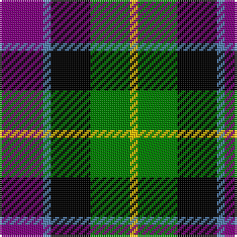

In pattern [BBKGY](/patterns/bbkgy/).

This was sourced from weddslist.  It is a [5 stripes tartan](/stripes/stripes5/).

Original link http://www.weddslist.com/cgi-bin/tartans/pg.pl?source=sts

## Thread count
P/22 B4 K20 G20 Y/4

## Palette
Each colour and its ΔE from the base-6 reference it is a variant of.

| Colour | Shade | Base | ΔE (OKLab) |
|---|---|---|---|
| B | <code style="background-color:#5480B0;">#5480B0</code> `#5480B0` | B <code style="background-color:#2A418A;">#2A418A</code> | 0.19 |
| G | <code style="background-color:#008000;">#008000</code> `#008000` | G <code style="background-color:#006100;">#006100</code> | 0.10 |
| K | <code style="background-color:#000000;">#000000</code> `#000000` | K <code style="background-color:#000000;">#000000</code> | 0.00 |
| P | <code style="background-color:#800080;">#800080</code> `#800080` | B <code style="background-color:#2A418A;">#2A418A</code> | 0.17 |
| Y | <code style="background-color:#F0C000;">#F0C000</code> `#F0C000` | Y <code style="background-color:#F2BF00;">#F2BF00</code> | 0.00 |

# Sample pattern

## Nearest tartans

The nearest existing variants by ΔTartan distance.

1. [Nobiliary Fraternity](/setts/s5/b11ba2k10g10y3~b780078-ba5c8ca8-g006818-k101010-ye8c000~x2/) — ΔT 0.86
1. [Wilson's, No 194](/setts/s6/b3w1k3g5r1k3~b800080-g008000-k000000-rc00000-we0e0e0~x2/) — ΔT 0.89
1. [Thompson's Fancy (Fashion)](/setts/s6/r1g6b2w4k4w1~b1c0070-g604000-k101010-r880000-w98c8e8~x6/) — ΔT 0.94
1. [Birse](/setts/s6/k4g16k14y3b16r4~b304080-g008000-k000000-rc00000-yf0c000~x2/) — ΔT 0.95
1. [MacCaughan, or MacEachain](/setts/s6/b2g6k2ba6k1r2~b800070-ba304080-g008000-k000000-rc00000~x4/) — ΔT 0.97
1. [Cooke](/setts/s7/k6b2ba12g8r5k2g3~b8080d0-ba304080-g008000-k000000-rc00020~x4/) — ΔT 1.02
1. [MacNeil 2](/setts/s6/w2b10k10g9k3w2~b800080-g008000-k000000-we0e0e0~x2/) — ΔT 1.05
1. [Royal Highland](/setts/s6/y4g17k17b17r3b3~b304080-g008000-k000000-rc00000-yb0b0b0~x2/) — ΔT 1.06
1. [Wellington, or Waterloo](/setts/s6/b3g8k9ba7r2ba2~b5480b0-ba304080-g008000-k000000-rc00000~x2/) — ΔT 1.07
1. [Dalmeny](/setts/s5/r4g15k15b15w4~b304080-g008000-k000000-rc00000-we0e0e0~x2/) — ΔT 1.07

## Neighbour map

Every grey dot is one of 15726 variants placed by the first two principal components of the ΔTartan feature space (44% of its variance). Red is this tartan; blue dots are its nearest — click one to open its page.

<svg viewBox="0 0 640 380" role="img" style="max-width:100%;height:auto;border:1px solid #e0e0e0;border-radius:4px;display:block" xmlns="http://www.w3.org/2000/svg"><image href="/nn/cloud.v1.png" width="640" height="380"/><a href="/setts/s5/b11ba2k10g10y3~b780078-ba5c8ca8-g006818-k101010-ye8c000~x2/"><circle cx="85.1" cy="244.9" r="4" fill="#3465a4"><title>Nobiliary Fraternity</title></circle></a><a href="/setts/s6/b3w1k3g5r1k3~b800080-g008000-k000000-rc00000-we0e0e0~x2/"><circle cx="81.7" cy="239.4" r="4" fill="#3465a4"><title>Wilson's, No 194</title></circle></a><a href="/setts/s6/r1g6b2w4k4w1~b1c0070-g604000-k101010-r880000-w98c8e8~x6/"><circle cx="84.6" cy="219.2" r="4" fill="#3465a4"><title>Thompson's Fancy (Fashion)</title></circle></a><a href="/setts/s6/k4g16k14y3b16r4~b304080-g008000-k000000-rc00000-yf0c000~x2/"><circle cx="73.7" cy="229.3" r="4" fill="#3465a4"><title>Birse</title></circle></a><a href="/setts/s6/b2g6k2ba6k1r2~b800070-ba304080-g008000-k000000-rc00000~x4/"><circle cx="90.9" cy="224.1" r="4" fill="#3465a4"><title>MacCaughan, or MacEachain</title></circle></a><a href="/setts/s7/k6b2ba12g8r5k2g3~b8080d0-ba304080-g008000-k000000-rc00020~x4/"><circle cx="78.2" cy="218.1" r="4" fill="#3465a4"><title>Cooke</title></circle></a><a href="/setts/s6/w2b10k10g9k3w2~b800080-g008000-k000000-we0e0e0~x2/"><circle cx="103.6" cy="240.9" r="4" fill="#3465a4"><title>MacNeil 2</title></circle></a><a href="/setts/s6/y4g17k17b17r3b3~b304080-g008000-k000000-rc00000-yb0b0b0~x2/"><circle cx="89.4" cy="223.4" r="4" fill="#3465a4"><title>Royal Highland</title></circle></a><a href="/setts/s6/b3g8k9ba7r2ba2~b5480b0-ba304080-g008000-k000000-rc00000~x2/"><circle cx="53.0" cy="243.8" r="4" fill="#3465a4"><title>Wellington, or Waterloo</title></circle></a><a href="/setts/s5/r4g15k15b15w4~b304080-g008000-k000000-rc00000-we0e0e0~x2/"><circle cx="32.4" cy="258.8" r="4" fill="#3465a4"><title>Dalmeny</title></circle></a><circle cx="76.7" cy="233.7" r="5" fill="#c00000"/></svg>

ID: /setts/s5/b11ba2k10g10y2~b800080-ba5480b0-g008000-k000000-yf0c000~x2/
