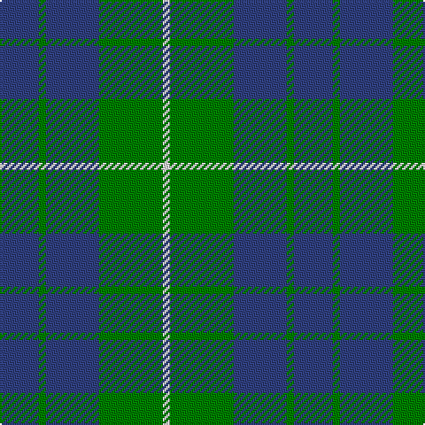

In pattern [BGBGW](/patterns/bgbgw/).

This was sourced from weddslist.  It is a [5 stripes tartan](/stripes/stripes5/).

Original link http://www.weddslist.com/cgi-bin/tartans/pg.pl?source=sts

## Thread count
B/22 G4 B30 G36 LN/4

## Palette
Each colour and its ΔE from the base-6 reference it is a variant of.

| Colour | Shade | Base | ΔE (OKLab) |
|---|---|---|---|
| B | <code style="background-color:#304080;">#304080</code> `#304080` | B <code style="background-color:#2A418A;">#2A418A</code> | 0.02 |
| G | <code style="background-color:#008000;">#008000</code> `#008000` | G <code style="background-color:#006100;">#006100</code> | 0.10 |
| LN | <code style="background-color:#E0E0E0;">#E0E0E0</code> `#E0E0E0` | W <code style="background-color:#F7F7F7;">#F7F7F7</code> | 0.07 |

# Sample pattern

## Nearest tartans

The nearest existing variants by ΔTartan distance.

1. [Unnamed No 78](/setts/s4/b2g7b7w1x2~b304080-g008000-we0e0e0/) — ΔT 0.67
1. [Hamilton, hunting](/setts/s5/b5g2b5g8w1x8~b304080-g008000-we0e0e0/) — ΔT 0.77
1. [Hamilton Hunting Clan Tartan Tartan Number: 139. Earliest known date: pre 2003 Sample presented to the Scottish Tartans Society by Wiebe Stodel. See products available Copyright © Blair Urquhart, Comrie, 2015](/setts/s5/b5g2b5g8w1x8~b2c2c80-g006818-we0e0e0/) — ΔT 0.86
1. [Unidentified, Tweed](/setts/s6/b4w1b12g12b1g4x2~b304080-g008000-we0e0e0/) — ΔT 0.88
1. [Outdoorsmen (Fashion)](/setts/s7/b3k1g4k1b4g9k2x4~b2474e8-g408060-k101010/) — ΔT 1.11
1. [Hamilton Green Hunting](/setts/s5/b8g2b8g15w2x4~b1c0070-g006818-wc0c0c0/) — ΔT 1.19
1. [Unidentified No 78](/setts/s4/b2g7b7w1x2~b2c4084-g005020-we0e0e0/) — ΔT 1.30
1. [Ferguson, (Old)](/setts/s3/g17r2b15x2~b304080-g008000-rc00000/) — ΔT 1.37
1. [MacIntyre Hunting Clan Tartan Tartan Number: 743. Earliest known date: 1800 There is a doublet in Kingussie Museum dated 1800 in this tartan. It also appeared in the Vestiarium Scoticum (1842). See products available Copyright © Blair Urquhart, Comrie, 2015](/setts/s6/g4b12r3b12g32w4x2~b2c2c80-g006818-rc80000-we0e0e0/) — ΔT 1.40
1. [Falconer of Labhdal (Personal)](/setts/s6/b7k7b7g20b2g2x4~b5c8ca8-g009468-k101010/) — ΔT 1.44

## Neighbour map

Every grey dot is one of 15726 variants placed by the first two principal components of the ΔTartan feature space (44% of its variance). Red is this tartan; blue dots are its nearest — click one to open its page.

<svg viewBox="0 0 640 380" role="img" style="max-width:100%;height:auto;border:1px solid #e0e0e0;border-radius:4px;display:block" xmlns="http://www.w3.org/2000/svg"><image href="/nn/cloud.v1.png" width="640" height="380"/><a href="/setts/s4/b2g7b7w1x2~b304080-g008000-we0e0e0/"><circle cx="301.4" cy="287.5" r="4" fill="#3465a4"><title>Unnamed No 78</title></circle></a><a href="/setts/s5/b5g2b5g8w1x8~b304080-g008000-we0e0e0/"><circle cx="282.5" cy="281.7" r="4" fill="#3465a4"><title>Hamilton, hunting</title></circle></a><a href="/setts/s5/b5g2b5g8w1x8~b2c2c80-g006818-we0e0e0/"><circle cx="286.2" cy="283.7" r="4" fill="#3465a4"><title>Hamilton Hunting Clan Tartan Tartan Number: 139. Earliest known date: pre 2003 Sample presented to the Scottish Tartans Society by Wiebe Stodel. See products available Copyright © Blair Urquhart, Comrie, 2015</title></circle></a><a href="/setts/s6/b4w1b12g12b1g4x2~b304080-g008000-we0e0e0/"><circle cx="336.9" cy="241.8" r="4" fill="#3465a4"><title>Unidentified, Tweed</title></circle></a><a href="/setts/s7/b3k1g4k1b4g9k2x4~b2474e8-g408060-k101010/"><circle cx="295.3" cy="243.8" r="4" fill="#3465a4"><title>Outdoorsmen (Fashion)</title></circle></a><a href="/setts/s5/b8g2b8g15w2x4~b1c0070-g006818-wc0c0c0/"><circle cx="279.2" cy="271.4" r="4" fill="#3465a4"><title>Hamilton Green Hunting</title></circle></a><a href="/setts/s4/b2g7b7w1x2~b2c4084-g005020-we0e0e0/"><circle cx="330.5" cy="300.7" r="4" fill="#3465a4"><title>Unidentified No 78</title></circle></a><a href="/setts/s3/g17r2b15x2~b304080-g008000-rc00000/"><circle cx="315.9" cy="307.3" r="4" fill="#3465a4"><title>Ferguson, (Old)</title></circle></a><a href="/setts/s6/g4b12r3b12g32w4x2~b2c2c80-g006818-rc80000-we0e0e0/"><circle cx="303.4" cy="215.1" r="4" fill="#3465a4"><title>MacIntyre Hunting Clan Tartan Tartan Number: 743. Earliest known date: 1800 There is a doublet in Kingussie Museum dated 1800 in this tartan. It also appeared in the Vestiarium Scoticum (1842). See products available Copyright © Blair Urquhart, Comrie, 2015</title></circle></a><a href="/setts/s6/b7k7b7g20b2g2x4~b5c8ca8-g009468-k101010/"><circle cx="293.7" cy="245.3" r="4" fill="#3465a4"><title>Falconer of Labhdal (Personal)</title></circle></a><circle cx="325.8" cy="269.4" r="5" fill="#c00000"/></svg>

ID: /setts/s5/b11g2b15g18w2x2~b304080-g008000-we0e0e0/
