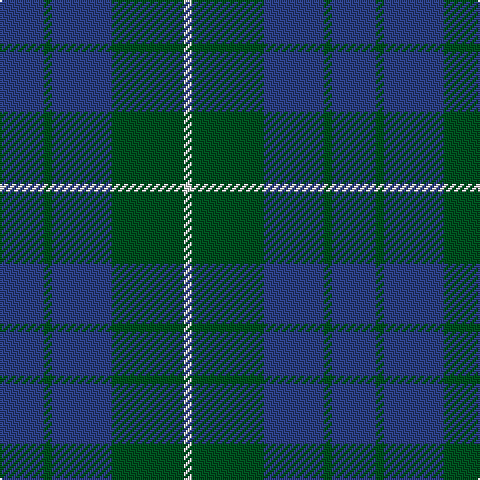

In pattern [BGBGW](/patterns/bgbgw/).

This was sourced from register-of-tartans.  It is a [5 stripes tartan](/stripes/stripes5/).

Original link https://www.tartanregister.gov.uk/tartanDetails.aspx?ref=1578

## Thread count
B/22 G4 B30 G36 LN/4

## Palette
Each colour and its ΔE from the base-6 reference it is a variant of.

| Colour | Shade | Base | ΔE (OKLab) |
|---|---|---|---|
| B | <code style="background-color:#2C4084;">#2C4084</code> `#2C4084` | B <code style="background-color:#2A418A;">#2A418A</code> | 0.01 |
| G | <code style="background-color:#005020;">#005020</code> `#005020` | G <code style="background-color:#006100;">#006100</code> | 0.07 |
| LN | <code style="background-color:#E0E0E0;">#E0E0E0</code> `#E0E0E0` | W <code style="background-color:#F7F7F7;">#F7F7F7</code> | 0.07 |

# Sample pattern

## Nearest tartans

The nearest existing variants by ΔTartan distance.

1. [Unidentified No 78](/setts/s4/b2g7b7w1~b2c4084-g005020-we0e0e0~x2/) — ΔT 0.82
1. [Unidentified Tweed](/setts/s6/b4w1b12g12b1g4~b2c4084-g005020-we0e0e0~x2/) — ΔT 0.96
1. [North Sea Commission](/setts/s5/b9ba3b1ba12y1~b5c8ca8-ba344054-ye8c000~x4/) — ΔT 1.26
1. [Green Highland, The (Fashion)](/setts/s6/b2g15ba3b7g7b2~b000088-ba381c0c-g004800~x4/) — ΔT 1.34
1. [Barclay](/setts/s4/g1b16g16r1~b2c2c80-g006818-rc80000~x2/) — ΔT 1.47
1. [Barclay Htg (Clan)](/setts/s4/g1b16g16r1~b2c2c80-g006818-rc80000~x4/) — ΔT 1.47
1. [Ferguson (Old)](/setts/s3/g17r2b15~b2c4084-g005020-rdc0000~x2/) — ΔT 1.48
1. [Ferguson - 1930 (Old)](/setts/s3/g17r2b15~b2c2c80-g006818-rc80000~x2/) — ΔT 1.51
1. [Omega Delta Sigma, National Veterans Fraternity](/setts/s4/k15b40k9r10~b003c64-k101010-r888888~x2/) — ΔT 1.54
1. [Hamilton, hunting](/setts/s5/b11g2b15g18w2~b304080-g008000-we0e0e0~x2/) — ΔT 1.54

## Neighbour map

Every grey dot is one of 15726 variants placed by the first two principal components of the ΔTartan feature space (44% of its variance). Red is this tartan; blue dots are its nearest — click one to open its page.

<svg viewBox="0 0 640 380" role="img" style="max-width:100%;height:auto;border:1px solid #e0e0e0;border-radius:4px;display:block" xmlns="http://www.w3.org/2000/svg"><image href="/nn/cloud.v1.png" width="640" height="380"/><a href="/setts/s4/b2g7b7w1~b2c4084-g005020-we0e0e0~x2/"><circle cx="330.5" cy="300.7" r="4" fill="#3465a4"><title>Unidentified No 78</title></circle></a><a href="/setts/s6/b4w1b12g12b1g4~b2c4084-g005020-we0e0e0~x2/"><circle cx="383.3" cy="262.2" r="4" fill="#3465a4"><title>Unidentified Tweed</title></circle></a><a href="/setts/s5/b9ba3b1ba12y1~b5c8ca8-ba344054-ye8c000~x4/"><circle cx="396.1" cy="249.5" r="4" fill="#3465a4"><title>North Sea Commission</title></circle></a><a href="/setts/s6/b2g15ba3b7g7b2~b000088-ba381c0c-g004800~x4/"><circle cx="386.5" cy="284.9" r="4" fill="#3465a4"><title>Green Highland, The (Fashion)</title></circle></a><a href="/setts/s4/g1b16g16r1~b2c2c80-g006818-rc80000~x2/"><circle cx="383.0" cy="252.8" r="4" fill="#3465a4"><title>Barclay</title></circle></a><a href="/setts/s4/g1b16g16r1~b2c2c80-g006818-rc80000~x4/"><circle cx="383.0" cy="252.8" r="4" fill="#3465a4"><title>Barclay Htg (Clan)</title></circle></a><a href="/setts/s3/g17r2b15~b2c4084-g005020-rdc0000~x2/"><circle cx="363.8" cy="327.7" r="4" fill="#3465a4"><title>Ferguson (Old)</title></circle></a><a href="/setts/s3/g17r2b15~b2c2c80-g006818-rc80000~x2/"><circle cx="324.4" cy="311.0" r="4" fill="#3465a4"><title>Ferguson - 1930 (Old)</title></circle></a><a href="/setts/s4/k15b40k9r10~b003c64-k101010-r888888~x2/"><circle cx="316.5" cy="316.8" r="4" fill="#3465a4"><title>Omega Delta Sigma, National Veterans Fraternity</title></circle></a><a href="/setts/s5/b11g2b15g18w2~b304080-g008000-we0e0e0~x2/"><circle cx="325.8" cy="269.4" r="4" fill="#3465a4"><title>Hamilton, hunting</title></circle></a><circle cx="363.5" cy="286.3" r="5" fill="#c00000"/></svg>

ID: /setts/s5/b11g2b15g18w2~b2c4084-g005020-we0e0e0~x2/
