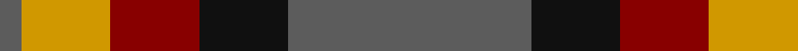
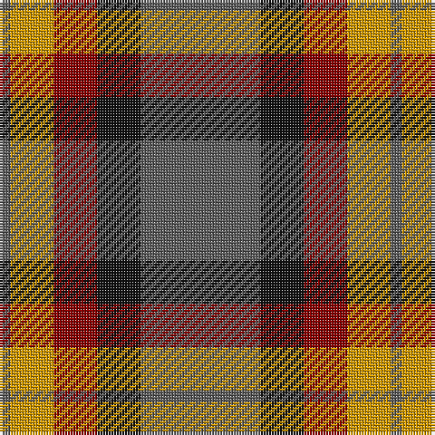

In pattern [BKRYB](/patterns/bkryb/).

This was sourced from register-of-tartans.  It is a [5 stripes tartan](/stripes/stripes5/).

Original link https://www.tartanregister.gov.uk/tartanDetails.aspx?ref=1812

## Attestations

This cloth appears in 2 source records; the oldest owns this page.

- 01/01/1993 — Ikelman #2 (Personal) (register-of-tartans, [record](https://www.tartanregister.gov.uk/tartanDetails.aspx?ref=1812))
- 1993 January — Ikelman #2 (Personal) (tartans-authority, [record](http://www.tartansauthority.com/tartan-ferret/display/2211/))

## Thread count
N/4 DY16 DR16 K16 N/44

## Palette
Each colour and its ΔE from the base-6 reference it is a variant of.

| Colour | Shade | Base | ΔE (OKLab) |
|---|---|---|---|
| DR | <code style="background-color:#880000;">#880000</code> `#880000` | R <code style="background-color:#CC0000;">#CC0000</code> | 0.15 |
| DY | <code style="background-color:#D09800;">#D09800</code> `#D09800` | Y <code style="background-color:#F2BF00;">#F2BF00</code> | 0.12 |
| K | <code style="background-color:#101010;">#101010</code> `#101010` | K <code style="background-color:#000000;">#000000</code> | 0.17 |
| N | <code style="background-color:#5C5C5C;">#5C5C5C</code> `#5C5C5C` | B <code style="background-color:#2A418A;">#2A418A</code> | 0.15 |

# Sample pattern

## Nearest tartans

The nearest existing variants by ΔTartan distance.

1. [Fraser Green](/setts/s6/w2b12g6b1ba6b1x4~b4c0000-ba5c5c5c-g447438-wc0c0c0/) — ΔT 0.81
1. [Dohmen (Personal)](/setts/s4/g30y3b8r25x2~b2c2c80-g006818-ra00000-yfccc00/) — ΔT 0.94
1. [Bronte House Check](/setts/s6/r10g60b13y24b24g8~b2c294f-g6b380d-rfc0fc0-yd4ad7d/) — ΔT 1.04
1. [Eyre (Personal)](/setts/s6/r3b12r4g18r6k2x2~b202060-g006818-k101010-rc80000/) — ΔT 1.11
1. [Strathspey (Fashion)](/setts/s6/g3r22b5g10k10g2x2~b48748c-g006818-k101010-r880000/) — ΔT 1.13
1. [Balfour #2](/setts/s6/b18y2g6y2g19r3x2~b2c2c80-g604000-rc80000-ye8c000/) — ΔT 1.13
1. [Balfour (Clan)](/setts/s6/b18y2g6y2g19r3x4~b2c2c80-g604000-rc80000-ye8c000/) — ΔT 1.13
1. [Canadian Autumn](/setts/s6/g4r28b6g10k10g3x2~b1c0070-g006818-k101010-r880000/) — ΔT 1.14
1. [Bronte House Check (Fashion)](/setts/s6/r10g60b13w24b24g8~b003c64-g604000-re87878-we8ccb8/) — ΔT 1.14
1. [MacNab 7](/setts/s4/g15r3b11ba2x2~b800080-ba5480b0-g008000-rc00000/) — ΔT 1.16

## Neighbour map

Every grey dot is one of 15726 variants placed by the first two principal components of the ΔTartan feature space (44% of its variance). Red is this tartan; blue dots are its nearest — click one to open its page.

<svg viewBox="0 0 640 380" role="img" style="max-width:100%;height:auto;border:1px solid #e0e0e0;border-radius:4px;display:block" xmlns="http://www.w3.org/2000/svg"><image href="/nn/cloud.v1.png" width="640" height="380"/><a href="/setts/s6/w2b12g6b1ba6b1x4~b4c0000-ba5c5c5c-g447438-wc0c0c0/"><circle cx="287.1" cy="210.8" r="4" fill="#3465a4"><title>Fraser Green</title></circle></a><a href="/setts/s4/g30y3b8r25x2~b2c2c80-g006818-ra00000-yfccc00/"><circle cx="261.5" cy="246.2" r="4" fill="#3465a4"><title>Dohmen (Personal)</title></circle></a><a href="/setts/s6/r10g60b13y24b24g8~b2c294f-g6b380d-rfc0fc0-yd4ad7d/"><circle cx="247.7" cy="223.2" r="4" fill="#3465a4"><title>Bronte House Check</title></circle></a><a href="/setts/s6/r3b12r4g18r6k2x2~b202060-g006818-k101010-rc80000/"><circle cx="213.6" cy="222.4" r="4" fill="#3465a4"><title>Eyre (Personal)</title></circle></a><a href="/setts/s6/g3r22b5g10k10g2x2~b48748c-g006818-k101010-r880000/"><circle cx="250.4" cy="222.5" r="4" fill="#3465a4"><title>Strathspey (Fashion)</title></circle></a><a href="/setts/s6/b18y2g6y2g19r3x2~b2c2c80-g604000-rc80000-ye8c000/"><circle cx="295.9" cy="217.3" r="4" fill="#3465a4"><title>Balfour #2</title></circle></a><a href="/setts/s6/b18y2g6y2g19r3x4~b2c2c80-g604000-rc80000-ye8c000/"><circle cx="295.9" cy="217.3" r="4" fill="#3465a4"><title>Balfour (Clan)</title></circle></a><a href="/setts/s6/g4r28b6g10k10g3x2~b1c0070-g006818-k101010-r880000/"><circle cx="266.4" cy="223.9" r="4" fill="#3465a4"><title>Canadian Autumn</title></circle></a><a href="/setts/s6/r10g60b13w24b24g8~b003c64-g604000-re87878-we8ccb8/"><circle cx="230.3" cy="221.4" r="4" fill="#3465a4"><title>Bronte House Check (Fashion)</title></circle></a><a href="/setts/s4/g15r3b11ba2x2~b800080-ba5480b0-g008000-rc00000/"><circle cx="250.4" cy="249.6" r="4" fill="#3465a4"><title>MacNab 7</title></circle></a><circle cx="265.3" cy="230.9" r="5" fill="#c00000"/></svg>

ID: /setts/s5/b11k4r4y4b1x4~b5c5c5c-k101010-r880000-yd09800/
