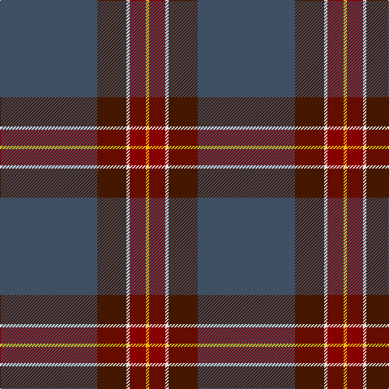

In pattern [BBWRY](/patterns/bbwry/).

This was sourced from tartans-authority.  It is a [5 stripes tartan](/stripes/stripes5/).

Original link http://www.tartansauthority.com/tartan-ferret/display/7875/

## Thread count
N/120 DR36 LN4 DRa20 Y/4

## Palette
Each colour and its ΔE from the base-6 reference it is a variant of.

| Colour | Shade | Base | ΔE (OKLab) |
|---|---|---|---|
| DR | <code style="background-color:#441800;">#441800</code> `#441800` | B <code style="background-color:#2C4084;">#2C4084</code> | 0.22 |
| DRa | <code style="background-color:#880000;">#880000</code> `#880000` | R <code style="background-color:#C80000;">#C80000</code> | 0.14 |
| LN | <code style="background-color:#E0E0E0;">#E0E0E0</code> `#E0E0E0` | W <code style="background-color:#F4F4F0;">#F4F4F0</code> | 0.06 |
| N | <code style="background-color:#405064;">#405064</code> `#405064` | B <code style="background-color:#2C4084;">#2C4084</code> | 0.09 |
| Y | <code style="background-color:#E8C000;">#E8C000</code> `#E8C000` | Y <code style="background-color:#E8C000;">#E8C000</code> | 0.00 |

# Sample pattern

ID: /setts/s5/b120ba36w4r20y4-b405064-ba441800-r880000-we0e0e0-ye8c000/
