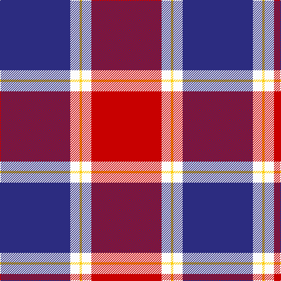

In pattern [BWYWR](/patterns/bwywr/).

This was sourced from tartans-authority.  It is a [5 stripes tartan](/stripes/stripes5/).

Original link http://www.tartansauthority.com/tartan-ferret/display/10660/

## Thread count
DB/120 W16 Y4 W16 R/120

## Palette
Each colour and its ΔE from the base-6 reference it is a variant of.

| Colour | Shade | Base | ΔE (OKLab) |
|---|---|---|---|
| DB | <code style="background-color:#2C2C80;">#2C2C80</code> `#2C2C80` | B <code style="background-color:#2C4084;">#2C4084</code> | 0.05 |
| R | <code style="background-color:#C80000;">#C80000</code> `#C80000` | R <code style="background-color:#C80000;">#C80000</code> | 0.00 |
| W | <code style="background-color:#FCFCFC;">#FCFCFC</code> `#FCFCFC` | W <code style="background-color:#F4F4F0;">#F4F4F0</code> | 0.03 |
| Y | <code style="background-color:#FCCC00;">#FCCC00</code> `#FCCC00` | Y <code style="background-color:#E8C000;">#E8C000</code> | 0.04 |

# Sample pattern

ID: /setts/s5/b120w16y4w16r120-b2c2c80-rc80000-wfcfcfc-yfccc00/
