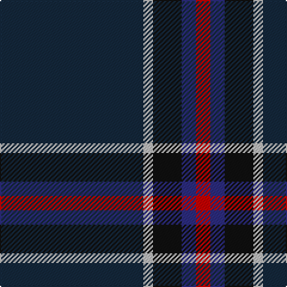

In pattern [BWKBR](/patterns/bwkbr/).

This was sourced from register-of-tartans.  It is a [5 stripes tartan](/stripes/stripes5/).

Original link https://www.tartanregister.gov.uk/tartanDetails.aspx?ref=1077

## Thread count
DN/120 N8 K24 DB12 R/12

## Palette
Each colour and its ΔE from the base-6 reference it is a variant of.

| Colour | Shade | Base | ΔE (OKLab) |
|---|---|---|---|
| DB | <code style="background-color:#2C2C80;">#2C2C80</code> `#2C2C80` | B <code style="background-color:#2A418A;">#2A418A</code> | 0.06 |
| DN | <code style="background-color:#14283C;">#14283C</code> `#14283C` | B <code style="background-color:#2A418A;">#2A418A</code> | 0.15 |
| K | <code style="background-color:#101010;">#101010</code> `#101010` | K <code style="background-color:#000000;">#000000</code> | 0.17 |
| N | <code style="background-color:#C0C0C0;">#C0C0C0</code> `#C0C0C0` | W <code style="background-color:#F7F7F7;">#F7F7F7</code> | 0.17 |
| R | <code style="background-color:#C80000;">#C80000</code> `#C80000` | R <code style="background-color:#CC0000;">#CC0000</code> | 0.01 |

# Sample pattern

## Nearest tartans

The nearest existing variants by ΔTartan distance.

1. [Edinburgh Crystal (Corporate)](/setts/s5/b120w8k24ba12r12-b14283c-ba2c2c80-k101010-rc80000-we0e0e0/) — ΔT 0.48
1. [Barrance, Paul and Kelly (Personal)](/setts/s7/b6ba84k4g34ba18b6w4-b64008c-ba14283c-g005448-k101010-wffffff/) — ΔT 1.24
1. [Silver Thistle (Fashion)](/setts/s7/g8b6k12ba40k92r4k8-b2c2c80-ba303070-g006818-k101010-r888888/) — ΔT 1.42
1. [Meaux (Personal)](/setts/s4/b124r48y10g6-b003c64-g003820-r880000-ybc8c00/) — ΔT 1.47
1. [Open Championship, The](/setts/s5/g4b8ba20b44y4-b141e46-ba2c4084-g005020-ye8c000/) — ΔT 1.47
1. [Osborne, Luke Alexander (Personal)](/setts/s4/b124k32ba16w8-b141e46-ba3d2e60-k1c1714-wf8f8f8/) — ΔT 1.50
1. [Meaux, Luc G (Personal)](/setts/s4/k124r48y10g6-g084106-k05132f-r780713-yef8f06/) — ΔT 1.59
1. [Round Table (1997)](/setts/s6/b94g28ba10bb4r6g14-b202060-ba440044-bb4c3428-g285800-r880000/) — ΔT 1.61
1. [Green Swamp Youth Campers](/setts/s6/k16r4k26y4g96b12-b2474e8-g004028-k101010-rc82828-ye0a126/) — ΔT 1.64
1. [Pinehurst Resort](/setts/s7/k16r4k16r4g56b4g4-b505050-g0c5454-k000034-r8c0000/) — ΔT 1.66

## Neighbour map

Every grey dot is one of 15726 variants placed by the first two principal components of the ΔTartan feature space (44% of its variance). Red is this tartan; blue dots are its nearest — click one to open its page.

<svg viewBox="0 0 640 380" role="img" style="max-width:100%;height:auto;border:1px solid #e0e0e0;border-radius:4px;display:block" xmlns="http://www.w3.org/2000/svg"><image href="/nn/cloud.v1.png" width="640" height="380"/><a href="/setts/s5/b120w8k24ba12r12-b14283c-ba2c2c80-k101010-rc80000-we0e0e0/"><circle cx="427.2" cy="188.2" r="4" fill="#3465a4"><title>Edinburgh Crystal (Corporate)</title></circle></a><a href="/setts/s7/b6ba84k4g34ba18b6w4-b64008c-ba14283c-g005448-k101010-wffffff/"><circle cx="446.5" cy="177.8" r="4" fill="#3465a4"><title>Barrance, Paul and Kelly (Personal)</title></circle></a><a href="/setts/s7/g8b6k12ba40k92r4k8-b2c2c80-ba303070-g006818-k101010-r888888/"><circle cx="471.0" cy="178.8" r="4" fill="#3465a4"><title>Silver Thistle (Fashion)</title></circle></a><a href="/setts/s4/b124r48y10g6-b003c64-g003820-r880000-ybc8c00/"><circle cx="470.0" cy="220.5" r="4" fill="#3465a4"><title>Meaux (Personal)</title></circle></a><a href="/setts/s5/g4b8ba20b44y4-b141e46-ba2c4084-g005020-ye8c000/"><circle cx="421.9" cy="242.3" r="4" fill="#3465a4"><title>Open Championship, The</title></circle></a><a href="/setts/s4/b124k32ba16w8-b141e46-ba3d2e60-k1c1714-wf8f8f8/"><circle cx="471.4" cy="238.3" r="4" fill="#3465a4"><title>Osborne, Luke Alexander (Personal)</title></circle></a><a href="/setts/s4/k124r48y10g6-g084106-k05132f-r780713-yef8f06/"><circle cx="448.6" cy="211.7" r="4" fill="#3465a4"><title>Meaux, Luc G (Personal)</title></circle></a><a href="/setts/s6/b94g28ba10bb4r6g14-b202060-ba440044-bb4c3428-g285800-r880000/"><circle cx="438.1" cy="183.1" r="4" fill="#3465a4"><title>Round Table (1997)</title></circle></a><a href="/setts/s6/k16r4k26y4g96b12-b2474e8-g004028-k101010-rc82828-ye0a126/"><circle cx="404.2" cy="169.0" r="4" fill="#3465a4"><title>Green Swamp Youth Campers</title></circle></a><a href="/setts/s7/k16r4k16r4g56b4g4-b505050-g0c5454-k000034-r8c0000/"><circle cx="389.4" cy="200.5" r="4" fill="#3465a4"><title>Pinehurst Resort</title></circle></a><circle cx="441.2" cy="194.5" r="5" fill="#c00000"/></svg>

ID: /setts/s5/b120w8k24ba12r12-b14283c-ba2c2c80-k101010-rc80000-wc0c0c0/
