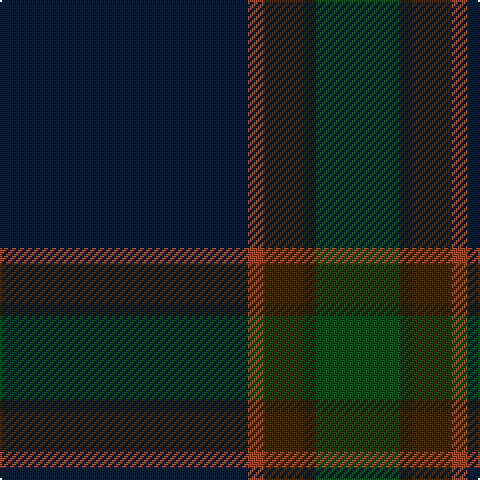

In pattern [BRGBG](/patterns/brgbg/).

This was sourced from register-of-tartans.  It is a [5 stripes tartan](/stripes/stripes5/).

Original link https://www.tartanregister.gov.uk/tartanDetails.aspx?ref=11552

## Thread count
DN/124 Ta8 T20 K6 G/42

## Palette
Each colour and its ΔE from the base-6 reference it is a variant of.

| Colour | Shade | Base | ΔE (OKLab) |
|---|---|---|---|
| DN | <code style="background-color:#061D37;">#061D37</code> `#061D37` | B <code style="background-color:#2C4084;">#2C4084</code> | 0.18 |
| G | <code style="background-color:#004F15;">#004F15</code> `#004F15` | G <code style="background-color:#006400;">#006400</code> | 0.07 |
| K | <code style="background-color:#2A230C;">#2A230C</code> `#2A230C` | B <code style="background-color:#2C4084;">#2C4084</code> | 0.21 |
| T | <code style="background-color:#452700;">#452700</code> `#452700` | G <code style="background-color:#006400;">#006400</code> | 0.20 |
| Ta | <code style="background-color:#9E411F;">#9E411F</code> `#9E411F` | R <code style="background-color:#C80000;">#C80000</code> | 0.09 |

# Sample pattern

ID: /setts/s5/b124r8g20ba6ga42-b061d37-ba2a230c-g452700-ga004f15-r9e411f/
