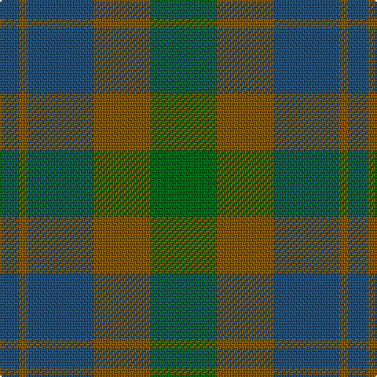

In pattern [BGBGG](/patterns/bgbgg/).

This was sourced from tartans-authority.  It is a [5 stripes tartan](/stripes/stripes5/).

Original link http://www.tartansauthority.com/tartan-ferret/display/6576/

## Thread count
B/12 T6 B42 T36 G/42

## Palette
Each colour and its ΔE from the base-6 reference it is a variant of.

| Colour | Shade | Base | ΔE (OKLab) |
|---|---|---|---|
| B | <code style="background-color:#245078;">#245078</code> `#245078` | B <code style="background-color:#2C4084;">#2C4084</code> | 0.05 |
| G | <code style="background-color:#006818;">#006818</code> `#006818` | G <code style="background-color:#006400;">#006400</code> | 0.02 |
| T | <code style="background-color:#845800;">#845800</code> `#845800` | G <code style="background-color:#006400;">#006400</code> | 0.16 |

# Sample pattern

ID: /setts/s5/b12g6b42g36ga42-b245078-g845800-ga006818/
