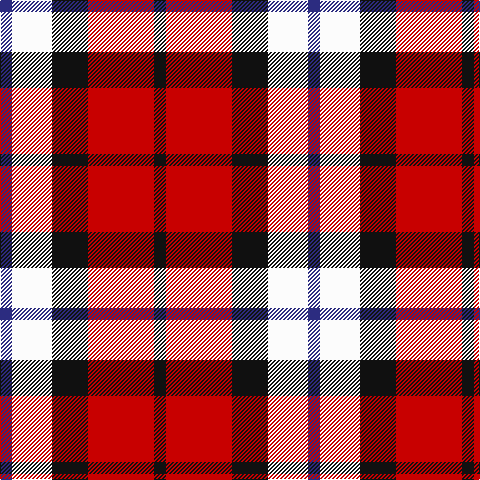

In pattern [BWKRK](/patterns/bwkrk/).

This was sourced from register-of-tartans.  It is a [5 stripes tartan](/stripes/stripes5/).

Original link https://www.tartanregister.gov.uk/tartanDetails.aspx?ref=371

## Thread count
DB/12 W40 K36 R66 K/12

## Palette
Each colour and its ΔE from the base-6 reference it is a variant of.

| Colour | Shade | Base | ΔE (OKLab) |
|---|---|---|---|
| DB | <code style="background-color:#2C2C80;">#2C2C80</code> `#2C2C80` | B <code style="background-color:#2A418A;">#2A418A</code> | 0.06 |
| K | <code style="background-color:#101010;">#101010</code> `#101010` | K <code style="background-color:#000000;">#000000</code> | 0.17 |
| R | <code style="background-color:#C80000;">#C80000</code> `#C80000` | R <code style="background-color:#CC0000;">#CC0000</code> | 0.01 |
| W | <code style="background-color:#FCFCFC;">#FCFCFC</code> `#FCFCFC` | W <code style="background-color:#F7F7F7;">#F7F7F7</code> | 0.01 |

# Sample pattern

## Nearest tartans

The nearest existing variants by ΔTartan distance.

1. [SAL Cubiska Stenen](/setts/s5/r30g6w4k20w10-g007800-k000000-rc80000-wf8f8f8/) — ΔT 0.96
1. [Aberdeen University (1992)](/setts/s5/y8r54k24b30y8-b2c2c80-k101010-rc8002c-ye8c000/) — ΔT 1.12
1. [Hamby Sport (Personal)](/setts/s4/r50k26w16b10-b2c2c80-k101010-rc8002c-we0e0e0/) — ΔT 1.19
1. [Aberdeen University](/setts/s5/y8r60k28b32y8-b304080-k000000-rc00000-yf0c000/) — ΔT 1.21
1. [Aberdeen University Corporate Tartan Tartan Number: 2152. Earliest known date: 1993 Aberdeen Unversity tartan was designed by the Weaver Incorporation of Aberdeen and Harry Lindley, to commemorate the Quincentennial of the University. The colours of the armourial bearings of the University were used as the starting point of the design, which was approved by the Principal in August 1992. See products available Copyright © Blair Urquhart, Comrie, 2015](/setts/s5/y8r60k28b32y8-b2c2c80-k101010-rc80000-ye8c000/) — ΔT 1.22
1. [Clark](/setts/s5/r12k4g4k4w12-g004c00-k000000-rc80000-wd0d0d0/) — ΔT 1.25
1. [Thomas Newcomen's Combustion Engine](/setts/s4/k28r20w12b8-b0000cd-k101010-rff0000-wffffff/) — ΔT 1.33
1. [SAL Glindrande Stiernan](/setts/s4/r60g20k60w20-g008b00-k101010-rff0000-wffffff/) — ΔT 1.34
1. [Common Ground (Dress)](/setts/s5/w6r54w32b54y6-b001f5c-r930601-wffffff-yf0e200/) — ΔT 1.36
1. [Meg Merrilees Fancy Tartan Tartan Number: 1602. Earliest known date: 1831 Miss McDougall, Inverness library, says in her notes:The first mention I had of this tartan was in an advertisment by D MacDougall, Draper, 27 High St., Inverness in 1831 . . . Meg Merrilees and other winter shawls. From Dalgety Archives. STS notes that it was sold by Forsyth's in Glasgow in 1840. Meg Merrilees was a character in one of Scotts novels, Guy Mannering. BU See products available Copyright © Blair Urquhart, Comrie, 2015](/setts/s6/w46b12w12r10k70r20-b2c2c80-k101010-rc80000-we0e0e0/) — ΔT 1.37

## Neighbour map

Every grey dot is one of 15726 variants placed by the first two principal components of the ΔTartan feature space (44% of its variance). Red is this tartan; blue dots are its nearest — click one to open its page.

<svg viewBox="0 0 640 380" role="img" style="max-width:100%;height:auto;border:1px solid #e0e0e0;border-radius:4px;display:block" xmlns="http://www.w3.org/2000/svg"><image href="/nn/cloud.v1.png" width="640" height="380"/><a href="/setts/s5/r30g6w4k20w10-g007800-k000000-rc80000-wf8f8f8/"><circle cx="166.2" cy="209.8" r="4" fill="#3465a4"><title>SAL Cubiska Stenen</title></circle></a><a href="/setts/s5/y8r54k24b30y8-b2c2c80-k101010-rc8002c-ye8c000/"><circle cx="188.1" cy="224.3" r="4" fill="#3465a4"><title>Aberdeen University (1992)</title></circle></a><a href="/setts/s4/r50k26w16b10-b2c2c80-k101010-rc8002c-we0e0e0/"><circle cx="197.1" cy="248.5" r="4" fill="#3465a4"><title>Hamby Sport (Personal)</title></circle></a><a href="/setts/s5/y8r60k28b32y8-b304080-k000000-rc00000-yf0c000/"><circle cx="185.8" cy="216.3" r="4" fill="#3465a4"><title>Aberdeen University</title></circle></a><a href="/setts/s5/y8r60k28b32y8-b2c2c80-k101010-rc80000-ye8c000/"><circle cx="197.7" cy="219.5" r="4" fill="#3465a4"><title>Aberdeen University Corporate Tartan Tartan Number: 2152. Earliest known date: 1993 Aberdeen Unversity tartan was designed by the Weaver Incorporation of Aberdeen and Harry Lindley, to commemorate the Quincentennial of the University. The colours of the armourial bearings of the University were used as the starting point of the design, which was approved by the Principal in August 1992. See products available Copyright © Blair Urquhart, Comrie, 2015</title></circle></a><a href="/setts/s5/r12k4g4k4w12-g004c00-k000000-rc80000-wd0d0d0/"><circle cx="74.7" cy="258.3" r="4" fill="#3465a4"><title>Clark</title></circle></a><a href="/setts/s4/k28r20w12b8-b0000cd-k101010-rff0000-wffffff/"><circle cx="105.8" cy="275.3" r="4" fill="#3465a4"><title>Thomas Newcomen's Combustion Engine</title></circle></a><a href="/setts/s4/r60g20k60w20-g008b00-k101010-rff0000-wffffff/"><circle cx="104.7" cy="273.8" r="4" fill="#3465a4"><title>SAL Glindrande Stiernan</title></circle></a><a href="/setts/s5/w6r54w32b54y6-b001f5c-r930601-wffffff-yf0e200/"><circle cx="148.3" cy="204.7" r="4" fill="#3465a4"><title>Common Ground (Dress)</title></circle></a><a href="/setts/s6/w46b12w12r10k70r20-b2c2c80-k101010-rc80000-we0e0e0/"><circle cx="161.4" cy="200.3" r="4" fill="#3465a4"><title>Meg Merrilees Fancy Tartan Tartan Number: 1602. Earliest known date: 1831 Miss McDougall, Inverness library, says in her notes:The first mention I had of this tartan was in an advertisment by D MacDougall, Draper, 27 High St., Inverness in 1831 . . . Meg Merrilees and other winter shawls. From Dalgety Archives. STS notes that it was sold by Forsyth's in Glasgow in 1840. Meg Merrilees was a character in one of Scotts novels, Guy Mannering. BU See products available Copyright © Blair Urquhart, Comrie, 2015</title></circle></a><circle cx="136.4" cy="228.0" r="5" fill="#c00000"/></svg>

ID: /setts/s5/b12w40k36r66k12-b2c2c80-k101010-rc80000-wfcfcfc/
