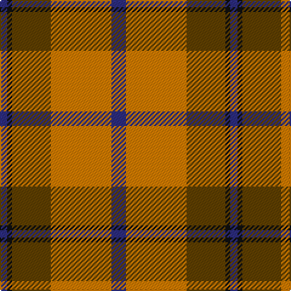

In pattern [BKGYB](/patterns/bkgyb/).

This was sourced from register-of-tartans.  It is a [5 stripes tartan](/stripes/stripes5/).

Original link https://www.tartanregister.gov.uk/tartanDetails.aspx?ref=3395

## Thread count
DB/6 K4 T32 O50 DB/12

## Palette
Each colour and its ΔE from the base-6 reference it is a variant of.

| Colour | Shade | Base | ΔE (OKLab) |
|---|---|---|---|
| DB | <code style="background-color:#2C2C80;">#2C2C80</code> `#2C2C80` | B <code style="background-color:#2A418A;">#2A418A</code> | 0.06 |
| K | <code style="background-color:#101010;">#101010</code> `#101010` | K <code style="background-color:#000000;">#000000</code> | 0.17 |
| O | <code style="background-color:#D87C00;">#D87C00</code> `#D87C00` | Y <code style="background-color:#F2BF00;">#F2BF00</code> | 0.17 |
| T | <code style="background-color:#604000;">#604000</code> `#604000` | G <code style="background-color:#006100;">#006100</code> | 0.14 |

# Sample pattern

## Nearest tartans

The nearest existing variants by ΔTartan distance.

1. [Prince of Orange](/setts/s5/b12y50r32k4b6-b304080-k000000-r806050-yff8500/) — ΔT 0.77
1. [Cetoloni (Personal)](/setts/s6/b4r48g24y4g24b4-b2c2c80-g006818-rc80000-ye8c000/) — ΔT 0.80
1. [MacBean, MacElvain](/setts/s7/k4r24b12r6g24r8b2-b304080-g008000-k000000-rc00000/) — ΔT 0.92
1. [Christmas (Fashion)](/setts/s5/y4g34ga8r30g2-g003820-ga006818-rc80000-yfccc00/) — ΔT 0.94
1. [MacNab 6](/setts/s7/g56r14ra14g28ra14r96k8-g008000-k000000-rc00000-ra802040/) — ΔT 0.94
1. [Christmas](/setts/s5/y4g34ga8r30g2-g0e3923-ga207449-rbb001a-ye3b235/) — ΔT 0.99
1. [MacGregor of Balquidder (Logan)](/setts/s6/g18r4g18r28k2w4-g006818-k101010-rc80000-we0e0e0/) — ΔT 1.00
1. [Starr (1978) (Name)](/setts/s7/k8r16w4r40g48r8w8-g00881c-k101010-rc80000-we0e0e0/) — ΔT 1.02
1. [MacNab 5](/setts/s7/g12r4ra4g8ra4r24k2-g008000-k000000-rc00000-ra900030/) — ΔT 1.02
1. [MacQuarrie 2](/setts/s7/r12g32r8b24r32ba2r4-b304080-ba5480b0-g008000-rc00000/) — ΔT 1.02

## Neighbour map

Every grey dot is one of 15726 variants placed by the first two principal components of the ΔTartan feature space (44% of its variance). Red is this tartan; blue dots are its nearest — click one to open its page.

<svg viewBox="0 0 640 380" role="img" style="max-width:100%;height:auto;border:1px solid #e0e0e0;border-radius:4px;display:block" xmlns="http://www.w3.org/2000/svg"><image href="/nn/cloud.v1.png" width="640" height="380"/><a href="/setts/s5/b12y50r32k4b6-b304080-k000000-r806050-yff8500/"><circle cx="266.7" cy="190.6" r="4" fill="#3465a4"><title>Prince of Orange</title></circle></a><a href="/setts/s6/b4r48g24y4g24b4-b2c2c80-g006818-rc80000-ye8c000/"><circle cx="287.6" cy="197.2" r="4" fill="#3465a4"><title>Cetoloni (Personal)</title></circle></a><a href="/setts/s7/k4r24b12r6g24r8b2-b304080-g008000-k000000-rc00000/"><circle cx="249.6" cy="196.8" r="4" fill="#3465a4"><title>MacBean, MacElvain</title></circle></a><a href="/setts/s5/y4g34ga8r30g2-g003820-ga006818-rc80000-yfccc00/"><circle cx="286.8" cy="192.5" r="4" fill="#3465a4"><title>Christmas (Fashion)</title></circle></a><a href="/setts/s7/g56r14ra14g28ra14r96k8-g008000-k000000-rc00000-ra802040/"><circle cx="288.9" cy="186.7" r="4" fill="#3465a4"><title>MacNab 6</title></circle></a><a href="/setts/s5/y4g34ga8r30g2-g0e3923-ga207449-rbb001a-ye3b235/"><circle cx="300.9" cy="198.7" r="4" fill="#3465a4"><title>Christmas</title></circle></a><a href="/setts/s6/g18r4g18r28k2w4-g006818-k101010-rc80000-we0e0e0/"><circle cx="297.9" cy="199.1" r="4" fill="#3465a4"><title>MacGregor of Balquidder (Logan)</title></circle></a><a href="/setts/s7/k8r16w4r40g48r8w8-g00881c-k101010-rc80000-we0e0e0/"><circle cx="264.5" cy="178.7" r="4" fill="#3465a4"><title>Starr (1978) (Name)</title></circle></a><a href="/setts/s7/g12r4ra4g8ra4r24k2-g008000-k000000-rc00000-ra900030/"><circle cx="287.8" cy="190.2" r="4" fill="#3465a4"><title>MacNab 5</title></circle></a><a href="/setts/s7/r12g32r8b24r32ba2r4-b304080-ba5480b0-g008000-rc00000/"><circle cx="288.0" cy="194.1" r="4" fill="#3465a4"><title>MacQuarrie 2</title></circle></a><circle cx="277.0" cy="200.5" r="5" fill="#c00000"/></svg>

ID: /setts/s5/b12y50g32k4b6-b2c2c80-g604000-k101010-yd87c00/
