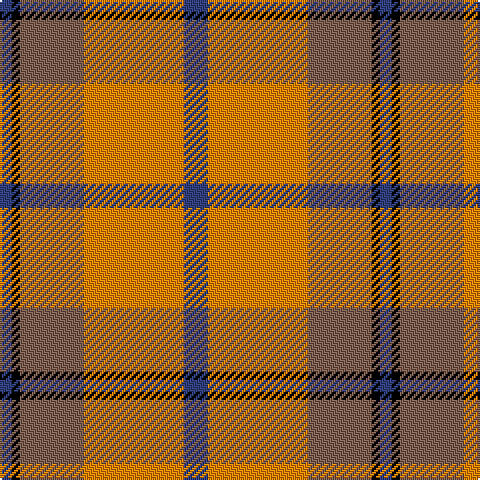

In pattern [BKRYB](/patterns/bkryb/).

This was sourced from weddslist.  It is a [5 stripes tartan](/stripes/stripes5/).

Original link http://www.weddslist.com/cgi-bin/tartans/pg.pl?source=sts

## Thread count
B/6 K4 LT32 O50 B/12

## Palette
Each colour and its ΔE from the base-6 reference it is a variant of.

| Colour | Shade | Base | ΔE (OKLab) |
|---|---|---|---|
| B | <code style="background-color:#304080;">#304080</code> `#304080` | B <code style="background-color:#2A418A;">#2A418A</code> | 0.02 |
| K | <code style="background-color:#000000;">#000000</code> `#000000` | K <code style="background-color:#000000;">#000000</code> | 0.00 |
| LT | <code style="background-color:#806050;">#806050</code> `#806050` | R <code style="background-color:#CC0000;">#CC0000</code> | 0.17 |
| O | <code style="background-color:#FF8500;">#FF8500</code> `#FF8500` | Y <code style="background-color:#F2BF00;">#F2BF00</code> | 0.14 |

# Sample pattern

## Nearest tartans

The nearest existing variants by ΔTartan distance.

1. [Basque (Corporate)](/setts/s5/r44g6k3g16w22-g006818-k101010-rc80000-we0e0e0/) — ΔT 0.60
1. [Prince of Orange #2](/setts/s5/b12y50g32k4b6-b2c2c80-g604000-k101010-yd87c00/) — ΔT 0.77
1. [Nesbit, Rose](/setts/s6/r12w6r74k32w32g8-g006818-k101010-rd05054-we8ccb8/) — ΔT 0.98
1. [Starr (1978) (Name)](/setts/s7/k8r16w4r40g48r8w8-g00881c-k101010-rc80000-we0e0e0/) — ΔT 1.06
1. [Ruthven (V.S.)](/setts/s6/w12g30b36r60g4r8-b2c2c80-g006818-rc80000-we0e0e0/) — ΔT 1.18
1. [Ruthven (V.S.) (Name)](/setts/s6/w12g30b36r60g4r8-b202060-g006818-rc80000-we0e0e0/) — ΔT 1.22
1. [Henkel (Corporate)](/setts/s6/k6g56k6r44k16w6-g808080-k101010-rc80000-wfcfcfc/) — ΔT 1.24
1. [Manhattan Ethnic](/setts/s7/r72b30r18y62g10b7y32-b401000-g908000-r906030-ye0a0a0/) — ΔT 1.24
1. [Plaid Wine](/setts/s6/r96b20ra36b8ra36w36-b5c5c5c-r880000-raa07c58-we8ccb8/) — ΔT 1.30
1. [Logan, Light](/setts/s7/b18r8b2r8g30ra8b2-b800080-g30a010-rd03030-rac00000/) — ΔT 1.31

## Neighbour map

Every grey dot is one of 15726 variants placed by the first two principal components of the ΔTartan feature space (44% of its variance). Red is this tartan; blue dots are its nearest — click one to open its page.

<svg viewBox="0 0 640 380" role="img" style="max-width:100%;height:auto;border:1px solid #e0e0e0;border-radius:4px;display:block" xmlns="http://www.w3.org/2000/svg"><image href="/nn/cloud.v1.png" width="640" height="380"/><a href="/setts/s5/r44g6k3g16w22-g006818-k101010-rc80000-we0e0e0/"><circle cx="253.9" cy="181.6" r="4" fill="#3465a4"><title>Basque (Corporate)</title></circle></a><a href="/setts/s5/b12y50g32k4b6-b2c2c80-g604000-k101010-yd87c00/"><circle cx="277.0" cy="200.5" r="4" fill="#3465a4"><title>Prince of Orange #2</title></circle></a><a href="/setts/s6/r12w6r74k32w32g8-g006818-k101010-rd05054-we8ccb8/"><circle cx="267.1" cy="175.0" r="4" fill="#3465a4"><title>Nesbit, Rose</title></circle></a><a href="/setts/s7/k8r16w4r40g48r8w8-g00881c-k101010-rc80000-we0e0e0/"><circle cx="264.5" cy="178.7" r="4" fill="#3465a4"><title>Starr (1978) (Name)</title></circle></a><a href="/setts/s6/w12g30b36r60g4r8-b2c2c80-g006818-rc80000-we0e0e0/"><circle cx="241.0" cy="185.5" r="4" fill="#3465a4"><title>Ruthven (V.S.)</title></circle></a><a href="/setts/s6/w12g30b36r60g4r8-b202060-g006818-rc80000-we0e0e0/"><circle cx="238.3" cy="184.7" r="4" fill="#3465a4"><title>Ruthven (V.S.) (Name)</title></circle></a><a href="/setts/s6/k6g56k6r44k16w6-g808080-k101010-rc80000-wfcfcfc/"><circle cx="221.9" cy="190.5" r="4" fill="#3465a4"><title>Henkel (Corporate)</title></circle></a><a href="/setts/s7/r72b30r18y62g10b7y32-b401000-g908000-r906030-ye0a0a0/"><circle cx="226.8" cy="203.8" r="4" fill="#3465a4"><title>Manhattan Ethnic</title></circle></a><a href="/setts/s6/r96b20ra36b8ra36w36-b5c5c5c-r880000-raa07c58-we8ccb8/"><circle cx="233.9" cy="205.8" r="4" fill="#3465a4"><title>Plaid Wine</title></circle></a><a href="/setts/s7/b18r8b2r8g30ra8b2-b800080-g30a010-rd03030-rac00000/"><circle cx="217.2" cy="173.5" r="4" fill="#3465a4"><title>Logan, Light</title></circle></a><circle cx="266.7" cy="190.6" r="5" fill="#c00000"/></svg>

ID: /setts/s5/b12y50r32k4b6-b304080-k000000-r806050-yff8500/
