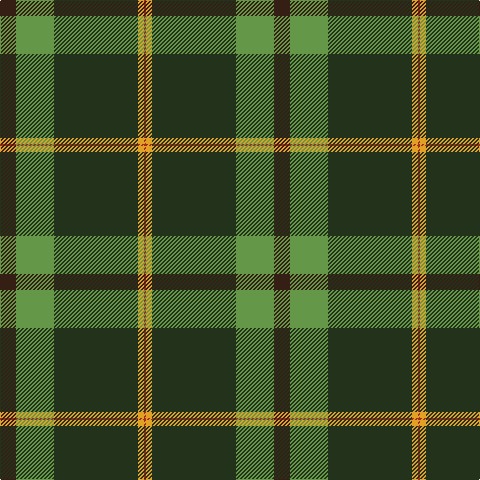

In pattern [BGGYR](/patterns/bggyr/).

This was sourced from register-of-tartans.  It is a [5 stripes tartan](/stripes/stripes5/).

Original link https://www.tartanregister.gov.uk/tartanDetails.aspx?ref=10542

## Thread count
Ka/16 LG38 K84 Y6 R/2

## Palette
Each colour and its ΔE from the base-6 reference it is a variant of.

| Colour | Shade | Base | ΔE (OKLab) |
|---|---|---|---|
| K | <code style="background-color:#23321B;">#23321B</code> `#23321B` | G <code style="background-color:#006400;">#006400</code> | 0.17 |
| Ka | <code style="background-color:#351E14;">#351E14</code> `#351E14` | B <code style="background-color:#2C4084;">#2C4084</code> | 0.20 |
| LG | <code style="background-color:#649848;">#649848</code> `#649848` | G <code style="background-color:#006400;">#006400</code> | 0.19 |
| R | <code style="background-color:#A32D18;">#A32D18</code> `#A32D18` | R <code style="background-color:#C80000;">#C80000</code> | 0.07 |
| Y | <code style="background-color:#E0A126;">#E0A126</code> `#E0A126` | Y <code style="background-color:#E8C000;">#E8C000</code> | 0.08 |

# Sample pattern

ID: /setts/s5/b16g38ga84y6r2-b351e14-g649848-ga23321b-ra32d18-ye0a126/
