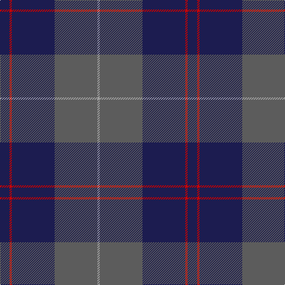

In pattern [BRBBY](/patterns/brbby/).

This was sourced from tartans-authority.  It is a [5 stripes tartan](/stripes/stripes5/).

Original link http://www.tartansauthority.com/tartan-ferret/display/8051/

## Thread count
DB/16 R4 DB72 N72 Na/4

## Palette
Each colour and its ΔE from the base-6 reference it is a variant of.

| Colour | Shade | Base | ΔE (OKLab) |
|---|---|---|---|
| DB | <code style="background-color:#1C1C50;">#1C1C50</code> `#1C1C50` | B <code style="background-color:#2A418A;">#2A418A</code> | 0.14 |
| N | <code style="background-color:#5C5C5C;">#5C5C5C</code> `#5C5C5C` | B <code style="background-color:#2A418A;">#2A418A</code> | 0.15 |
| Na | <code style="background-color:#A0A0A0;">#A0A0A0</code> `#A0A0A0` | Y <code style="background-color:#F2BF00;">#F2BF00</code> | 0.21 |
| R | <code style="background-color:#C80000;">#C80000</code> `#C80000` | R <code style="background-color:#CC0000;">#CC0000</code> | 0.01 |

# Sample pattern

## Nearest tartans

The nearest existing variants by ΔTartan distance.

1. [Meaux (Personal)](/setts/s4/b124r48y10g6-b003c64-g003820-r880000-ybc8c00/) — ΔT 1.34
1. [Connaught Green](/setts/s6/r2b24g10b4g8w2-b202060-g5c6428-ra00000-wc0c0c0/) — ΔT 1.37
1. [Largan (?)](/setts/s6/b8k39b8k39b87r6-b2c2c80-k101010-rc80000/) — ΔT 1.39
1. [MacKay (Blue) #2](/setts/s5/k30b8k30b56r4-b2c4084-k101010-rdc0000/) — ΔT 1.42
1. [Hutton](/setts/s6/k12g42b12g42b96r6-b00004c-g005030-k101010-rc80000/) — ΔT 1.42
1. [Cameron Hunting](/setts/s6/b30r10b60ba64b8y6-b4c3428-ba1474b4-rc80000-yd09800/) — ΔT 1.43
1. [Keepers of the Quaich](/setts/s6/y6g66b48g4b4g4-b2c2c80-g604000-yd09800/) — ΔT 1.47
1. [McNiff, Kevin (Personal)](/setts/s4/g40r14b80w4-b2c2c80-g003c14-rc80000-wf8f8f8/) — ΔT 1.47
1. [Lyndon Prep (School)](/setts/s6/b16w4b72k72y4k16-b1c0070-k101010-w98c8e8-ye8c000/) — ΔT 1.50
1. [Dege of Saville Row](/setts/s6/g44b4g12ba4b36r4-b202060-ba2c2c80-g604000-rc80000/) — ΔT 1.51

## Neighbour map

Every grey dot is one of 15726 variants placed by the first two principal components of the ΔTartan feature space (44% of its variance). Red is this tartan; blue dots are its nearest — click one to open its page.

<svg viewBox="0 0 640 380" role="img" style="max-width:100%;height:auto;border:1px solid #e0e0e0;border-radius:4px;display:block" xmlns="http://www.w3.org/2000/svg"><image href="/nn/cloud.v1.png" width="640" height="380"/><a href="/setts/s4/b124r48y10g6-b003c64-g003820-r880000-ybc8c00/"><circle cx="470.0" cy="220.5" r="4" fill="#3465a4"><title>Meaux (Personal)</title></circle></a><a href="/setts/s6/r2b24g10b4g8w2-b202060-g5c6428-ra00000-wc0c0c0/"><circle cx="351.4" cy="215.8" r="4" fill="#3465a4"><title>Connaught Green</title></circle></a><a href="/setts/s6/b8k39b8k39b87r6-b2c2c80-k101010-rc80000/"><circle cx="427.2" cy="247.4" r="4" fill="#3465a4"><title>Largan (?)</title></circle></a><a href="/setts/s5/k30b8k30b56r4-b2c4084-k101010-rdc0000/"><circle cx="376.3" cy="264.3" r="4" fill="#3465a4"><title>MacKay (Blue) #2</title></circle></a><a href="/setts/s6/k12g42b12g42b96r6-b00004c-g005030-k101010-rc80000/"><circle cx="356.6" cy="227.5" r="4" fill="#3465a4"><title>Hutton</title></circle></a><a href="/setts/s6/b30r10b60ba64b8y6-b4c3428-ba1474b4-rc80000-yd09800/"><circle cx="347.3" cy="230.0" r="4" fill="#3465a4"><title>Cameron Hunting</title></circle></a><a href="/setts/s6/y6g66b48g4b4g4-b2c2c80-g604000-yd09800/"><circle cx="439.0" cy="215.1" r="4" fill="#3465a4"><title>Keepers of the Quaich</title></circle></a><a href="/setts/s4/g40r14b80w4-b2c2c80-g003c14-rc80000-wf8f8f8/"><circle cx="368.5" cy="217.7" r="4" fill="#3465a4"><title>McNiff, Kevin (Personal)</title></circle></a><a href="/setts/s6/b16w4b72k72y4k16-b1c0070-k101010-w98c8e8-ye8c000/"><circle cx="364.1" cy="212.8" r="4" fill="#3465a4"><title>Lyndon Prep (School)</title></circle></a><a href="/setts/s6/g44b4g12ba4b36r4-b202060-ba2c2c80-g604000-rc80000/"><circle cx="397.6" cy="237.5" r="4" fill="#3465a4"><title>Dege of Saville Row</title></circle></a><circle cx="397.3" cy="221.4" r="5" fill="#c00000"/></svg>

ID: /setts/s5/b16r4b72ba72y4-b1c1c50-ba5c5c5c-rc80000-ya0a0a0/
