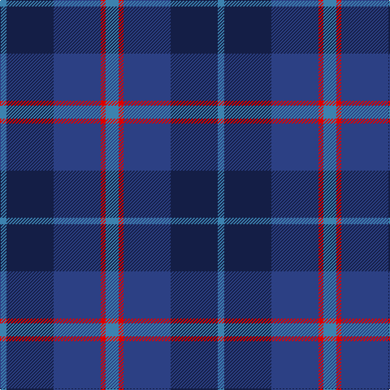

In pattern [BBBRB](/patterns/bbbrb/).

This was sourced from register-of-tartans.  It is a [5 stripes tartan](/stripes/stripes5/).

Original link https://www.tartanregister.gov.uk/tartanDetails.aspx?ref=409

## Thread count
B/8 DB58 Ba58 R6 B/16

## Palette
Each colour and its ΔE from the base-6 reference it is a variant of.

| Colour | Shade | Base | ΔE (OKLab) |
|---|---|---|---|
| B | <code style="background-color:#3C82AF;">#3C82AF</code> `#3C82AF` | B <code style="background-color:#2A418A;">#2A418A</code> | 0.19 |
| Ba | <code style="background-color:#2C4084;">#2C4084</code> `#2C4084` | B <code style="background-color:#2A418A;">#2A418A</code> | 0.01 |
| DB | <code style="background-color:#141E46;">#141E46</code> `#141E46` | B <code style="background-color:#2A418A;">#2A418A</code> | 0.16 |
| R | <code style="background-color:#DC0000;">#DC0000</code> `#DC0000` | R <code style="background-color:#CC0000;">#CC0000</code> | 0.03 |

# Sample pattern

## Nearest tartans

The nearest existing variants by ΔTartan distance.

1. [Hutchesons' Grammar (Corporate)](/setts/s6/b16r8ba60bb60ra6bb8-b5c8ca8-ba2c2c80-bb14283c-r888888-rac80000/) — ΔT 1.06
1. [Rangers 1989 (Sports)](/setts/s4/b42k20ba16r6-b2c2c84-ba24486c-k101010-rc80000/) — ΔT 1.40
1. [Sugiyama](/setts/s6/b14ba4b50ba20g42ba4-b2c4084-ba1c1c50-g408060/) — ΔT 1.44
1. [Sugiyama Jogakuen University (Corp)](/setts/s6/b14ba4b50ba20g42ba4-b2c2c80-ba202060-g006818/) — ΔT 1.45
1. [Caledonian Hotel (Corporate)](/setts/s8/b36ba4b4ba4b4ba28g28r8-b5c5c5c-ba1c0070-g003820-r880000/) — ΔT 1.46
1. [Skibo (Corporate)](/setts/s5/r4g46b22ba44r4-b2c2c80-ba1474b4-g406054-rc80000/) — ΔT 1.48
1. [Balmoral Hotel](/setts/s8/b34r4b4r4b4k34ba26k8-b003c64-ba2c2c80-k101010-rc04c08/) — ΔT 1.52
1. [Bareback (Corporate)](/setts/s6/b6k6b21k16ba36y4-b5c5c5c-ba2c2c80-k101010-ye8c000/) — ΔT 1.55
1. [Great Scot (Fashion)](/setts/s7/b12ba6b52bb41r12bc6r12-b2c2c80-ba2888c4-bb003c64-bc780078-rb468ac/) — ΔT 1.56
1. [Scottish Open Squash (Corporate)](/setts/s5/b46ba4g22ba48w6-b1c0070-ba440044-g006818-wc0c0c0/) — ΔT 1.59

## Neighbour map

Every grey dot is one of 15726 variants placed by the first two principal components of the ΔTartan feature space (44% of its variance). Red is this tartan; blue dots are its nearest — click one to open its page.

<svg viewBox="0 0 640 380" role="img" style="max-width:100%;height:auto;border:1px solid #e0e0e0;border-radius:4px;display:block" xmlns="http://www.w3.org/2000/svg"><image href="/nn/cloud.v1.png" width="640" height="380"/><a href="/setts/s6/b16r8ba60bb60ra6bb8-b5c8ca8-ba2c2c80-bb14283c-r888888-rac80000/"><circle cx="275.3" cy="220.3" r="4" fill="#3465a4"><title>Hutchesons' Grammar (Corporate)</title></circle></a><a href="/setts/s4/b42k20ba16r6-b2c2c84-ba24486c-k101010-rc80000/"><circle cx="299.2" cy="295.8" r="4" fill="#3465a4"><title>Rangers 1989 (Sports)</title></circle></a><a href="/setts/s6/b14ba4b50ba20g42ba4-b2c4084-ba1c1c50-g408060/"><circle cx="342.3" cy="258.8" r="4" fill="#3465a4"><title>Sugiyama</title></circle></a><a href="/setts/s6/b14ba4b50ba20g42ba4-b2c2c80-ba202060-g006818/"><circle cx="344.2" cy="262.5" r="4" fill="#3465a4"><title>Sugiyama Jogakuen University (Corp)</title></circle></a><a href="/setts/s8/b36ba4b4ba4b4ba28g28r8-b5c5c5c-ba1c0070-g003820-r880000/"><circle cx="251.9" cy="227.7" r="4" fill="#3465a4"><title>Caledonian Hotel (Corporate)</title></circle></a><a href="/setts/s5/r4g46b22ba44r4-b2c2c80-ba1474b4-g406054-rc80000/"><circle cx="287.1" cy="258.6" r="4" fill="#3465a4"><title>Skibo (Corporate)</title></circle></a><a href="/setts/s8/b34r4b4r4b4k34ba26k8-b003c64-ba2c2c80-k101010-rc04c08/"><circle cx="255.2" cy="239.0" r="4" fill="#3465a4"><title>Balmoral Hotel</title></circle></a><a href="/setts/s6/b6k6b21k16ba36y4-b5c5c5c-ba2c2c80-k101010-ye8c000/"><circle cx="229.7" cy="235.8" r="4" fill="#3465a4"><title>Bareback (Corporate)</title></circle></a><a href="/setts/s7/b12ba6b52bb41r12bc6r12-b2c2c80-ba2888c4-bb003c64-bc780078-rb468ac/"><circle cx="280.8" cy="229.2" r="4" fill="#3465a4"><title>Great Scot (Fashion)</title></circle></a><a href="/setts/s5/b46ba4g22ba48w6-b1c0070-ba440044-g006818-wc0c0c0/"><circle cx="255.5" cy="234.9" r="4" fill="#3465a4"><title>Scottish Open Squash (Corporate)</title></circle></a><circle cx="279.7" cy="254.3" r="5" fill="#c00000"/></svg>

ID: /setts/s5/b16r6ba58bb58b8-b3c82af-ba2c4084-bb141e46-rdc0000/
