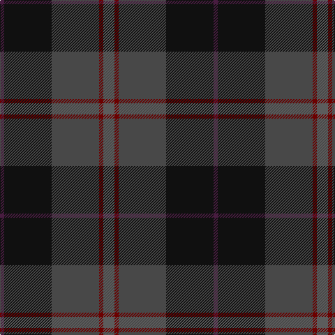

In pattern [BKBRB](/patterns/bkbrb/).

This was sourced from tartans-authority.  It is a [5 stripes tartan](/stripes/stripes5/).

Original link http://www.tartansauthority.com/tartan-ferret/display/7735/

## Attestations

This cloth appears in 2 source records; the oldest owns this page.

- December 2008 — Passion of Scotland, Pewter (Fashion (tartans-authority, [record](http://www.tartansauthority.com/tartan-ferret/display/7735/))
- undated — Passion of Scotland Pewter (register-of-tartans, [record](https://www.tartanregister.gov.uk/tartanDetails.aspx?ref=5718))

## Thread count
DP/6 K68 N68 DR6 Na/16

## Palette
Each colour and its ΔE from the base-6 reference it is a variant of.

| Colour | Shade | Base | ΔE (OKLab) |
|---|---|---|---|
| DP | <code style="background-color:#481C40;">#481C40</code> `#481C40` | B <code style="background-color:#2C4084;">#2C4084</code> | 0.14 |
| DR | <code style="background-color:#6C0000;">#6C0000</code> `#6C0000` | R <code style="background-color:#C80000;">#C80000</code> | 0.20 |
| K | <code style="background-color:#101010;">#101010</code> `#101010` | K <code style="background-color:#000000;">#000000</code> | 0.17 |
| N | <code style="background-color:#484848;">#484848</code> `#484848` | B <code style="background-color:#2C4084;">#2C4084</code> | 0.12 |
| Na | <code style="background-color:#5C5C5C;">#5C5C5C</code> `#5C5C5C` | B <code style="background-color:#2C4084;">#2C4084</code> | 0.14 |

# Sample pattern

ID: /setts/s5/b16r6ba68k68bb6-b5c5c5c-ba484848-bb481c40-k101010-r6c0000/
