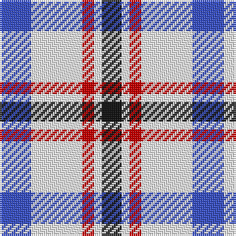

In pattern [BWRWK](/patterns/bwrwk/).

This was sourced from tartans-authority.  It is a [5 stripes tartan](/stripes/stripes5/).

Original link http://www.tartansauthority.com/tartan-ferret/display/6359/

## Thread count
B/16 W26 R6 W4 K/10

## Palette
Each colour and its ΔE from the base-6 reference it is a variant of.

| Colour | Shade | Base | ΔE (OKLab) |
|---|---|---|---|
| B | <code style="background-color:#3850C8;">#3850C8</code> `#3850C8` | B <code style="background-color:#2C4084;">#2C4084</code> | 0.12 |
| K | <code style="background-color:#101010;">#101010</code> `#101010` | K <code style="background-color:#000000;">#000000</code> | 0.17 |
| R | <code style="background-color:#C80000;">#C80000</code> `#C80000` | R <code style="background-color:#C80000;">#C80000</code> | 0.00 |
| W | <code style="background-color:#F8F8F8;">#F8F8F8</code> `#F8F8F8` | W <code style="background-color:#F4F4F0;">#F4F4F0</code> | 0.01 |

# Sample pattern

## Nearest tartans

The nearest existing variants by ΔTartan distance.

1. [Boswell Dress (Personal)](/setts/s5/b16w26r6w4k10-b3850c8-k101010-rc80000-wffffff/) — ΔT 0.09
1. [MacRae of Conchra #3](/setts/s4/r14w72b72y14-b2c2c80-rc80000-wf0f0d8-ye8c000/) — ΔT 0.92
1. [City of London](/setts/s4/k10w48b48ka10-b666666-k000000-ka101010-wffffff/) — ΔT 1.28
1. [North Vancouver Island](/setts/s8/r8w24b8w36b36w8b24y8-b2c2c80-rc80000-wffffff-ye8c000/) — ΔT 1.33
1. [North Vancouver Island (Corporate)](/setts/s8/r8w24b8w36b36w8b24y8-b2c2c80-rc80000-wfcfcfc-ye8c000/) — ΔT 1.33
1. [City of London (Corporate)](/setts/s4/k10b48w48r10-b5c5c5c-k101010-rc80000-wfcfcfc/) — ΔT 1.33
1. [MacRae of Conchra](/setts/s4/r4w32b32y4-b102040-rc00000-we0e0e0-yf0c000/) — ΔT 1.40
1. [North Vancouver Island District Tartan Tartan Number: 1682. Earliest known date: 1985 Originally designed for the North Island Highlanders Pipe & Drum Band by Robert Fells of Port Hardy, B.C. See products available Copyright © Blair Urquhart, Comrie, 2015](/setts/s8/r4w12b4w18b18w4b12y4-b2c2c80-rc80000-we0e0e0-ye8c000/) — ΔT 1.40
1. [North Vancouver, Island](/setts/s8/r4w12b4w18b18w4b12y4-b304080-rc00000-we0e0e0-yf0c000/) — ΔT 1.42
1. [Kellogg College University of Oxford](/setts/s4/r42b122y16w42-b38409c-rc80000-wfcfcfc-ye8c000/) — ΔT 1.42

## Neighbour map

Every grey dot is one of 15726 variants placed by the first two principal components of the ΔTartan feature space (44% of its variance). Red is this tartan; blue dots are its nearest — click one to open its page.

<svg viewBox="0 0 640 380" role="img" style="max-width:100%;height:auto;border:1px solid #e0e0e0;border-radius:4px;display:block" xmlns="http://www.w3.org/2000/svg"><image href="/nn/cloud.v1.png" width="640" height="380"/><a href="/setts/s5/b16w26r6w4k10-b3850c8-k101010-rc80000-wffffff/"><circle cx="164.8" cy="216.9" r="4" fill="#3465a4"><title>Boswell Dress (Personal)</title></circle></a><a href="/setts/s4/r14w72b72y14-b2c2c80-rc80000-wf0f0d8-ye8c000/"><circle cx="161.4" cy="236.1" r="4" fill="#3465a4"><title>MacRae of Conchra #3</title></circle></a><a href="/setts/s4/k10w48b48ka10-b666666-k000000-ka101010-wffffff/"><circle cx="146.7" cy="240.1" r="4" fill="#3465a4"><title>City of London</title></circle></a><a href="/setts/s8/r8w24b8w36b36w8b24y8-b2c2c80-rc80000-wffffff-ye8c000/"><circle cx="156.2" cy="216.9" r="4" fill="#3465a4"><title>North Vancouver Island</title></circle></a><a href="/setts/s8/r8w24b8w36b36w8b24y8-b2c2c80-rc80000-wfcfcfc-ye8c000/"><circle cx="156.9" cy="217.3" r="4" fill="#3465a4"><title>North Vancouver Island (Corporate)</title></circle></a><a href="/setts/s4/k10b48w48r10-b5c5c5c-k101010-rc80000-wfcfcfc/"><circle cx="156.0" cy="239.7" r="4" fill="#3465a4"><title>City of London (Corporate)</title></circle></a><a href="/setts/s4/r4w32b32y4-b102040-rc00000-we0e0e0-yf0c000/"><circle cx="207.3" cy="215.5" r="4" fill="#3465a4"><title>MacRae of Conchra</title></circle></a><a href="/setts/s8/r4w12b4w18b18w4b12y4-b2c2c80-rc80000-we0e0e0-ye8c000/"><circle cx="164.9" cy="222.1" r="4" fill="#3465a4"><title>North Vancouver Island District Tartan Tartan Number: 1682. Earliest known date: 1985 Originally designed for the North Island Highlanders Pipe &amp; Drum Band by Robert Fells of Port Hardy, B.C. See products available Copyright © Blair Urquhart, Comrie, 2015</title></circle></a><a href="/setts/s8/r4w12b4w18b18w4b12y4-b304080-rc00000-we0e0e0-yf0c000/"><circle cx="169.0" cy="223.6" r="4" fill="#3465a4"><title>North Vancouver, Island</title></circle></a><a href="/setts/s4/r42b122y16w42-b38409c-rc80000-wfcfcfc-ye8c000/"><circle cx="242.1" cy="224.8" r="4" fill="#3465a4"><title>Kellogg College University of Oxford</title></circle></a><circle cx="166.4" cy="218.0" r="5" fill="#c00000"/></svg>

ID: /setts/s5/b16w26r6w4k10-b3850c8-k101010-rc80000-wf8f8f8/
