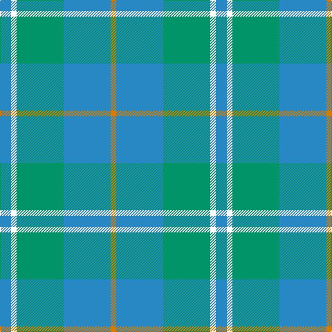

In pattern [BWGBY](/patterns/bwgby/).

This was sourced from register-of-tartans.  It is a [5 stripes tartan](/stripes/stripes5/).

Original link https://www.tartanregister.gov.uk/tartanDetails.aspx?ref=5047

## Attestations

This cloth appears in 2 source records; the oldest owns this page.

- 01/01/1986 — Bermuda (1986) (register-of-tartans, [record](https://www.tartanregister.gov.uk/tartanDetails.aspx?ref=5047))
- 1986 — Bermuda (1986) (Fashion) (tartans-authority, [record](http://www.tartansauthority.com/tartan-ferret/display/3685/))

## Thread count
Ba/16 W8 Bb68 Ba68 O/8

## Palette
Each colour and its ΔE from the base-6 reference it is a variant of.

| Colour | Shade | Base | ΔE (OKLab) |
|---|---|---|---|
| B | <code style="background-color:#2474E8;">#2474E8</code> `#2474E8` | B <code style="background-color:#2C4084;">#2C4084</code> | 0.20 |
| Ba | <code style="background-color:#2888C4;">#2888C4</code> `#2888C4` | B <code style="background-color:#2C4084;">#2C4084</code> | 0.21 |
| Bb | <code style="background-color:#009468;">#009468</code> `#009468` | G <code style="background-color:#006400;">#006400</code> | 0.16 |
| DB | <code style="background-color:#1C0070;">#1C0070</code> `#1C0070` | B <code style="background-color:#2C4084;">#2C4084</code> | 0.14 |
| G | <code style="background-color:#006818;">#006818</code> `#006818` | G <code style="background-color:#006400;">#006400</code> | 0.02 |
| LN | <code style="background-color:#E0E0E0;">#E0E0E0</code> `#E0E0E0` | W <code style="background-color:#F4F4F0;">#F4F4F0</code> | 0.06 |
| O | <code style="background-color:#D87C00;">#D87C00</code> `#D87C00` | Y <code style="background-color:#E8C000;">#E8C000</code> | 0.17 |
| W | <code style="background-color:#FCFCFC;">#FCFCFC</code> `#FCFCFC` | W <code style="background-color:#F4F4F0;">#F4F4F0</code> | 0.03 |

# Sample pattern

## Nearest tartans

The nearest existing variants by ΔTartan distance.

1. [Chambers Bay](/setts/s7/g8b60y20g8b8g28w8-b5f749c-g408060-wffffff-yb0b0b0/) — ΔT 1.42
1. [Lennox Dress, Purple (Dance)](/setts/s7/b12ba4b50ba8g50ba4g12-b2888c4-ba44546c-g289c18/) — ΔT 1.48
1. [Irving of Glentulchan (Personal)](/setts/s6/r6y54ya54k6ya6w6-k101010-rc80000-we0e0e0-y70a880-ya80a0b4/) — ΔT 1.84
1. [Irvine of Drum](/setts/s8/b6k6b42g98b42k6b6w6-b5c8ca8-g408060-k101010-wfcfcfc/) — ΔT 1.90
1. [Gamba Tuscany Fife](/setts/s5/g10r6ga60b60w6-b105088-g004830-ga006840-re01c18-we8e8e8/) — ΔT 1.94
1. [Irvine of Drum (Clan)](/setts/s5/g98b42k6b6w6-b5c8ca8-g408060-k101010-wfcfcfc/) — ΔT 1.96
1. [Bethlehem, City of (District)](/setts/s5/b12r40g36ra4g12-b1c0070-g006c3c-r888888-ra880000/) — ΔT 2.03
1. [Universal, Ancient](/setts/s8/b24g4b4g4b4r16ga16r2-b5480b0-g008000-ga30a010-r806050/) — ΔT 2.03
1. [Farooq (Personal)](/setts/s4/b40g100w20r5-b506880-g609070-rc80000-we0e0e0/) — ΔT 2.05
1. [Unnamed, No 17](/setts/s7/g20b4g4b12ba10b2ba4-b304080-ba5480b0-g008000/) — ΔT 2.06

## Neighbour map

Every grey dot is one of 15726 variants placed by the first two principal components of the ΔTartan feature space (44% of its variance). Red is this tartan; blue dots are its nearest — click one to open its page.

<svg viewBox="0 0 640 380" role="img" style="max-width:100%;height:auto;border:1px solid #e0e0e0;border-radius:4px;display:block" xmlns="http://www.w3.org/2000/svg"><image href="/nn/cloud.v1.png" width="640" height="380"/><a href="/setts/s7/g8b60y20g8b8g28w8-b5f749c-g408060-wffffff-yb0b0b0/"><circle cx="302.9" cy="236.1" r="4" fill="#3465a4"><title>Chambers Bay</title></circle></a><a href="/setts/s7/b12ba4b50ba8g50ba4g12-b2888c4-ba44546c-g289c18/"><circle cx="310.5" cy="215.7" r="4" fill="#3465a4"><title>Lennox Dress, Purple (Dance)</title></circle></a><a href="/setts/s6/r6y54ya54k6ya6w6-k101010-rc80000-we0e0e0-y70a880-ya80a0b4/"><circle cx="296.4" cy="207.3" r="4" fill="#3465a4"><title>Irving of Glentulchan (Personal)</title></circle></a><a href="/setts/s8/b6k6b42g98b42k6b6w6-b5c8ca8-g408060-k101010-wfcfcfc/"><circle cx="363.3" cy="192.4" r="4" fill="#3465a4"><title>Irvine of Drum</title></circle></a><a href="/setts/s5/g10r6ga60b60w6-b105088-g004830-ga006840-re01c18-we8e8e8/"><circle cx="274.6" cy="228.4" r="4" fill="#3465a4"><title>Gamba Tuscany Fife</title></circle></a><a href="/setts/s5/g98b42k6b6w6-b5c8ca8-g408060-k101010-wfcfcfc/"><circle cx="449.4" cy="218.8" r="4" fill="#3465a4"><title>Irvine of Drum (Clan)</title></circle></a><a href="/setts/s5/b12r40g36ra4g12-b1c0070-g006c3c-r888888-ra880000/"><circle cx="277.5" cy="250.5" r="4" fill="#3465a4"><title>Bethlehem, City of (District)</title></circle></a><a href="/setts/s8/b24g4b4g4b4r16ga16r2-b5480b0-g008000-ga30a010-r806050/"><circle cx="286.4" cy="226.0" r="4" fill="#3465a4"><title>Universal, Ancient</title></circle></a><a href="/setts/s4/b40g100w20r5-b506880-g609070-rc80000-we0e0e0/"><circle cx="413.9" cy="225.6" r="4" fill="#3465a4"><title>Farooq (Personal)</title></circle></a><a href="/setts/s7/g20b4g4b12ba10b2ba4-b304080-ba5480b0-g008000/"><circle cx="273.4" cy="252.0" r="4" fill="#3465a4"><title>Unnamed, No 17</title></circle></a><circle cx="332.0" cy="257.0" r="5" fill="#c00000"/></svg>

ID: /setts/s5/b16w8g68b68y8-b2888c4-g009468-wfcfcfc-yd87c00/
