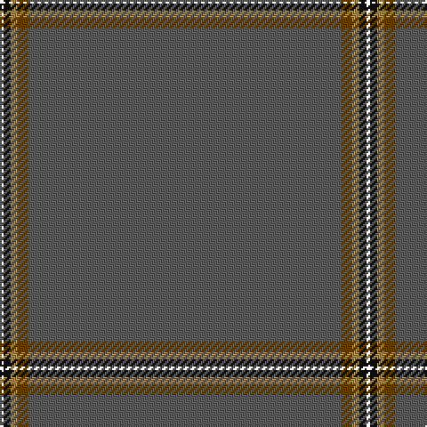

In pattern [BGYKK](/patterns/bgykk/).

This was sourced from house-of-tartan.  It is a [5 stripes tartan](/stripes/stripes5/).

Original link http://www.house-of-tartan.scotland.net/house/TartanViewjs.asp?colr=Def&tnam=10214

## Thread count
LN/2 K4 LT4 T6 N/176

## Palette
Each colour and its ΔE from the base-6 reference it is a variant of.

| Colour | Shade | Base | ΔE (OKLab) |
|---|---|---|---|
| K | <code style="background-color:#101010;">#101010</code> `#101010` | K <code style="background-color:#000000;">#000000</code> | 0.17 |
| LT | <code style="background-color:#A08858;">#A08858</code> `#A08858` | Y <code style="background-color:#F2BF00;">#F2BF00</code> | 0.21 |
| N | <code style="background-color:#5C5C5C;">#5C5C5C</code> `#5C5C5C` | B <code style="background-color:#2A418A;">#2A418A</code> | 0.15 |
| Na | <code style="background-color:#888888;">#888888</code> `#888888` | R <code style="background-color:#CC0000;">#CC0000</code> | 0.24 |
| T | <code style="background-color:#604000;">#604000</code> `#604000` | G <code style="background-color:#006100;">#006100</code> | 0.14 |

# Sample pattern

## Nearest tartans

The nearest existing variants by ΔTartan distance.

1. [Eternity (Fashion)](/setts/s5/b176g6y4k4ya2-b5c5c5c-g604000-k101010-ya08858-yaa0a0a0/) — ΔT 1.16
1. [Burnett, of Leys hunting](/setts/s8/r192b16r16w6r16g6r16ra6-b304080-g008000-r806050-rac00000-we0e0e0/) — ΔT 1.77
1. [Eternity, Dedicated 2 Weddings](/setts/s5/b176r6y4k4ya2-b433e3b-k101010-r8c7853-yeec591-yab0b0b0/) — ΔT 1.80
1. [Burnett of Leys Hunting Family Tartan Tartan Number: 1657. Earliest known date: 1988 Nothing See products available Copyright © Blair Urquhart, Comrie, 2015](/setts/s8/g192b16g16w6g16ga6g16r6-b2c2c80-g604000-ga006818-rc80000-we0e0e0/) — ΔT 2.55
1. [Alich (Personal)](/setts/s4/k200r4b12ba4-b003c64-ba780078-k101010-rc80000/) — ΔT 2.63
1. [Torridon Tweed](/setts/s6/b32ba8b48r8b112y8-b5c5c5c-ba2c2c80-rb468ac-ya0a0a0/) — ΔT 2.72
1. [Alich (Personal)](/setts/s4/k200r4b12ba4-b000080-ba551a8b-k101010-rd41a1f/) — ΔT 2.76
1. [Connacht](/setts/s10/r128g12r4g6r4g12r128b4r4b12-b401000-g008000-r806050/) — ΔT 2.78
1. [MacFie](/setts/s7/y2r24g324r2g4r24ya2-g11450d-raa0000-yaaaa00-yaaaaaaa/) — ΔT 2.96
1. [St. David's (District)](/setts/s6/g60r2g8r1g5k2-g003820-k000000-rc80000/) — ΔT 3.07

## Neighbour map

Every grey dot is one of 15726 variants placed by the first two principal components of the ΔTartan feature space (44% of its variance). Red is this tartan; blue dots are its nearest — click one to open its page.

<svg viewBox="0 0 640 380" role="img" style="max-width:100%;height:auto;border:1px solid #e0e0e0;border-radius:4px;display:block" xmlns="http://www.w3.org/2000/svg"><image href="/nn/cloud.v1.png" width="640" height="380"/><a href="/setts/s5/b176g6y4k4ya2-b5c5c5c-g604000-k101010-ya08858-yaa0a0a0/"><circle cx="626.0" cy="180.7" r="4" fill="#3465a4"><title>Eternity (Fashion)</title></circle></a><a href="/setts/s8/r192b16r16w6r16g6r16ra6-b304080-g008000-r806050-rac00000-we0e0e0/"><circle cx="626.0" cy="147.3" r="4" fill="#3465a4"><title>Burnett, of Leys hunting</title></circle></a><a href="/setts/s5/b176r6y4k4ya2-b433e3b-k101010-r8c7853-yeec591-yab0b0b0/"><circle cx="626.0" cy="148.8" r="4" fill="#3465a4"><title>Eternity, Dedicated 2 Weddings</title></circle></a><a href="/setts/s8/g192b16g16w6g16ga6g16r6-b2c2c80-g604000-ga006818-rc80000-we0e0e0/"><circle cx="626.0" cy="140.2" r="4" fill="#3465a4"><title>Burnett of Leys Hunting Family Tartan Tartan Number: 1657. Earliest known date: 1988 Nothing See products available Copyright © Blair Urquhart, Comrie, 2015</title></circle></a><a href="/setts/s4/k200r4b12ba4-b003c64-ba780078-k101010-rc80000/"><circle cx="626.0" cy="207.4" r="4" fill="#3465a4"><title>Alich (Personal)</title></circle></a><a href="/setts/s6/b32ba8b48r8b112y8-b5c5c5c-ba2c2c80-rb468ac-ya0a0a0/"><circle cx="626.0" cy="259.5" r="4" fill="#3465a4"><title>Torridon Tweed</title></circle></a><a href="/setts/s4/k200r4b12ba4-b000080-ba551a8b-k101010-rd41a1f/"><circle cx="626.0" cy="204.2" r="4" fill="#3465a4"><title>Alich (Personal)</title></circle></a><a href="/setts/s10/r128g12r4g6r4g12r128b4r4b12-b401000-g008000-r806050/"><circle cx="626.0" cy="180.2" r="4" fill="#3465a4"><title>Connacht</title></circle></a><a href="/setts/s7/y2r24g324r2g4r24ya2-g11450d-raa0000-yaaaa00-yaaaaaaa/"><circle cx="626.0" cy="142.0" r="4" fill="#3465a4"><title>MacFie</title></circle></a><a href="/setts/s6/g60r2g8r1g5k2-g003820-k000000-rc80000/"><circle cx="626.0" cy="192.2" r="4" fill="#3465a4"><title>St. David's (District)</title></circle></a><circle cx="626.0" cy="166.2" r="5" fill="#c00000"/></svg>

ID: /setts/s5/b176g6y4k4ka2-b5c5c5c-g604000-k101010-ka000000-ya08858/
