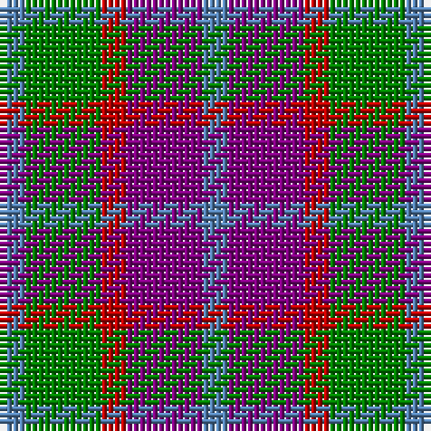

In pattern [BBRGB](/patterns/bbrgb/).

This was sourced from weddslist.  It is a [5 stripes tartan](/stripes/stripes5/).

Original link http://www.weddslist.com/cgi-bin/tartans/pg.pl?source=sts

## Thread count
B/4 G12 R4 P12 B/4

## Palette
Each colour and its ΔE from the base-6 reference it is a variant of.

| Colour | Shade | Base | ΔE (OKLab) |
|---|---|---|---|
| B | <code style="background-color:#5480B0;">#5480B0</code> `#5480B0` | B <code style="background-color:#2A418A;">#2A418A</code> | 0.19 |
| G | <code style="background-color:#008000;">#008000</code> `#008000` | G <code style="background-color:#006100;">#006100</code> | 0.10 |
| P | <code style="background-color:#800080;">#800080</code> `#800080` | B <code style="background-color:#2A418A;">#2A418A</code> | 0.17 |
| R | <code style="background-color:#C00000;">#C00000</code> `#C00000` | R <code style="background-color:#CC0000;">#CC0000</code> | 0.03 |

# Sample pattern

## Nearest tartans

The nearest existing variants by ΔTartan distance.

1. [Wilson's No.95](/setts/s5/b1ba3r1g3b1x4~b3c82af-ba5a008c-g005020-rdc0000/) — ΔT 0.89
1. [Stevens #2](/setts/s7/b4y3b4y3r3ra11r3x2~b1c1c50-rb468ac-ra888888-yb8b8b8/) — ΔT 1.21
1. [Creek Indian Nation](/setts/s5/b2g4y1b1r2x12~b2c2c80-g006818-rc80000-ye8c000/) — ΔT 1.32
1. [Wilson's, No 113](/setts/s4/r1g3b3w1x4~b800080-g008000-rc00000-we0e0e0/) — ΔT 1.32
1. [Wilson's No.214](/setts/s8/b3k1b1r3g4r3b1k1x4~b2888c4-g006818-k101010-rc80000/) — ΔT 1.33
1. [Wilson's, No 214](/setts/s5/g4r3b1k1b3x4~b5480b0-g008000-k000000-rc00000/) — ΔT 1.37
1. [Holden Monaro Corporate Tartan Tartan Number: 8700. Earliest known date: 1831 Holden Monaro GTS 1978 car seats. Reproduction colours. Warp 162 threads Weft 202 threads. Last weaving went through with slight difference. Sett size = 4 3/8th - 4 3/4 inch (112mm - 120mm) See products available Copyright © Blair Urquhart, Comrie, 2015](/setts/s8/y10b3y3b3y3b11g11r3x2~b282828-g54381c-r9c4048-yb0a488/) — ΔT 1.40
1. [Coleman, Sarah-Louise (Personal)](/setts/s4/g2r1b3r1x10~b780078-g007800-r888888/) — ΔT 1.42
1. [St. Edmunds (School)](/setts/s6/r4b3ba11bb8b2r4~b1474b4-ba5c8ca8-bb2c2c80-rc80000/) — ΔT 1.43
1. [Stewart (Artefact)](/setts/s7/r2g4b8r9g9k2r2x4~b2c2c80-g006818-k101010-rc80000/) — ΔT 1.46

## Neighbour map

Every grey dot is one of 15726 variants placed by the first two principal components of the ΔTartan feature space (44% of its variance). Red is this tartan; blue dots are its nearest — click one to open its page.

<svg viewBox="0 0 640 380" role="img" style="max-width:100%;height:auto;border:1px solid #e0e0e0;border-radius:4px;display:block" xmlns="http://www.w3.org/2000/svg"><image href="/nn/cloud.v1.png" width="640" height="380"/><a href="/setts/s5/b1ba3r1g3b1x4~b3c82af-ba5a008c-g005020-rdc0000/"><circle cx="126.2" cy="292.1" r="4" fill="#3465a4"><title>Wilson's No.95</title></circle></a><a href="/setts/s7/b4y3b4y3r3ra11r3x2~b1c1c50-rb468ac-ra888888-yb8b8b8/"><circle cx="120.8" cy="250.5" r="4" fill="#3465a4"><title>Stevens #2</title></circle></a><a href="/setts/s5/b2g4y1b1r2x12~b2c2c80-g006818-rc80000-ye8c000/"><circle cx="142.1" cy="273.4" r="4" fill="#3465a4"><title>Creek Indian Nation</title></circle></a><a href="/setts/s4/r1g3b3w1x4~b800080-g008000-rc00000-we0e0e0/"><circle cx="117.7" cy="287.6" r="4" fill="#3465a4"><title>Wilson's, No 113</title></circle></a><a href="/setts/s8/b3k1b1r3g4r3b1k1x4~b2888c4-g006818-k101010-rc80000/"><circle cx="115.2" cy="249.2" r="4" fill="#3465a4"><title>Wilson's No.214</title></circle></a><a href="/setts/s5/g4r3b1k1b3x4~b5480b0-g008000-k000000-rc00000/"><circle cx="106.3" cy="276.0" r="4" fill="#3465a4"><title>Wilson's, No 214</title></circle></a><a href="/setts/s8/y10b3y3b3y3b11g11r3x2~b282828-g54381c-r9c4048-yb0a488/"><circle cx="139.3" cy="248.7" r="4" fill="#3465a4"><title>Holden Monaro Corporate Tartan Tartan Number: 8700. Earliest known date: 1831 Holden Monaro GTS 1978 car seats. Reproduction colours. Warp 162 threads Weft 202 threads. Last weaving went through with slight difference. Sett size = 4 3/8th - 4 3/4 inch (112mm - 120mm) See products available Copyright © Blair Urquhart, Comrie, 2015</title></circle></a><a href="/setts/s4/g2r1b3r1x10~b780078-g007800-r888888/"><circle cx="193.8" cy="324.5" r="4" fill="#3465a4"><title>Coleman, Sarah-Louise (Personal)</title></circle></a><a href="/setts/s6/r4b3ba11bb8b2r4~b1474b4-ba5c8ca8-bb2c2c80-rc80000/"><circle cx="155.4" cy="256.4" r="4" fill="#3465a4"><title>St. Edmunds (School)</title></circle></a><a href="/setts/s7/r2g4b8r9g9k2r2x4~b2c2c80-g006818-k101010-rc80000/"><circle cx="158.3" cy="251.4" r="4" fill="#3465a4"><title>Stewart (Artefact)</title></circle></a><circle cx="121.9" cy="285.9" r="5" fill="#c00000"/></svg>

ID: /setts/s5/b1ba3r1g3b1x4~b5480b0-ba800080-g008000-rc00000/
