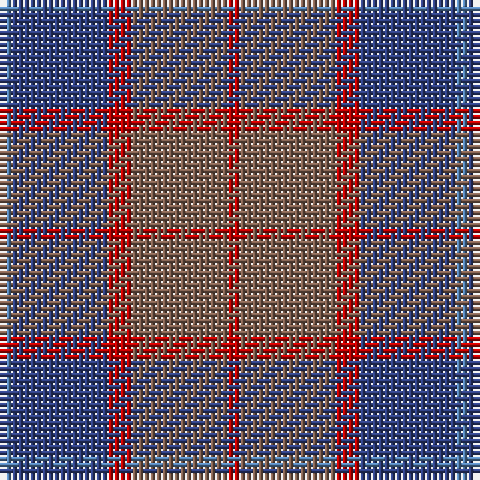

In pattern [BBRRR](/patterns/bbrrr/).

This was sourced from weddslist.  It is a [5 stripes tartan](/stripes/stripes5/).

Original link http://www.weddslist.com/cgi-bin/tartans/pg.pl?source=sts

## Thread count
Ba/2 B16 R4 LT16 R/2

## Palette
Each colour and its ΔE from the base-6 reference it is a variant of.

| Colour | Shade | Base | ΔE (OKLab) |
|---|---|---|---|
| B | <code style="background-color:#304080;">#304080</code> `#304080` | B <code style="background-color:#2A418A;">#2A418A</code> | 0.02 |
| Ba | <code style="background-color:#5480B0;">#5480B0</code> `#5480B0` | B <code style="background-color:#2A418A;">#2A418A</code> | 0.19 |
| LT | <code style="background-color:#806050;">#806050</code> `#806050` | R <code style="background-color:#CC0000;">#CC0000</code> | 0.17 |
| R | <code style="background-color:#C00000;">#C00000</code> `#C00000` | R <code style="background-color:#CC0000;">#CC0000</code> | 0.03 |

# Sample pattern

## Nearest tartans

The nearest existing variants by ΔTartan distance.

1. [Unamed Riding cloak 1745](/setts/s5/b1ba8r2g8r1x2~b3c82af-ba2c4084-g503c14-rdc0000/) — ΔT 1.12
1. [Trinity Bicycles](/setts/s5/g4y11g14r30ra4x2~g6b4226-r8b7355-racd0000-y6ca6cd/) — ΔT 1.49
1. [Callum (Buchan) (Name)](/setts/s5/b7r1ba6r8y1x8~b5c5c5c-ba344054-rc80000-ya0a0a0/) — ΔT 1.54
1. [MacArthur-Fox, dress](/setts/s6/b2r16ba3r3ba13ra2x4~b5480b0-ba304080-r800000-rac00000/) — ΔT 1.55
1. [Harmony 6](/setts/s5/b2g10ga15b10g2x4~b840068-g005020-ga503c14/) — ΔT 1.65
1. [Cameron, hunting](/setts/s6/r15ra5r30b32r4y3x2~b304080-r806050-rac00000-yf0c000/) — ΔT 1.65
1. [Aisteach](/setts/s7/b32g16r14k4r6b7k2x2~b3d2e60-g005020-k1c1714-r97342f/) — ΔT 1.67
1. [Skibo (Corporate)](/setts/s5/r2g23b11ba22r2x2~b2c2c80-ba1474b4-g406054-rc80000/) — ΔT 1.69
1. [Bristol Gramar School Check (School)](/setts/s6/r4b3ba12bb8b2r4~b447084-ba5c5c5c-bb1c1c50-rc80000/) — ΔT 1.70
1. [Balfour blue & brown](/setts/s6/b18y2r6y2r19ra3x2~b304080-r806050-rac00000-yf0c000/) — ΔT 1.74

## Neighbour map

Every grey dot is one of 15726 variants placed by the first two principal components of the ΔTartan feature space (44% of its variance). Red is this tartan; blue dots are its nearest — click one to open its page.

<svg viewBox="0 0 640 380" role="img" style="max-width:100%;height:auto;border:1px solid #e0e0e0;border-radius:4px;display:block" xmlns="http://www.w3.org/2000/svg"><image href="/nn/cloud.v1.png" width="640" height="380"/><a href="/setts/s5/b1ba8r2g8r1x2~b3c82af-ba2c4084-g503c14-rdc0000/"><circle cx="272.4" cy="247.1" r="4" fill="#3465a4"><title>Unamed Riding cloak 1745</title></circle></a><a href="/setts/s5/g4y11g14r30ra4x2~g6b4226-r8b7355-racd0000-y6ca6cd/"><circle cx="317.1" cy="261.5" r="4" fill="#3465a4"><title>Trinity Bicycles</title></circle></a><a href="/setts/s5/b7r1ba6r8y1x8~b5c5c5c-ba344054-rc80000-ya0a0a0/"><circle cx="258.3" cy="257.1" r="4" fill="#3465a4"><title>Callum (Buchan) (Name)</title></circle></a><a href="/setts/s6/b2r16ba3r3ba13ra2x4~b5480b0-ba304080-r800000-rac00000/"><circle cx="347.4" cy="239.4" r="4" fill="#3465a4"><title>MacArthur-Fox, dress</title></circle></a><a href="/setts/s5/b2g10ga15b10g2x4~b840068-g005020-ga503c14/"><circle cx="303.9" cy="299.0" r="4" fill="#3465a4"><title>Harmony 6</title></circle></a><a href="/setts/s6/r15ra5r30b32r4y3x2~b304080-r806050-rac00000-yf0c000/"><circle cx="378.2" cy="238.7" r="4" fill="#3465a4"><title>Cameron, hunting</title></circle></a><a href="/setts/s7/b32g16r14k4r6b7k2x2~b3d2e60-g005020-k1c1714-r97342f/"><circle cx="350.7" cy="225.0" r="4" fill="#3465a4"><title>Aisteach</title></circle></a><a href="/setts/s5/r2g23b11ba22r2x2~b2c2c80-ba1474b4-g406054-rc80000/"><circle cx="288.7" cy="256.0" r="4" fill="#3465a4"><title>Skibo (Corporate)</title></circle></a><a href="/setts/s6/r4b3ba12bb8b2r4~b447084-ba5c5c5c-bb1c1c50-rc80000/"><circle cx="196.0" cy="259.4" r="4" fill="#3465a4"><title>Bristol Gramar School Check (School)</title></circle></a><a href="/setts/s6/b18y2r6y2r19ra3x2~b304080-r806050-rac00000-yf0c000/"><circle cx="316.2" cy="222.9" r="4" fill="#3465a4"><title>Balfour blue &amp; brown</title></circle></a><circle cx="298.5" cy="254.8" r="5" fill="#c00000"/></svg>

ID: /setts/s5/b1ba8r2ra8r1x2~b5480b0-ba304080-rc00000-ra806050/
