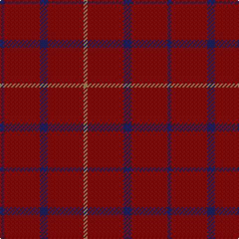

In pattern [BRBRY](/patterns/brbry/).

This was sourced from register-of-tartans.  It is a [5 stripes tartan](/stripes/stripes5/).

Original link https://www.tartanregister.gov.uk/tartanDetails.aspx?ref=384

## Attestations

This cloth appears in 2 source records; the oldest owns this page.

- 01/01/2005 — Brooks Brothers Tattersall Red (register-of-tartans, [record](https://www.tartanregister.gov.uk/tartanDetails.aspx?ref=384))
- pre 2005 — Brooks Bros Tattersall Red (Fashion) (tartans-authority, [record](http://www.tartansauthority.com/tartan-ferret/display/6572/))

## Thread count
DB/4 DR36 DB8 DR36 LT/4

## Palette
Each colour and its ΔE from the base-6 reference it is a variant of.

| Colour | Shade | Base | ΔE (OKLab) |
|---|---|---|---|
| DB | <code style="background-color:#202060;">#202060</code> `#202060` | B <code style="background-color:#2A418A;">#2A418A</code> | 0.11 |
| DR | <code style="background-color:#880000;">#880000</code> `#880000` | R <code style="background-color:#CC0000;">#CC0000</code> | 0.15 |
| LT | <code style="background-color:#A08858;">#A08858</code> `#A08858` | Y <code style="background-color:#F2BF00;">#F2BF00</code> | 0.21 |

# Sample pattern

## Nearest tartans

The nearest existing variants by ΔTartan distance.

1. [Rannoch Red](/setts/s7/r10g3r24w3r16k3r8~g8c7038-k101010-r880000-wc0c0c0~x2/) — ΔT 1.65
1. [Dunbar, John Telfer (Personal)](/setts/s7/r5k2r28k10r26k4r4~k101010-r883000~x2/) — ΔT 1.72
1. [Killiechassie](/setts/s6/r2g1r4ra1r12y1~g604000-r880000-rae87878-ya08858~x2/) — ΔT 1.75
1. [Inverness Augustus](/setts/s7/r18g1k5g1k1g1r9~g005020-k101010-r781c38~x2/) — ΔT 2.16
1. [Scott Htg (Error 2)](/setts/s8/r3g16g10r3g3w2g3r3~g604000-rc80000-wc0c0c0~x2/) — ΔT 2.20
1. [Highland Spring (1988)](/setts/s6/b3g1b9r3b9g1~b440044-g006818-rc80000~x4/) — ΔT 2.32
1. [Waverley Care Aids Trust (Corporate)](/setts/s6/r8g2r2k1r1g2~g006818-k101010-r880000~x10/) — ΔT 2.34
1. [MacDonald Lord of the Isles](/setts/s4/r38g2r5g16~g11450d-raa0000~x2/) — ΔT 2.34
1. [MacDonald Lord of the Isles](/setts/s4/r38g2r5g16~g11450d-raa0000/) — ΔT 2.34
1. [Highland Spring Corporate Tartan Tartan Number: 130. Earliest known date: 1987 Highland Spring manufacture bottled drinking water at Blackford in Perthshire, Scotland. See products available Copyright © Blair Urquhart, Comrie, 2015](/setts/s4/b5g2b19r5~b780078-g006818-rc80000~x2/) — ΔT 2.46

## Neighbour map

Every grey dot is one of 15726 variants placed by the first two principal components of the ΔTartan feature space (44% of its variance). Red is this tartan; blue dots are its nearest — click one to open its page.

<svg viewBox="0 0 640 380" role="img" style="max-width:100%;height:auto;border:1px solid #e0e0e0;border-radius:4px;display:block" xmlns="http://www.w3.org/2000/svg"><image href="/nn/cloud.v1.png" width="640" height="380"/><a href="/setts/s7/r10g3r24w3r16k3r8~g8c7038-k101010-r880000-wc0c0c0~x2/"><circle cx="592.4" cy="247.8" r="4" fill="#3465a4"><title>Rannoch Red</title></circle></a><a href="/setts/s7/r5k2r28k10r26k4r4~k101010-r883000~x2/"><circle cx="603.5" cy="252.9" r="4" fill="#3465a4"><title>Dunbar, John Telfer (Personal)</title></circle></a><a href="/setts/s6/r2g1r4ra1r12y1~g604000-r880000-rae87878-ya08858~x2/"><circle cx="626.0" cy="230.9" r="4" fill="#3465a4"><title>Killiechassie</title></circle></a><a href="/setts/s7/r18g1k5g1k1g1r9~g005020-k101010-r781c38~x2/"><circle cx="589.0" cy="218.5" r="4" fill="#3465a4"><title>Inverness Augustus</title></circle></a><a href="/setts/s8/r3g16g10r3g3w2g3r3~g604000-rc80000-wc0c0c0~x2/"><circle cx="512.7" cy="251.3" r="4" fill="#3465a4"><title>Scott Htg (Error 2)</title></circle></a><a href="/setts/s6/b3g1b9r3b9g1~b440044-g006818-rc80000~x4/"><circle cx="552.1" cy="267.5" r="4" fill="#3465a4"><title>Highland Spring (1988)</title></circle></a><a href="/setts/s6/r8g2r2k1r1g2~g006818-k101010-r880000~x10/"><circle cx="472.1" cy="253.9" r="4" fill="#3465a4"><title>Waverley Care Aids Trust (Corporate)</title></circle></a><a href="/setts/s4/r38g2r5g16~g11450d-raa0000~x2/"><circle cx="557.8" cy="253.3" r="4" fill="#3465a4"><title>MacDonald Lord of the Isles</title></circle></a><a href="/setts/s4/r38g2r5g16~g11450d-raa0000/"><circle cx="557.8" cy="253.3" r="4" fill="#3465a4"><title>MacDonald Lord of the Isles</title></circle></a><a href="/setts/s4/b5g2b19r5~b780078-g006818-rc80000~x2/"><circle cx="563.0" cy="272.9" r="4" fill="#3465a4"><title>Highland Spring Corporate Tartan Tartan Number: 130. Earliest known date: 1987 Highland Spring manufacture bottled drinking water at Blackford in Perthshire, Scotland. See products available Copyright © Blair Urquhart, Comrie, 2015</title></circle></a><circle cx="608.8" cy="274.7" r="5" fill="#c00000"/></svg>

ID: /setts/s5/b1r9b2r9y1~b202060-r880000-ya08858~x4/
